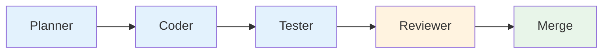
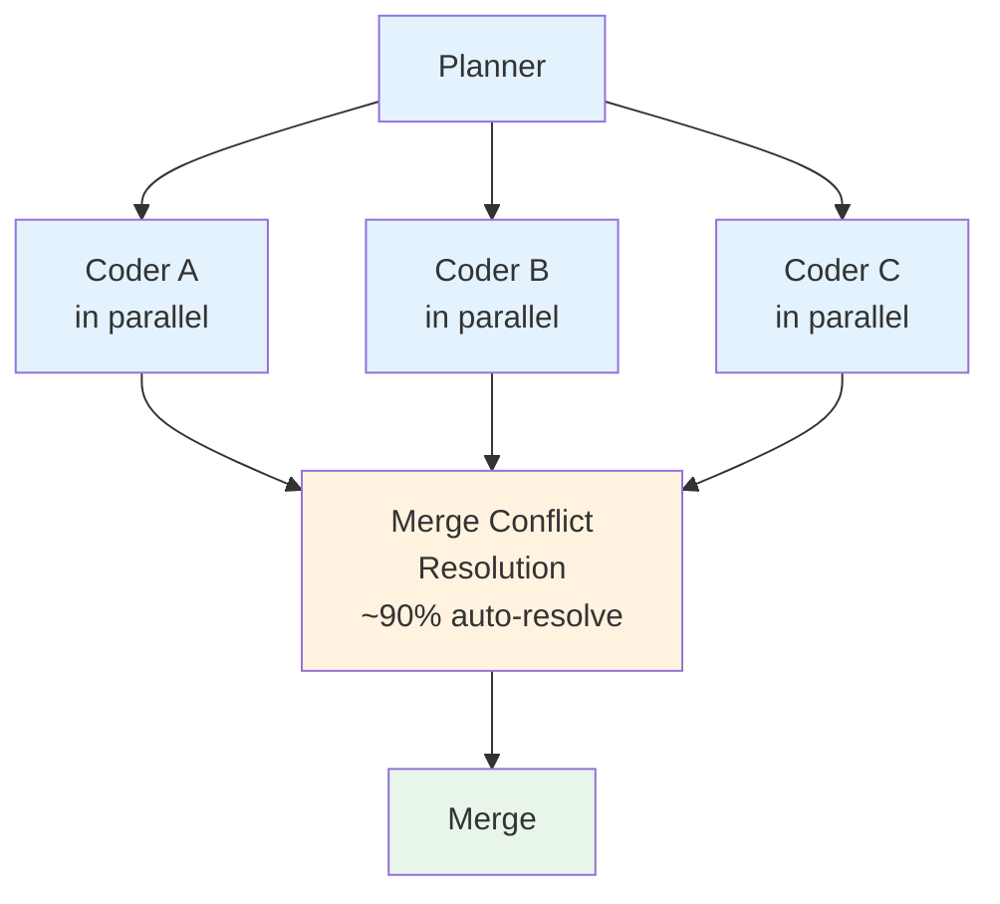
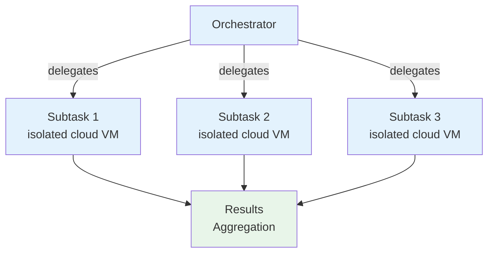
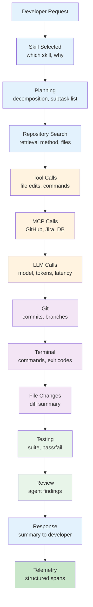
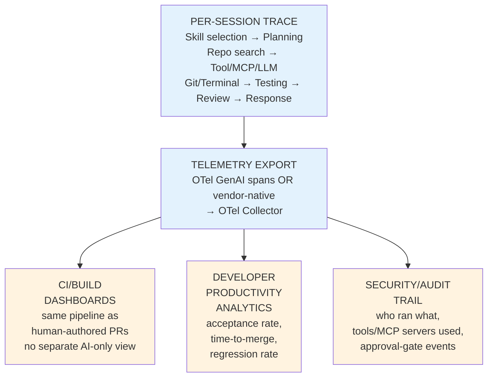

# Part 13 — Multi-Agent Skills & Part 14 — Logging and Tracing (+ Deliverable 9)

## PART A: Multi-Agent Architectures in Coding Workflows

### 13.1 The emerging role taxonomy

| Role | Function | Observed examples |
| --- | --- | --- |
| **Planner** | Decomposes a large task into subtasks, sequences work across other agents | Codex CLI's subagent orchestration; Warp's multi-agent parallel dispatch |
| **Research Agent** | Gathers external context (docs, web, related code) before implementation begins | Codex's "search the web for up-to-date information" pattern; a dedicated research pass ahead of coding |
| **Coding Agent** | Implements the actual change | The default role most tools optimize for by default |
| **Testing Agent** | Generates/extends tests, independent of the implementation agent, to avoid the same blind spots | Explicitly recommended pattern: "get your code reviewed by a separate Codex agent" generalizes to "get your code *tested* by a separate agent" |
| **Review Agent** | Independent code review before merge, distinct from the implementing agent | Codex's dedicated review-agent pattern; CodeRabbit/Greptile as fully separate review-focused products |
| **Documentation Agent** | Generates/updates docs alongside a code change | Less commonly a fully separate agent role; often folded into the coding agent's own output-format requirement |
| **Security Agent** | Scans for vulnerabilities, reviews auth/secrets handling | Specialist verticals (Snyk DeepCode AI, Semgrep Assistant) increasingly operate as attachable review agents rather than a role inside a general coding agent |
| **Refactoring Agent** | Large-scale, mechanical, cross-file transformations | Distinct from feature-coding because the safety bar (no behavior change) and validation strategy (broad regression testing) differ |
| **Deployment Agent** | Executes or gates the release process | Highest blast-radius role; should have the tightest approval-gate policy of any role in this list |

### 13.2 Orchestration patterns

**Pattern A: Sequential Pipeline**

**Pattern B: Parallel Fan-out (Replit Agent Pattern)**

**Pattern C: Supervisor/Delegate (Devin/GitHub Copilot Workspace)**

Three common patterns are observed:

- **(a) Sequential pipeline**: Tasks flow linearly through each agent role (Planner → Coder → Tester → Reviewer → Merge).
- **(b) Parallel fan-out**: Planner delegates to multiple coders working in parallel with merge conflict resolution (Replit Agent 4 auto-resolves ~90% of conflicts per vendor claims).
- **(c) Supervisor/delegate**: Orchestrator delegates subtasks to isolated agents (Devin/GitHub Copilot Workspace pattern using isolated cloud VMs per long-running task).

### 13.3 When to use multi-agent vs. a single agent with skills

- **Single agent + skills** is sufficient, and preferable, when the task is well-scoped and sequential — the added coordination overhead of multiple agents is not free (token cost, latency, potential for agents to disagree or duplicate work).
- **Multi-agent decomposition earns its cost** when (a) independent review genuinely benefits from a second, un-anchored perspective (testing/review agents deliberately kept separate from the implementer, for exactly the same reason human code review isn't done by the PR's own author), (b) subtasks are genuinely parallelizable across independent files/services, or (c) the task is long-running enough that background/async execution (Devin-style isolated VM) is warranted over an interactive session.
- **A supervisor pattern mirrors the enterprise Planner/Supervisor Skill pattern** (companion package file `07`) one layer up — here the delegation target is a separate *agent instance* (sometimes a different vendor's agent entirely, per the "let Claude Code talk to Codex and Gemini" pattern observed in community tooling) rather than a separate skill within one agent.

---

## PART B: Observability

### 14.1 Trace hierarchy for coding agents

The trace hierarchy for coding agents progresses through these stages in order:

1. **Developer Request** — initiates the workflow
2. **Skill Selected** — which skill, why (description match or explicit invocation)
3. **Planning** — decomposition, subtask list if multi-agent
4. **Repository Search** — retrieval method (AST/semantic/grep), files retrieved
5. **Tool Calls** — each file edit, terminal command, git operation
6. **MCP Calls** — external system calls (GitHub, Jira, DB, browser)
7. **LLM Calls** — model invocations, token usage, latency
8. **Git** — commits, branches created
9. **Terminal** — commands run, exit codes
10. **File Changes** — diff summary
11. **Testing** — suite run, pass/fail counts
12. **Review** — if a separate review agent/pass ran, its findings
13. **Response** — final summary/PR presented to the developer
14. **Telemetry** — everything above, emitted as structured spans

### 14.2 Tooling landscape

| Category | Examples | Notes for coding-agent use specifically |
| --- | --- | --- |
| Vendor-native session telemetry | Claude Code's own session logs/telemetry, VS Code Copilot's telemetry, GitHub's Copilot usage/audit telemetry | Best default for single-vendor shops; least effort to enable |
| OTel-based GenAI observability | Same `gen_ai.*` semantic conventions as the enterprise case (companion package file `08`) | Increasingly the right choice once more than one agent vendor is in use across a team, to get one unified view |
| Dedicated LLM-app observability | Langfuse, LangSmith, Phoenix | More common when a team has built *custom* agent tooling (e.g., an internal Codex-MCP-orchestrated pipeline) than when using off-the-shelf CLI/IDE agents directly |
| Session-replay / audit tools | Community tools (`claude-replay`, `session-dashboard`) that convert agent session logs into reviewable, shareable replays | A coding-agent-specific pattern with no strong enterprise-business-agent equivalent — useful for post-incident review and for onboarding developers to "how the agent actually worked through this" |
| CI-integrated telemetry | Test/lint/build results already flow through existing CI observability | The Validation lifecycle stage (file `03`) should feed the *same* dashboards a human-authored PR's CI run would, not a separate, siloed "AI metrics" view — this keeps agent-authored and human-authored work held to the same visible bar |

### 14.3 Deliverable 9 — Observability Architecture

The key design choice this architecture encodes: **agent-authored work should be observable through the same lens as human-authored work** (same CI dashboards, same PR review metrics) *plus* an additional agent-specific layer (skill/tool selection, MCP calls, approval-gate events) that has no human-workflow equivalent. Treating agent telemetry as a completely separate, siloed system tends to produce blind spots exactly where it matters most — at the moment an agent's output merges into the same codebase a human's would.

## Related

- [MCP Integration & Memory](24-mcp-integration-and-memory.md) — the previous section in this series.
- [Governance & Security](26-governance-and-security.md) — the next section in this series.
