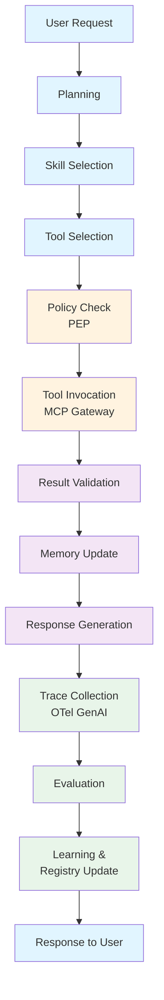
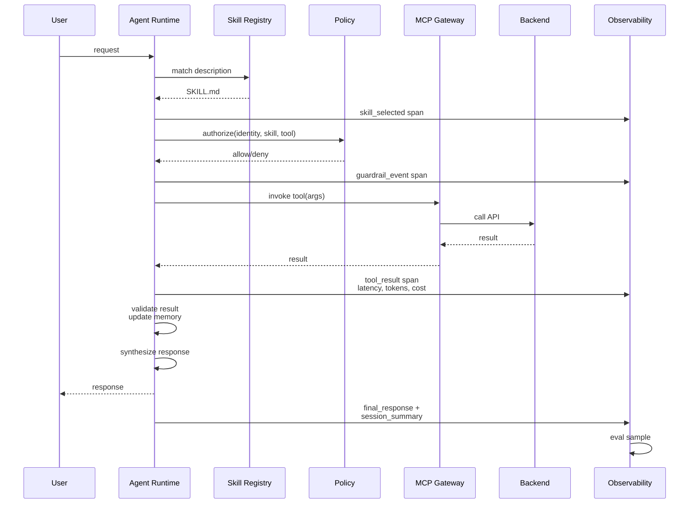
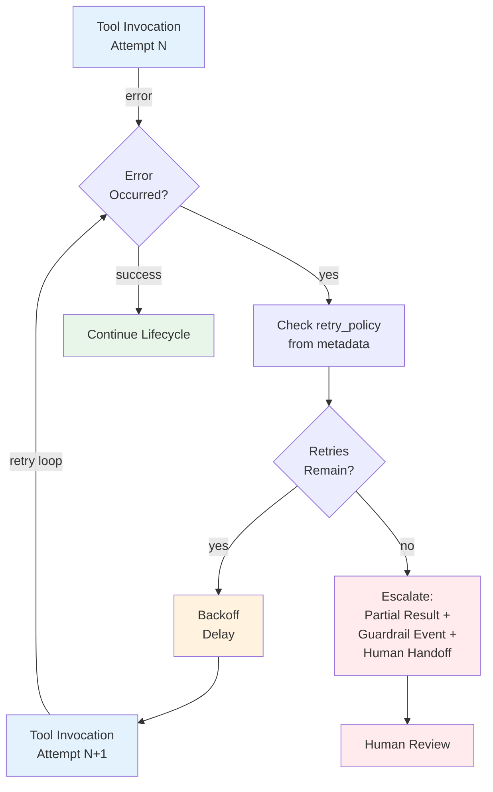
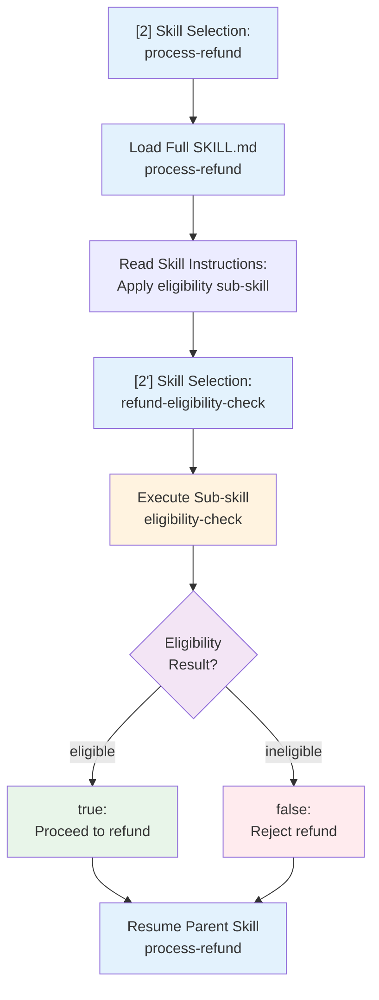
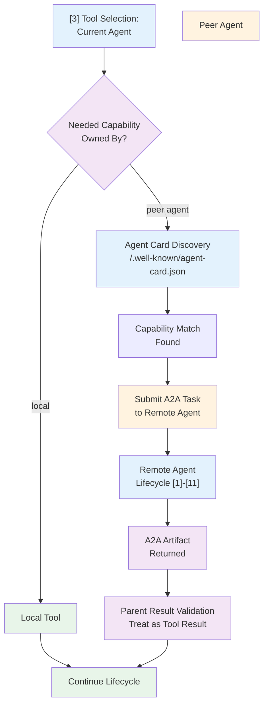
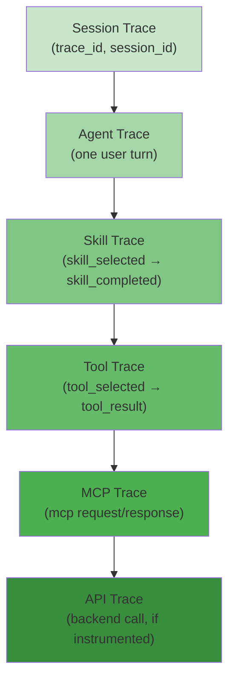

# Part 3 — Skill Execution Lifecycle (+ Deliverable 2: End-to-End Flow)

## Lifecycle Architecture Overview

## 3.1 The lifecycle, stage by stage

The skill execution lifecycle consists of eleven sequential stages:

1. **User Request** — Initiates the workflow
2. **Planning** — Agent decomposes the goal; decides if it needs skill(s), tool(s), or can answer directly
3. **Skill Selection** — Agent matches task against loaded skill metadata (name+description); loads full SKILL.md (and referenced files) on match
4. **Tool Selection** — Within the loaded skill's guidance, agent picks the specific tool(s) the skill recommends for this step
5. **Policy Check (PEP)** — Deterministic authorization check: does this identity + skill + tool + data class combo satisfy policy? (Cedar/OPA — see file 09)
6. **Tool Invocation** — Call executes via MCP Gateway → MCP Server → Backend API/System
7. **Result Validation** — Output checked against the tool's schema and, if declared, the skill's output_contract
8. **Memory Update** — Session state updated; episodic/procedural memory written if the skill's memory_policy allows it
9. **Response Generation** — Agent synthesizes user-facing output, respecting the skill's declared output format
10. **Trace Collection** — Every span above (skill-selected, tool-called, policy-decision, result) emitted via OTel GenAI conventions to the observability plane
11. **Evaluation** — Online (production sampling + LLM-judge) and offline (golden dataset regression) scoring
12. **Learning** — Findings feed: (a) skill/prompt refinement recommendations, (b) episodic memory, (c) registry quality scores that influence future discovery ranking (file 06)

This mirrors, at an architectural level, what AWS AgentCore's harness loop does explicitly (reasoning → tool selection → action execution → response streaming, with a continuous "agent performance loop" that analyzes production traces to recommend prompt/tool-description improvements) and what Salesforce's Atlas Reasoning Engine documents as its topic-selection → action-selection → grounding-check flow.

This mirrors, at an architectural level, what AWS AgentCore's harness loop does explicitly (reasoning → tool selection → action execution → response streaming, with a continuous "agent performance loop" that analyzes production traces to recommend prompt/tool-description improvements) and what Salesforce's Atlas Reasoning Engine documents as its topic-selection → action-selection → grounding-check flow.

## 3.2 Detailed sequence diagram — single-skill, single-tool happy path

In the single-skill, single-tool happy path, the following sequence occurs:

1. **User sends request** to Agent Runtime
2. **Agent matches skill description** against loaded metadata and loads the full SKILL.md
3. **Emits span: skill_selected** to observability layer
4. **Agent chooses tool** per skill guidance instructions
5. **Emits span: tool_selected (reason)** to observability layer
6. **Policy authorization** — Agent calls PEP with identity, skill, tool, and arguments
7. **PEP allows/denies** the action
8. **Emits span: guardrail_event (decision)** to observability layer
9. **Tool invocation** — Agent calls tool(args) via MCP Gateway
10. **MCP Gateway forwards** to MCP Server → Backend API call
11. **Backend returns result**
12. **Emits span: tool_result** with latency, tokens, cost metrics to observability
13. **Result validation** — Validates result against output_contract
14. **Memory update** — Updates session state per memory_policy
15. **Response synthesis** — Agent generates user-facing output per skill's declared format
16. **User receives response**
17. **Emits span: final_response + session_summary** to observability
18. **Evaluation sample** collected for offline analysis

## 3.3 Deliverable 2 — end-to-end flow, expanded with failure and multi-step paths

Real production traffic is rarely single-skill/single-tool. The full flow must account for:

**A. Skill-selection ambiguity (two skills both plausible)**
The planner should prefer the *more specific* skill (narrower description match) and, where confidence is low, either (a) ask a clarifying question, or (b) load both skills' metadata-only summaries and let the model disambiguate before committing to a full load — this is exactly why skill descriptions must be precise and mutually distinguishing (file `01`, section 1.5).

**B. Tool failure / retry**

When tool invocation encounters an error:

1. Checks the `retry_policy` from tool or skill metadata
2. Determines if retries remain
3. If retries exhausted → escalates by returning partial result + guardrail_event(failure) + human handoff
4. If retries remain → applies backoff delay and re-invokes tool (attempt N+1)

**C. Skill-to-skill delegation (composite skill)**

Composite skills can delegate to sub-skills:

1. [2] Skill Selection: Main skill ("process-refund") is loaded
2. Skill instructions indicate to apply a sub-skill first
3. [2'] Skill Selection: Sub-skill ("refund-eligibility-check") is loaded and executed as a nested step
4. Sub-skill returns its result (eligibility=true/false)
5. Parent skill resumes its procedure based on the sub-skill result

Full treatment of nested/hierarchical/planner/supervisor skill patterns appears in file `07`.

**D. Cross-agent delegation (A2A)**

Cross-agent delegation occurs when:

1. [3] Tool Selection determines the needed capability is owned by a peer agent, not a local tool
2. Agent Card discovery queries `/.well-known/agent-card.json` for capability matching
3. A2A Task is submitted to the remote agent
4. Remote agent executes its own full [1]-[11] lifecycle independently
5. A2A Artifact is returned and treated as a tool result in the parent's Result Validation step

**E. Human-in-the-loop pause**

Triggered when `human_approval.required_for` conditions are met (file `02`), the lifecycle suspends between steps [4] and [5], persists state (AWS AgentCore's filesystem persistence and Azure's session-isolated runtime both exist specifically to make this pattern practical without custom plumbing), and resumes on approval.

## 3.4 Trace hierarchy (ties to Part 10, expanded in file `08`)

The trace hierarchy is structured as a nested tree with the following levels:

1. **Session Trace** — Root level, encompasses entire session
2. **Agent Trace** — One user turn/request within the session
3. **Skill Trace** — Skill selection through skill completion (skill_selected → skill_completed)
4. **Tool Trace** — Tool selection through tool result (tool_selected → tool_result)
5. **MCP Trace** — MCP request/response framing and calls
6. **API Trace** — Backend API calls (if instrumented)

Each level should propagate a common `trace_id`/`session_id` per W3C Trace Context so that a single production incident can be reconstructed top-to-bottom — this is the explicit design goal behind both the AAIF's push for OTel-based agent tracing and OpenTelemetry's own GenAI observability walkthroughs, which show the `invoke_agent` span as the parent of child `chat` (LLM call) and `execute_tool` spans.

## Related

- [Foundations: What Is an Agent Skill?](29-foundations-what-is-an-agent-skill.md) — the previous section in this series.
- [Skills, Tools, MCP & A2A Relationship](31-skills-tools-mcp-a2a-relationship.md) — the next section in this series.
