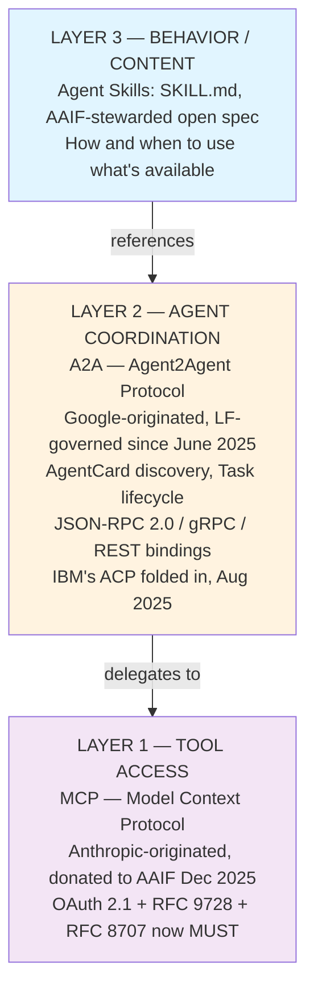
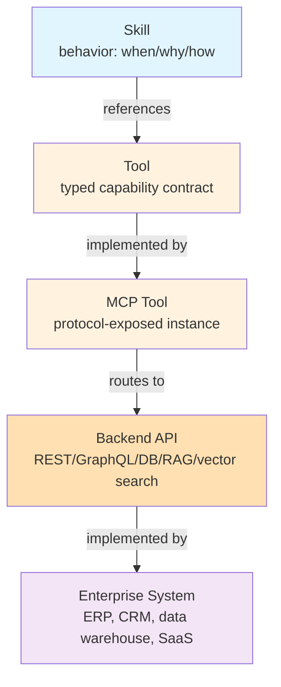

# Part 4 — Relationship Between Skills, Tools, MCP, and A2A (+ Deliverable 3: Decision Matrix)

## 4.1 The layered protocol stack (2026 industry consensus)

By mid-2026 the interoperability landscape has consolidated around two complementary, Linux-Foundation-governed protocols, plus a content-layer convention (Agent Skills) that sits above both:

Both MCP and A2A now sit under the Agentic AI Foundation (AAIF), a Linux-Foundation-directed body co-founded by Anthropic, OpenAI, Google, Microsoft, AWS, and Block — the clearest signal that the protocol layer has stopped fragmenting and started standardizing. A useful mental model repeated across vendor documentation (AWS, Salesforce, SAP all use variants of it): **MCP is the internal tooling a specialist uses; A2A is the org chart that lets specialists delegate to each other.**

Interestingly, **A2A's own canonical data model includes an `AgentSkill` type** — each Agent Card advertises a `skills[]` array (id, name, description, tags, examples, inputModes, outputModes) describing what that *remote agent* can do at a capability level. This is a coarser-grained, discovery-oriented notion of "skill" than the SKILL.md content-packaging notion — the two are related but not identical, and enterprises should not conflate "the skills my agent has loaded" with "the skills my agent advertises to other agents via its Agent Card." The latter is a *public capability summary*; the former is *private implementation detail*.

## 4.2 What belongs in each layer — expanded

| Layer | Owns | Does NOT own |
| --- | --- | --- |
| **Skill** | Judgment, sequencing, policy text, examples, escalation rules, output format | Network calls, auth tokens, schema validation, rate limiting |
| **Tool** | Typed input/output contract, semantic description of a single action | Business judgment about *when* to call it, retry/backoff mechanics (usually delegated to the gateway) |
| **MCP Server** | Protocol framing, auth boundary for a connected system, tool/resource/prompt exposure, rate limiting | Business policy, cross-system orchestration |
| **Backend API/System** | Data, transactional integrity, business logic execution, system of record | Agent-facing semantics (that's the Tool's job — don't expose raw internal APIs 1:1 as tools without a semantic wrapper) |
| **A2A layer** | Cross-agent task delegation, capability discovery between autonomous, independently-owned agents | Intra-agent tool routing (that's MCP's and the skill's job) |

## 4.3 RAG, vector search, and databases in this model

These are **backend systems**, accessed via **Tools** (often MCP-hosted: e.g., AgentCore's Web Search tool, Foundry IQ's unified retrieval endpoint, or a custom vector-search MCP server). A common anti-pattern is embedding retrieval *logic* (which index, what filters, how to rerank) inside skill instructions as free text — that logic should live in the Tool/backend layer as parameters and defaults, with the Skill only providing judgment about *when* retrieval is appropriate and *how to use the results* (citation format, confidence handling). Microsoft's Foundry IQ and AWS's Web Search-as-MCP-target are both explicit examples of retrieval being productized as a governed tool layer rather than left to ad hoc per-agent implementation.

## 4.4 Deliverable 3 — Decision Matrix (expanded)

| Question | Skill | Tool | MCP Server | Backend Service |
| --- | :---: | :---: | :---: | :---: |
| Does it define *when/why* to act? | ✅ | | | |
| Does it define a *single typed action*? | | ✅ | ✅ (hosts) | ✅ (implements) |
| Does it hold business policy / decision criteria? | ✅ | | | |
| Does it manage authentication/connection state? | | | ✅ | ✅ |
| Does it own data / transactional integrity? | | | | ✅ |
| Is it versioned independently of the agents using it? | ✅ | ✅ | ✅ | ✅ |
| Is it portable across agent platforms unmodified? | ✅ (if spec-conformant) | ✅ (if MCP-wrapped) | ✅ (protocol-native) | N/A (internal) |
| Does it enforce rate limits / schema validation? | | partial | ✅ | ✅ |
| Does it coordinate with other autonomous agents? | | | | (via A2A layer, not this layer) |
| Should it appear in the Skill Registry? | ✅ | ❌ (appears in Tool/MCP registry instead) | ❌ | ❌ |
| Should it appear in the Tool/Capability Catalog? | metadata only (references) | ✅ | ✅ | ❌ (appears via its Tool wrapper) |

## 4.5 Common modeling mistakes this matrix prevents

1. **Wrapping a single API call in a "skill."** If there's no judgment, sequencing, or policy involved — it's a Tool with a good description, not a Skill. (See anti-pattern "creating a Skill for every API," file `11`.)
2. **Putting authentication logic inside skill instructions** ("first call the auth endpoint with these headers..."). Auth belongs to the MCP server / gateway layer, which should present the agent with an already-authenticated tool call.
3. **Encoding cross-system orchestration entirely in one mega-skill** instead of decomposing into a supervisor pattern that delegates to domain skills and, where the domains are owned by separate teams/systems, to peer agents over A2A (file `07`).
4. **Treating a vector database as a tool an agent calls raw** rather than through a retrieval Tool that encodes query construction, filtering, and result shaping — this pushes fragile, hard-to-govern logic into every skill that needs retrieval instead of centralizing it once.
