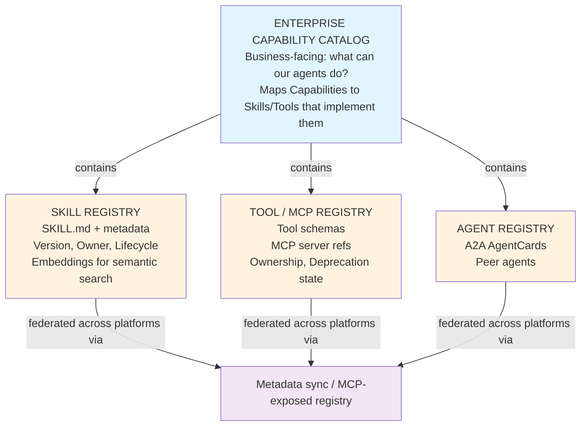

# Part 6 + Part 8 — Avoiding Duplication, Registry & Discovery Architecture (+ Deliverable 9)

## 6.1 Why duplication happens (root causes, not symptoms)

1. **No golden source** — two teams independently discover they need "cancel an order" and neither knows the other's tool exists, because there is no searchable, authoritative catalog.
2. **No ownership signal** — even when a tool is found, unclear ownership makes teams distrust it enough to build their own rather than take a dependency.
3. **Poor discoverability of *intent*, not just keywords** — keyword search on tool names fails when Team A calls it `cancel_order` and Team B needs "stop a shipment," which is semantically the same capability under different words.
4. **Platform silos** — a Skill built for Salesforce Agentforce and a functionally identical one built for Azure Foundry never appear in the same search because they live in different, vendor-native catalogs with no federation layer.
5. **Fear of coupling** — teams deliberately fork rather than take a dependency on another team's artifact, because there's no versioning/SLA contract that makes the dependency safe.

## 6.2 Registry architecture — the core enterprise pattern

This three-registry pattern (capability catalog on top, skill/tool/agent registries underneath) is not hypothetical — it mirrors what AWS just shipped natively: the **AWS Agent Registry** (launched in Preview) is explicitly described as a private, governed catalog and discovery layer for agents, tools, skills, MCP servers, and custom resources, queryable via Console UI, API, or as an MCP server from IDEs. Google's **Cloud Skill Registry** for ADK plays the same role at the Skill layer specifically, with built-in collision prevention. Azure Foundry keeps a project-scoped, versioned Skills catalog separate from its Toolbox (tool) catalog, discoverable as MCP resources.

## 6.3 Discovery mechanisms, layered

| Mechanism | What it's good at | Weakness | When to use |
| --- | --- | --- | --- |
| **Keyword/metadata search** | Fast, cheap, exact-name lookups | Misses semantically-equivalent-but-differently-worded capabilities | First pass, IDE/CLI tooling |
| **Semantic/embedding search** | Finds "stop a shipment" ≈ "cancel an order" | Requires embedding infra + periodic reindexing; can surface false positives | Registry search UI, agent-time discovery (Google ADK's `search_skills(query)` performs semantic or keyword query against the registry) |
| **Taxonomy / capability graph** | Human-navigable, supports governance rollups ("all payment-related tools") | Requires upfront taxonomy design and maintenance discipline | Compliance reviews, capability catalogs |
| **Policy filtering (RBAC/ABAC)** | Ensures discovery results only show what the requesting identity/agent is authorized to even see | Adds latency; must be kept in sync with the policy engine (file `09`) | Every runtime discovery call, no exceptions |
| **Ranking (usage, quality score, recency)** | Surfaces the *better* of two similar tools/skills | Requires telemetry pipeline feeding the registry (file `08`) | Search result ordering |
| **Marketplace/showcase listing** | Human browsing, procurement-style evaluation | Not suitable for runtime agent discovery (too slow, not policy-filtered) | Pre-approval, sourcing decisions |

## 6.4 Static vs. dynamic (runtime) loading

- **Static registration**: skills/tools bound to an agent at deploy time — safest, most predictable, easiest to audit, but doesn't scale past a few dozen capabilities per agent before context bloat returns.
- **Dynamic loading**: agent queries the registry mid-session and loads only what a specific task needs — this is exactly the ADK Skill Registry pattern: the agent's `load_skill` tool fetches, parses, and session-caches a remote skill only when a matching need is identified, after which its instructions are appended to the system prompt and its bundled tools become executable.
- **Caching**: dynamic loads should be cached for the session (as ADK does) to avoid repeated registry round-trips within a single conversation, while still re-checking policy on each *use*, not just each *load* (authorization and discovery are different checks — a cached skill can still be denied at tool-invocation time if context has changed).

## 6.5 Deliverable 9 — Registry & Discovery Architecture That Minimizes Duplication

**Governing rules (encode these as registry admission checks, not just documentation):**

1. **No skill/tool may be published without passing a similarity check** against the existing catalog (embedding-similarity threshold + human review queue for borderline matches) — this is the single most effective anti-duplication control, and is cheap to automate once embeddings exist for the registry.
2. **Every skill/tool must declare `owner` and `golden_source: true/false`.** Only one artifact per capability may be marked golden; non-golden duplicates found post-hoc are flagged for consolidation, not silently left in place.
3. **Publishing requires a capability-catalog mapping** — you cannot register a new Tool without stating which Capability it implements, which surfaces existing implementations of the same Capability automatically.
4. **Namespace enforcement** at the Tool layer (`domain.verb_noun`) prevents a large class of accidental duplication and makes intentional near-duplicates (e.g., a v2 with a breaking change) explicit via versioning rather than a same-shaped, differently-named tool.
5. **Federation, not centralization, across platforms.** Don't force every team onto one vendor's native skill format — instead, maintain the enterprise metadata schema (file `02`) as the source of truth and sync/export to each platform's native registry (Azure Skills API, ADK Skill Registry, AgentCore catalog) so discovery *within* each platform still works, while a cross-platform search layer (built on the same embeddings) prevents silent duplication *across* platforms.
6. **Deprecation must be visible at discovery time**, not just in a changelog — a `lifecycle_state: deprecated` skill should still resolve in search but be ranked last and flagged with its replacement, so agents (and developers) don't keep building against it.
7. **Quality/usage signals feed ranking.** A 2026 industry benchmark (SkillsBench) scored tens of thousands of unreviewed public skills and found an average quality score of roughly 6 out of 12, while curated, reviewed skill libraries raised measured agent pass rates by double-digit percentage points over uncurated ones. Discovery ranking should weight curated/certified quality scores, not raw popularity alone — popularity and quality diverged sharply in the poisoned public-registry incidents of Q1 2026 (file `09`).
