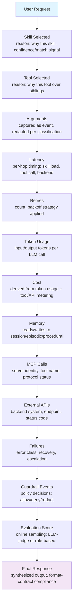
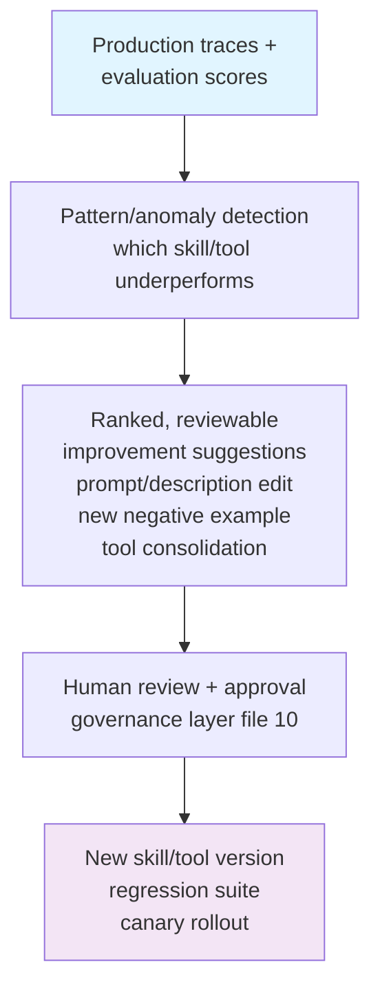

# Part 10 — Logging & Tracing + Part 13 — Evaluation (+ Deliverable 7)

## 8.1 The standardization state (as of mid-2026)

The industry is converging on **OpenTelemetry's GenAI Semantic Conventions** as the vendor-neutral schema for agent observability. The OTel GenAI Special Interest Group, active since April 2024, has expanded its scope across six layers: LLM client call tracing, agent orchestration, MCP tool calling, content capture, and quality evaluation. As of mid-2026 these conventions remain in **Development/Experimental** status — meaning the attribute names are directionally stable but still subject to change, and enterprises adopting them now should use the dual-emission opt-in pattern (`OTEL_SEMCONV_STABILITY_OPT_IN`) to avoid breaking dashboards on every spec revision.

Despite that immaturity, adoption is already broad: major backends (Datadog, Honeycomb, New Relic, Langfuse, LangSmith, Arize, plus every hyperscaler-native tracing tool — CloudWatch, Azure Monitor, Google Cloud Trace) either natively support or are actively adding `gen_ai.*` attribute ingestion, and frameworks (LangChain, CrewAI, AutoGen/AG2) emit OTel-compliant spans natively or via instrumentation packages.

**Core span types (from the spec and vendor implementations reviewed):**

| Span | Key attributes |
| --- | --- |
| `invoke_agent` (parent) | `gen_ai.system`, `agent.name`, `session.id` |
| `chat` (LLM call, child) | `gen_ai.request.model`, `gen_ai.usage.input_tokens`, `gen_ai.usage.output_tokens`, `gen_ai.response.finish_reasons` |
| `execute_tool` (child) | tool name, arguments (as events, not attributes — see below), latency, result status |
| MCP-specific spans | request/response framing, server identity, protocol-level errors |

**Content-capture guidance**: full prompt/completion text should be recorded as **span events**, not span attributes — attributes are indexed, size-limited, and get exposed broadly in observability backends; events can be filtered or dropped at the OTel Collector level without touching application code. This directly matters for PII/secrets exposure risk (file `09`).

## 8.2 The full trace model (Deliverable 7, expanded)



## 8.3 Trace hierarchy (recap from file `03`, with ownership mapped)

```
Session Trace          (owned by: platform/SRE - cross-turn continuity)
 - Agent Trace         (owned by: agent product team - one user turn)
   - Skill Trace      (owned by: skill owner - selection + execution)
     - Tool Trace    (owned by: tool/integration team)
       - MCP Trace  (owned by: MCP server operator)
         - API Trace (owned by: backend system owner)
```

Propagate `trace_id`/`session_id` via W3C Trace Context end-to-end so a single incident can be reconstructed across every ownership boundary above — critical in enterprises where the skill owner, tool owner, and backend owner are three different teams.

## 8.4 Observability tooling landscape

| Category | Examples | Notes |
| --- | --- | --- |
| LLM/agent-native observability platforms | Langfuse, LangSmith, Arize (Phoenix), MLflow (tracing) | Purpose-built for GenAI traces; increasingly OTel-ingesting rather than proprietary-only |
| General APM/observability | Datadog, Grafana, New Relic, Honeycomb | Adding `gen_ai.*` support; good when GenAI observability must live alongside existing infra observability in one pane |
| Hyperscaler-native | AWS CloudWatch (+ AgentCore Observability), Azure Monitor (+ Foundry tracing/evaluators), Google Cloud Trace (+ ADK trace tree/trajectory diagrams) | Tightest integration with the platform's own runtime; best default if single-cloud |
| Evaluation-specific | AgentCore's 13 built-in evaluators, Foundry's ASSERT/Rubric/Agent Optimizer, custom LLM-judge pipelines | Increasingly bundled into the platform rather than a separate product |

## 8.5 Evaluation — what to measure

| Dimension | Metric examples | Method |
| --- | --- | --- |
| **Coverage** | % of representative task types with a passing skill/tool path | Golden dataset audit |
| **Accuracy** | Correct final answer / correct action taken | Golden dataset + human or LLM-judge scoring |
| **Correct tool/skill selection** | % of turns where the *right* skill/tool was chosen | Trace analysis against labeled intents |
| **Wrong tool selection** | Rate of near-miss selections (right domain, wrong specific tool) | Trace analysis, often surfaces disambiguation gaps (file `05`) |
| **Duplicate invocation** | Same tool called &gt;1x for one logical operation within a turn | Trace analysis; often a retry/idempotency bug |
| **Hallucinated tools** | Agent attempts to call a tool/skill that doesn't exist | Should be ~zero in a well-scoped registry; a spike signals prompt/registry drift |
| **Prompt/instruction quality** | Ambiguity rate, conflicting-instruction rate | Static lint + periodic human review |
| **Latency** | P50/P95/P99 per hop | OTel spans |
| **Cost** | Token + tool-metering cost per resolved task | Derived from trace data |
| **Reliability** | Success rate under retry, error-recovery rate | Trace + synthetic fault injection |
| **Business KPIs** | Containment rate, deflection rate, CSAT, time-to-resolution | Product analytics, tied back to trace `session_id` |

Salesforce's own operational guidance is a useful concrete benchmark: they flag reasoning accuracy (correct topic/action selection) below 85% as a signal that instructions need refinement, and recommend weekly review of that metric plus cost-consumption anomalies during the first 30 days after any agent launch — a good default cadence for any platform, not just Agentforce.

## 8.6 Evaluation methodology mix

- **Golden datasets / regression testing**: a versioned, curated set of representative tasks with known-good outcomes, run in CI on every skill/tool change (AWS AgentCore's batch evaluation explicitly tests changes against a defined dataset before they reach production).
- **A/B / canary evaluation**: split live traffic between skill/prompt versions and compare outcomes under real conditions before full rollout (AgentCore's A/B testing capability is a direct implementation of this pattern).
- **Continuous/online evaluation**: sampled production traces scored automatically (rule-based + LLM-judge) to catch drift between regression cycles.
- **LLM-as-judge**: scalable but imperfect — use for triage and trend detection, not as the sole gate for high-stakes changes; pair with periodic human evaluation, especially for regulated domains.
- **Human evaluation**: still necessary for nuanced quality dimensions (tone, judgment calls, edge-case correctness) that automated scoring under-detects; scope it to sampled, high-risk, or low-confidence-score traces rather than 100% review, to keep it sustainable.

## 8.7 Closing the loop: from evaluation to skill improvement

The mature pattern, now productized by more than one vendor (AWS AgentCore's recommendation engine "analyzes production traces and evaluation outputs to suggest specific improvements to system prompts and tool descriptions, grounded in how the agent actually behaves"; Azure Foundry's Agent Optimizer performs a similar closed loop), is:



Treat this loop as a first-class part of the observability program, not an afterthought — it's what turns a trace archive into a continuously improving system rather than a forensic-only tool.

## Related

- [Skill Composition & Instructions Engineering](34-composition-and-instructions-engineering.md) — the previous section in this series.
- [Security Architecture](36-agent-skills-security-architecture.md) — the next section in this series.
