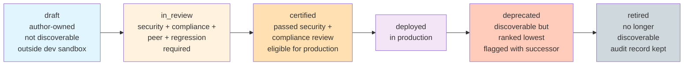
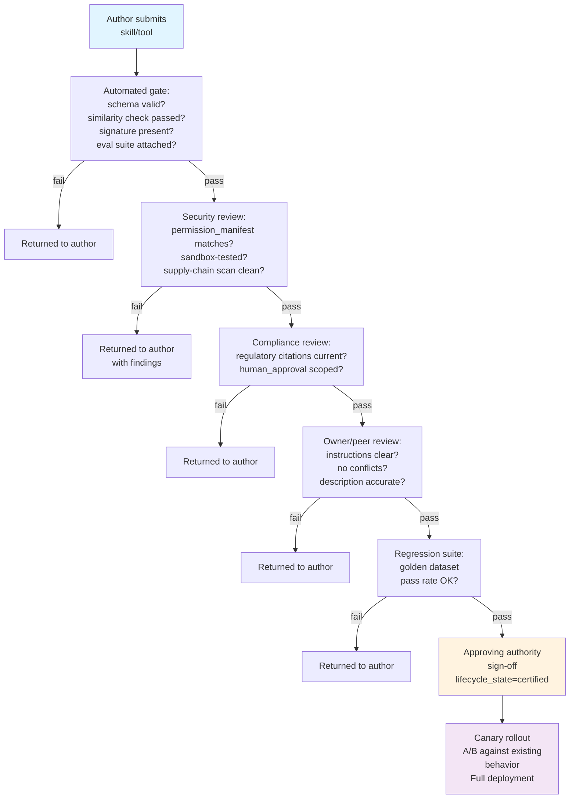

# Part 11 — Governance (+ Deliverable 6: Governance Model)

## 10.1 Why governance is now unavoidable, not aspirational

Skills and tools are no longer a handful of hand-built integrations reviewed once by a single architect. With SAP alone reporting roughly 2,400 Joule Skills across 40+ agents, and every enterprise platform now shipping self-service skill/agent-builder tooling (Joule Studio, Agent Builder, Foundry portal, ADK), the realistic failure mode is **ungoverned proliferation**, not scarcity. Governance is the mechanism that keeps that proliferation safe and navigable rather than turning into the duplicate-sprawl and security-debt problems covered in files `06` and `09`.

## 10.2 Lifecycle states and gates

## 10.3 Ownership model

| Role | Responsibility |
| --- | --- |
| **Skill/Tool Owner** | Accountable for correctness, timely updates when upstream policy/API changes, and first-line incident response |
| **Domain/Business Owner** | Accountable for the business policy the skill encodes being current and correctly represented |
| **Security Reviewer** | Independent review against the permission manifest, supply-chain checks (file `09`), sign-off required for `certified` state |
| **Compliance Reviewer** | Required for any skill touching regulated data or regulated decisions (credit, healthcare, employment) |
| **Registry/Platform Team** | Owns the registry infrastructure itself, admission checks (duplication/similarity gate, file `06`), and cross-platform federation |
| **Approving Authority** | Final sign-off to promote to `certified`/production — should be a named role, not "whoever gets to it," for audit purposes |

## 10.4 Approval workflow (Deliverable 6 core)

## 10.5 Versioning

- **Semantic versioning** (`major.minor.patch`) at the skill and tool level independently — a tool's breaking change (parameter removed, return shape changed) is a major version bump and requires every dependent skill to be re-validated before it can adopt the new version (dependency declarations from file `02` make this traceable).
- **Skills should pin tool version ranges**, not float to "latest," in production — Azure Foundry's toolbox-skill-reference pattern explicitly supports pinning a skill reference to a specific version for exactly this reason.
- **Default version pointer**: most platforms (Azure Foundry's `default_version`, similar patterns elsewhere) separate "all historical versions exist for rollback" from "which version is currently live" — always design for instant rollback to the prior default version without a redeploy.

## 10.6 Deprecation and retirement

- **Deprecation is an announcement with a deadline, not a deletion.** Mark `lifecycle_state: deprecated`, keep it fully functional, surface the successor in discovery results (file `06`), and set a retirement date communicated to all known consumers (traceable via the dependency graph).
- **Retirement removes discoverability** but the registry retains historical metadata and trace-linkage for audit purposes — regulated industries in particular need to be able to answer "what did this agent believe, and why, on a given past date" long after a skill is retired.
- **Rollback** must be a first-class, tested operation — not a manual hotfix improvisation. If a newly certified version regresses in production (caught via the online evaluation loop, file `08`), reverting the default-version pointer should be a single, fast, audited action.

## 10.7 Testing requirements before certification

| Test type | Requirement |
| --- | --- |
| Unit-level tool schema validation | 100% of declared parameters/returns exercised |
| Golden dataset regression | Meets or exceeds `min_pass_rate` from metadata (file `02`) |
| Adversarial/red-team pass | At minimum, the relevant OWASP ASI/AST10 risk classes for this skill's blast radius (file `09`) |
| Human review of instructions | Sign-off that description accurately scopes usage and negative examples are present |
| Canary/A/B in production | Required before full rollout for any skill above a defined risk tier |

## 10.8 Audit trail

Every lifecycle transition (submitted, reviewed, approved, deployed, deprecated, retired) should be an immutable, timestamped record, linked to the specific artifact version and the specific human/system that made the decision — this is the same "traceability by design" principle SAP's leadership has articulated publicly for agent *actions* ("every action an agent takes... is fully logged... you always know what an agent did, why it did it and what data it used") applied one layer up, to the governance of the *capabilities* those actions come from.

## 10.9 Deliverable 6 — Governance model summary table

| Dimension | Policy |
| --- | --- |
| **Ownership** | Every artifact has exactly one accountable owner + domain owner; no orphaned artifacts permitted past `draft` |
| **Approval** | Multi-gate (automated → security → compliance → peer → regression → sign-off) before `certified` |
| **Versioning** | Semver, independent per artifact, pinned dependencies, instant-rollback default-version pointer |
| **Lifecycle** | Six states (`draft` → `in_review` → `certified` → `deployed` → `deprecated` → `retired`), each with explicit entry/exit criteria |
| **Retirement** | Deprecation window with communicated deadline; retirement removes discoverability but preserves audit history |
| **Audit** | Immutable, timestamped, artifact-and-actor-linked record of every lifecycle transition |

## Related

- [Security Architecture](36-agent-skills-security-architecture.md) — the previous section in this series.
- [Architecture Patterns, Anti-Patterns & Case Studies](38-architecture-patterns-antipatterns-and-case-studies.md) — the next section in this series.
