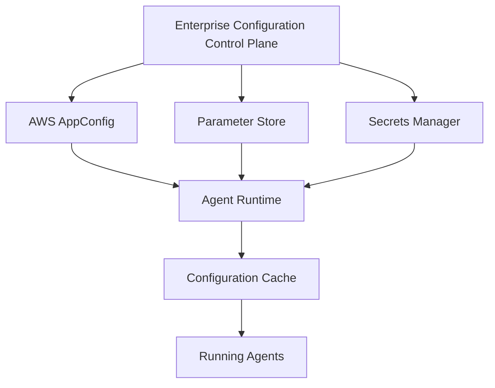

This document is part of the Enterprise Agent Builder Platform architecture reference series, focusing on enterprise configuration & parameter management (part 2): runtime patterns & features.

## Related Documents

- [Part 1: Enterprise Configuration & Parameter Management](../02-enterprise-agentic-ai-config-management-2026.md)
- [Part 3: Governance & Operations](./02-enterprise-agentic-ai-config-management-2026-part3.md)




Enterprise configuration management architecture showing the layered approach to managing configuration in Agentic AI systems on AWS. Configuration flows from centralized control plane through multiple AWS services to distributed agent runtimes with local caching for resilience.

## Runtime Configuration
### How Enterprises Update Configuration Without Redeployment
The ability to update configuration at runtime — without redeploying application code — is one of the most critical capabilities for enterprise Agentic AI platforms. A misconfigured prompt, a model that produces poor outputs, or an enabled capability that causes compliance issues must be correctable in seconds, not hours.
### Configuration Refresh Patterns
### Pull-Based Polling
Applications periodically poll the configuration service for updates. Simple to implement but introduces update latency equal to the polling interval.
- Polling interval: 30s–300s depending on criticality
- Exponential backoff on configuration service failures
- Last-known-good cache prevents failures if service is unavailable
- Jitter added to polling interval to prevent thundering herd
- Checksum/ETag comparison avoids unnecessary deserialization
- AppConfig Agent uses efficient long-polling (not busy-polling)
- → *Best for: AppConfig (built-in long-poll), Parameter Store polling, low-criticality flags*
### Push-Based Event-Driven
Configuration service pushes changes to subscribers via messaging systems. Near-real-time updates with minimal polling overhead, but requires message broker infrastructure.
- EventBridge rules trigger on Parameter Store / AppConfig changes
- SNS fan-out to per-service SQS queues for guaranteed delivery
- Lambda functions process configuration change events
- ECS/EKS sidecar containers receive updates and apply to agent config
- WebSocket connections for truly real-time configuration streaming
- Dead letter queues for failed configuration update processing
- → *Best for: kill switches (must propagate in &lt;5s), emergency guardrail updates*
### Local Configuration Cache
Each agent instance maintains an in-memory or on-disk cache of its configuration. This provides sub-millisecond configuration reads and resilience against configuration service outages.
- AppConfig Agent extension maintains local cache (default 90s TTL)
- Redis/ElastiCache as distributed cache for EKS agent fleets
- SQLite-backed local cache for Lambda (persistent across warm starts)
- Cache invalidation on configuration change events
- Stale-while-revalidate pattern: serve cached value while refreshing
- Cache warming on agent startup (pre-load all required configuration)
- → *Critical: agents must NEVER fail if configuration service is temporarily unavailable*
### Configuration Snapshots
Point-in-time snapshots of complete configuration state, stored in S3. Agents boot from snapshots and apply incremental updates from the change stream.
- Daily full snapshots to S3 for disaster recovery
- Incremental change log for replay from any point in time
- Snapshot integrity verification (SHA-256 hash)
- Agents download and validate snapshot on cold start
- Snapshot compression for large configuration sets
- Cross-region snapshot replication for DR scenarios
- → *Enables fast recovery and rollback to any previous configuration state*
### Distributed Cache Pattern
ElastiCache (Redis) or DAX (for DynamoDB-backed config) provides a shared distributed cache for agent fleets running on ECS/EKS, enabling consistent configuration reads across hundreds of instances.
- Redis Pub/Sub for real-time configuration change notification
- DAX cluster in front of DynamoDB for consistent &lt;1ms reads
- Cache cluster sized for peak agent concurrency
- Redis Cluster mode for horizontal scaling
- Separate cache namespaces per tenant for isolation
- Cache warmup scripts for Blue/Green deployment switches
- → *Required for large EKS deployments (100+ agent pods) to avoid Parameter Store TPS limits*
### Configuration Update Latency Targets
Different configuration types have different acceptable update latency windows. Enterprises must design their configuration delivery pipeline to meet these targets.
|**Configuration Type**|**Max Acceptable**<br/>**Latency**|**Recommended Mechanism**|**Failure Mode**|
|Kill Switches|&lt;5 seconds|EventBridge + Push|Block all requests|
|**Configuration Type**|**Max Acceptable**<br/>**Latency**|**Recommended Mechanism**|**Failure Mode**|
|Guardrail Updates|&lt;30 seconds|AppConfig + Push|Use previous guardrail|
|Prompt Version Updates|&lt;60 seconds|AppConfig polling|Use previous prompt version|
|Model Selection Changes|&lt;60 seconds|AppConfig polling|Use default model|
|Feature Flags|&lt;90 seconds|AppConfig Agent cache|Use default (off)|
|Cost Limits|&lt;5 minutes|AppConfig polling|Use conservative default|
|Tool Endpoints|&lt;15 minutes|Parameter Store polling|Use cached endpoint|
|Static Configuration|Restart cycle|Parameter Store / S3|Fail to start|
### Failure Recovery & Rollback
Configuration changes are the #1 cause of production incidents in distributed systems. Every configuration update must include a tested rollback path that can be executed in under 60 seconds.
- **AppConfig automatic rollback:** Configure CloudWatch alarms (error rate, latency) that trigger
- automatic deployment rollback via AppConfig stop-deployment API
- **Feature flag kill switch:** All feature flags have an emergency off switch that bypasses all targeting
- rules and immediately disables the feature globally
- **Configuration version labels:** Parameter Store versions labeled STABLE, CURRENT, CANARY —
- instant rollback by changing the CURRENT label to point to STABLE version
• **Snapshot rollback:** Agents can be instructed to boot from a specific configuration snapshot for full environment rollback
• **Git revert:** GitOps-managed configuration is rolled back via Git revert PR, automatically triggering the deployment pipeline
• **Blue/Green configuration swap:** Maintain two complete configuration sets (blue and green), instant switchover by changing routing configuration
## Feature Flag Platforms
### Enterprise Feature Flag Architecture for Agentic AI
Feature flags are the control plane for progressive delivery of AI agent capabilities. Unlike traditional software where a bad feature causes a UI bug, a bad AI feature flag can expose unsafe agent behaviors to production users. Enterprise feature flag platforms for AI must support emergency kill switches, per-tenant targeting, and integration with RAI policy enforcement.
### AWS AppConfig Feature Flags
|**Architecture**|Managed AWS service storing feature flag definitions as JSON documents in AppConfig.<br/>Integrates natively with Lambda (extension), ECS/EKS (sidecar), and EC2. Evaluation<br/>happens client-side using downloaded flag document.|
|**Targeting**|Basic targeting via flag document structure. Advanced targeting requires CloudWatch<br/>Evidently (segment-based) or custom evaluation logic.|
|**Rollout**|Percentage-based via Evidently launches. Manual percentage changes via flag document<br/>updates with AppConfig deployment strategies.|
|**Kill Switch**|Update flag to false→AppConfig deployment→propagates in 90s (agent cache TTL).<br/>Emergency: set cache TTL to 0s for immediate propagation.|
|**Pricing**|$0.0008 per configuration deployment + API call costs. Essentially free for low-volume flag<br/>operations.|
|**Recommendatio**<br/>**n**|USE for simple binary flags and AWS-only deployments. AUGMENT with Evidently for<br/>targeting. REPLACE with LaunchDarkly for complex enterprise needs.|
### LaunchDarkly
|**Architecture**|SaaS feature management platform with edge SDK evaluation. Flag rules evaluated<br/>client-side from locally cached rule set streamed via SSE. Sub-millisecond flag evaluation<br/>latency. Enterprise adoption: Netflix, IBM, HP, Atlassian.|
|**Targeting**|Multi-dimensional targeting: user attributes, custom context types, percentage rollouts,<br/>targeting rules with boolean/string/number/JSON flag types. Tenant-based, region-based,<br/>agent-type-based targeting.|
|**Rollout**|Progressive rollout with percentage increments. Automated rollout based on metric<br/>thresholds. A/B testing with experiment management. Ring deployments.|
|**Kill Switch**|Instant kill: LD SDK maintains streaming connection. Flag off propagates in &lt;500ms globally.<br/>Per-target kill switches supported.|
|**Pricing**|Enterprise pricing (custom). Developer tier from $20/month. Seats-based pricing — can be<br/>expensive for large teams.|
|**Recommendatio**<br/>**n**|BEST choice for complex multi-tenant enterprise feature flags. Superior targeting, SDK<br/>ecosystem, and experiment management vs AWS-native options.|
### OpenFeature + Flagsmith
|**Architecture**|OpenFeature is a CNCF standard API for feature flags that decouples application code from<br/>specific feature flag providers. Flagsmith is an open-source implementation deployable on<br/>AWS. Enables vendor switching without code changes.|
|**Targeting**|Flagsmith: rule-based targeting, percentage rollouts, identity-based flags. OpenFeature:<br/>provider-agnostic targeting via evaluation context.|
|**Rollout**|Gradual rollout in Flagsmith (percentage of users). A/B testing via segment configuration.|
|**Kill Switch**|Immediate flag disable in Flagsmith UI. Propagation depends on SDK polling interval (default<br/>60s).|
|**Pricing**|Flagsmith: Open source (self-hosted free) or SaaS from $45/month. OpenFeature: CNCF<br/>open source (free).|
|**Recommendatio**<br/>**n**|USE when vendor neutrality is required or budget is constrained. OpenFeature standard<br/>protects against future migration costs.|
### Unleash (Self-Hosted)
|**Architecture**|Open-source feature flag platform (hosted or self-hosted on AWS). SDK available for Go,<br/>Python, Java, Node.js, .NET. PostgreSQL or MySQL backend. Enterprise version with SSO,<br/>RBAC, audit logs.|
|**Targeting**|Activation strategies: gradual rollout, user ID list, IP address, hostname, custom strategies.<br/>Variants for A/B testing.|
|**Rollout**|Gradual rollout strategy (0-100% by user ID hash). Variant-based rollout for A/B testing.|
|**Kill Switch**|Instant disable via API or UI. SDK polls every 15 seconds by default.|
|**Pricing**|Open source (free self-hosted). Enterprise from $50/month for hosted.|
|**Recommendatio**<br/>**n**|USE for cost-sensitive deployments where LaunchDarkly pricing is prohibitive. Good for<br/>regulated industries requiring on-premise data residency.|
### AI-Specific Feature Flag Patterns
- **Model Version Flag:** Flag 'use_claude_4' enables routing to new model. Canary to 5% of agents →
- measure quality metrics → expand. Instant rollback if quality degrades.
- **Prompt Version Flag:** Flag 'prompt_version' returns 'v2.3.1' or 'v2.2.0'. AppConfig deployment
- strategy with 30-minute bake time and CW alarm rollback.
- **RAI Guardrail Flag:** Flag 'enable_strict_guardrails' overrides default. Emergency ON switch that
- bypasses all targeting rules — any compliance event enables globally.
- **Tool Availability Flag:** Flag 'enable_web_search_tool' controls tool availability per agent type and
- tenant tier. Gradual rollout with error rate monitoring.
- **Human Approval Flag:** Flag 'require_human_approval_for_financial' — kill switch that forces human
- review for all financial operations, regardless of configured threshold.
- **Cost Control Flag:** Flag 'enforce_token_budget' enables/disables strict token counting per agent.
- Emergency switch to prevent runaway cost events.
Agentic AI platforms handle a large volume of secrets: LLM API keys, OAuth credentials for tool integrations, database passwords, vector database API keys, observability tokens, and inter-service authentication credentials. A mature secrets management architecture is non-negotiable for enterprise AI platforms.
|**Capability**|**AWS Secrets**<br/>**Manager**|**HashiCorp Vault**|**Azure Key Vault**|**Google Secret**<br/>**Manager**|
|---|---|---|---|---|
|Auto Rotation|Native (RDS/Lambd|a)Dynamic secrets|Native (Azure resou|rces)<br/>Limited|
|Dynamic Secrets|Static only|Core feature|Static only|Static only|
|Cross-Cloud|AWS only|Multi-cloud|Azure focus|GCP focus|
|PKI / Certs|ACM integration|Full PKI engine|Certificate mgmt|CA Service|
|Multi-Region|Replication|Enterprise|Geo-redundancy|Native|
|Audit Logging|CloudTrail|Audit log|Activity log|Cloud Audit|
|Short-Lived Creds|Limited (rotation)|Core design|Limited|Limited|
|K8s Integration|External Secrets Op.|Native (Agent)|CSI driver|Workload Identity|
|Cost (est)|$0.40/secret/mo|Enterprise pricing|Azure pricing|$0.06/version/mo|
|Complexity|Low|High|Medium|Medium|
|AWS IAM Integ|Native|Via auth method|Limited|Limited|
### AWS Secrets Manager — Enterprise Implementation
### Secret Naming Convention
Use hierarchical naming: /{environment}/{platform}/{service}/{secret-type}. Example: /prod/agent-platform/bedrock/api-key, /prod/agent-platform/langfuse/token, /prod/agent-platform/oauth/{tool-name}/client-secret. Tag every secret with: Environment, Platform, Team, DataClassification, RotationSchedule.
### Automatic Rotation Architecture
Configure Lambda rotation functions for all API keys and OAuth tokens. Rotation Lambda: (1) Generate new credential, (2) Test new credential, (3) Update secret with AWSPENDING label, (4) Validate, (5) Promote to AWSCURRENT, (6) Delete old credential. Set rotation window: 30 days for API keys, 90 days for service accounts, 7 days for OAuth refresh tokens.
### Cross-Account Access Pattern
Agent services in isolated AWS accounts access secrets via resource-based policies. Pattern: Secrets Manager resource policy allows specific IAM roles from child accounts. Avoids cross-account credential sharing. Audit log in the secrets owner account. Use AWS Organizations SCPs to enforce that secrets are only accessed from approved accounts.
### SDK Caching Client
Use AWS Secrets Manager caching client in all agent code. Default cache TTL: 3600 seconds. Reduces API calls by 99%+ for frequently accessed secrets. Force refresh on rotation event via EventBridge → Lambda → cache invalidation. Never call GetSecretValue in hot paths — always use the caching client.
### Dynamic Secrets via HashiCorp Vault
For advanced use cases, deploy HashiCorp Vault for dynamic secrets: Database secrets that auto-generate per-session credentials with 1-hour TTL. AWS STS credentials generated on-demand via Vault AWS secrets engine. Zero standing privileges — agents only get credentials when actively needed. Vault sidecar injection for EKS workloads via Agent Injector.
### Secret Classification Matrix
|**Secret Type**|**Store**|**Rotation**<br/>**Period**|**Access Pattern**|**Risk Level**|
|---|---|---|---|---|
|LLM API Keys|Secrets Manager|30 days|Read at startup (cach|ed)CRITICAL|
|OAuth Client Secrets|Secrets Manager|90 days|Read at startup|HIGH|
|Database Passwords|Secrets Manager|30 days (auto)|SDK cache|CRITICAL|
|Vector DB API Keys|Secrets Manager|30 days|Read at startup|HIGH|
|Service Account Keys|Secrets Manager / Vault|7 days|Dynamic (Vault)|HIGH|
|Observability Tokens|Secrets Manager|90 days|Read at startup|MEDIUM|
|MCP Server Auth Tokens|Secrets Manager|30 days|Read per session|HIGH|
|Encryption Keys|KMS (not SM)|Annual (KMS ma|naged)<br/>KMS API|CRITICAL|
|TLS Certificates|ACM / Vault|Annual (auto-ren|ew)ACM managed|CRITICAL|
|Webhook Signing Keys|Secrets Manager|30 days|Read at startup|HIGH|
## Configuration Hierarchy Design
### Organizing Configuration for Enterprise Scale
A well-designed configuration hierarchy is the cornerstone of scalable enterprise configuration management. It eliminates duplication, enables governed override, and provides clear ownership at every level of the organization.
### The 14-Level Configuration Hierarchy
|**L1: Enterprise**|Global defaults that apply to every agent across all organizations. Security minimums,<br/>compliance baselines, cost governance defaults, RAI policy minimums. Managed by:<br/>Platform Security & Architecture team. Change requires: Architecture Review Board<br/>approval.|
|**L2: Organization**|Organizational unit overrides. Business unit specific policies, regulatory constraints,<br/>approved model lists. Managed by: BU Platform Engineering. Change requires: BU CTO<br/>approval.|
|**L3: Business**<br/>**Unit**|BU-specific configuration: cost center codes, preferred observability platforms,<br/>BU-approved tool sets, internal API endpoints. Managed by: BU Platform team.|
|**L4: Platform**|Agent Builder Platform configuration: platform version, supported runtimes, platform<br/>feature flags, SDK versions. Managed by: Platform Engineering team.|
|**L5: Environment**|Environment-specific overrides: dev (verbose logging, mock endpoints), test (synthetic<br/>credentials), UAT (production models, test data), prod (real credentials, optimized<br/>settings). Managed by: DevOps/SRE team.|
|**L6: Region**|Regional configuration: Bedrock model availability by region, regional endpoints, data<br/>residency constraints, regional cost limits, latency-based routing. Managed by: Platform<br/>Engineering.|
|**L7: Tenant**|Tenant-specific configuration: tenant tier (Basic/Pro/Enterprise), tenant feature flags,<br/>custom model allowlists, tenant branding config, per-tenant token budgets. Managed by:<br/>Platform Operations.|
|**L8: Project**|Project-level configuration: project-specific tool sets, project knowledge bases, project<br/>prompt collections, project cost allocation. Managed by: Project team lead.|
|**L9: Agent**|Individual agent configuration: agent role, capabilities, model selection, prompt version,<br/>memory configuration, human approval thresholds. Managed by: Agent developer.<br/>Change requires: code review + AppConfig deployment.|
|**L10: Workflow**|Workflow-specific configuration: step definitions, branching rules, parallel limits, step<br/>timeouts. Managed by: Workflow developer.|
|**L11: Tool**|Tool-specific configuration: tool endpoints, authentication, rate limits, timeouts, retry<br/>policies. Managed by: Tool owner.|
|**L12: Session**|Session-level runtime configuration: session token budget, session memory scope,<br/>session feature overrides for A/B testing. Set programmatically at session creation.|
|**L13: User**|User-level preferences and overrides: language, persona, access tier, user-specific feature<br/>flags. Retrieved from user profile service.|
|**L14: Request**|Per-request runtime context: dynamic context injection, request-specific tool restrictions,<br/>real-time cost limits. Set by calling application at request time.|
### Parameter Store Hierarchy Implementation
The 14-level hierarchy maps directly to SSM Parameter Store paths:
```
/enterprise/defaults/security/min-guardrail-version
```
```
/enterprise/defaults/rai/content-policy-arn
/org/fintech/defaults/compliance/pii-detection-enabled
/platform/agent-builder/v2/supported-runtimes /env/prod/bedrock/model-allowlist
/region/us-east-1/bedrock/endpoint /tenant/{tenant-id}/token-budget/monthly-usd
/project/{project-id}/knowledge-base-arns /agent/{agent-id}/model-id
/agent/{agent-id}/prompt-version /agent/{agent-id}/memory-config
/workflow/{workflow-id}/step-timeout-seconds /tool/{tool-id}/endpoint-url
/tool/{tool-id}/auth-secret-arn
```
### Inheritance Rules
- **Last-writer-wins:** Lower levels override higher levels for the same key
- **Deep merge for maps:** Nested JSON objects are merged recursively (not replaced)
- **Append for lists:** List values (e.g., allowed-tools) are unioned by default; explicit 'replace' prefix
- overrides
- **Explicit null to remove:** A lower level can remove an inherited value by explicitly setting null
- **Protected values:** Enterprise-level security minimums cannot be overridden (marked 'immutable' in
- schema)
- **Dependency resolution:** Configuration values referencing other values (e.g.,
- ${env/prod/bedrock/endpoint}) are resolved at evaluation time
- **Cycle detection:** Configuration resolver detects circular references and fails with descriptive error
## Configuration Schema Design
### Type-Safe, Versioned Schemas for Every Configuration Category
Configuration schemas are the contract between configuration producers (platform teams, agent developers) and configuration consumers (agents at runtime). Strict JSON Schema validation with schema versioning prevents misconfiguration incidents and enables safe schema evolution over time.
### Agent Configuration Schema
```
{ "$schema": "https://json-schema.org/draft/2020-12/schema", "$id":
"https://platform.enterprise.com/schemas/agent/v1.2.0", "title": "AgentConfiguration",
"type": "object", "required": ["agentId", "modelConfig", "promptConfig", "memoryConfig",
"policyConfig"], "additionalProperties": false, "properties": { "agentId": { "type":
"string", "pattern": "^[a-z][a-z0-9-]{2,63}$" }, "version": { "type": "string",
"pattern": "^\\d+\\.\\d+\\.\\d+$" }, "displayName": { "type": "string", "maxLength": 128
}, "description": { "type": "string", "maxLength": 1024 }, "modelConfig": { "type":
"object", "required": ["primaryModelId"], "properties": { "primaryModelId": { "type":
"string" }, "fallbackModelId": { "type": "string" }, "temperature": { "type": "number",
"minimum": 0, "maximum": 2 }, "maxTokens": { "type": "integer", "minimum": 1, "maximum":
200000 }, "topP": { "type": "number", "minimum": 0, "maximum": 1 }, "stopSequences": {
"type": "array", "items": { "type": "string" }, "maxItems": 10 } } }, "promptConfig": {
"type": "object", "required": ["systemPromptRef"], "properties": { "systemPromptRef": {
"$ref": "#/$defs/PromptRef" }, "fewShotRef": { "$ref": "#/$defs/PromptRef" },
"outputFormatRef": { "$ref": "#/$defs/PromptRef" } } }, "memoryConfig": { "type":
"object", "properties": { "shortTermWindowTokens": { "type": "integer", "minimum": 1000,
"maximum": 200000 }, "longTermStoreArn": { "type": "string", "pattern": "^arn:aws:.*" },
"retrievalTopK": { "type": "integer", "minimum": 1, "maximum": 20 },
```
```
"retrievalSimilarityThreshold": { "type": "number", "minimum": 0, "maximum": 1 } } },
"policyConfig": { "type": "object", "required": ["guardrailConfigArn", "raiPolicyRef"],
"properties": { "guardrailConfigArn": { "type": "string" }, "raiPolicyRef": { "type":
"string" }, "humanApprovalThreshold": { "type": "number", "minimum": 0, "maximum": 1 } }
}, "costConfig": { "type": "object", "properties": { "monthlyBudgetUSD": { "type":
"number", "minimum": 0 }, "budgetExhaustedBehavior": { "enum": ["THROTTLE", "BLOCK",
"NOTIFY_ONLY"] } } } }, "$defs": { "PromptRef": { "type": "object", "required":
["promptId", "version"], "properties": { "promptId": { "type": "string" }, "version": {
"type": "string" }, "registryArn": { "type": "string" } } } } }
```
### Schema Evolution Rules
- **MINOR version bump** (1.2.0 → 1.3.0): Adding optional fields with defaults. Fully backward
- compatible. Existing configurations remain valid.
- **MAJOR version bump** (1.x.x → 2.0.0): Removing required fields, renaming fields, changing field
- types. Requires migration script and dual-write period.
- **Schema registry:** All schema versions stored in S3 with immutable versioned paths. Agents specify
- the schema version they consume.
- **Validation pipeline:** Every configuration change validated against schema in CI. AppConfig Lambda
- validator enforces schema at deployment time.
- **Schema deprecation:** Deprecated schemas remain valid for 6 months with deprecation warning.
- Platform migrates consumers before end-of-life.
- **Breaking change process:** RFC required for breaking schema changes. Minimum 30-day notice.
- Migration tooling provided by platform team.
## Configuration Lifecycle
### From Design Through Archival
Configuration has a complete lifecycle that must be managed with the same discipline as application code: design, review, approval, publishing, distribution, consumption, versioning, deprecation, and archival.
|**1. Design**|Configuration schema drafted in YAML/JSON. Peer review by 2 platform engineers.<br/>Schema linting via CI pipeline. Owner assigned (team + individual). Documentation<br/>written.|
|**2. Review &**<br/>**Approval**|Pull request in GitOps repository. Automated checks: schema validation, naming<br/>convention, security policy, cost impact. Human review: platform team approval for<br/>cross-cutting config, owner review for agent-specific.|
|**3. Publishing**|Merge to main triggers CD pipeline. Parameter Store update via CloudFormation /<br/>Terraform apply. AppConfig deployment with configured deployment strategy (canary for<br/>prod). Event published to EventBridge (configuration.published event).|
|**4. Distribution**|AppConfig Agent delivers to running instances. EventBridge triggers Lambda to<br/>invalidate distributed caches. SNS notification to subscribed services. Configuration<br/>health check validates propagation.|
|**5. Runtime**<br/>**Consumption**|Agents read from local cache (AppConfig Agent). Cache miss triggers AppConfig API<br/>call. All reads logged to CloudWatch for observability. Schema validation on<br/>consumption (fail-fast on invalid config).|
|**6. Versioning**|Every change creates new version (immutable). Current version labeled ACTIVE.<br/>Previous version labeled PREVIOUS. Up to 100 versions retained in Parameter Store.<br/>Version history queryable via platform API.|
|**7. Deprecation**|Deprecation notice added to schema (deprecatedAt field). 6-month deprecation period<br/>with active migration support. Platform dashboard shows consumers still using<br/>deprecated configs. Automated PR creation for automated migrations.|
|**8. Archival**|Archived configurations moved to S3 Glacier after 90 days. Retained for 7 years for<br/>compliance. Audit log retained separately in CloudWatch Logs Insights. Archived configs<br/>can be restored for DR scenarios.|
## Platform Engineering
### Internal Developer Platform for Configuration
An Internal Developer Platform (IDP) for configuration management dramatically improves developer productivity and ensures configuration governance is embedded in the developer workflow rather than applied as a gate after the fact.
### Self-Service Configuration Portal
→ `Web UI for browsing and creating agent configurations (Backstage plugin)`
→ `Form-based agent builder with real-time schema validation`
→ `Configuration diff viewer for change review` → `One-click deployment to non-prod environments`
→ `Approval workflow UI for production deployments`
→ `Configuration health dashboard per agent/environment`
→ `Usage analytics: which configurations are actively consumed`
### Configuration CLI (platform-config)
→ `platform-config init agent --template bedrock-rag-agent`
→ `platform-config validate --config agent.yaml --env prod`
→ `platform-config deploy --config agent.yaml --env test --strategy canary`
→ `platform-config rollback --agent my-agent --version v2.1.0 --env prod`
→ `platform-config diff --agent my-agent --from prod --to test` → `platform-config get --agent my-agent --env prod --key modelConfig.primaryModelId`
→ `platform-config audit --agent my-agent --from 2025-01-01 --to 2025-12-31`
### Terraform Provider (provider 'agentplatform')
→ `resource 'agentplatform_agent' 'my_agent' { ... } — full agent configuration as IaC` → `data 'agentplatform_model_list' 'approved' { tier = 'enterprise' } — discover approved models`
→ `resource 'agentplatform_feature_flag' 'web_search' { ... } — feature flags as code` → `resource 'agentplatform_prompt' 'system' { ... } — prompt registration in IaC` → `Automatic dependency resolution between related resources` → `Import command for existing configurations`
### Configuration SDK (Python/TypeScript/Java/Go)
→ `from agent_platform import ConfigClient, AgentConfig`
→ `config = await ConfigClient.load(agent_id='my-agent', env='prod')`
→ `model_id = config.model.primary_model_id # typed, IDE autocomplete`
→ `config.on_change('modelConfig', lambda c: reload_model(c)) # hot reload`
→ `config.validate() # raises ConfigValidationError on schema violation`
→ `config.mock({'modelConfig.temperature': 0.0}) # for testing`
### Golden Path Templates
→ `bedrock-rag-agent: RAG agent with Knowledge Base, Guardrails, memory` → `bedrock-orchestrator: Multi-agent orchestration with routing rules`
→ `tool-specialist: Single-purpose agent with specific tool set`
→ `compliance-agent: Pre-configured with strict RAI and audit settings`
→ `cost-optimized-agent: Haiku model, aggressive caching, token limits`
→ `research-agent: High context window, web search, extended memory`
## Security & Zero Trust
### Securing Configuration in Agentic AI Platforms
Configuration security for Agentic AI platforms must address a unique threat model: adversarial prompt injection via misconfigured guardrails, cost attacks via model selection manipulation, data exfiltration via compromised tool endpoints, and unauthorized capability escalation via feature flag tampering.
### Zero Trust Configuration Access
- No implicit trust — every configuration read requires explicit authorization
- IAM roles scoped to minimum required configuration paths
- VPC endpoints for all configuration service access (no public internet)
- mTLS for service-to-service configuration API calls
- Short-lived STS tokens for cross-account configuration access
- IAM conditions: aws:SourceVpc, aws:RequestedRegion, aws:PrincipalTag
### ABAC with Cedar Policy
- Cedar policies define fine-grained access rules for configuration
- Example: permit agent with tag AgentTier=='enterprise' to read configuration in path '/enterprise/**'
- Configuration access context includes: agent-id, tenant-id, environment, IP range
- Policy evaluation cached in AVP (Amazon Verified Permissions)
- Policy as code — Cedar policies versioned in Git alongside configuration
- Real-time policy evaluation at configuration read time (not just write time)
### Configuration Signing & Tamper Detection
- All configuration artifacts signed with KMS asymmetric key (RSA-2048)
- Agents verify signature before applying configuration
- SHA-256 hash stored alongside configuration for integrity verification
- Tamper detection: CloudWatch alarm on signature verification failures
- Configuration provenance: who created, who approved, who deployed
- SBOM linkage: configuration version linked to deploying pipeline run
### Configuration Encryption
- All configuration at rest encrypted with customer-managed KMS keys
- KMS key per environment (separate keys for dev/test/uat/prod)
- KMS key policies enforce principle of least privilege
- Envelope encryption for large configuration documents (S3)
- SecureString parameters encrypted at Parameter Store level
- Configuration caches encrypted at rest (Redis AUTH + TLS, EBS encryption)
### Configuration Drift Detection
- AWS Config Rules detect drift from approved configuration baselines
- Scheduled Lambda functions compare runtime config with Git source of truth
- Alerts on manual console edits that bypass GitOps pipeline
- Automated remediation: SNS alert + optional auto-rollback to Git state
- Configuration audit reports generated weekly for security review
- Drift score tracked as SLA metric for platform reliability
## Configuration Observability
Monitoring Configuration Changes, Propagation, and Failures
Configuration observability answers the critical operational questions: Did my configuration change propagate to all agents? Is the new prompt version being used? Did the kill switch activate globally? Why is Agent-X still using the old model?
### Configuration Change Events
All configuration changes published to EventBridge as structured events. Schema: {eventType: 'configuration.updated', agentId, configPath, oldVersion, newVersion, deployedBy, deploymentStrategy, timestamp}. Events consumed by: audit log (CloudWatch), notification service (SNS), propagation tracker (DynamoDB), dashboard (Grafana).
### Propagation Monitoring
After each configuration deployment, propagation tracker polls a random 10% sample of running agent instances to verify they have received the new version. Alert if &lt;95% of instances have updated within SLA window (90s for AppConfig, 300s for polling). Dashboard shows propagation heatmap by region and availability zone.
### Configuration Failure Detection
Agent SDK emits metric 'config.read.failure' on any configuration read error. CloudWatch alarm triggers on >1% failure rate. Separate alarm for 'config.validation.failure' (schema mismatch at runtime). PagerDuty integration for P1 configuration failures (kill switch, guardrail).
### Rollback Event Tracking
Every rollback event recorded with: trigger (manual/automatic), triggering alarm, time-to-rollback, affected agents, root cause label. Monthly rollback report reviewed by platform team. Rollback frequency tracked as key metric.
### Feature Flag Usage Analytics
Langfuse / Phoenix integration tracks which prompt versions, model IDs, and feature flags are active per agent execution. Enables correlation: configuration version X → quality metric Y. Powers configuration impact analysis for prompt and model updates.
### Audit Trail
CloudTrail captures all API calls to Parameter Store, AppConfig, Secrets Manager. Custom CloudWatch Logs Insights queries for: who changed what, when, from where. Audit reports exported to S3 for compliance (SOC2, GDPR, HIPAA). 7-year retention for regulated industries.
### OpenTelemetry Integration
Agent SDK instruments configuration reads with OTel spans: span attributes include config-path, config-version, cache-hit/miss, latency. Traces sent to Phoenix/Langfuse for AI-specific observability. Config read latency tracked as P99 SLO metric.