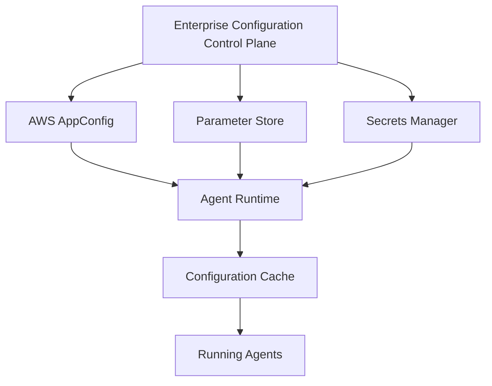

This document is part of the Enterprise Agent Builder Platform architecture reference series, focusing on enterprise configuration & parameter management (part 3): governance & operations.

## Related Documents

- [Part 1: Enterprise Configuration & Parameter Management](../02-enterprise-agentic-ai-config-management-2026.md)
- [Part 2: Runtime Patterns & Features](./02-enterprise-agentic-ai-config-management-2026-part2.md)




Enterprise configuration management architecture showing the layered approach to managing configuration in Agentic AI systems on AWS. Configuration flows from centralized control plane through multiple AWS services to distributed agent runtimes with local caching for resilience.

## AI-Specific Configuration Requirements
### Configuration Patterns Unique to Agentic AI Systems
Agentic AI platforms require configuration capabilities that have no equivalent in traditional software systems. Prompt versioning, model routing, RAI policy management, and MCP server registries are examples of AI-specific configuration domains that must be designed from the ground up.
### Prompt Registry & Versioning
- Centralized Prompt Registry stores all prompt templates with semantic versioning (MAJOR.MINOR.PATCH)
- MAJOR bump: fundamental change to prompt structure or persona
- MINOR bump: additional instructions, updated examples, clarifications
- PATCH bump: typo fixes, formatting improvements
- Prompt approval workflow: draft → review → approved → active → deprecated
- Automatic A/B testing on prompt version upgrades (10% traffic to new version, compare quality metrics)
- Rollback: instant revert to previous approved version via label switch
- Prompt templates stored in S3 (versioned), referenced by AppConfig
- Prompt rendering at runtime (late binding variables: {user_name}, {current_date})
- Prompt injection detection rules embedded in prompt registry validation
### Model Registry & Routing
- Model Registry catalogs all approved models with metadata: provider, context window, cost/token, capabilities
- Model routing rules: intent profile → model selection (FAST→Haiku, BALANCED→Sonnet, ACCURATE→Opus)
- Fallback chain: primary model → fallback model → emergency model
- Model availability monitoring: circuit breaker on model errors > threshold
- Model upgrade path: canary 5% → monitor quality → expand to 50% → 100%
- Embedding model registry: separate registry for text embedding models (for RAG)
- Model cost tracking: real-time token consumption tracked per agent/model
- Model allowlist per environment: no Opus in dev (cost control), no Haiku in safety-critical workflows
### MCP Server Registry
- MCP (Model Context Protocol) Server Registry: catalog of available tool servers with endpoints, capabilities, auth
- Registration includes: server ID, display name, endpoint URL, auth method, capability schema, SLA, owner
- MCP server health monitoring: synthetic probes every 60 seconds
- Agent-to-MCP connection pool management: connection limits per tenant
- MCP server version pinning: agents pin to specific server version to prevent breaking changes
- Discovery API: agents query registry for available tools matching capability requirements
- Rate limit configuration per MCP server, per tenant, per agent
- Cost tracking: external tool call costs attributed to calling agent
### Knowledge Base Registry
- Catalog of all Bedrock Knowledge Bases with metadata: domain, last-indexed, doc count, embedding model
- Knowledge base access control: which agent types/projects can access which KBs
- Multi-KB routing: agent queries multiple KBs and merges results based on configured strategy
- Knowledge Base versioning: track when KB was last updated, alert on stale KBs
- Retrieval configuration per KB: top-k, similarity threshold, search type (semantic/hybrid/keyword)
- Knowledge base health: monitor embedding quality, query latency, retrieval accuracy
### RAI Policy & Guardrail Configuration
- RAI (Responsible AI) Policy Registry: versioned policy documents with approval workflow
- Bedrock Guardrail ARNs registered per policy type (content, topic, PII, grounding)
- Policy hierarchy: enterprise minimum → BU policy → project policy → agent policy
- Emergency guardrail switch: instant enable of maximum restrictions across all agents
- Policy version testing: validate new RAI policies against test query set before activation
- Constitutional AI principle references: link agent configs to specific constitutional principles
- Evaluation threshold configuration: minimum RAGAS scores, human evaluation sample rates
- Safety incident playbook references: configuration links to runbooks for policy violations
### Memory & Context Configuration
- Memory type registry: short-term (context window), episodic (session), semantic (vector), procedural (tool memory)
- Context budget allocation: how to split context window between system prompt, history, retrieved context, user input
- RAG retrieval configuration per agent: embedding model, top-k, similarity threshold, reranker
- Memory TTL policies: session memory expires after 24h, project memory after 30 days, user memory permanent
- Cross-agent memory sharing rules: which agents can read shared memory pools
- Memory compression configuration: when to summarize conversation history vs retain verbatim
## PART 14–15
## Configuration Delivery & Developer Experience
Pull/Push Models, SDKs, and Hot Reload Patterns
### Configuration Delivery Models
|**Model**|**Mechanism**<br/>**Latency**|**Complexity**|**Best For**|
|Pull (Polling)|SDK polls AppConfig/SSM API every N seconds<br/>Poll interval (30–|300s)Low|Feature flags, model config|
|Long Poll|AppConfig API blocks until change or timeou**t**<br/>Near-ins ant on c|hange<br/>Low|AppConfig native consumers|
|Push (EventBri|dge)<br/>EventBridge rule→Lambda/SQS→agent<br/>&lt;5 seconds|Medium|Kill switches, guardrails|
|Push (SSE)|Server-Sent Events from config API &lt;1 second|Medium|Real-time dashboard config|
|Push (WebSoc|ket)Bidirectional streaming connection<br/>&lt;100ms|High|Interactive config updates|
|Hybrid|Poll for normal config + push for critical flags<br/>Mixed|Medium-High|Production enterprise (recommended)|
|Distributed Cac|heRedis Pub/Sub + ElastiCache<br/>&lt;10ms|High|High-scale EKS deployments|
|EventBridge Pi|pesEventBridge Pipes→Kinesis→agents<br/>&lt;10 seconds|Medium|Multi-region fan-out|
### Developer Experience — SDK Design
The configuration SDK is the primary interface for agent developers. It must be typed, self-documenting, testable, and support hot reload with minimal boilerplate.
```
# Python SDK — Agent Configuration Client from agent_platform.config import
ConfigClient, ConfigOptions # Initialize — loads from AppConfig + Parameter Store +
Secrets Manager config = await ConfigClient.create( agent_id="customer-support-agent",
environment="prod", options=ConfigOptions( cache_ttl_seconds=90,
refresh_strategy="hybrid", # poll + push fail_open=True, # use last-known-good on
service failure validate_on_load=True, # schema validation at startup ) ) # Typed access
— IDE autocomplete, no string key lookups model_id = config.model.primary_model_id # str
temperature = config.model.temperature # float prompt_ref =
config.prompt.system_prompt_ref # PromptRef budget_usd = config.cost.monthly_budget_usd
# float | None # Feature flags if config.flags.is_enabled("web_search_tool"):
tools.append(WebSearchTool()) # Hot reload — callback on specific key changes
@config.on_change("model.primary_model_id") async def on_model_change(old_val, new_val):
```
```
await reload_model_client(new_val) # Testing — mock specific values async with
config.mock({"model.temperature": 0.0, "flags.web_search_tool": False}): result = await
agent.run(test_query) assert result.model_used == config.model.primary_model_id #
Observability — all reads traced automatically (OTel) # Metrics: config.read.latency_ms,
config.cache.hit_rate, config.validation.errors
```
## Anti-Patterns
### Common Enterprise Configuration Failures to Avoid
Configuration anti-patterns are the most common cause of production incidents in enterprise AI platforms. Understanding and proactively preventing these failures is as important as implementing the right patterns.
### I **Configuration Sprawl**
**Problem:** Configuration values spread across 10+ different systems with no single source of truth. Teams cannot find which service owns which configuration. Inconsistent values between services cause mysterious failures.
**Solution:** Solution: Implement configuration ownership model. Central registry maps every config key to its authoritative source. Configuration audit quarterly to identify orphaned values.
### I **Secret Leakage via Parameter Store**
**Problem:** API keys, passwords, and OAuth secrets stored as plain-text Parameter Store parameters. CloudTrail logs expose secret values. IAM policies too broad.
**Solution:** Solution: ALL secrets go to Secrets Manager. Parameter Store for non-sensitive values ONLY. Automated scanner (git-secrets, detect-secrets) runs in CI to catch accidental secret commits.
### I **Hardcoded Configuration Values**
**Problem:** Model IDs, endpoint URLs, knowledge base ARNs hardcoded in container images. Requires redeployment for any value change. Different values in different environments require different images — violates 12-Factor principles.
**Solution:** Solution: Zero hardcoded values. All values from external configuration. Startup validation fails fast if any required configuration is missing.
### I **Environment-Specific Code Branches**
**Problem:** if env == 'prod': use_real_model() else: use_mock(). Environment branches in application code. Configuration values embedded in conditionals. Tests don't reflect production behavior.
**Solution:** Solution: Externalized configuration with environment-specific values in configuration store, not in code. Feature flags for behavior differences, not environment checks.
### I **Monolithic Configuration Blobs**
**Problem:** Single JSON document containing all configuration for all agents in the platform. Every configuration change deploys the entire blob. Merge conflicts when multiple teams edit simultaneously. Blast radius of a misconfiguration is the entire platform.
**Solution:** Solution: Fine-grained configuration — one AppConfig profile per agent or per concern. Separate deployable units. Atomic updates with minimal blast radius.
### I **Overusing AppConfig for Secrets**
**Problem:** Storing database passwords and API keys in AppConfig freeform configurations instead of Secrets Manager. No rotation, no encryption at field level, secrets visible in AppConfig console.
**Solution:** Solution: AppConfig for non-sensitive configuration values only. Secrets Manager for all credentials. AppConfig stores ARN references to Secrets Manager secrets.
### I **No Configuration Versioning**
**Problem:** Configuration changes overwrite previous values with no history. When an incident is caused by a configuration change, impossible to identify what changed or roll back. No audit trail for compliance.
**Solution:** Solution: Immutable configuration versions. Every change creates new version. Current version labeled — rollback is just changing the label to a previous version.
### I **Storing Runtime State as Configuration**
**Problem:** Agent conversation history, session data, or dynamic counters stored in Parameter Store or AppConfig. These services are not designed for high-write state. Throttling errors in production.
**Solution:** Solution: Configuration services for configuration only (infrequently changing values). DynamoDB, ElastiCache, or S3 for runtime state. Clear separation of configuration and state.
### I **No Configuration Testing**
**Problem:** Configuration changes deployed directly to production without testing. Schema violations discovered at runtime. Configuration incompatibilities between services not caught until they cause agent failures.
**Solution:** Solution: Configuration test pipeline: schema validation → integration tests in dev → canary deployment to UAT → smoke tests → production. No configuration change skips testing.
### I **Configuration Coupled with Deployment**
**Problem:** Configuration changes require code deployments. New environment variable requires new container image. No way to update configuration without downtime. Emergency guardrail update takes 45 minutes instead of 45 seconds.
**Solution:** Solution: Strict separation of configuration and deployment lifecycles. AppConfig, Parameter Store, and Secrets Manager enable configuration changes completely independent of container image or Lambda function deployments.
## Best Practices Catalog
Comprehensive Configuration Governance for Enterprise Scale
### Naming Standards
- Use lowercase-kebab-case for all configuration keys
- Follow hierarchy: /{layer}/{environment}/{service}/{category}/{key}
- Include version suffix for breaking changes: /agent-config/v2/...
- No abbreviations — prefer clarity over brevity: 'primary-model-id' not 'pm-id'
- Environment names: dev, test, uat, prod (never: d, t, u, p or development, production)
- Tag all resources: Environment, Team, Owner, CostCenter, DataClassification
### Ownership & Governance
- Every configuration key has an explicit owner (team + individual)
- Configuration without an owner is considered a critical finding in quarterly audits
- Platform team owns enterprise-level and platform-level configuration
- Agent developer teams own agent-level and workflow-level configuration
- Secrets owned by security team with delegated access to consuming teams
- Configuration changes to prod require approval from both owner and security reviewer
### Schema & Validation
- Every configuration type has a JSON Schema (minimum version 2020-12)
- Schema validation in CI pipeline (pre-commit hook + pipeline check)
- AppConfig Lambda validator enforces schema at deployment time
- Agent SDK validates configuration schema at startup (fail-fast)
- Schema evolution: additive changes only in MINOR versions; document breaking changes
- Type safety: use typed configuration clients (never raw dict/map access in production)
### Security Baselines
- No secrets in Parameter Store — all credentials in Secrets Manager
- All configuration encrypted at rest (KMS customer-managed keys)
- Separate KMS keys per environment
- Minimum IAM permission: read-only access to specific parameter paths only
- Configuration signing: all configuration artifacts signed with asymmetric KMS key
- Audit logging mandatory: no configuration access without CloudTrail record
- Configuration changes to prod require 2-person approval (4-eyes principle)
### Resilience & Caching
- Always cache configuration locally (AppConfig Agent / SDK cache)
- Implement fail-open: use last-known-good configuration on service failure
- Configuration cache TTL: 90s for feature flags, 300s for static config
- Circuit breaker on configuration service calls (open after 5 consecutive failures)
- Configuration snapshot for disaster recovery (full state backup to S3 daily)
- Test configuration service failure regularly in chaos engineering exercises
### Progressive Delivery
- No configuration change goes directly to production without canary testing
- Standard rollout: dev → test → UAT → canary 5% prod → 25% → 100% prod
- Automated rollback on CloudWatch alarm (error rate > 1% or latency > SLO)
- Bake time: minimum 30 minutes at each percentage stage for prod rollouts
- Kill switch mandatory for all feature flags and capability toggles
- Configuration change freeze windows: no non-emergency changes during peak traffic
### Automation & GitOps
- All configuration changes via pull request — no direct console edits in prod
- GitOps reconciliation: pipeline auto-detects and alerts on drift from Git state
- Automated testing: every PR runs configuration validation test suite
- One-click deployment to non-prod environments for fast iteration
- Automated rollback pipeline: triggered by alarm → execute rollback → notify team
- Monthly automated audits: unused configuration, expired feature flags, orphaned secrets
## Comprehensive Comparison Matrix
### 40+ Decision Criteria Across 14 Configuration Solutions
The following matrix evaluates 14 configuration management solutions across 40+ criteria relevant to Enterprise Agentic AI platforms on AWS. Scores are 1–5 (5 = best). Use this matrix to select the right tool for each configuration category.
|**PERFORMANCE**|**SSM**<br/>**Param**<br/>**Store**|**AWS A**<br/>**ppConf**<br/>**ig**|**Secrets**<br/>**Manag**<br/>**er**|**Dynam**<br/>**oDB**<br/>**Config**<br/>**Svc**|**HashiC**<br/>**orp**<br/>**Vault**|**Launch**<br/>**Darkly**|**Open**<br/>**Feature**|**K8s Co**<br/>**nfigMa**<br/>**ps**|**Spring**<br/>**Cl.**<br/>**Config**|**Consul**|
|---|---|---|---|---|---|---|---|---|---|---|
|Read Latency|**4**|**5**|**3**|**5**|**3**|**5**|**4**|**5**|**3**|**4**|
|Write Latency|**4**|**3**|**4**|**4**|**3**|**4**|**4**|**4**|**3**|**4**|
|Throughput|**3**|**4**|**4**|**5**|**4**|**5**|**4**|**5**|**3**|**4**|
|Cache Support|**3**|**5**|**3**|**5**|**3**|**5**|**3**|**4**|**4**|**5**|
|**FEATURES**|**SSM**<br/>**Param**<br/>**Store**|**AWS A**<br/>**ppConf**<br/>**ig**|**Secrets**<br/>**Manag**<br/>**er**|**Dynam**<br/>**oDB**<br/>**Config**<br/>**Svc**|**HashiC**<br/>**orp**<br/>**Vault**|**Launch**<br/>**Darkly**|**Open**<br/>**Feature**|**K8s Co**<br/>**nfigMa**<br/>**ps**|**Spring**<br/>**Cl.**<br/>**Config**|**Consul**|
|---|---|---|---|---|---|---|---|---|---|---|
|Hot Reload|**2**|**5**|**3**|**5**|**4**|**5**|**4**|**2**|**4**|**5**|
|Feature Flags|**1**|**4**|**1**|**3**|**2**|**5**|**5**|**1**|**2**|**3**|
|A/B Testing|**1**|**3**|**1**|**3**|**2**|**5**|**3**|**1**|**1**|**2**|
|Kill Switches|**2**|**5**|**1**|**4**|**3**|**5**|**5**|**2**|**3**|**4**|
|Canary Rollout|**2**|**5**|**1**|**4**|**2**|**5**|**4**|**2**|**3**|**3**|
|Versioning|**4**|**4**|**4**|**4**|**4**|**4**|**3**|**2**|**4**|**4**|
|Rollback|**3**|**5**|**4**|**4**|**4**|**5**|**4**|**2**|**4**|**4**|
|Hierarchy|**4**|**3**|**2**|**5**|**4**|**3**|**3**|**2**|**5**|**4**|
|Schema Validation|**2**|**4**|**2**|**5**|**3**|**4**|**4**|**2**|**4**|**3**|
**Dynam SSM AWS A Secrets oDB HashiC K8s Co Spring Param ppConf Manag Config orp Launch Open nfigMa Cl. SECURITY Store ig er Svc Vault Darkly Feature ps Config Consul**
|Encryption at Rest|**4**|**4**|**5**|**4**|**5**|**4**|**3**|**3**|**3**|**4**|
|---|---|---|---|---|---|---|---|---|---|---|
|Secret Management|**2**|**1**|**5**|**2**|**5**|**1**|**1**|**1**|**2**|**3**|
|IAM Integration|**5**|**5**|**5**|**4**|**3**|**4**|**3**|**4**|**3**|**3**|
|Audit Logging|**4**|**4**|**5**|**4**|**5**|**4**|**3**|**2**|**3**|**4**|
|RBAC/ABAC|**4**|**4**|**5**|**4**|**5**|**4**|**3**|**4**|**3**|**4**|
|Zero Trust|**3**|**3**|**4**|**4**|**5**|**4**|**3**|**3**|**3**|**4**|
|**OPERATIONS**|**SSM**<br/>**Param**<br/>**Store**|**AWS A**<br/>**ppConf**<br/>**ig**|**Secrets**<br/>**Manag**<br/>**er**|**Dynam**<br/>**oDB**<br/>**Config**<br/>**Svc**|**HashiC**<br/>**orp**<br/>**Vault**|**Launch**<br/>**Darkly**|**Open**<br/>**Feature**|**K8s Co**<br/>**nfigMa**<br/>**ps**|**Spring**<br/>**Cl.**<br/>**Config**|**Consul**|
|---|---|---|---|---|---|---|---|---|---|---|
|Ease of Use|**4**|**4**|**4**|**2**|**2**|**5**|**4**|**4**|**3**|**3**|
|Operational Overhead|**5**|**4**|**4**|**2**|**1**|**5**|**4**|**4**|**3**|**3**|
|Multi-Region|**3**|**3**|**4**|**5**|**4**|**4**|**3**|**3**|**3**|**4**|
|Multi-Account|**4**|**4**|**4**|**4**|**4**|**4**|**3**|**3**|**2**|**3**|
|DR / HA|**4**|**4**|**5**|**5**|**4**|**5**|**4**|**3**|**3**|**4**|
|Disaster Recovery|**3**|**4**|**4**|**4**|**4**|**5**|**3**|**2**|**3**|**4**|
|**GOVERNANCE**|**SSM**<br/>**Param**<br/>**Store**|**AWS A**<br/>**ppConf**<br/>**ig**|**Secrets**<br/>**Manag**<br/>**er**|**Dynam**<br/>**oDB**<br/>**Config**<br/>**Svc**|**HashiC**<br/>**orp**<br/>**Vault**|**Launch**<br/>**Darkly**|**Open**<br/>**Feature**|**K8s Co**<br/>**nfigMa**<br/>**ps**|**Spring**<br/>**Cl.**<br/>**Config**|**Consul**|
|---|---|---|---|---|---|---|---|---|---|---|
|Change Management|**3**|**5**|**4**|**4**|**4**|**5**|**4**|**2**|**4**|**4**|
|Approval Workflows|**2**|**4**|**3**|**4**|**3**|**5**|**3**|**1**|**3**|**3**|
|Configuration Drift|**3**|**4**|**3**|**4**|**4**|**3**|**3**|**3**|**3**|**3**|
|Compliance Reports|**4**|**4**|**5**|**4**|**4**|**4**|**3**|**2**|**3**|**3**|
|**ECOSYSTEM**|**SSM**<br/>**Param**<br/>**Store**|**AWS A**<br/>**ppConf**<br/>**ig**|**Secrets**<br/>**Manag**<br/>**er**|**Dynam**<br/>**oDB**<br/>**Config**<br/>**Svc**|**HashiC**<br/>**orp**<br/>**Vault**|**Launch**<br/>**Darkly**|**Open**<br/>**Feature**|**K8s Co**<br/>**nfigMa**<br/>**ps**|**Spring**<br/>**Cl.**<br/>**Config**|**Consul**|
|---|---|---|---|---|---|---|---|---|---|---|
|AWS Native|**5**|**5**|**5**|**4**|**3**|**3**|**3**|**3**|**2**|**3**|
|SDK Coverage|**5**|**4**|**5**|**3**|**4**|**5**|**5**|**5**|**5**|**5**|
|Terraform Support|**5**|**5**|**5**|**4**|**5**|**4**|**3**|**5**|**4**|**4**|
|CloudFormation|**5**|**5**|**5**|**3**|**3**|**3**|**2**|**3**|**3**|**3**|
|Cost (1=expensive)|**5**|**4**|**4**|**3**|**2**|**2**|**5**|**5**|**4**|**4**|
*Legend: 5=Excellent 4=Good 3=Adequate 2=Limited 1=Poor/Not Supported*
## Production Reference Architecture
### Enterprise Agent Builder Platform on AWS
The following reference architecture defines a production-grade configuration management system for an Enterprise Agent Builder Platform on AWS. It is designed for multi-account AWS Organizations, multi-region deployment, and supports thousands of concurrent AI agents across multiple teams and tenants.
### Architecture Overview
**LAYER 1: Configuration Control Plane (Central Tooling Account)**
→ Git Repository (CodeCommit / GitHub): Single source of truth for all configuration
- → AWS CodePipeline: CI/CD for configuration changes with validation gates
- → AWS CodeBuild: Linting, schema validation, policy checks, integration tests
- → Parameter Store (us-east-1 primary): Enterprise and platform-level configuration
- → AppConfig Application 'AgentPlatform': All feature flags and dynamic configuration
- → Secrets Manager: Centralized secrets with cross-account resource policies
- → S3 Configuration Archive: Configuration snapshots, schemas, prompt templates
- → AWS Config: Compliance rules and drift detection
- → CloudTrail (organization-level): Immutable audit log for all configuration API calls
- → EventBridge (default event bus): Configuration change event routing
### LAYER 2: Configuration Distribution Layer
→ EventBridge Rules: Route configuration.* events to downstream consumers
- → SNS Topic 'config-changes': Fan-out to per-environment SQS queues
- → SQS Queues per environment: Guaranteed delivery of configuration change notifications
- → Lambda 'config-propagation': Processes change events, invalidates caches, notifies agents
- → ElastiCache (Redis): Distributed configuration cache for EKS agent fleets
- → CloudFront + S3: Global distribution of large configuration artifacts (schemas, prompts)
### LAYER 3: Workload Accounts (Dev / Test / UAT / Prod)
- → Parameter Store (local): Environment-specific overrides, inherited from central
- → AppConfig Agent Extension: Deployed in Lambda layers and ECS sidecars
- → EKS Cluster: Agent pods with AppConfig sidecar container and Redis cache client
- → ECS Services: Agent containers with AppConfig Extension Lambda layer
- → Lambda Functions: Agent handlers with AppConfig SDK + SSM Parameter caching
- → Bedrock AgentCore Runtime: Managed agents with built-in config integration
- → Bedrock Knowledge Bases: Referenced via configuration (ARN stored in Parameter Store)
- → Bedrock Guardrails: ARNs managed in configuration, applied per-agent-type
### LAYER 4: Observability & Governance
→ CloudWatch Metrics: Configuration read latency, cache hit rates, propagation delay
- → CloudWatch Alarms: Trigger auto-rollback on error rate spike post-deployment
- → OpenTelemetry Collector (EKS DaemonSet): Traces configuration reads as spans
- → Phoenix / Langfuse: AI-specific observability with configuration version correlation
- → AWS Security Hub: Configuration compliance findings aggregated centrally
- → Grafana Dashboard: Configuration health, propagation status, feature flag usage
### Configuration Publishing Sequence
|**Ste**<br/>**p**|**Actor**|**Action**|
|**1**|**Developer**|git push to feature branch with configuration change in YAML|
|**2**|**CodePipeline**|Triggers on PR create: run schema validation, naming check, security scan|
|**3**|**CodeBuild**|JSON Schema validation passes. OPA policy check passes. Naming convention<br/>valid.|
|**4**|**Human Reviewer**|Platform engineer reviews PR. Approves for non-prod environments.|
|**5**|**CodePipeline**|Merge to main triggers deployment pipeline|
|**6**|**CodeBuild**|Apply configuration to dev: Parameter Store put, AppConfig create-deployment|
|**7**|**AppConfig**|Deployment starts with LINEAR_50_PERCENT_EVERY_30_SECONDS strategy<br/>in dev|
|**8**|**AppConfig Agent**|Running Lambda/ECS instances receive updated configuration via long-poll|
|**9**|**Integration Tests**|Automated tests validate configuration is applied correctly in dev|
|**10**|**Pipeline Gate**|Manual approval required to promote to prod|
|**11**|**Production**<br/>**Approval**|BU CTO or security reviewer approves production deployment|
|**Ste**<br/>**p**|**Actor**|**Action**|
|**12**|**CodePipeline**|Deploys to prod with CANARY_10_PERCENT_20_MINUTES strategy|
|**13**|**CloudWatch Alarm**|Monitors error_rate and latency. If alarm triggers→auto-rollback|
|**14**|**EventBridge**|Publishes configuration.published event to all subscribers|
|**15**|**Propagation**<br/>**Lambda**|Invalidates Redis cache, notifies EKS agents via SQS|
|**16**|**Audit Log**|CloudTrail records complete deployment with approver identity|
### Multi-Account AWS Organizations Architecture
- **Management Account:** AWS Organizations, SCPs that prevent direct configuration API calls
- bypassing pipeline, centralized CloudTrail, Security Hub aggregation
- **Tooling Account:** CodePipeline, CodeBuild, central Parameter Store, central Secrets Manager,
- AppConfig application definitions, S3 configuration archive
- **Shared Services Account:** ElastiCache (Redis) for shared configuration cache, EventBridge custom
- event bus, SNS/SQS for configuration propagation
- **Dev Account:** Dev environment Parameter Store overrides, AppConfig dev environment, all
- workloads for development
- **Test Account:** Test environment configuration, synthetic credentials, integration test infrastructure
- **UAT Account:** UAT environment configuration, production-like settings with test data, acceptance
- testing
- **Production Account:** Production configuration, real credentials (cross-account from Tooling
- Account), production workloads
- **Log Archive Account:** All CloudTrail logs consolidated for 7-year immutable retention, compliance
- reports
### High Availability & Disaster Recovery
- Parameter Store: Cross-region SSM parameter replication via EventBridge + Lambda automation
- AppConfig: Deployed independently per region — each region has full AppConfig stack
- Secrets Manager: Multi-region secret replication enabled for all production secrets
- ElastiCache: Redis Global Datastore for &lt;1s cross-region configuration cache replication
- DynamoDB (custom config service): Global Tables for active-active multi-region configuration
- S3 Configuration Archive: Cross-region replication with S3 versioning and MFA delete
- RTO Target: &lt;15 minutes for full configuration plane restoration in DR region
- RPO Target: &lt;5 minutes for configuration data (DynamoDB Global Tables + S3 replication)
- Configuration snapshot: Full configuration state backed up to S3 every 6 hours
- Runbook: Automated DR failover playbook tested quarterly via chaos engineering exercises
### Appendix A: Decision Matrix — Technology Selection
This decision matrix provides the authoritative mapping of configuration categories to recommended AWS services and patterns for the Enterprise Agent Builder Platform.
|**Configuration Category**|**Primary Service**|**Secondary**|**Rationale**|
|LLM Model Selection|AWS AppConfig|DynamoDB Config|SvcHot reload required; canary rollout for model upgrades|
|Foundation Model IDs|Parameter Store (Advance|d)AppConfig|Infrequent change; hierarchical path per env/agent|
|Prompt Templates|S3 (versioned) + Prompt R|egistry<br/>AppConfig|Large documents; versioning critical; Git-managed|
|Prompt Version Pinning|AppConfig Feature Flags|Parameter Store|Hot swap; progressive rollout; instant rollback|
|Knowledge Base ARNs|Parameter Store|AppConfig|ARNs are stable; hierarchical by project/agent|
|MCP Server Endpoints|Parameter Store + Service|Registry<br/>DynamoDB|Discovery API required; health monitoring needed|
|Tool Endpoints|Parameter Store|AppConfig|Stable URLs; environment-specific overrides|
|API Keys (3rd party)|Secrets Manager|—|Rotation mandatory; audit required; never in SSM|
|OAuth Client Secrets|Secrets Manager|Vault|Rotation; short-lived token support|
|Database Passwords|Secrets Manager (auto-rot|ate)—|RDS native rotation; mandatory encryption|
|Feature Flags (agents)|AWS AppConfig + Evidentl|y LaunchDarkly|Progressive rollout; per-tenant targeting|
|Kill Switches|AppConfig + EventBridge|Push<br/>LaunchDarkly|&lt;5s propagation; no targeting rules needed|
|RAI Policy References|Parameter Store|AppConfig|Policy ARNs stable; version labels for rollback|
|Guardrail Config ARNs|Parameter Store|AppConfig|Emergency update path via AppConfig if needed|
|Token / Cost Limits|AppConfig|DynamoDB|Hot update when budget events trigger; per-tenant|
|Retry / Timeout Policies|Parameter Store|AppConfig|Stable; environment-specific; infrequent change|
|Regional Endpoints|Parameter Store (by region|) Cloud Map|Region-specific paths; Service Discovery for dynamic|
|OTel Collector Endpoints|Parameter Store|—|Infrastructure configuration; env-specific|
|Langfuse / Phoenix Config|Parameter Store + Secrets|Manager<br/>—|Endpoint in SSM; API key in Secrets Manager|
|Vector DB Configuration|Parameter Store + Secrets|Manager<br/>—|Endpoint/index in SSM; credentials in SM|
|Memory Configuration|AppConfig|Parameter Store|May change per experiment; hot reload useful|
|Human Approval Thresholds|AppConfig|DynamoDB|Emergency lowering required; hot reload critical|
|Multi-Agent Routing Rules|AppConfig + DynamoDB|—|Complex rules; searchable; version history|
|A/B Test Configuration|CloudWatch Evidently|LaunchDarkly|Native statistical analysis; traffic splitting|
|Tenant Configuration|DynamoDB Config Svc|Parameter Store|Per-tenant complexity; query patterns needed|
|Environment-Specific Values|Parameter Store (env-scop|ed**p**ath)<br/>A pConfig|Hierarchy at env level; stable values|
|Schema Definitions|S3 (versioned, public)|CodeArtifact|Large files; versioned; shared read access|
|**Configuration Category**|**Primary Service**|**Secondary**|**Rationale**|
|Certificate / TLS Config|ACM + Parameter Store (A|RNs)<br/>Vault PKI|ACM manages cert lifecycle; ARNs in SSM|
|Encryption Key References|Parameter Store (KMS AR|Ns)—|KMS key ARNs; never secrets themselves|
|Infrastructure ARNs|CloudFormation Outputs +|SSM<br/>Terraform Remot|e StateIaC outputs→SSM for cross-stack reference|
### Appendix B: Implementation Roadmap
|**Phase 1: Pro**|**of of Concept**<br/>0–90 Days|
|**Goal**|Validate key technology choices; demonstrate hot reload for one agent type|
|**Parameter Store**|Implement naming hierarchy for one service. Migrate 10 hardcoded values to SSM.|
|**AppConfig**|Deploy one feature flag (kill switch for new agent). Test hot reload &lt;90s.|
|**Secrets Manager**|Migrate 3 API keys from Parameter Store/env vars to Secrets Manager.|
|**SDK PoC**|Build typed Python configuration client for one agent. Demonstrate mock support for<br/>testing.|
|**GitOps**|Set up CodePipeline for one configuration path. First PR-based configuration<br/>deployment.|
|**Observability**|CloudWatch dashboard: config reads, cache hits, propagation time.|
|**Success Metrics**|Hot reload working (&lt;90s). Zero hardcoded secrets. First GitOps deployment complete.|
|**Phase 2: Mini**|**mum Viable Platform**<br/>90–180 Days|
|**Goal**|Configuration Control Plane supporting all existing agents; team self-service operational|
|**Hierarchy**|Implement 8-level hierarchy (Enterprise→Agent). All agents migrated.|
|**AppConfig**|All feature flags migrated to AppConfig. EventBridge push for kill switches.|
|**SDK GA**|Python and TypeScript SDK v1.0 released. Documented. Internal teams onboarded.|
|**CI Validation**|Schema validation in all CI pipelines. Naming convention enforced.|
|**Self-Service Portal**|Backstage plugin for agent configuration. Form-based creation.|
|**Prompt Registry**|v1 Prompt Registry operational. 10 prompts migrated. Versioning working.|
|**Security Baseline**|KMS encryption for all config. IAM ABAC policies. Audit logging.|
|**Success Metrics**|100% agents using config platform. 0 hardcoded values. P99 read &lt;5ms.|
### Phase 3: Enterprise Scale
|180–365 Days|
|**Goal**|Full governance, progressive delivery, and multi-team self-service at enterprise scale|
|**Full Hierarchy**|All 14 hierarchy levels implemented. Inheritance engine with conflict resolution.|
|**Progressive**<br/>**Delivery**|Canary rollout for all configuration types. Auto-rollback on alarms.|
|**DynamoDB Config**<br/>**Svc**|Deploy for complex schemas (multi-tenant, routing rules). DAX caching.|
|**LaunchDarkly**|Advanced feature flags with per-tenant targeting and A/B testing.|
|**Model Registry**|Complete Model Registry with routing, fallback, and cost tracking.|
|**MCP Registry**|MCP Server Registry with discovery API and health monitoring.|
|**Compliance**|SOC2 audit trail. Configuration lineage reports. Automated compliance checks.|
|**Developer Platform**|CLI v2, Terraform provider, Configuration Marketplace launched.|
|**Success Metrics**|1000+ agents managed. &lt;30s propagation P99. 99.99% config availability.|
|**Phase 4: Glob**|**al Multi-Region Platform**<br/>12–24 Months|
|**Goal**|Global deployment with sovereign support, AI-optimized configuration, and marketplace|
|**Multi-Region**|Active-active configuration in 3+ regions. DynamoDB Global Tables. Redis Global<br/>Datastore.|
|**Sovereign**<br/>**Deployments**|On-premise<br/>configuration<br/>replica<br/>for<br/>air-gapped<br/>deployments.<br/>No<br/>external<br/>dependencies.|
|**Config Marketplace**|Cross-team reusable configuration components. Rating and discovery.|
|**AI-Optimized**<br/>**Config**|ML-driven automatic configuration optimization based on performance metrics.|
|**Intent Profiles**|FAST/SAFE/CHEAP/BALANCED profiles with automated model and parameter<br/>selection.|
|**Configuration**<br/>**Analytics**|AI-powered anomaly detection in configuration changes. Predictive rollback.|
|**Zero-Downtime**<br/>**Schema Migration**|Automated dual-write migration for breaking schema changes.|
|**Success Metrics**|10,000+ agents. 5 regions. 99.999% configuration availability. &lt;1s global propagation.|
### Appendix C: RFC Template & Implementation Checklist
### Configuration Change RFC Template
`RFC-{NUMBER}: {TITLE}` IIIIIIIIIIIIIIIIIIIIIIIIIIIIIIIIIIIIIIIIIIII `METADATA Status: DRAFT | REVIEW | APPROVED | IMPLEMENTED | REJECTED Author: {name} &lt;{email}> Reviewers: {platform-engineer}, {security-reviewer}, {business-owner} Created: {YYYY-MM-DD} Target Deploy: {YYYY-MM-DD} (prod) Priority: P0 (emergency) | P1 (this sprint) | P2 (this quarter) SUMMARY {One paragraph describing the configuration change and its purpose.} MOTIVATION Problem being solved: Current state (how is this handled today): Consequences of not making this change: CONFIGURATION CHANGES PROPOSED Service: [ ] Parameter Store [ ] AppConfig [ ] Secrets Manager [ ] DynamoDB Config Svc [ ] Other: ________ Configuration Path(s): - /env/{env}/platform/{service}/{key} [BEFORE: value]` → `[AFTER: value] Schema Changes: [ ] None [ ] Additive (MINOR bump) [ ] Breaking (MAJOR bump) Hierarchy Level: [ ] Enterprise [ ] Org [ ] BU [ ] Platform [ ] Environment [ ] Region [ ] Tenant [ ] Project [ ] Agent [ ] Workflow ROLLOUT STRATEGY Strategy: [ ] AllAtOnce [ ] Linear_10%/10min [ ] Canary_5%/30min [ ] Custom Rollback Plan: {Describe exact rollback steps and time-to-rollback estimate} Rollback Time: {estimated time to complete rollback} Kill Switch: [ ] Yes (flag: {flag-name}) [ ] No (explain why not needed) RISK ASSESSMENT Blast Radius: [ ] Single agent [ ] All agents of type X [ ] All tenants [ ] Global Risk Level: [ ] LOW [ ] MEDIUM [ ] HIGH [ ] CRITICAL Breaking Change: [ ] Yes (requires consumer migration) [ ] No Data Migration: [ ] Yes (describe migration steps) [ ] No Downtime Risk: [ ] None [ ] Brief (&lt;1 min) [ ] Significant (planned maintenance) VALIDATION Schema Validated: [ ] Yes (CI pipeline) Naming Convention: [ ] Yes (reviewed by platform team) Security Review: [ ] Yes (security team sign-off) Test Environment: [ ] Yes (tested in dev/test since {date}) Integration Tests: [ ] Pass [ ] Fail (describe) OBSERVABILITY Monitoring Alert: [ ] CloudWatch alarm created for this change Propagation Check: [ ] Automated propagation test configured Rollback Alarm: [ ] Auto-rollback on {metric} > {threshold} Audit Trail: [ ] CloudTrail logging verified APPROVALS Platform Engineer: _____________ Date: _________ Security Reviewer: _____________ Date: _________ Business Owner: _____________ (for P0/P1 prod changes) Deployment by: _____________ Date: _________`
### Implementation Checklist — New Agent Configuration
### Design Phase
- [ ] Agent schema defined using platform JSON Schema template
- [ ] Configuration hierarchy level determined (which levels need overrides)
- [ ] Naming convention followed for all parameter paths
- [ ] Secret vs non-secret classification done for all values
- [ ] Owner assigned to all configuration keys
- [ ] Schema reviewed by platform team
### Development Phase
- [ ] Configuration defined in YAML file in GitOps repository
- [ ] Schema validation passes in local dev
- [ ] SDK integrated in agent code (no raw API calls in application code)
- [ ] Hot reload handler implemented for critical configuration keys
- [ ] Mock configuration implemented for unit tests
- [ ] Integration test verifies configuration is read correctly
- [ ] No hardcoded values in container image or Lambda package
### Security Review
- [ ] All secrets in Secrets Manager (none in Parameter Store or environment variables)
- [ ] IAM role scoped to minimum required configuration paths
- [ ] KMS encryption verified for all configuration stores
- [ ] Configuration signing enabled if classified as SENSITIVE
- [ ] Cross-account access policy reviewed if applicable
- [ ] Audit logging verified in CloudTrail
### Pre-Production Deployment
- [ ] Configuration deployed to dev via CI pipeline (not manually)
- [ ] Integration tests pass in dev environment
- [ ] Schema validation passes in AppConfig Lambda validator
- [ ] Configuration promoted to test environment
- [ ] UAT testing completed with production-equivalent configuration
- [ ] RFC created and approved for production deployment
### Production Deployment
- [ ] Production deployment uses AppConfig deployment strategy (canary or linear)
- [ ] CloudWatch alarms configured for auto-rollback
- [ ] On-call engineer notified of deployment start
- [ ] Propagation monitoring dashboard reviewed post-deployment
- [ ] All running agent instances confirmed to have received new configuration
- [ ] Deployment status documented in incident tracking system
### Post-Deployment
- [ ] Configuration visible in Internal Developer Platform portal
- [ ] Documentation updated in team runbook
- [ ] Ownership recorded in configuration registry
- [ ] Monitoring alert thresholds calibrated based on baseline metrics
- [ ] Feature flag expiry date set if applicable
- [ ] Next review date scheduled for configuration