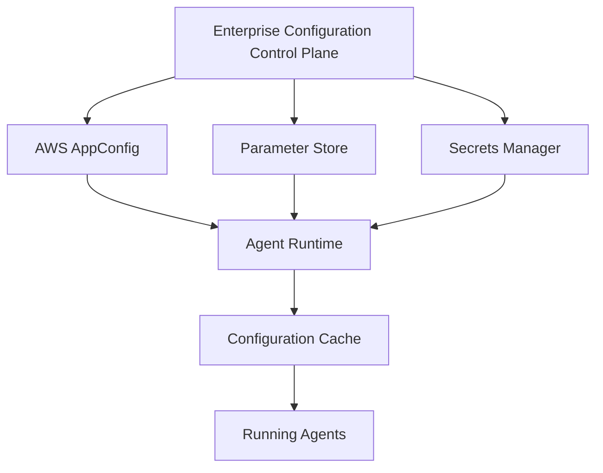

This document is part of the Enterprise Agent Builder Platform architecture reference series, focusing on enterprise promptops (part 2): architecture, integration & implementation.

## Related Documents

- [Part 1: Enterprise PromptOps: Prompt Lifecycle Management for AWS AgentCore Runtime](../08-enterprise-promptops-aws-agentcore-2026.md)




Enterprise configuration management architecture showing the layered approach to managing configuration in Agentic AI systems on AWS. Configuration flows from centralized control plane through multiple AWS services to distributed agent runtimes with local caching for resilience.

## Arize AX — Deep Dive
Architecture, prompt capabilities, evaluation engine, governance, enterprise adoption, pricing, and honest limitations.
### What Arize AX Is
Arize AX is an enterprise AI engineering platform for production monitoring, evaluation, and self-improvement of LLM and agentic AI applications. It is built on open standards (OpenTelemetry, OpenInference) and runs on a proprietary OLAP database (ADB — Arize Database) designed for processing billions of traces at petabyte scale. As of June 2026, Arize AX processes 1 trillion spans and runs 50+ million evaluations monthly.
Arize occupies the **observability and online evaluation layer** of the PromptOps stack. Its enterprise customers include DoorDash, Instacart, Reddit, Uber, Booking.com, Roblox, PagerDuty, Air Canada, Siemens, Microsoft, and the US Navy. AX is available on AWS Marketplace and Azure Marketplace with SOC 2 Type II, ISO 27001, PCI DSS, HIPAA, and GDPR compliance.
### Arize AX Architecture
|**Component**|**Description**|
|ADB (Arize Database)|Proprietary OLAP engine built for massive-scale trace ingestion and querying. Replaces<br/>ClickHouse for enterprise-scale workloads. Processes billions of traces with real-time ingestion<br/>and fast querying.|
|OpenInference / OpenTelemetry|Open-source instrumentation standard for LLM applications. Most widely adopted OTel<br/>semantic conventions for LLM spans. Vendor-agnostic.|
|Tracing Layer|Session-level and span-level traces for agent runs: prompts, tool calls, memory operations, LLM<br/>outputs. Integrates with 40+ frameworks (LangChain, LlamaIndex, Strands, CrewAI, OpenAI<br/>SDK).|
|Evaluator Hub (2026)|Create, version, and reuse evaluators with commit-level version control. LLM-as-judge<br/>templates for hallucination, relevance, tool-call evaluation, factuality, safety.|
|Prompt IDE|Design, test, compare, and evolve prompts with live inputs/outputs and integrated evaluation<br/>results. Save views including prompts, dataset selections, and model configurations.|
|Prompt Learning|Workflow for prompt iteration and evaluation. Connect production traces to prompt improvement<br/>cycles. Not a production deployment system.|
|Datasets & Experiments|Curated and human-annotated datasets for controlled experiments. Compare prompt strategies,<br/>agent configurations, toolchains with built-in analytics.|
|Online Evaluation (Tasks)|Continuous evaluation on production traffic. Sampling rate configurable. Results attached to<br/>traces. Alerts on quality degradation.|
|Alyx AI Assistant|In-product AI copilot for trace analysis, anomaly surfacing, eval form proposals. Confirmation<br/>drawer added May 2026 for Alyx-proposed changes.|
|Organizations API|Full RBAC management: organizations, spaces, roles, resource restrictions, API keys via REST<br/>API and Python/JS SDKs (released April 2026).|
|Annotations|Human feedback and labeling on traces. Annotation queues with configurable caps. Batch<br/>annotation endpoints.|
### Arize AX — PromptOps Capability Assessment
|**Capability**|**Rating**|**Notes**|
|Production Observability|IExcellent|Industry-leading trace ingestion at scale. 1T spans/month<br/>processed.|
|Online Evaluation|IExcellent|LLM-as-judge on production traffic with configurable sampling.<br/>Real-time quality monitoring.|
|Prompt IDE / Experimentation|IGood|Prompt Playground with save views, dataset selection, side-by-side<br/>comparison. Prompt Learning workflow.|
|Evaluator Hub (Versioned)|IGood|Evaluators versioned with commit-level control since Jan 2026.|
|Prompt Registry (Production)|IILimited|No dedicated prompt registry. Prompts live in Prompt IDE for<br/>experimentation, not as production versioned assets with<br/>semver/lineage.|
|Approval Workflow|INot Present|No built-in approval workflow for prompts. External workflow system<br/>required.|
|Zero-Downtime Hot Reload|INot Present|No runtime prompt delivery mechanism. Must use AppConfig or<br/>equivalent.|
|Semantic Versioning|IIPartial|Evaluators have version control. Prompts in Prompt IDE lack<br/>semver, lineage tracking, dependency graphs.|
|CI/CD Quality Gates|IIPartial|Evaluation results available via API. No native CI/CD gate<br/>integration equivalent to Braintrust's GitHub Action.|
|RBAC for Prompts|IGood|Organizations API provides full RBAC for spaces, roles, resource<br/>restrictions, API keys.|
|Compliance (SOC2/HIPAA)|IExcellent|SOC 2 Type II, ISO 27001, PCI DSS, HIPAA, GDPR. Available on<br/>AWS/Azure Marketplace.|
|AWS AgentCore Integration|IGood|OTel-native. Integrates via AgentCore Observability (CloudWatch).<br/>Arize AX cited as compatible observability partner.|
|Pricing|IIEnterprise|AX starts ~$50K/year. AX Pro from $50/month (limited). Enterprise<br/>custom pricing. Span-based pricing can escalate on agent<br/>workloads.|
### Honest Limitations of Arize AX for PromptOps
- Prompt lifecycle management (versioning, approval, deployment) is NOT Arize's primary product surface. It is an observability-first platform.
- No git-style prompt branching comparable to Confident AI or Braintrust's PR model.
- No built-in CI/CD gate that blocks PR merges on prompt quality regression (must build with AX API).
- Span-based pricing can become expensive on agentic workloads emitting thousands of spans per run.
- Graduating from Phoenix (free) to AX is a contract/repricing event, not a tier upgrade.
- Documentation is extensive but has steep learning curve per G2 and AWS Marketplace reviews.
- Limited pre-production simulation capabilities — strong in production, weaker in staging.
**Strategic Verdict: Arize AX should be the observability and online evaluation layer for enterprise AWS AgentCore deployments. It should NOT be the primary prompt registry or lifecycle management platform. Pair it with Langfuse or Braintrust for the registry/CI/CD layer.**
Open-source tracing, evaluation, and prompt management — comparison against Arize AX.
### What Phoenix Is
Arize Phoenix is the open-source library for LLM tracing, evaluation, and prompt management. It has 10,200+ GitHub stars (June 2026) and is licensed under Elastic License 2.0 (ELv2). Phoenix runs locally, in Docker, in Jupyter notebooks, or cloud-hosted. It is the open-source foundation of the Arize ecosystem — the path is 'start with Phoenix, graduate to AX when you need enterprise features.'
### Phoenix Capabilities
|**Capability**|**Phoenix Rating**|**Notes**|
|LLM Tracing|IExcellent|OpenInference/OTel native. Most widely adopted OTel semantic<br/>conventions for LLM. Works with all major frameworks.|
|Offline Evaluation|IGood|LLM-as-judge evaluations on datasets. Python SDK. Notebook-friendly<br/>workflow.|
|Prompt Playground|IGood|Prompt IDE with comparison views. Integrated evaluation. Save views.|
|Prompt Registry|IIBasic|Prompt versioning present but limited — no semver, no lineage graph,<br/>no approval workflow.|
|Dataset Management|IGood|Curated datasets for evaluation experiments. Dataset versioning.|
|Online Evaluation|IAX Only|Online production evaluation requires Arize AX. Not available in<br/>Phoenix open-source.|
|Alerts|IAX Only|PagerDuty/Slack alerts require Arize AX.|
|RBAC|IAX Only|Role-based access control is an enterprise AX feature.|
|Self-hosting|IFully Self-Hostable|Docker, Kubernetes, cloud. No feature gates. Zero-cost for self-hosted.|
|License|IIELv2|ELv2 forbids offering Phoenix as managed service to third parties.<br/>Internal use is fine. OSI-purists / platform companies need Apache<br/>alternatives.|
|Long Agent Trace UX|IILimited|Phoenix was designed for prompt/completion pairs + eval score. Long<br/>agentic traces (1000+ spans) are displayable but not optimized for<br/>debugging.|
|Pricing|IFree (self-hosted)|Self-hosted is free. AX Pro from $50/month. AX Enterprise: custom<br/>(~$50K+/year).|
### Phoenix vs Arize AX — Decision
|**Dimension**|**Choose Phoenix**|**Choose Arize AX**|
|Team Size|&lt; 20 engineers, single team|> 20 engineers, multi-team|
|Scale|&lt; 10M spans/month|> 100M spans/month|
|Production Monitoring|Not required / bring your own|Real-time online eval, drift detection, alerts|
|Compliance|Not required or bring your own|SOC2/HIPAA/GDPR required out of box|
|Budget|Zero platform budget|Enterprise budget available (~$50K+/year)|
|Data Residency|Full control required (self-host)|VPC deployment acceptable|
|CLI Workflow|Terminal-first (January 2026 CLI)|Platform UI + API + CLI|
**For enterprise AWS AgentCore deployments in regulated industries: Use Phoenix in development and CI for zero-cost evaluation during authoring. Graduate to Arize AX in production for online evaluation, alerts, and compliance-grade observability. Do not depend on Phoenix for production prompt registry — use Langfuse, Braintrust, or custom DynamoDB registry instead.**
## AWS-Native Alternative
How much PromptOps can be built using only AWS services — and where native services fall short.
### AWS-Native PromptOps Stack
A fully AWS-native PromptOps stack is possible but requires significant custom engineering. Each capability requires combining multiple services:
|**PromptOps Capability**|**AWS Services**|**Engineering Effort**|**Maturity**|
|Prompt Repository|CodeCommit / GitHub|Low — use existing Git|IMature|
|Prompt Registry|DynamoDB + S3 + OpenSearch|High — custom schema,<br/>CRUD API, search|IICustom|
|Semantic Search|OpenSearch Service + Bedrock<br/>Embeddings|High — embedding<br/>pipeline, index<br/>management|IICustom|
|Approval Workflow|Step Functions + Lambda + SES +<br/>DynamoDB|Very High — workflow<br/>engine, UI, notifications|IHigh effort|
|Versioning & Lineage|DynamoDB + custom schema +<br/>Lambda|High — semver logic,<br/>graph traversal, lineage<br/>queries|IICustom|
|Zero-Downtime Updates|AppConfig + AppConfig<br/>Agent/Extension|Low-Medium —<br/>AppConfig is purpose-built|IMature|
|A/B / Canary Routing|AppConfig deployment strategies<br/>+ Lambda|Medium — deployment<br/>strategy configuration|IGood|
|CI/CD Quality Gates|CodePipeline + Lambda + custom<br/>evaluators|High — custom evaluation<br/>framework, gate logic|IICustom|
|Online Evaluation|Lambda + Bedrock Evaluations +<br/>CloudWatch|Very High — custom eval<br/>pipeline, metrics, alerts|IIComplex|
|Offline Evaluation|SageMaker + Glue + Lambda + S3|Very High — full eval<br/>pipeline orchestration|IIComplex|
|Observability / Tracing|CloudWatch + X-Ray + OTel<br/>Collector|Medium — OTel<br/>instrumentation +<br/>dashboard setup|IGood|
|Audit Trail|CloudTrail + S3 Object Lock +<br/>Athena|Low — CloudTrail is<br/>automatic|IMature|
|RBAC|IAM + Resource-Based Policies +<br/>Cognito|High — custom RBAC on<br/>top of IAM|IIComplex|
|PII Scanning|Amazon Comprehend + Lambda +<br/>Macie|Medium — Comprehend<br/>integration|IGood|
|Cost Attribution|Cost Explorer + Resource Tagging<br/>+ Lambda|Medium — tagging<br/>discipline required|IGood|
### AWS-Native Verdict
**An AWS-native PromptOps platform can be built, but the total engineering effort is enormous: 6–12 months for a team of 4–6 engineers to build a Level 3 capable system. The operational burden is significant. For most enterprises, buying an external platform (Langfuse, Braintrust, or Arize AX) for the registry and evaluation layers is 10x cheaper than building equivalent capabilities. The exception: organizations with extreme data-sovereignty requirements or pre-existing investment in AWS-native tooling.**
### What AWS-Native Does Well
- **AppConfig:** Best-in-class for zero-downtime prompt delivery. Use this regardless of which registry platform
- you choose.
- **CloudTrail + S3 Object Lock:** Immutable, tamper-evident audit trail. Required for compliance. Use this
- natively.
- **Bedrock Guardrails:** Content safety layer. Best deployed as AWS-native regardless of external platform.
- **IAM + Secrets Manager:** Secrets separation and least-privilege access. Always AWS-native.
- **CloudWatch + OTel:** Baseline observability available natively. Arize AX or Langfuse add value on top.
- **Bedrock Prompt Caching:** Model-layer KV cache. Always AWS-native — no external platform provides this.
Comprehensive comparison of all major PromptOps platforms for enterprise AWS deployments.
|**Platform**|**Prompt**<br/>**Registry**|**Versioni**<br/>**ng**|**Approval**<br/>**Workflo**<br/>**w**|**CI/CD**<br/>**Gates**|**Online**<br/>**Eval**|**RBAC**|**Self-H**<br/>**ost**|**AWS Inte**<br/>**gration**|**Pricing**|
|---|---|---|---|---|---|---|---|---|---|
|Arize AX|Limited|Eval only|I|API only|IBest|I|VPC|IBest|~$50K+/yr|
|Phoenix OSS|Basic|Limited|I|I|I(AX<br/>only)|I|IFull|IOTel|Free|
|LangSmith|Good|Git hash|I|Manual|IGood|Team<br/>RBAC|I|ILangCh<br/>ain|$39/seat/<br/>mo|
|Langfuse|IGood|Semver|I|Manual|IGood|I<br/>(cloud)|I<br/>Docker|IOTel|OSS free /<br/>$30/seat|
|Braintrust|IGood|Semver|I|IBest|IGood|I|ISaaS|IAPI|~$249/mo<br/>+|
|MLflow|IGood|Stage-bas<br/>ed|Limited|Manual|IGood|Enterpri<br/>se only|IFull|ISageMa<br/>ker|Free /<br/>Databricks|
|W&B; Weave|Basic|Experimen<br/>t|I|I|IGood|Team<br/>RBAC|Limited|IAPI|$50/user/<br/>mo|
|PromptLayer|IGood|Version ID|I|I|Limited|I|ISaaS|IAPI|$500/mo<br/>team|
|Humanloop|SHUTDO<br/>WN|SHUTDO<br/>WN|SHUTDO<br/>WN|SHUTDO<br/>WN|SHUTDO<br/>WN|SHUTD<br/>OWN|SHUTD<br/>OWN|SHUTDO<br/>WN|SHUTDO<br/>WN|
|AWS Native|Custom|Custom|Custom|Custom|Custom|IAM-ba<br/>sed|N/A|INative|Engineerin<br/>g cost|
### Platform Descriptions
### Arize AX
Production observability & online evaluation leader. OTel-native. Enterprise compliance. Prompt IDE for experimentation. Limited registry/CI/CD.
### Phoenix (OSS)
Free self-hosted Arize foundation. Excellent development-time tracing and eval. ELv2 license. Limited for production monitoring.
### LangSmith
LangChain-native tracing, eval, Prompt Hub versioning. Best for LangChain/LangGraph teams. Limited A/B testing, no approval workflow.
### Langfuse
Best open-source self-hosted option post-Humanloop shutdown. MIT license. Good tracing, prompt versioning. Less polished CI/CD than Braintrust.
### Braintrust
Best eval-gated CI/CD integration. Native GitHub Action. Eval blocks PR merges. Production traces → test cases. $80M Series B.
### MLflow Prompt Reg
Apache 2.0. Linux Foundation. Most widely adopted OSS. Strong model registry + prompt versioning. Lower LLM eval depth than pure-play platforms.
### W&B; Weave
Strong experiment tracking pedigree. Weave adds LLM tracing and eval. Good for teams with ML experiment tracking culture. $50/user/month.
### PromptLayer
Low-friction prompt management CMS. Good for non-technical collaboration. Limited governance depth. $500/month team plan.
### Humanloop
ACQUIRED AND SHUT DOWN by Anthropic, September 8, 2025. Do not evaluate or plan on.
### AWS Native Only
Maximum data sovereignty. Very high engineering investment. AppConfig + CloudTrail + Bedrock Guardrails are the best AWS-native PromptOps primitives.
How agents fetch, cache, and receive prompts — latency implications and tradeoffs.
### Integration Pattern Comparison
|**Pattern**|**P50**<br/>**Latency**|**P99**<br/>**Latency**|**Freshness**|**Complexit**<br/>**y**|**Best For**|
|Fetch every request (no cache)|50–200ms|500ms+|Always fresh|Low|Dev/test only —<br/>unacceptable for production|
|In-process LRU cache (TTL=60s)|0–2ms (hit)|200ms<br/>(miss)|60s stale max|Low|Single-agent, single-region<br/>deployments|
|AppConfig sidecar + TTL|1–5ms (hit)|50ms<br/>(miss)|Poll interval<br/>(default 45s)|Low-Med|Standard production pattern<br/>— RECOMMENDED|
|Redis shared cache + invalidation|0.5–2ms<br/>(hit)|10ms<br/>(miss)|Near-real-time<br/>on invalidation|Medium|Multi-agent, multi-instance<br/>deployments|
|Prompt Gateway (dedicated<br/>service)|2–10ms|20ms|Policy-controlled|High|A/B testing, per-tenant<br/>routing, global deployments|
|Local memory (sidecar)|&lt; 1ms|&lt; 1ms|Full restart to<br/>refresh|Low|Immutable prompts only|
### Recommended Implementation: AppConfig Lambda Extension
The AppConfig Lambda extension (or sidecar for containerized agents) is the production-recommended pattern. It runs locally, handles caching, polling, and rollback transparently:
```
# AgentCore agent: fetch prompt via AppConfig sidecar
import requests
import os
APPCONFIG_BASE = 'http://localhost:2772'
APP = os.environ['APPCONFIG_APP']
ENV = os.environ['APPCONFIG_ENV']
def get_prompt(prompt_id: str) -> dict:
    """AppConfig sidecar handles caching and polling automatically."""
    url = f'{APPCONFIG_BASE}/applications/{APP}/environments/{ENV}/configurations/{prompt_id}'
    response = requests.get(url, timeout=1.0)  # < 5ms typical
    response.raise_for_status()
    return response.json()
# Agent invocation
def invoke(session: dict, user_input: str) -> str:
    # Get prompt (AppConfig sidecar returns cached value, polls for updates)
    prompt_cfg = get_prompt('customer-support-system')
    system_prompt = render_prompt(prompt_cfg['template'], session['context'])
    response = bedrock_client.converse(
        modelId='anthropic.claude-sonnet-4-6-v1:0',
        system=[{'text': system_prompt}],
        messages=[{'role': 'user', 'content': [{'text': user_input}]}]
    )
    return response['output']['message']['content'][0]['text']
```
## Multi-Agent Systems
How Planner, Coordinator, Worker, Supervisor, and Reflection agents share and compose prompts.
### Agent Role**→**Prompt Type Mapping
|**Agent Role**|**Primary Prompt Types**|**Sharing Pattern**|**Versioning**|
|Orchestrator / Planner|Goal decomposition, task<br/>delegation, progress synthesis|Centrally owned, inherited by<br/>sub-agents as context|MAJOR version gate —<br/>changes affect entire system|
|Coordinator|Sub-agent communication<br/>protocols, handoff rules, conflict<br/>resolution|Shared registry, consumed by<br/>multiple orchestrators|MINOR version gate —<br/>backward compat required|
|Worker / Executor|Task-specific execution<br/>instructions, tool usage rules|Per-domain prompt, shared across<br/>workers of same type|Standard semver lifecycle|
|Supervisor|Quality review criteria, escalation<br/>rules, intervention triggers|Platform team owned, consumed<br/>by all agents|MAJOR version gate —<br/>affects all supervision|
|Reflection Agent|Self-assessment rubrics, error<br/>detection, improvement criteria|Shared library macro, composed<br/>into worker prompts|PATCH safe; MINOR<br/>requires re-evaluation|
|Memory Agent|Storage rules, retrieval criteria,<br/>summarization policies|Central platform, version pinned<br/>per deployment|MAJOR — changes affect all<br/>memory operations|
|Tool Agent|Tool selection heuristics,<br/>parameter formatting, error<br/>handling|Tool-specific, co-versioned with<br/>tool schema|Versioned with tool<br/>compatibility matrix|
### Prompt Composition Patterns
### Central Registry (Recommended)
All agents fetch prompts from the central registry. Each agent knows its role and requests the appropriate prompt type. Governance, versioning, and audit happen centrally. Dependency graph tracks which agent uses which prompt.
### Inheritance
Orchestrator system prompt inherited by sub-agents as context. Sub-agent cannot override orchestrator constraints. Hierarchy enforced at runtime by Orchestrator injecting its constraints as context into sub-agent calls.
### Composition / Macro System
Large prompts assembled from smaller reusable fragments (macros): safety-clause-v1, brand-voice-v2, tool-usage-policy-v3. Each macro versioned independently. Assembled prompt's hash reflects composition.
### Overrides
Tenant-specific overrides applied on top of base prompt. Override stored separately in registry with its own approval record. Base + override assembled by Prompt Gateway at request time.
## Prompt Template Systems
Jinja2, Mustache, DSPy, structured prompts, and composition patterns.
### Template Engine Comparison
|**Engine**|**Syntax**|**Logic Support**|**Safety**|**Enterprise Use**|**Recommendation**|
|Jinja2 (Python)|`{{ var }}`, ``|Full logic, loops, filters|Requires sanitization|Very common|Recommended — most expressive|
|Mustache / Handlebars|`{{ var }}`, `{{# section }}`|Logic-less (Mustache); some logic (HB)|Safer — no code execution|Common|Good for non-technical authoring|
|Python f-strings|`f'{var}'`|None in template|Injection risk|Legacy|Anti-pattern for production|
|Structured JSON|`{ 'role': 'system', 'content': [...] }`|No logic|Safe|Growing|For API-first, multi-modal prompts|
|XML/YAML Prompts|YAML/XML structure with variable refs|Limited|Safe|Enterprise|Good for structured agents|
|DSPy|Programmatic module definitions, auto-optimization|Full Python logic|Compiled output|Research / advanced|Best for teams with ML expertise|
### Recommended Template Pattern: Jinja2 with Security Controls
```
# template: customer-support-system-v2.jinja2
# SECURITY: All variables sanitized before rendering
You are {{ persona.name }}, a customer support specialist for {{ company.name }}.


## Current Context
- Customer: {{ customer.display_name }}
- Product: {{ product.name }}
- Issue Category: {{ issue.category }}



## Guidelines

- {{ guideline }}

```
### DSPy — Programmatic Prompt Optimization
DSPy (Declarative Self-improving Python) treats prompts as compiled programs rather than hand-written strings. The optimizer generates optimized prompts through empirical testing against training data. Key considerations for enterprise:
- Compiled prompts are deterministic given the same optimizer run — versioning must capture optimizer configuration AND compiled output
- DSPy optimizations may be opaque — RAI review must assess compiled prompt content, not just the module definition
- Excellent for automated prompt improvement (Stage 7 of PromptOps maturity)
- Integration pattern: DSPy optimizes offline; compiled prompt stored in registry as v-next candidate; human approval before production promotion
## Enterprise Reference PART 19 Architecture
Complete production architecture for PromptOps on AWS AgentCore Runtime.
### Architecture Layer Overview
|**L7: Developer Experience**|Author Portal (Langfuse/Braintrust UI) · Prompt IDE (Arize AX) · CLI (git, registry<br/>CLI) · VS Code Extension · Slack/JIRA Integration|M|
|**L6: Governance & Approval**|Approval Workflow Engine (Step Functions) · RAI Checklist Service · Security Scan<br/>Gate · RBAC Service · Policy Engine (OPA) · Audit Logger|M|
|**L5: Evaluation Pipeline**|Offline Eval (Phoenix / Braintrust SDK) · CI/CD Gates (GitHub Actions) · Red Team<br/>Suite (Promptfoo) · Golden Dataset Service · Quality Score Service|M|
|**L4: Prompt Registry**|Registry API (DynamoDB + Lambda) · Semantic Search (OpenSearch + Bedrock<br/>Embeddings) · Lineage Graph · Dependency Tracker · Version Store · Signed<br/>Release Manager|M|
|**L3: Delivery Layer**|AWS AppConfig (hot delivery) · Prompt Gateway (Lambda) · Redis Cache Cluster ·<br/>Canary Router · A/B Routing Logic · Invalidation Bus (EventBridge)|M|
|**L2: AgentCore Runtime**|AgentCore Runtime · AgentCore Gateway (MCP/REST tools) · AgentCore Memory<br/>· AgentCore Identity · AgentCore Policy · AgentCore Observability|M|
|**L1: Observability**|Arize AX (online eval + production tracing) · CloudWatch (metrics/logs) · OTel<br/>Collector · Cost Attribution (per-prompt token tracking)|M|
|**L0: Foundation**|Amazon Bedrock (models + Guardrails + Prompt Caching) · Secrets Manager ·<br/>KMS · IAM · VPC + PrivateLink · CloudTrail + S3 Object Lock||
### Sequence: Prompt Update Flow (Zero-Downtime)
|**1. Author creates PR**|Prompt Engineer commits new version to Git repo. Automated CI triggers: schema<br/>validation, secret scanning, PII check, prompt injection scan.|M|
|**2. Peer Review**|Senior Engineer reviews PR. Automated evaluation runs (Phoenix/Braintrust SDK)<br/>against golden dataset. Score posted as PR comment.|M|
|**3. Approval Gate**|Governance workflow triggered based on risk tier. RAI Officer + CISO approve via<br/>Slack/portal. OPA policy evaluates all conditions.|M|
|**4. Registry Publication**|On approval, CI publishes to registry: semver assigned, signature generated,<br/>metadata written, lineage recorded, dependency graph updated.|M|
|**5. AppConfig Deployment**|Registry webhook triggers AppConfig new configuration version. Deployment<br/>strategy selected (instant/canary/linear) based on version type.|M|
|**6. Canary Rollout**|AppConfig serves new version to canary % of agents. Arize AX monitors online<br/>eval scores and quality metrics during rollout.|M|
|**7. Automatic Promotion or**<br/>**Rollback**|If quality gates pass after evaluation window: promote to 100%. If any gate fails:<br/>AppConfig automatic rollback to previous version.|M|
### 8. Audit Record
All events (publish, deploy, rollout, rollback) written to immutable CloudTrail audit log. Compliance report auto-generated.
### Multi-Account Topology
|**AWS Account**|**Purpose**|**Key Services**|
|Security Account|Prompt registry, approval workflow, signing keys,<br/>audit logs|DynamoDB, Lambda, KMS, CloudTrail, S3<br/>Object Lock|
|Shared Services|Prompt delivery (AppConfig), Redis cache, Prompt<br/>Gateway|AppConfig, ElastiCache, Lambda, API Gateway|
|AgentCore Production|Live agent execution environment|AgentCore Runtime, Bedrock, CloudWatch|
|AgentCore Staging|Pre-production validation environment|AgentCore Runtime, Bedrock, AppConfig<br/>(staging)|
|Observability|Arize AX, CloudWatch cross-account, cost<br/>attribution|CloudWatch, OTel Collector, Cost Explorer|
|Development|Author portal, Phoenix local, Braintrust offline evals|Development tooling, no production data|
## PromptOps CI/CD
GitOps, branching, evaluation gates, promotion rings, and feature flags for prompts.
### Git Branching Strategy for Prompts
|**Branch**|**Purpose**|**Merge Target**|**CI/CD Action**|
|main / trunk|Production-approved prompts only|—|Triggers registry publish +<br/>AppConfig deploy|
|release/vX.Y.Z|Release candidate preparation|main|Full evaluation suite, security scan,<br/>approval gate|
|feat/prompt-name|Feature development, MINOR<br/>changes|release/*|Fast eval suite (subset of golden<br/>dataset)|
|fix/prompt-name|PATCH changes — typos,<br/>metadata|release/* or main|Schema validation + smoke test<br/>only|
|experiment/name|A/B test candidates, shadow<br/>prompts|Never auto-merged|Eval suite, register as experiment<br/>in Braintrust/AX|
|hotfix/security|Emergency safety patches|main directly|Security scan + RAI review only<br/>(Tier 5 fast path)|
### GitHub Actions Pipeline
```
# .github/workflows/prompt-ci.yml
on:
  pull_request:
    paths: ['prompts/**']
jobs:
  validate:
    runs-on: ubuntu-latest
    steps:
      - uses: actions/checkout@v4
      - name: Schema Validation
        run: python scripts/validate_prompt_schema.py
      - name: Secret Scanning
        run: detect-secrets scan prompts/
      - name: PII Detection
        run: python scripts/pii_scan.py prompts/
      - name: Injection Pattern Check
        run: promptfoo scan --config promptfoo.yaml
  evaluate:
    needs: validate
    steps:
      - name: Run Evaluation Suite
        run: |
          python -m pytest evals/ --eval-platform=braintrust
      - name: Braintrust Quality Gate
        uses: braintrustdata/eval-action@v1
        with:
          threshold: 0.90
          fail-on-regression: true
  security:
    needs: validate
    steps:
      - name: OWASP Agentic AI Check
        run: python scripts/owasp_check.py
      - name: Red Team (automated)
        run: promptfoo redteam --config redteam.yaml
```
### Release Rings
|**Ring**|**Traffic %**|**Population**|**Promotion Gate**|
|Ring 0 — Canary|1%|Internal teams only|Manual approval after 30 min|
|Ring 1 — Early Adopters|10%|Beta enterprise customers<br/>(opted-in)|Auto if quality gates pass for 2h|
|Ring 2 — Standard|40%|All standard tier customers|Auto if Ring 1 gates pass for 4h|
|Ring 3 — Full Production|100%|All customers|Auto if Ring 2 gates pass for 8h|
|Emergency Rollback|100%→<br/>0%|All sessions migrated|Automatic on quality breach or manual trigger|
## Anti-Patterns
The 15 most dangerous failure modes in enterprise PromptOps and how to remediate them.
### Prompt Archaeology [CRITICAL]
**Problem:** Prompts stored in source code comments, README files, Slack messages, or spreadsheets. No version history. No ownership. No evaluation.
**Remediation:** Mandatory prompt repository policy with automated scanning. Zero-tolerance enforcement. Migration sprint to centralize all prompts.
### God Prompt [HIGH]
**Problem:** A single system prompt attempting to define persona, safety rules, tool policies, domain knowledge, and escalation criteria. 3000+ tokens. Unmaintainable, ungovernable.
**Remediation:** Decompose into macro system: separate safety-clause, persona, tool-policy, and domain-specific components. Compose at runtime.
### Hardcoded Secrets [CRITICAL]
**Problem:** API keys, credentials, or personal data embedded directly in prompt templates. Exposed via prompt leakage attacks or repository access.
**Remediation:** Mandatory secrets management (Secrets Manager). Template variables for all sensitive references. Automated secret scanning in CI blocks all PRs with credentials.
### No Rollback Strategy [CRITICAL]
**Problem:** Production prompt deployments with no defined rollback procedure. Recovery from bad updates requires emergency engineering and potential downtime.
**Remediation:** AppConfig with automatic rollback triggers. Registry always retains N previous stable versions. One-command rollback runbook documented and tested quarterly.
### Cross-Model Prompt Reuse [HIGH]
**Problem:** Prompts developed and evaluated for Claude deployed unchanged on GPT or Gemini without re-evaluation. Model behavior differences cause silent quality degradation.
**Remediation:** Mandatory compatibility matrix. Model-specific evaluation gates in CI. Prompt migration testing protocol for every model version upgrade.
### Ownerless Prompts [HIGH]
**Problem:** Prompts with no identified team or individual owner. When they break, no one knows. They never get deprecated, updated, or retired.
**Remediation:** CODEOWNERS enforcement for all prompt directories. Owner field mandatory in metadata schema. Orphaned prompt auto-escalation after 30 days.
### Evaluation Debt [HIGH]
**Problem:** Evaluation only at initial deployment. No regression suite. No golden datasets. Quality degradation discovered via production incidents and user complaints.
**Remediation:** Continuous evaluation as platform primitive. Mandatory regression suite before every version promotion. Automated quality alerts on production traffic.
### Prompt Sprawl [MEDIUM]
**Problem:** Dozens of near-identical prompts for similar use cases. None discoverable. All maintained independently. Divergence creates inconsistency.
**Remediation:** Discovery-before-creation policy. Semantic similarity detection in CI. Prompt macro library and inheritance system.
### Missing Lineage [HIGH]
**Problem:** No tracking of which prompt produced which output, or which knowledge base grounded which agent response. Impact analysis impossible.
**Remediation:** Mandatory lineage metadata. Automatic lineage capture in evaluation and deployment pipelines. OpenLineage integration.
### Prompt in CI/CD Only [MEDIUM]
**Problem:** Prompts stored only in CI/CD secrets or environment variables. No central registry. No search. No governance. Different environments drift.
**Remediation:** Centralized registry as the authoritative source. CI/CD fetches from registry. Never store prompts as CI/CD secrets.
### No Session Version Pinning [HIGH]
**Problem:** Long-running agent sessions switch prompt versions mid-conversation when a new version deploys. Behavioral inconsistency, compliance violations, debugging nightmares.
**Remediation:** Session version pinning at session creation. Version stored in AgentCore Memory or DynamoDB with session TTL.
### One-Shot Red Team [HIGH]
**Problem:** Red team testing only at initial launch. No ongoing adversarial testing. Attack surface grows as tools and integrations evolve.
**Remediation:** Quarterly red team exercises as compliance requirement. Automated Promptfoo red team runs in CI for high-risk prompts. Incident-triggered ad-hoc red team.
### Context Bloat [MEDIUM]
**Problem:** Agent context window grows without bound as conversation history accumulates. Prompt quality degrades. Token costs spiral. Eventually hits model context limit.
**Remediation:** Context window management policy. Automatic summarization at token budget threshold. Per-agent token budget enforcement.
### No Cost Governance [HIGH]
**Problem:** No per-prompt, per-agent, or per-team token cost tracking. Cost surprises discovered on AWS bill. No budget alerts or circuit breakers.
**Remediation:** Token cost metadata in every prompt evaluation record. Per-agent cost budget in AppConfig. CloudWatch alarms on token spend rate. Monthly cost review process.
### Approval Theater [HIGH]
**Problem:** Approval workflow exists on paper but approvers rubber-stamp everything without reading. Security and RAI review become checkbox exercises.
**Remediation:** Structured approval checklists with mandatory evidence requirements. Approver training. Rotation of approvers. Spot audits of approval quality. Accountability for post-approval incidents.
## Complete Enterprise Reference Architecture
Full production architecture for AWS AgentCore Runtime with multi-account, multi-region, multi-tenant, HA, DR, and zero-downtime prompt updates.
### Architecture Principles
- **Separation of Concerns:** Registry (governance), AppConfig (delivery), AgentCore (execution), Arize AX
- (observability) — each layer owns its responsibility.
- **Zero-Trust:** All prompt fetches authenticated. Signatures verified. No implicit trust between services.
- **Defense in Depth:** Bedrock Guardrails + AgentCore Policy + OPA + Prompt Scanner + Signature Verification.
- No single point of safety failure.
- **GitOps-First:** All prompt changes flow through Git. Immutable audit trail from commit to production.
- **Policy-as-Code:** All governance rules in OPA Rego policies. Machine-evaluated, version-controlled,
- auditable.
- **Observability by Default:** Every prompt invocation traced with OTel. Every evaluation result persisted. Every
- cost attributed.
### Complete Service Inventory
|**Layer**|**Service / Component**|**Purpose**|**Justification**|
|Source Control|GitHub / AWS<br/>CodeCommit|Prompt source, version history, PR<br/>workflow|GitOps foundation|
|Registry API|Lambda + API GW +<br/>DynamoDB|Authoritative prompt store with semver,<br/>lineage, approval records|Purpose-built, AWS-native control|
|Semantic<br/>Search|OpenSearch Serverless +<br/>Bedrock Embeddings|Prompt discovery by semantic similarity|No duplicate prompt creation|
|Approval<br/>Workflow|Step Functions + Lambda<br/>+ SES|Multi-tier approval orchestration|Auditable, non-bypassable governance|
|Policy Engine|OPA on Lambda|Machine-readable promotion gates|Consistent, auditable enforcement|
|Secret<br/>Management|AWS Secrets Manager|Prompt signing keys, API credentials|Rotation, audit, never in prompts|
|Delivery|AWS AppConfig + Agent<br/>sidecar|Zero-downtime prompt hot delivery with<br/>canary strategies|Purpose-built, AWS-native, HA|
|Caching|ElastiCache for Redis<br/>(cluster mode)|Sub-ms prompt cache, pub/sub<br/>invalidation|Performance + real-time invalidation|
|Prompt<br/>Gateway|Lambda + API Gateway|Routing policy, A/B assignment,<br/>per-tenant override|Centralized routing logic|
|Execution|AWS AgentCore Runtime|Serverless agent execution, session<br/>isolation, tool access|AWS-native, managed, HA|
|Safety Layer|Amazon Bedrock<br/>Guardrails + Model Armor|Content filtering, PII redaction, injection<br/>detection|Defense in depth|
|Policy<br/>Enforcement|AgentCore Policy (Cedar)|Behavioral boundaries outside agent<br/>reasoning|Cannot be prompt-injected|
|Foundation<br/>Models|Amazon Bedrock (Claude,<br/>Nova)|Model inference with prompt caching|Managed, HA, multi-region|
|Observability|Arize AX + CloudWatch +<br/>OTel Collector|Production tracing, online eval, alerts,<br/>cost|Best-in-class observability layer|
|Offline Eval|Braintrust / Langfuse +<br/>Phoenix|Pre-production evaluation, CI quality<br/>gates|Eval-gated promotion|
|Red Team|Promptfoo (Apache 2.0<br/>post-OpenAI acq.)|Automated adversarial testing in CI|OWASP Agentic AI coverage|
|Audit|CloudTrail + S3 Object<br/>Lock + Athena|Immutable lifecycle audit trail|Regulatory compliance|
|Cost Attribution|Cost Explorer + resource<br/>tagging + Lambda|Per-prompt, per-agent token cost<br/>tracking|Budget governance|
|DR|Multi-region DynamoDB<br/>Global Tables +<br/>AppConfig multi-region|RPO &lt; 1hr, RTO &lt; 15min for prompt<br/>delivery|HA requirement for production|
|IaC|AWS CDK (TypeScript)|All infrastructure as code, GitOps<br/>managed|Reproducible, auditable deployments|
### Multi-Tenant Architecture
For SaaS deployments, tenant isolation is enforced at multiple layers:
- Prompt Gateway routes based on tenant ID in request context
- Per-tenant prompt overrides stored in registry with tenant-scoped RBAC
- AgentCore sessions isolated per tenant (full session isolation at platform layer)
- Token cost attributed per tenant via resource tags
- Per-tenant evaluation dashboards in Arize AX via organization separation
- Tenant-controlled migration timing for new prompt versions
Weighted comparison of AWS-only, AWS + Arize AX, AWS + Langfuse, AWS + Braintrust, and hybrid architectures.
### Scoring Methodology
Each architecture option is scored 1–5 on 13 dimensions. Weights reflect regulated enterprise priorities (compliance > performance > vendor risk). Weighted scores are summed and normalized to 100.
|**Dimension**|**Weight**|**Why It Matters for Regulated Enterprises**|
|Prompt Lifecycle Completeness|15%|Covers all 18 lifecycle stages from authoring to archive|
|Zero-Downtime Updates|10%|No agent interruption during prompt updates — operational requirement|
|Runtime Performance|8%|Prompt fetch latency &lt; 10ms P99 at scale|
|Governance & Compliance|15%|EU AI Act, SOC2, HIPAA — approval workflows, audit trails, RBAC|
|RAI Capabilities|10%|Hallucination detection, bias testing, safety evaluation|
|Security|12%|Signed prompts, secrets separation, supply chain integrity|
|Cost (3yr TCO)|8%|Platform licensing + engineering + operational costs|
|Vendor Lock-In Risk|8%|Portability, open standards, migration complexity|
|Multi-Cloud / Portability|5%|Can prompts move to Azure/GCP if needed|
|Enterprise Readiness|7%|SOC2, SSO, support SLAs, professional services|
|Extensibility|5%|Custom integrations, API-first, plugin ecosystem|
|Community Maturity|4%|OSS community, documentation quality, ecosystem|
|Operational Complexity|7%|Runbooks, on-call burden, deployment complexity|
### Decision Matrix Scores
|**Dimension (Weight)**|**AWS Only**|**AWS + Arize**<br/>**AX**|**AWS +**<br/>**Langfuse**|**AWS +**<br/>**Braintrust**|**AWS + AX +**<br/>**Langfuse**<br/>**(Hybrid)**|
|Lifecycle Completeness (15%)|2 (must build)|3 (AX adds<br/>eval)|4 (Langfuse<br/>adds registry)|4 (Braintrust<br/>adds CI/CD)|5 (combined<br/>coverage)|
|Zero-Downtime Updates (10%)|4 (AppConfig)|4 (AppConfig<br/>still)|4 (AppConfig<br/>still)|4 (AppConfig<br/>still)|5 (AppConfig +<br/>invalidation)|
|Runtime Performance (8%)|5 (no network<br/>hop)|4 (OTel<br/>overhead)|4 (minimal<br/>overhead)|4 (minimal<br/>overhead)|4 (OTel<br/>overhead)|
|Governance & Compliance (15%)|2 (custom build)|3 (AX adds<br/>audit)|4 (Langfuse<br/>adds workflow)|3 (Braintrust<br/>limited gov)|5 (full<br/>governance<br/>stack)|
|RAI Capabilities (10%)|2 (Guardrails<br/>only)|5 (AX eval best)|3 (Langfuse<br/>eval ok)|4 (Braintrust<br/>eval good)|5 (AX online +<br/>offline)|
|Security (12%)|4 (AWS-native)|4 (same AWS)|4 (same AWS)|4 (same AWS)|5 (all controls)|
|Cost 3yr TCO (8%)|2 (high eng.<br/>cost)|3 (AX<br/>~$50K/yr)|4 (Langfuse<br/>lower cost)|4 (Braintrust<br/>~$249/mo+)|2 (AX +<br/>Langfuse<br/>licensing)|
|Vendor Lock-In (8%)|5 (AWS only)|3 (AX<br/>proprietary)|4 (OSS/open)|3 (proprietary)|3 (multi-vendor)|
|Multi-Cloud Portability (5%)|2 (AWS-bound)|3 (AX<br/>multi-cloud)|4 (Langfuse<br/>portable)|3 (Braintrust<br/>SaaS)|3 (mixed<br/>portability)|
|Enterprise Readiness (7%)|3 (DIY)|5 (SOC2/HIPA<br/>A/US Navy)|4 (cloud SOC2)|4 (SOC2 Type<br/>II)|5 (highest)|
|Extensibility (5%)|5 (full control)|4 (APIs)|5 (OSS+APIs)|4 (APIs)|5 (best)|
|Community Maturity (4%)|5 (AWS<br/>maturity)|4 (growing)|4 (strong OSS)|4 (growing<br/>rapidly)|4 (combined)|
|Operational Complexity (7%)|2 (very high)|3 (manageable)|4 (simpler)|4 (simpler)|3 (multi-vendor<br/>ops)|
|**WEIGHTED TOTAL**|**3.54/5.0**|**4.15/5.0**|**4.51/5.0**|**4.28/5.0**|**4.94/5.0**|
**Matrix Winner: AWS + Arize AX + Langfuse (Hybrid) scores 4.94/5.0, highest on governance, RAI, lifecycle completeness, and enterprise readiness. Pure AWS-native scores lowest (3.54) due to engineering cost and governance gaps. AWS + Langfuse alone (4.51) is the best single-vendor option for cost-sensitive teams.**
## Implementation Blueprint
4-phase implementation roadmap from MVP to autonomous prompt optimization.
**Phase 1 — Foundation MVP (Weeks 1–4)**
|**Deliverable**|**Description / AWS Services**|
|Prompt Repository|GitHub monorepo with /prompts directory structure, CODEOWNERS, branch protection,<br/>required status checks|
|Basic Metadata Schema|JSON Schema v1 with required fields: id, name, version, owner, type, lifecycle_state,<br/>model_compatibility|
|CI Pipeline — Validation|GitHub Actions: schema validation, secret scanning (detect-secrets), PII scan (Comprehend),<br/>injection pattern check|
|AppConfig Setup|AppConfig application + dev/staging/prod environments. Lambda extension configured for<br/>AgentCore agents.|
|Langfuse OSS (self-hosted)|Docker Compose deployment in VPC. Prompt versioning enabled. Basic RBAC configured.|
|Phoenix (local + CI)|Phoenix for development-time eval and offline CI evaluation. Braintrust or Langfuse SDK for<br/>eval scripts.|
|Bedrock Guardrails|Content safety layer for all AgentCore agent invocations. PII redaction policy applied.|
|Baseline Observability|AgentCore Observability→CloudWatch. OTel collector. Basic dashboards for latency,<br/>errors, token cost.|
**Success Metrics:** All prompts in repository, zero hardcoded secrets, schema validation passing, AppConfig delivering prompts, basic quality eval running in CI.
**Phase 2 — Production Pilot (Weeks 5–12)**
|**Deliverable**|**Description / AWS Services**|
|Prompt Registry API|DynamoDB + Lambda + API Gateway. Semver, lineage tracking, signed releases, evaluation<br/>history. CDK infrastructure.|
|Approval Workflow|Step Functions workflow for Tier 1–4 approvals. Slack integration for notifications. OPA policy<br/>evaluation gate.|
|Evaluation Pipeline|Braintrust GitHub Action for CI quality gates. Golden dataset created for pilot agent.<br/>LLM-as-judge evaluators.|
|AppConfig Canary|Canary deployment strategy configured. Auto-rollback alarm on CloudWatch quality metric<br/>breach.|
|Arize AX Trial|Arize AX deployed via AWS Marketplace. OTel instrumentation on AgentCore agents. Online<br/>evaluation tasks configured.|
|Redis Cache + Pub/Sub|ElastiCache Redis cluster. In-process cache with TTL. Invalidation listener in each AgentCore<br/>agent.|
|Session Version Pinning|Session creation writes pinned prompt versions to AgentCore Memory. Invocation reads<br/>pinned version.|
|Security Controls|Prompt signature verification. IAM least privilege audit. Secrets Manager for all credentials.<br/>RBAC in Langfuse.|
**Success Metrics:** Zero-downtime prompt updates validated, canary rollout tested end-to-end, approval workflow processing all changes, Arize AX monitoring online quality.
**Phase 3 — Enterprise Rollout (Months 4–9)**
|**Deliverable**|**Description / AWS Services**|
|Multi-Account Topology|Security account (registry, keys), Shared Services (AppConfig, Redis), AgentCore Prod,<br/>AgentCore Staging, Observability|
|Full RAI Framework|RAI checklist service, bias testing suite, safety red team automation (Promptfoo). RAI Officer<br/>portal.|
|AIBOM Generation|Automated AI Bill of Materials for all production agents. Includes all prompt versions, models,<br/>tools, knowledge bases.|
|EU AI Act Controls|High-risk system documentation, conformity assessment evidence, audit trail export for<br/>regulatory submission.|
|Multi-Agent Prompt Sharing|Central macro library. Prompt composition at Prompt Gateway. Dependency graph<br/>visualization.|
|Cost Governance|Per-prompt token cost tracking. Per-team budget alerts. Monthly cost review dashboard.<br/>Circuit breakers on runaway costs.|
|Developer Portal|Self-service UI for prompt discovery, publishing, approval requests. Built on Langfuse UI or<br/>custom React.|
|DR & HA|DynamoDB Global Tables for multi-region registry. AppConfig multi-region. RTO &lt; 15 min<br/>validated.|
**Success Metrics:** Level 3 maturity attained, EU AI Act audit evidence package ready, AIBOM generated for all production systems, DR tested successfully.
**Phase 4 — Autonomous Prompt Optimization (Months 10–18)**
|**Deliverable**|**Description / AWS Services**|
|Production→Test Case Pipeline|Arize AX production failures automatically converted to evaluation test cases via webhook.<br/>Dataset grows with every incident.|
|Continuous Eval Loop|Online evaluation via Arize AX tasks feeding quality trends to CloudWatch. Automated<br/>regression detection.|
|DSPy Integration|DSPy optimizer runs nightly against latest golden dataset. Generates prompt improvement<br/>candidates. Human review gate required.|
|Autonomous A/B|New DSPy-optimized prompt automatically registered as experiment variant. A/B test<br/>triggered if offline eval improves by > threshold.|
|Predictive Rollback|ML model predicts quality degradation before metric threshold breach. Pre-emptive rollback<br/>recommendation to on-call.|
|Cross-Team Marketplace|Internal prompt marketplace with usage analytics, ratings, and curated collections.<br/>Fork/extend pattern for sharing.|
|Policy Auto-Update|Low-risk policy changes auto-generated by AI and submitted as PR. Human approval still<br/>required for all policy changes.|
**Success Metrics:** Level 4+ maturity, prompt quality improving without manual intervention, autonomous A/B test cadence, marketplace adoption across 3+ teams.
## Appendix A: Capability Heat Map
The heat map below rates each platform across the 10 most critical PromptOps capabilities for regulated enterprise deployments. I = Full II = Partial I = Absent
|**Platform**|**Regis**<br/>**try**|**SemV**<br/>**er**|**Appro**<br/>**val**|**CI**<br/>**Gate**|**Onlin**<br/>**e Eval**|**RBAC**|**Self-H**<br/>**ost**|**Comp**<br/>**liance**|**Linea**<br/>**ge**|**Zero-**<br/>**DT**|
|---|---|---|---|---|---|---|---|---|---|---|
|AWS AppConfig|I|I|I|I|I|I|N/A|I|I|I|
|AWS Native (Full)|II|II|II|II|II|II|I|I|II|I|
|Arize AX|II|II|I|II|I|I|VPC|I|II|I|
|Phoenix OSS|II|I|I|I|I|I|I|I|I|I|
|LangSmith|I|II|I|II|I|I|I|II|II|I|
|Langfuse (OSS)|I|I|I|II|I|I|I|I|I|I|
|Braintrust|I|I|I|I|I|I|I|I|II|I|
|MLflow|I|I|II|II|I|II|I|II|I|I|
|W&B; Weave|II|II|I|I|I|I|II|I|II|I|
|Recommended Hybrid|I|I|I|I|I|I|I|I|I|I|
**No single platform achieves** I **across all 10 capabilities. The Recommended Hybrid (AWS AppConfig + Arize AX + Langfuse) achieves full coverage by combining best-in-class tools at each layer.**
## Appendix B: Prompt Governance Model
### Governance Framework Summary
The enterprise prompt governance model is based on three principles: **Traceability** (every prompt change traced from author to production), **Accountability** (named human accountable for every approved production prompt), and **Auditability** (immutable record of all lifecycle events accessible for regulatory review).
### Regulatory Mapping
|**Regulation**|**Prompt Governance Requirements**|**Key Controls**|
|EU AI Act (Art. 50 Aug 2026;<br/>Annex III Dec 2027)|Technical documentation, risk assessment, human<br/>oversight, audit trail, AIBOM for high-risk systems|Approval workflow, signed versions, audit<br/>log, AIBOM generation|
|NIST AI RMF|GOVERN, MAP, MEASURE, MANAGE functions<br/>across prompt lifecycle|Risk scoring, governance board, evaluation<br/>metrics, lifecycle management|
|GDPR / CCPA|No PII in prompt templates. Data minimization. Right to<br/>deletion.|PII scan gate, no PII in templates, secrets<br/>separation|
|HIPAA|PHI protection in healthcare agent prompts. BAA with<br/>vendors.|PHI-free prompt templates, Arize AX HIPAA<br/>compliance, BAA coverage|
|SOC 2 Type II|Access controls, audit trails, change management for<br/>all AI assets|RBAC, CloudTrail, approval workflow,<br/>immutable logs|
|Colorado AI Act (2023)|Reasonable care aligned with ISO/IEC 42001 or NIST<br/>AI RMF|Documented governance framework, eval<br/>metrics, human oversight|
|Texas AI Act (Jan 2026)|Affirmative defense requires documented AI risk<br/>management|Governance board charter, risk<br/>assessments, RACI documented|
### Governance RACI Summary
|**Decision**|**Responsible**|**Accountable**|**Consulted**|**Informed**|
|Create/author prompt|Prompt Engineer|Tech Lead|RAI Officer|Product Owner|
|Evaluate quality|Eval Engineer|Tech Lead|Prompt Engineer|Product Owner|
|RAI Approval|RAI Officer|RAI Officer|Legal, Compliance|Governance Board|
|Security Approval|AI Security Arch|CISO|RAI Officer|Tech Lead|
|Production Deploy|AI Platform Eng|Tech Lead|SRE, CISO|Governance Board|
|Rollback|SRE / On-Call|Incident<br/>Commander|Tech Lead, CISO|Governance Board|
|Retire / Archive|AI Platform Eng|Product Owner|Compliance Team|Audit Team|
|Policy Update|RAI Officer|Governance Board|CISO, Legal|All Teams|
## Appendix C: Final Recommendation
### The Question Answered
Should Arize AX become the central Prompt Lifecycle platform, or should AWS-native capabilities own lifecycle management?
### Answer: Neither alone. The winning architecture is a purposeful three-layer hybrid
### Recommended Architecture: The Three-Layer Stack
|**Layer 1 — Governance &**<br/>**Registry (Langfuse or**<br/>**Braintrust)**|Owns: Prompt registry, semantic versioning, lineage, approval workflow, CI/CD<br/>quality gates, dataset management. Recommendation: Langfuse OSS (self-hosted)<br/>for maximum data sovereignty and open-source licensing; or Braintrust if<br/>eval-gated CI/CD is the primary bottleneck.|M|
|**Layer 2 — Delivery (AWS**<br/>**AppConfig)**|Owns: Zero-downtime hot delivery, canary deployment strategies, automatic<br/>rollback, per-environment prompt serving. This is always AWS-native regardless of<br/>other choices. AppConfig is purpose-built for this problem.|M|
|**Layer 3 — Observability &**|Owns: Production tracing, online LLM-as-judge evaluation, quality monitoring, drift||
|**Online Evaluation (Arize**|detection, cost attribution, alerts. Arize AX is the clear enterprise leader here.||
|**AX)**|Deploy via AWS Marketplace for compliance credentials.||
### Architecture By Organization Size
|**Team Size**|**Recommended Stack**|**Rationale**|
|&lt; 5 engineers (startup)|Phoenix (local) + AppConfig + Bedrock Guardrails|Zero platform cost. AppConfig solves delivery.<br/>Phoenix solves eval. Build governance light.|
|5–20 engineers<br/>(growth)|Langfuse OSS + AppConfig + Phoenix/Braintrust (CI)<br/>+ CloudWatch|Self-host Langfuse for registry and tracing.<br/>Braintrust for CI gates. No enterprise licensing<br/>yet.|
|20–100 engineers<br/>(scale)|Langfuse Cloud + AppConfig + Braintrust (CI) + Arize<br/>AX (prod)|Langfuse managed for team velocity. Braintrust<br/>for quality-gated CI. Arize AX for production<br/>monitoring.|
|100+ engineers<br/>(enterprise)|Custom Registry (DynamoDB) + AppConfig +<br/>Langfuse + Arize AX + Step Functions governance|Custom registry for full control. AppConfig<br/>delivery. Arize AX production. Step Functions<br/>governance.|
|Regulated (FS,<br/>Healthcare, Gov)|Custom Registry + AppConfig + Arize AX (AWS<br/>Marketplace) + Full governance stack|Full audit trail. Arize AX SOC2/HIPAA. Custom<br/>approval workflow. EU AI Act compliance<br/>posture.|
### What NOT to Do
- Do NOT make Arize AX the sole platform for prompt lifecycle management — it lacks the registry, approval workflow, and CI/CD gate layer.
- Do NOT build a fully AWS-native PromptOps platform from scratch — the engineering cost is 6–12 months and the result will be less capable than Langfuse OSS.
- Do NOT depend on AgentCore Registry as a prompt registry — it is a skill/tool catalog, not a prompt lifecycle platform.
- Do NOT store prompts in Secrets Manager or SSM Parameter Store as a primary registry — these are for secrets, not prompt governance.
- Do NOT use Humanloop — it was acquired by Anthropic and shut down September 8, 2025.
- Do NOT skip AppConfig for prompt delivery — embedding prompts in code or using only S3 makes zero-downtime updates extremely complex.
### Key Decisions — Summary
|**Decision**|**Recommendation**|**Confidence**|
|Prompt Registry|Langfuse OSS (self-hosted) or Braintrust|High|
|Prompt Delivery|AWS AppConfig — always|Very High|
|Production Observability|Arize AX via AWS Marketplace|High|
|Development Eval|Phoenix + Braintrust CI or Langfuse|High|
|Approval Workflow|AWS Step Functions + Lambda (custom) or enterprise<br/>ITSM|Medium-High|
|Cache Layer|ElastiCache Redis (cluster mode) + pub/sub invalidation|High|
|Safety Layer|Amazon Bedrock Guardrails + AgentCore Policy|Very High|
|Audit Trail|AWS CloudTrail + S3 Object Lock — always native|Very High|
|Template Engine|Jinja2 with sanitization + security controls|High|
|Multi-Agent Sharing|Central macro library in registry + Prompt Gateway|High|
|Session Consistency|Session version pinning via AgentCore Memory|High|
|Zero-DT Updates|AppConfig canary + Redis invalidation + Arize AX<br/>monitoring|Very High|
### 2026–2028 Trends to Watch
- **AgentCore Prompt Registry:** AWS may ship a native prompt registry. Watch AWS re:Invent 2026 for announcements. Until then, external platforms fill the gap.
- **Autonomous Prompt Optimization:** DSPy, Arize AX Prompt Learning, and FutureAGI's self-improvement loop will reduce manual prompt authoring. Human approval gates remain mandatory.
- **Policy-Driven PromptOps:** OPA and Cedar policies will replace manual approval for low-risk changes. Policy-as-code becomes the new guardrail layer.
- **Prompt Supply Chain Security:** Signed prompts, SBOM-equivalent for AI (AIBOM), and supply chain attestation will become regulatory requirements for high-risk AI systems by 2027.
- **EU AI Act Enforcement (Art. 50 transparency from August 2026; Annex III high-risk from December 2027 per the Digital Omnibus):** Organizations without prompt versioning, approval workflows, and audit trails face regulatory exposure. The deferral does not shrink the conformity workload — start now.