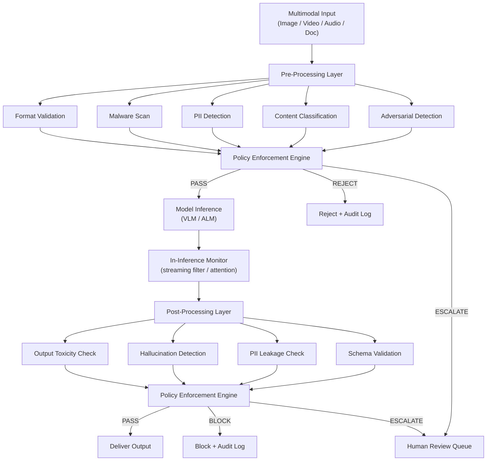

# Part 8 — Guardrails & Sanitization for Multimodal AI

A production-grade technical reference for designing, implementing, and operating guardrail and sanitization systems across image, video, audio, and document modalities in enterprise AI deployments.

> **Audience:** Principal AI Architects, AI Platform Engineers, AI Security Architects, Trust & Safety Engineers
> **Coverage:** Guardrail Architecture · Content Moderation · PII Detection · Deepfake Detection · Sanitization Pipelines · Framework Comparison
> **As of:** July 2026

---

## Guardrail Architecture Overview

Guardrails in multimodal AI systems operate at three distinct phases: before model inference, during inference, and after the model produces output. Each phase addresses different threat vectors and imposes different latency budgets. A mature enterprise system operates all three layers simultaneously, with the pre-processing layer bearing the heaviest workload.

### Pre-Processing Guardrails

Pre-processing guardrails intercept raw inputs before they reach the model. For multimodal systems this means format validation, malware scanning, PII detection across all modalities, content policy classification (violence, NSFW, hate), and adversarial perturbation detection. These checks run in parallel where possible. Budget: typically 50–150 ms for a standard image or 1–2 seconds for a 60-second audio clip.

The pre-processing layer is the cheapest place to enforce policy. A reject decision here avoids model inference cost entirely — critical for high-volume enterprise workloads where inference may cost $0.01–$0.10 per call.

### In-Inference Guardrails

In-inference guardrails monitor model behavior in real time, typically implemented as:

- Token-level streaming filters that interrupt generation when policy-violating content appears
- Attention pattern monitors that detect the model attending to known adversarial triggers in the input
- Confidence threshold monitors that flag low-confidence multimodal grounding as requiring human review
- Tool-call interceptors for agentic multimodal systems that validate tool arguments before execution

In-inference guardrails add 2–10 ms per token depending on implementation. For vision-language model (VLM) outputs this phase is less granular than for text generation — typically it involves monitoring the first tokens of the response for policy signals.

### Post-Processing Guardrails

Post-processing guardrails validate model outputs before they reach the user or downstream system. For VLMs this includes:

- Output toxicity classification
- Factual consistency checks against the input image/document
- Hallucination detection (output claims that contradict visual evidence)
- PII leakage detection in generated text
- Structured output schema validation (critical for document extraction agents)

Post-processing adds 30–100 ms depending on secondary model complexity.

### Policy Enforcement Engine

The policy enforcement engine is the orchestration layer that coordinates all three phases, maintains per-tenant policy configurations, logs decisions, and routes borderline cases to human review queues. Enterprise implementations typically use a policy-as-code approach (OPA or Cedar) that allows policy updates without redeployment. The engine must support:

- Per-customer policy overrides (a medical platform has different NSFW thresholds than a consumer chatbot)
- Severity-based routing (high-severity violations → immediate reject; medium → human escalation; low → log only)
- Policy versioning and rollback
- Audit-grade decision logging with input hashes, policy version, and outcome

---

## Content Moderation by Modality

### Image Guardrails

**Violence, weapons, blood, self-harm detection** uses multi-class classifiers trained on datasets such as LAION-Aesthetics filtered subsets, internal moderation datasets, and government-provided illegal content hashes (PhotoDNA). Production systems maintain separate classifiers for: weapons-only (firearms, bladed weapons), blood/gore, depictions of violence in progress, and self-harm imagery. Thresholds are tuned independently per context — a hunting equipment retailer needs different weapon thresholds than a children's education platform.

**Adult/NSFW content detection** typically involves a cascade: a fast binary classifier (NSFW/SFW) at the front, followed by a multi-label fine-grained classifier for regulatory compliance (toplessness, explicit content, partial nudity). Enterprise systems must handle artistic nudity exceptions for healthcare and art platforms.

**Face detection and privacy protection** uses a face detector (MTCNN, RetinaFace, or YOLOv8-face) followed by a decision: blur, pixelate, or redact faces based on policy. In enterprise document processing, face detection on ID documents is critical for GDPR compliance.

**Age estimation and minor protection** runs after face detection. Models such as MiVolo or DEX estimate apparent age from detected faces. Any detected face with estimated age below 18 triggers elevated scrutiny or outright rejection for NSFW contexts. False positive rates on age estimation are high — calibrate thresholds conservatively and rely on human review for borderline cases.

**Brand logo detection and copyright protection** uses object detection models fine-tuned on logo datasets (Logo-2K+) to identify brand marks in user-submitted images. This enables enforcement of brand usage policies and flags potential trademark violations in generated content.

**Deepfake and synthetic media detection** is covered in depth in the interview use cases section below. Detection models include FaceForensics++-trained classifiers (e.g., EfficientNet-B4), frequency-domain analysis (FFT artifact detection), and biological signal analysis (rPPG — remote photoplethysmography — detects absence of natural skin color variation in synthetic faces). Accuracy degrades significantly for compressed video (post-social-media-upload), which is the realistic enterprise attack scenario.

**Political content detection** uses multi-label classifiers trained on news imagery datasets. Enterprise platforms processing user-generated content in regulated sectors (banking, healthcare) often adopt zero-tolerance policies for political imagery in AI-generated content.

**Government ID detection** (passports, driver's licenses, SSN cards) uses a combination of document type classifiers and template matching. Detection triggers automatic PII masking or rejection depending on policy. ID document ingestion in KYC workflows requires explicit exemption policies.

**Medical record detection** uses document classification models (LayoutLM, DocFormer) to identify HIPAA-covered medical record formats: clinical notes, lab results, DICOM viewer screenshots, prescription images.

### Video Guardrails

**Frame-level content moderation** applies the same image classifiers described above to sampled frames. Production systems use adaptive sampling: fast scene change detection (optical flow or histogram difference) determines where to sample, ensuring key transitions are not missed. A fixed 1 fps sample rate misses flash violence or momentary NSFW frames — use at minimum 2 fps and 100% sampling at detected scene changes.

**Temporal context (brief vs sustained content)** matters for policy enforcement. A single frame of a weapon in a historical documentary is different from 30 seconds of weapon handling. Enterprise guardrail systems implement temporal context windows: if a policy-violating class exceeds threshold in more than N% of frames over a T-second window, it triggers an escalation versus a single frame that may be a false positive.

**Audio track moderation** processes the audio channel independently using the audio guardrails described below, then correlates audio and video classification results. Audio-visual correlation catches cases where each modality alone is borderline but combined clearly violates policy (e.g., audio with explicit lyrics synchronized to suggestive imagery).

**Synthetic video (deepfake) detection** for streaming video introduces latency constraints. Production systems use lightweight temporal consistency detectors that analyze facial landmark trajectories across frames — synthetic faces exhibit unnatural landmark jitter and blending artifacts at frame boundaries that are detectable at video-frame rate without full per-frame deepfake inference.

### Audio Guardrails

**Profanity and hate speech detection** in audio operates in two ways: (1) ASR-first pipeline (transcribe then classify text) using Whisper or a streaming ASR model, followed by a text hate-speech classifier; (2) direct audio classification using models such as Audio Spectrogram Transformer (AST) fine-tuned on audio hate speech datasets. The ASR-first approach achieves higher accuracy for language-specific content but adds 200–500 ms latency. Direct audio classification is faster but less accurate, especially for multilingual or accented speech.

**Voice cloning / synthetic audio detection** uses a combination of: spectral artifact detection (GAN-generated speech has characteristic spectral inconsistencies), speaker verification against claimed identity (if the user claims to be a specific individual, verify against an enrolled voiceprint), and anti-spoofing models (ASVspoof competition models, SpeechBrain). Detection accuracy against high-quality voice clones (ElevenLabs, VALL-E) is currently 70–85% in ideal conditions and drops further on compressed audio.

**Call recording consent compliance** for healthcare and financial services requires detecting jurisdiction-specific consent language at the start of calls, or injecting consent announcements. Systems must log consent status per call for regulatory audit.

**PII in speech** (credit card numbers, SSN, account numbers) uses ASR transcription followed by a regex/NER pipeline similar to text PII detection, with specialized patterns for spoken number formats ("four one one two" spoken as separate digits vs "four thousand, one hundred twelve"). Redaction replaces detected spans with silence or a beep tone in the audio output.

### Document Guardrails

**Financial document PII masking** targets account numbers, routing numbers, Social Security Numbers, Tax Identification Numbers, and credit card numbers in scanned PDFs, images, and extracted text using NER models fine-tuned on financial documents.

**Medical record protection** in document processing uses LayoutLM-based classifiers to identify HIPAA-covered PHI zones — patient name header regions, date of birth fields, MRN fields — and applies masking before any third-party processing.

**Identity document protection** detects government ID templates and triggers either rejection or controlled-workflow routing with enhanced access logging.

**Watermark detection and copyright** uses both visible watermark detection (image segmentation identifying watermark overlays) and invisible watermark reading (C2PA-compliant watermark extraction, Stable Diffusion watermark detection via Stable Signature).

---

## PII Detection & Masking Pipeline

PII in multimodal systems exists in three distinct forms that require different detection technologies:

**Text PII** (in extracted text, OCR output, transcriptions): names, emails, phone numbers, SSNs, credit card numbers, dates of birth, addresses. Detection uses transformer-based NER (GLiNER, spaCy with custom components, AWS Comprehend, Azure AI Language) plus regex patterns for structured PII formats. Confidence threshold: 0.85 minimum before masking to avoid false positives in business text.

**Visual PII** (in images and video frames): faces (biometric identity), license plates (location inference), vehicle identification numbers, handwritten signatures, passport photos, fingerprints. Detection uses purpose-built computer vision models for each subtype — face detectors, OCR-based license plate readers (OpenALPR, Plate Recognizer), signature detectors, fingerprint detectors.

**Audio PII** (in recordings and transcriptions): voice biometrics (speaker identity from voiceprint), spoken PII (account numbers, names), background audio clues (location, other speakers). Detection combines speaker diarization with identity verification against enrolled voiceprints, plus ASR-to-text PII pipelines.

### Masking Strategies by Context

- *Redaction*: replace with black box (documents), silence (audio), black rectangle (images). Irreversible. Use for external sharing.
- *Pixelation*: coarsen pixel resolution over PII zone. Cosmetically less intrusive than black boxes. Reversibility risk if pixelation level too low — use minimum 16x16 block size.
- *Blurring*: Gaussian blur over detected face/plate region. Preferred for video as it introduces less visual discontinuity than pixelation. Same reversibility caveat — use radius ≥ 20px.
- *Tokenization*: replace PII value with a stable pseudonymous token (HMAC of original value + system salt). Enables referential integrity across documents while protecting identity. Preferred for data analytics pipelines.
- *Synthetic replacement*: replace detected PII with plausible synthetic data (Faker library for text; GAN-synthesized face swaps for images). Highest utility preservation for ML training data generation.

---

## Guardrail Framework Comparison Matrix

| Framework | Image | Video | Audio | PII | Deepfake | Latency Overhead | Extensibility | Enterprise Support | Cost Model |
|-----------|-------|-------|-------|-----|----------|-----------------|---------------|-------------------|------------|
| Azure AI Content Safety | Strong | Frames only | No | Via Azure PII | Limited | 80–200 ms | Moderate (custom categories) | Enterprise SLA | Per-call |
| AWS Bedrock Guardrails | Moderate | No | No | Strong (text) | No | 100–300 ms | Moderate | Enterprise SLA | Per-call |
| NeMo Guardrails | Text-focused | No | No | Plugin | No | 50–150 ms | High (programmable) | Community + NVIDIA | OSS |
| OpenAI Moderation API | Moderate | No | No | No | No | 50–100 ms | Low | Enterprise SLA | Per-call |
| Lakera Guard | Text-focused | No | No | Via LLM | No | 30–80 ms | Moderate | Enterprise SLA | Per-call |
| Protect AI | Moderate | No | No | Moderate | No | 100–200 ms | High | Enterprise SLA | License |
| NVIDIA NIM Safety | Strong | Via frames | No | Plugin | Limited | 50–120 ms | High (NIM plugin) | Enterprise | License |
| Google Safe Messaging API | Moderate | Limited | No | No | No | 80–150 ms | Low | Enterprise SLA | Per-call |
| Microsoft Presidio | Text + Image | No | Limited | Strong | No | 20–80 ms | Very High (OSS) | Community | OSS |
| Guardrails AI | Text-focused | No | No | Via validators | No | 30–100 ms | Very High (validators) | Community + Commercial | OSS/License |

*Latency overhead = incremental latency added to standard inference path. "Frames only" = video support via frame extraction, not native video stream processing.*

---

**This is Part 1 of 2. [Continue with Part 2 →](pathname:///archon/agentic-systems/multimodal/parts/08-08-part-08-guardrails-sanitization.md-part2.md) for sanitization pipeline design, enterprise patterns, and interview use cases.**
