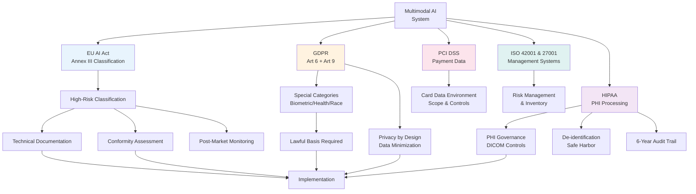

# Part 9 — Compliance & Responsible AI for Multimodal Systems

A comprehensive reference for regulatory compliance, biometric data governance, fairness, explainability, and content provenance in enterprise multimodal AI deployments across regulated industries.

> **Audience:** AI Risk & Compliance Officers, Enterprise Architects, Principal AI Architects, Legal & Privacy Counsel
> **Coverage:** EU AI Act · GDPR · HIPAA · PCI DSS · Biometric Governance · Responsible AI · C2PA · Content Provenance
> **As of:** July 2026

---

## Multimodal AI Regulatory Framework

## Regulatory Landscape Overview

### Why Multimodal AI is Uniquely Regulated

Text-only AI systems handle a limited class of personal data — primarily names, opinions, and behavioral patterns inferred from language. Multimodal systems process biometric data (faces, voices, fingerprints), health data (medical images, symptom descriptions combined with visual assessment), location data (GPS from EXIF metadata, background identification), and behavioral data (gait, emotional expression, eye movement) simultaneously and in combination.

This combination creates regulatory obligations that have no equivalent in text AI. A VLM that reads a scanned prescription and identifies the patient's face in the document header processes both health data (the medication) and biometric data (the face) in a single inference step. Under GDPR, this activates Article 9 special categories protections. Under HIPAA, it activates PHI processing obligations. Under the EU AI Act, depending on the use case, it may qualify the system as high-risk. No single regulatory framework anticipated this convergence — architects must navigate across multiple frameworks simultaneously.

### Biometric Data Special Category

Biometric data receives the highest level of regulatory protection across virtually every major framework. Under GDPR Article 4(14), biometric data means personal data resulting from specific technical processing relating to the physical, physiological, or behavioural characteristics of a natural person that allows or confirms the unique identification — facial images, voice recordings (voiceprints), iris patterns, fingerprints, gait.

The critical compliance trap: a facial image alone is not biometric data under GDPR unless it is processed for the purpose of uniquely identifying a person. A VLM that describes the contents of an image (including that a face appears) without performing identity matching does not necessarily process biometric data. However, a VLM that is asked "who is this person?" and matches against a database performs biometric categorization and is subject to Article 9 restrictions.

### Cross-Border Data Transfer Implications

Multimodal data frequently moves across borders during inference: a user in Germany uploads an image that is processed on US-based GPU infrastructure. Under GDPR Chapter V, this transfer requires an adequacy decision, Standard Contractual Clauses (SCCs), or Binding Corporate Rules. For biometric data specifically, the transfer is additionally restricted under Article 9 — the lawful basis for the transfer must encompass the biometric special category, not just ordinary personal data.

Cloud providers address this through regional inference endpoints (EU-West model deployments on Azure, AWS eu-central-1 Bedrock) and in-region data residency guarantees. For highest-compliance environments (German banking, French public sector), air-gapped on-premises or sovereign cloud deployment may be required.

---

## Regulation Deep Dive

### EU AI Act

The EU AI Act (effective August 2024, full enforcement August 2026) classifies AI systems into four tiers: unacceptable risk (prohibited), high-risk, limited risk (transparency obligations), and minimal risk. Multimodal systems are primarily affected at the high-risk and unacceptable-risk tiers.

**High-risk AI system classification criteria:** A multimodal agent qualifies as high-risk if it is used in one of the Annex III categories: biometric identification and categorization, critical infrastructure (energy, water, transport), education (assessing students), employment (screening candidates), essential private and public services (credit scoring, benefits assessment), law enforcement, migration and asylum, and administration of justice. An agentic VLM that analyzes resumes including photographs (common in non-EU markets) is a high-risk employment screening system if deployed in the EU.

**Biometric categorization systems:** Any AI system that categorizes people based on biometric data is prohibited (Article 5) unless specific exceptions apply. *Categorization* means inferring sensitive attributes — race, ethnicity, political opinions, religious beliefs, sexual orientation — from biometric data such as facial features or voice characteristics. Emotion recognition in workplaces and educational institutions is separately prohibited under Article 5(1)(f).

**Real-time remote biometric identification (RTRBI):** The use of AI systems for real-time remote biometric identification of natural persons in publicly accessible spaces for law enforcement is prohibited except for specific, narrowly defined purposes (preventing terrorist attacks, finding victims of trafficking or missing children, prosecuting serious crimes). For non-law-enforcement commercial use (retail analytics identifying shoppers, stadium surveillance matching ticket holders to faces), RTRBI is prohibited in public spaces.

**Technical documentation requirements for multimodal high-risk systems** (Article 11, Annex IV): must include a general description of the AI system and its intended purpose; description of the training, validation, and testing data including data governance practices; description of the monitoring, functioning, and control of the system; description of the risk management system; and for biometric systems specifically, the demographic scope of training data and accuracy metrics disaggregated by demographic group.

**Conformity assessment for biometric systems:** High-risk systems in Annex III categories 1 (biometric) and 6 (law enforcement) require third-party conformity assessment by a notified body before deployment. This means an accredited external auditor must review the system design, training data, accuracy metrics, and risk management documentation.

**Post-market monitoring:** High-risk system providers must implement post-market monitoring systems that collect and analyze data on system performance throughout its lifetime, including notifying the market surveillance authority of serious incidents within defined timeframes.

### GDPR

**Special categories of personal data (Article 9):** Processing biometric data for the purpose of uniquely identifying a natural person, as well as health data and data revealing racial or ethnic origin, is prohibited unless one of ten specific conditions is met. The most relevant for enterprise multimodal AI are: explicit consent of the data subject; processing necessary for employment law obligations; processing necessary for reasons of substantial public interest (with suitable safeguards); processing for medical diagnosis or healthcare (under professional secrecy obligations).

**Lawful basis for multimodal processing:** Ordinary GDPR processing (Article 6) requires one of six lawful bases: consent, contract, legal obligation, vital interests, public task, or legitimate interests. For multimodal systems processing biometric or health data, Article 6 lawful basis is required *and* an Article 9 exception must separately apply. Both must be established before processing begins.

**Data subject rights for biometric data:** The right to erasure (Article 17) requires that biometric templates derived from personal data be deleted when the data subject requests erasure. This is technically challenging for systems that embed biometric identity into model weights during fine-tuning — the model may need retraining or the use of machine unlearning techniques. The right to data portability (Article 20) applies when processing is based on consent or contract — biometric templates must be exportable in a machine-readable format.

**Privacy by design (Article 25):** Controllers must implement appropriate technical measures (data minimization, pseudonymization) both at the time of design and by default. For multimodal AI: face blurring before storage, limiting biometric template retention to the minimum necessary duration, pseudonymizing voice recordings before analysis.

**Data minimization for multimodal data:** Frame extraction from video should use the minimum number of frames necessary for the intended purpose. Audio sampling should not retain the full recording if only the transcription is needed. For a fraud detection system that needs to verify document authenticity, the document image should not be retained after verification is complete.

**DPA notification for biometric processing:** Many EU member state data protection authorities (DPAs) require notification or prior consultation before commencing large-scale biometric processing. Germany's Datenschutzkonferenz, France's CNIL, and Italy's Garante have all issued specific guidance on facial recognition requiring prior DPA consultation.

### HIPAA

**PHI in medical imaging:** DICOM files contain 18 classes of PHI in metadata tags: patient name (0010,0010), patient ID (0010,0020), patient birth date (0010,0030), institution name (0008,0080), and 14 others. Any cloud-based VLM processing DICOM files must strip these tags before transmission or must operate under a Business Associate Agreement (BAA) with appropriate data handling controls. The pixel data itself — the actual medical image — is PHI if it can identify the patient (e.g., a photograph of the patient's face from a dermatology visit is PHI; an X-ray of an anonymous bone fracture may not be).

**Audio PHI:** Voice recordings in healthcare settings are PHI when they contain patient health information. This includes clinical consultation recordings, telehealth visit recordings, and call center recordings about patient conditions. Transcriptions derived from PHI audio are themselves PHI.

**De-identification standards — Safe Harbor:** The Safe Harbor method requires removing all 18 PHI identifiers and having no actual knowledge that the remaining information could identify an individual. For images: remove DICOM metadata, blur or remove patient faces and photographs, remove visible tattoo identifiers (common in dermatology). For audio: remove name mentions, remove dates more specific than year, remove geographic identifiers smaller than state.

**De-identification — Expert Determination:** A qualified statistician applies generally accepted principles to certify that the risk of identifying an individual is very small. Allows retention of some identifiers (truncated dates, three-digit ZIP codes) that Safe Harbor prohibits. Required for clinical research datasets where date precision matters.

**BAA requirements for cloud multimodal services:** Azure (Azure AI Services, Azure OpenAI), AWS (Bedrock, SageMaker), and Google Cloud (Vertex AI) all offer BAAs. The BAA must explicitly cover the specific services used for PHI processing — a BAA for general cloud storage does not automatically extend to AI inference services. Check the BAA service scope carefully.

**Minimum necessary standard:** Only the PHI that is the minimum necessary to accomplish the intended purpose should be accessed or disclosed. For a clinical documentation assistant that transcribes patient encounters: the transcription service should receive the audio recording, but downstream services (NLP analysis, billing code extraction) should receive only the transcription — not the audio — unless the audio is specifically needed.

### PCI DSS

**Card data in images:** Customers frequently photograph physical credit cards and send them to customer service agents. The card image contains PAN (Primary Account Number), cardholder name, expiration date, and CVV. A multimodal AI that receives such an image enters PCI DSS scope for that interaction. Controls required: the image must not be stored after the card data is extracted; the raw image must be purged from logs; access to the system is subject to PCI DSS access control requirements (MFA, need-to-know access).

**Audio PCI:** Call center recordings where customers speak card numbers are in PCI DSS scope. Card Data Environment (CDE) extends to the audio storage and processing infrastructure. Required controls include: pause-resume recording during card number dictation (most telephony platforms support this natively), or post-call redaction of PAN and CVV spans identified by ASR + PII detection.

**OCR controls for card data:** Systems that OCR card images must implement controls equivalent to those for any PAN-containing system: encryption at rest (AES-256), encryption in transit (TLS 1.2+), access logging, quarterly vulnerability scanning.

**Scope reduction strategies:** The most effective strategy for multimodal payment processing is to route payment image/audio processing through a PCI-compliant vault service that extracts the card data, returns only a token, and purges the original media. The multimodal AI system then operates on the token rather than the raw card data, reducing its PCI DSS scope.

### Additional Regulations

**SOX (Sarbanes-Oxley):** Financial document integrity requires that document processing AI systems for financial reporting maintain audit trails of all transformations applied to source documents. VLMs processing financial statements must log input document hashes, extracted values, and model version for each processing run.

**ISO 42001 (AI Management System):** The international standard for AI management systems (published 2023) requires organizations to establish, implement, maintain, and continually improve an AI management system. For multimodal AI: this includes maintaining an AI system inventory with risk classification, impact assessment procedures for new multimodal capabilities, and controls for data quality and model performance monitoring.

**ISO 27001:** Information security management system standard. Multimodal data (images, audio, video) typically requires higher storage and transmission security classifications than text, given the biometric and sensitive content risk. ISO 27001 Annex A controls A.8.10 (information deletion) and A.8.11 (data masking) are directly applicable to multimodal PII.

**NIST AI RMF:** The NIST AI Risk Management Framework's four functions (Govern, Map, Measure, Manage) apply directly to multimodal AI. The Measure function requires fairness and bias metrics disaggregated by demographic group — for face recognition this means accuracy metrics by race/gender/age cohort. The Govern function requires documentation of organizational roles and accountability for AI system decisions.

**NIST AI 100-1 (Trustworthy AI):** Defines six characteristics of trustworthy AI: accurate, explainable and interpretable, privacy-enhanced, reliable and robust, safe, and fair with harmful bias managed. Multimodal systems are most challenged on explainability (VLM attention visualization) and bias (demographic disparities in face recognition, accent disparities in ASR).

**DORA (Digital Operational Resilience Act):** EU regulation for financial services ICT risk management. For multimodal AI in financial sector: incident reporting requirements (major incidents involving AI decision failures must be reported to regulators within 4 hours), third-party ICT provider oversight (cloud VLM providers are third-party ICT providers subject to DORA oversight), and ICT operational resilience testing (multimodal AI systems must be included in penetration testing scope).

**MAS TRM / RBI / APRA:** Monetary Authority of Singapore (MAS) Technology Risk Management guidelines, Reserve Bank of India (RBI) technology risk framework, and Australian Prudential Regulation Authority (APRA) CPS 234 all impose technology risk management requirements on financial sector multimodal AI. Common requirements include: board-level AI risk governance, model risk management frameworks that cover VLMs and multimodal systems, and data residency controls.

**SOC 2 Type II / FedRAMP:** Cloud-hosted multimodal AI services require SOC 2 Type II for commercial enterprise and FedRAMP Moderate or High for US government use. FedRAMP High authorization covers systems processing Controlled Unclassified Information (CUI) — federal medical records, law enforcement biometrics. Check that the specific AI service (not just the underlying cloud) holds the relevant authorization.

**CCPA / CPRA:** California's privacy law treats biometric data (facial recognition data, voiceprint data, fingerprint data) as "sensitive personal information" subject to the right to limit use. Businesses must not use biometric data for purposes beyond the disclosed purpose without separate consent. CPRA's expanded enforcement (California Privacy Protection Agency) has issued enforcement guidance specifically addressing biometric data in AI systems.

---

## Compliance Matrix

| Regulation | Facial Recognition | Voice ID | Document OCR | Video Surveillance | Medical Imaging | Financial Documents |
|-----------|------------------|----------|-------------|-------------------|----------------|-------------------|
| **EU AI Act** | High-risk (Art 6) or prohibited RTRBI (Art 5) | High-risk if for law enforcement ID | Low-risk unless Annex III use case | Prohibited if real-time public space | High-risk if clinical decision support | Low-risk unless credit scoring |
| **GDPR** | Art 9 special category; explicit consent or public interest basis required | Art 9 biometric; DPIA required for large-scale | Art 6 lawful basis; minimize retention | Art 9 biometric; DPIA; data minimization | Art 9 health data; healthcare exemption | Art 6 lawful basis; contractual necessity |
| **HIPAA** | PHI if patient identity inferable | PHI if healthcare-related recording | PHI if patient-identifiable | PHI if healthcare setting | PHI — full DICOM controls + BAA | Not covered unless combined with PHI |
| **PCI DSS** | N/A unless combined with card | N/A unless card spoken | Card data in scope if PAN visible | N/A unless card visible | N/A | In scope if financial statements contain PAN |
| **CCPA/CPRA** | Sensitive PI; right to limit use | Sensitive PI; right to limit | Personal info if identifiable | Sensitive PI if persistent ID | Sensitive PI; health category | Personal info if individual identifiable |
| **ISO 42001** | Risk assessment required; human oversight for high-stakes | Risk assessment; accuracy monitoring | Impact assessment | Risk assessment; bias monitoring | High-risk classification; clinical validation | Impact assessment; accuracy metrics |
| **NIST AI RMF** | Bias metrics by demographic; explainability | WER by accent group; fairness | Accuracy by document type | Temporal bias; demographic fairness | Clinical concordance metrics | Accuracy by document complexity |

---

**This is Part 1 of 2. [Continue with Part 2 →](pathname:///archon/agentic-systems/multimodal/parts/09-09-part-09-compliance-responsible-ai.md-part2) for biometric governance, responsible AI, content provenance, and interview use cases.**
