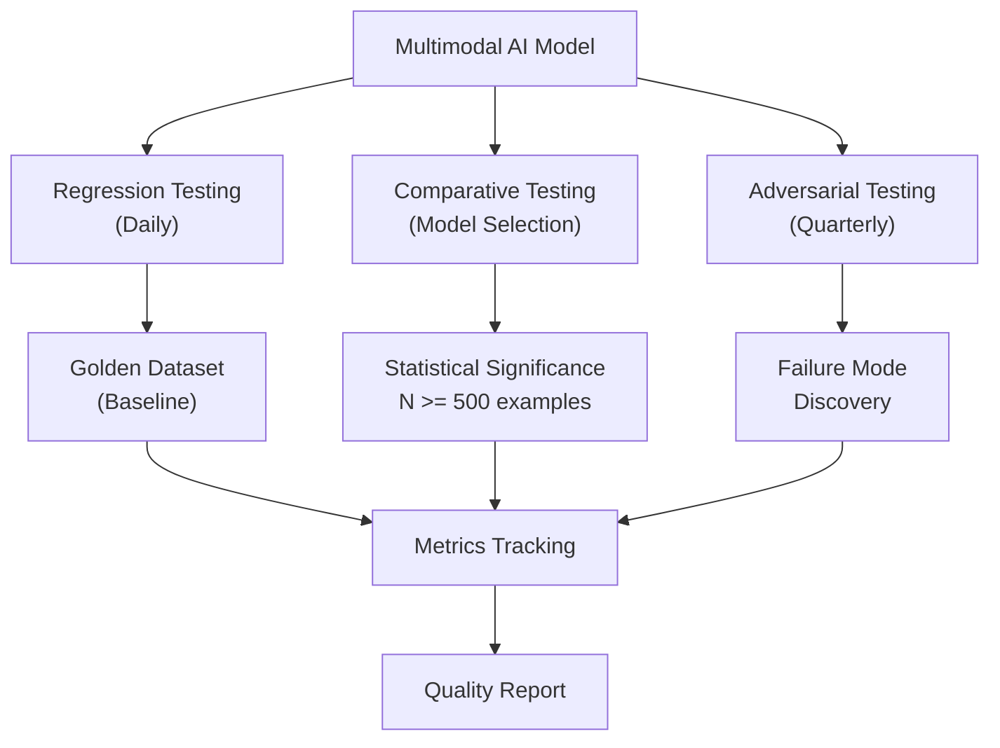

# Part 10 — Evaluation & Benchmarks for Multimodal AI

A comprehensive technical reference for benchmarks, evaluation methodologies, golden dataset construction, and LLM-as-judge approaches for enterprise multimodal AI systems across vision, video, audio, and document modalities.

> **Audience:** AI Platform Engineers, ML Engineers, Evaluation Specialists, Principal AI Architects
> **Coverage:** Benchmark Taxonomy · VLM Benchmarks · Video & Audio Benchmarks · OCR & Document Benchmarks · Agent Benchmarks · LLM-as-Judge · Golden Datasets
> **As of:** July 2026

---

## Evaluation Philosophy for Multimodal AI

### Why Multimodal Evaluation is Harder

Text evaluation is comparatively tractable: reference answers exist, string overlap metrics (BLEU, ROUGE) provide a baseline, and human evaluation scales reasonably well because annotators need only language competence. Multimodal evaluation adds fundamental complexity along four axes:

*Perceptual grounding:* The evaluator must verify that model outputs are grounded in the visual, audio, or document input — not just plausible text. A model that produces fluent, accurate-sounding descriptions of an image it hallucinated has passed text evaluation but failed multimodal evaluation. Evaluating grounding requires either human annotators with domain expertise or a multimodal judge that can perceive the input.

*Cross-modal consistency:* Does the model's audio transcription agree with its image description when both refer to the same event? Does the model's answer to a document visual question match what the document actually shows? These consistency checks require cross-modal reasoning by the evaluator.

*Modality-specific quality:* Image quality metrics (perceptual sharpness, color fidelity), audio quality metrics (MOS — Mean Opinion Score), and OCR quality metrics (character error rate, field extraction accuracy) require domain-specific evaluation tooling and expertise.

*Adversarial sensitivity:* Multimodal models are uniquely vulnerable to adversarial inputs — pixel-level perturbations, audio noise injection, font changes in documents — that do not affect human perception but dramatically change model behavior. Evaluation must include robustness testing across adversarially perturbed inputs.

### Evaluation Dimensions

- *Capability:* What tasks can the model perform and at what accuracy?
- *Robustness:* Does performance degrade gracefully under input quality degradation, distribution shift, or adversarial perturbation?
- *Safety:* Does the model comply with content policies, avoid hallucination, and refuse appropriately?
- *Fairness:* Are capability and robustness metrics consistent across demographic groups, languages, and input variations?
- *Efficiency:* What is the latency, throughput, and cost per inference unit?

### Automated vs Human Evaluation

Automated evaluation (benchmark datasets with ground truth, metric computation) scales, is reproducible, and is cheap. Human evaluation captures nuance, cross-modal grounding verification, and subjective quality that automated metrics miss. The gap between automated and human evaluation is largest for: open-ended visual question answering, image caption quality, and audio description naturalness.

Enterprise evaluation strategy: automated benchmarks for regression tracking (daily CI gate), human evaluation for model selection decisions and quarterly capability assessment, adversarial red teaming quarterly.

### Regression vs Comparative vs Adversarial Evaluation

*Regression evaluation* compares a new model/prompt version against a baseline, detecting performance degradation. Run daily or on every PR. Metrics: delta from baseline, not absolute score.

*Comparative evaluation* pits two candidate models against each other to select the superior option for a specific use case. Run at model selection decision points. Requires statistical significance testing (N ≥ 500 examples per comparison for 80% power at 5% significance).

*Adversarial evaluation* systematically constructs inputs designed to expose model failure modes. Run quarterly or before deployment to high-stakes applications. Output: ranked list of failure modes with reproduction rate.

---

## Benchmark Taxonomy & Deep Dive

### Vision & VLM Benchmarks

**COCO (Common Objects in Context):** The foundational benchmark for object detection (2D bounding boxes) and instance segmentation. 118,000 training images, 5,000 validation images with 80 object categories and 5 captions per image. Primary metrics: mAP@0.5 for detection, mAP@0.5:0.95 for segmentation. Still the gold standard for object detection evaluation. Limitation: object categories are everyday consumer objects — no medical, satellite, or document-specific categories.

**ImageNet / ImageNet-A / ImageNet-R / ObjectNet:** ImageNet-1K (1,000 classes, 1.2M training images) is the reference for image classification. Production evaluation should use robustness variants: ImageNet-A (naturally adversarial images that fool standard classifiers), ImageNet-R (artistic renditions — cartoons, paintings, origami — that test shape vs texture bias), ObjectNet (controlled test set with object pose and background variation removed to eliminate dataset bias). Enterprise note: ImageNet accuracy has near-zero correlation with domain-specific performance (medical, satellite, document).

**DocVQA:** Document Visual Question Answering. 50,000 question-answer pairs over 12,767 document images including handwritten, printed, and typed text. The primary benchmark for enterprise document intelligence VLMs. Metric: Average Normalized Levenshtein Similarity (ANLS) which is more lenient than exact match. Limitation: documents are primarily English; significant performance gap exists for multilingual documents.

**ChartQA:** 9,608 charts with 20,882 question-answer pairs. Covers bar charts, line charts, pie charts, and scatter plots. Tests both data extraction (read exact value from y-axis) and reasoning (which year had the highest growth?). Critical benchmark for business intelligence applications. Metric: relaxed accuracy allowing 5% numerical tolerance.

**TextVQA:** Visual question answering over images containing text in natural scenes (store signs, product labels, street signs). 28,408 images, 45,336 questions. Tests OCR capability in uncontrolled conditions — rotated text, varied fonts, partial occlusion. Metric: VQA accuracy (answer matches any of 10 reference annotations).

**MMMU (Massive Multi-discipline Multimodal Understanding):** 11,500 questions across 30 subjects and 6 image types (diagrams, tables, charts, chemical structures, photographs, music sheets). Subjects span science, technology, engineering, mathematics, humanities, and arts. The most comprehensive single benchmark for evaluating VLMs on university-level multi-discipline reasoning. Metric: accuracy. Why it matters for enterprise: the 30-subject scope correlates better with real enterprise task diversity than any single-domain benchmark.

**MMMU-Pro:** A harder version of MMMU with 3,460 questions featuring process-level evaluation — the model must show step-by-step reasoning, not just produce a final answer. Measures reasoning quality, not just outcome accuracy. Enterprise use: evaluating chain-of-thought reliability for complex document analysis tasks.

**MMBench:** Comprehensive VLM benchmark decomposed into 20 sub-skills including attribute recognition, object localization, relation reasoning, future prediction, and commonsense reasoning. 2,974 multiple-choice questions. Enables fine-grained capability profiling — useful for identifying specific weaknesses before enterprise deployment.

**AI2D (Allen AI Diagrams):** 4,903 diagrams from science textbooks with 15,000 multiple-choice questions about diagram understanding. Covers biology, physics, chemistry, and earth science. Enterprise relevance: tests the model's ability to read and interpret technical diagrams — relevant for manufacturing, engineering, and scientific document processing.

**MathVista:** 6,141 examples testing mathematical reasoning in visual contexts — geometry proofs, statistical chart analysis, physics diagrams. Metric: accuracy. Critical for evaluating VLMs intended for financial data extraction (reading tables, interpreting graphs) or educational platforms.

**OCRBench:** 1,000 instances specifically testing OCR-related understanding: text recognition, text localization, handwriting recognition, and document understanding. More fine-grained than DocVQA for diagnosing OCR-specific failures vs reasoning failures.

**HallusionBench:** 1,129 visual questions specifically designed to probe hallucination. Questions are paired: a real question and a trick question about an object not present in the image. Measures object hallucination rate and counterfactual hallucination. Critical for enterprise deployment where hallucinated content in AI outputs creates legal or reputational risk.

**POPE (Polling-based Object Probing Evaluation):** 9,000 binary questions ("Is there a {object} in the image?") across three sampling strategies — random, popular (commonly co-occurring objects), and adversarial. Measures object existence hallucination specifically. Metric: F1 score. High POPE score is a prerequisite for enterprise document processing VLMs.

### Video Benchmarks

**VideoMME:** Comprehensive video question answering benchmark with short (< 2 min), medium (4–15 min), and long (30–60 min) video clips. Tests temporal reasoning, event localization, and content understanding across 30 domains. Metric: accuracy. The reference benchmark for evaluating video VLM temporal reasoning at different timescales.

**MVBench:** Multi-task video understanding benchmark with 20 challenging temporal reasoning tasks including action sequence understanding, scene transition reasoning, and counterfactual reasoning. 4,000 multiple-choice questions. Enterprise relevance: tests whether the model understands what happened *over time*, not just what appears in a single frame.

**EgoSchema:** 5,031 multiple-choice questions over egocentric video clips (first-person perspective). 3-minute clips requiring temporal context spanning the full clip. Critical for evaluating wearable AI, industrial inspection agents, and healthcare monitoring systems.

**ActivityNet QA:** Question-answering over the ActivityNet activity recognition dataset covering 200 activity classes. Tests action recognition combined with temporal reasoning.

**Charades:** 9,848 videos of people performing activities in home environments. Multi-label activity recognition with compositional queries ("putting down a book while sitting"). Tests compositionality and multi-label prediction.

**Perception Test:** DeepMind benchmark covering four skills: memory, abstraction, physics, and semantics across video and audio. Tests temporal reasoning with a focus on causal understanding (why did X happen?). Enterprise relevance: robustness testing for agentic video analysis systems.

### Audio & Speech Benchmarks

**LibriSpeech:** 960 hours of English audiobook speech. Clean subset (test-clean) and noisy subset (test-other). WER on test-clean is the most commonly reported ASR benchmark metric. Limitation: audiobook speech has distinctly different acoustic characteristics from conversational call center speech — do not use LibriSpeech WER as the sole quality metric for call center ASR.

**Common Voice:** Mozilla's community-contributed multilingual speech dataset. 100+ languages, crowdsourced from volunteers. Tests multilingual ASR and accent diversity. Critical for enterprise systems deployed in multilingual markets (EU financial services, Asian telco).

**VoxCeleb 1 & 2:** 1,251 and 6,112 celebrity speakers respectively. Used for speaker verification (same/different speaker?) and speaker identification. The standard benchmark for enterprise voice biometric systems.

**SUPERB (Speech Processing Universal PERformance Benchmark):** Evaluation framework covering 10 speech processing tasks: speech recognition, speaker identification, speaker verification, emotion recognition, keyword spotting, intent classification, slot filling, semantic parsing, speech enhancement, and speech separation. Uses a shared pretrained representation model evaluated on each task with minimal task-specific fine-tuning. Enables holistic evaluation of speech foundation models.

**FLEURS (Few-shot Learning Evaluation of Universal Representations of Speech):** 102-language speech benchmark built from the multilingual FLoRes text benchmark. Tests both ASR and language identification. Critical for evaluating multilingual speech AI systems intended for global enterprise deployment.

**AIR-Bench (Audio Instruction-following):** Tests audio LLMs on instruction-following tasks over environmental sounds, music, and speech. Questions like "what is the dominant instrument in this clip?" or "describe the soundscape." Enterprise relevance: evaluating audio agents that must understand context beyond pure speech.

**AudioBench:** Comprehensive benchmark for audio LLMs covering speech understanding, environmental sound understanding, and music understanding. More recent than AIR-Bench, with broader coverage of real-world audio diversity.

**GigaSpeech:** 10,000-hour multi-domain English ASR corpus covering audiobooks, podcasts, YouTube. Tests ASR in real-world noisy conditions. Better proxy for enterprise call center ASR than LibriSpeech.

### OCR & Document Benchmarks

**FUNSD (Form Understanding in Noisy Scanned Documents):** 199 noisy scanned forms with semantic entity labeling (header, question, answer, other) and entity linking. Tests form field understanding in low-quality scans — representative of real enterprise document intake. Metric: F1 for entity recognition and relation prediction.

**SROIE (Scanned Receipts OCR and Information Extraction):** 1,000 scanned receipt images. Tasks: text localization, OCR, and key information extraction (company name, date, address, total). Metric: entity-level F1. Directly applicable to expense processing and accounts payable automation.

**RVL-CDIP (Ryerson Vision Lab Complex Document Information Processing):** 400,000 grayscale document images across 16 document type classes (letter, memo, email, form, handwritten, invoice, advertisement, budget, news, note, report, resume, scientific publication, scientific report, specification, and file folder). Document classification benchmark — the foundation for document routing systems.

**CORD (Consolidated Receipt Dataset):** 11,000 Indonesian receipt images with parsed key-value information. Tests multi-lingual document extraction. More structured than SROIE.

**DocILE (Document Information Localization and Extraction):** 12,000 business documents (invoices, purchase orders, delivery notes) with field localization (bounding box) and value extraction. Emphasizes both finding where information is (localization) and reading it correctly (extraction). Enterprise relevance: directly models the invoice processing use case.

**VRDU (Visually Rich Document Understanding):** Google's benchmark for understanding complex document layouts with interleaved text, tables, and figures. Two datasets: Registration Form (1,544 documents) and Ad-Buy Form (2,000 documents). Tests layout-aware information extraction.

### Agent & Reasoning Benchmarks

**GAIA (General AI Assistants):** 466 questions requiring real-world task completion with multi-step reasoning, tool use (web search, code execution, file handling), and multimodal understanding. Three difficulty levels. GAIA questions test whether AI agents can reliably accomplish the kind of research and analysis tasks a human assistant performs. Currently, frontier models score 50–70% on Level 1 questions and <30% on Level 3.

**AgentBench:** Multi-environment evaluation for LLM agents: web browsing, database operations, lateral-thinking puzzles, house-holding tasks (Alfworld), coding, and operating systems. Tests agent generalization across diverse task types.

**τ-bench (Tau-bench):** Evaluates agents on realistic customer service tasks (airline booking, e-commerce returns) with stochastic user simulation. Tests instruction-following, policy compliance, and multi-turn task completion under real-world conditions.

**WebArena / VisualWebArena:** WebArena provides realistic web environments (shopping, social forum, GitLab, CMS) for web navigation agents. VisualWebArena extends this with visually grounded tasks that require understanding page screenshots, not just HTML. The primary benchmark for evaluating web-browsing multimodal agents.

**OSWorld:** Evaluates computer use agents on real desktop applications (LibreOffice, Chrome, GIMP, VLC) in real OS environments. 369 tasks across 9 categories. The reference benchmark for computer use agents (Claude Computer Use, Operator).

**AppAgent:** Evaluates mobile app interaction agents on Android apps. Tests swipe, tap, and text entry in app interfaces — applicable to mobile automation use cases.

---

## Benchmark Comparison Matrix

| Benchmark | Modality | Task Type | Size | License | Enterprise Relevance | Limitations |
|-----------|---------|-----------|------|---------|---------------------|-------------|
| COCO | Image | Detection/Segmentation | 118K images | CC BY 4.0 | Medium | Consumer objects only |
| ImageNet | Image | Classification | 1.2M images | Research | Low | Distribution shift from real data |
| DocVQA | Document | VQA | 50K QA pairs | CC BY 4.0 | Very High | English-only |
| ChartQA | Chart | QA + Reasoning | 20K QA pairs | CC BY 4.0 | High | Mostly Western-style charts |
| TextVQA | Scene text | VQA | 45K QA pairs | CC BY 4.0 | High | Uncontrolled scene conditions |
| MMMU | Multi-discipline | Reasoning | 11.5K questions | CC BY 4.0 | Very High | Academic-domain focus |
| MMMU-Pro | Multi-discipline | Process eval | 3.4K questions | CC BY 4.0 | High | Smaller size |
| MMBench | Vision | Multi-skill | 2.9K questions | CC BY 4.0 | High | Multiple-choice only |
| AI2D | Science diagram | VQA | 15K questions | CC BY 4.0 | Medium | Science domain |
| MathVista | Math+Vision | Reasoning | 6.1K questions | CC BY 4.0 | Medium-High | Math focus |
| OCRBench | Document | OCR | 1K instances | Unspecified | High | Small dataset |
| HallusionBench | Image | Hallucination | 1.1K questions | CC BY 4.0 | Very High | Binary probing |
| POPE | Image | Hallucination | 9K questions | CC BY 4.0 | Very High | Object existence only |
| VideoMME | Video | Multi-task QA | Multi-duration | CC BY 4.0 | Very High | English-focused |
| MVBench | Video | Temporal reasoning | 4K questions | CC BY 4.0 | High | Indoor-biased |
| EgoSchema | Egocentric video | QA | 5K questions | CC BY 4.0 | High | First-person POV |
| LibriSpeech | Speech | ASR | 960 hrs | CC BY 4.0 | Medium | Audiobook domain |
| Common Voice | Speech | ASR multilingual | 100+ languages | CC0/CC BY 4.0 | High | Quality varies by language |
| VoxCeleb | Speaker | Verification | 6K speakers | CC BY 4.0 | Very High | Celebrity domain bias |
| SUPERB | Speech | Multi-task | 10 tasks | Various | Very High | Shared encoder constraint |
| FLEURS | Speech | 102 languages | 102 languages | CC BY 4.0 | High | Few-shot setting |
| FUNSD | Document | Form understanding | 199 forms | CC BY 4.0 | High | Small dataset |
| SROIE | Document | Receipt OCR | 1K receipts | Unspecified | Very High | Receipt format |
| RVL-CDIP | Document | Classification | 400K images | Unspecified | Very High | Classification only |
| DocILE | Document | Extraction | 12K documents | CC BY 4.0 | Very High | Business documents |
| VRDU | Document | Layout understanding | 3.5K documents | Research | High | Form-focused |
| GAIA | Agent | Real-world tasks | 466 tasks | CC BY 4.0 | Very High | Frontier model ceiling |
| WebArena | Agent | Web navigation | Multi-env | MIT | Very High | Web-specific |
| OSWorld | Agent | Computer use | 369 tasks | Apache 2.0 | High | Desktop app scope |

---

**This is Part 1 of 3. [Continue with Part 2 →](pathname:///archon/agentic-systems/multimodal/parts/10-10-part-10-evaluation-benchmarks.md-part2.md) for LLM-as-Judge and golden dataset construction.**
