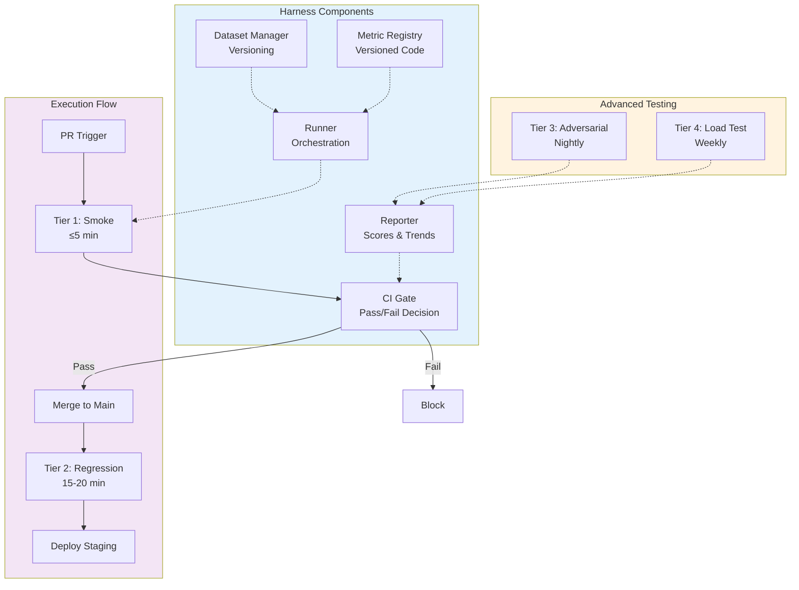

# Part 11 — Evaluation Harnesses & CI/CD for Multimodal AI

A comprehensive engineering reference for building production-grade evaluation harnesses, continuous evaluation pipelines, and CI/CD integration for multimodal AI systems in enterprise deployments.

> **Audience:** AI Platform Engineers, ML Engineers, DevOps/MLOps Engineers, Principal AI Architects
> **Coverage:** Harness Architecture · Evaluation Types · Framework Comparison · CI/CD Pipeline Design · Chaos Testing · Human-in-the-Loop · Production Monitoring
> **As of:** July 2026

## Evaluation Harness Architecture

---

## Engineering an Evaluation Harness

### What Separates an Evaluation Script from a Production Evaluation Harness

An evaluation script is a notebook or Python file that runs metrics against a dataset and prints results. A production evaluation harness is a system. The difference is architectural:

An evaluation script has hardcoded dataset paths, no versioning, manual execution, results stored in a local file, and no integration with deployment gates. A production harness has: a dataset registry with versioned golden datasets; a metric registry where metrics are versioned, tested code artifacts; a run management system that records every evaluation with full provenance (model version, dataset version, metric versions, environment); a reporting layer that generates scorecard artifacts and notifies stakeholders; and CI gate integration that translates evaluation results into deployment allow/block decisions.

The gap matters at scale: a team running weekly manual evaluations catches regressions one week late. A harness running on every PR catches them within 30 minutes, before bad code merges.

### Harness Components

**Runner:** The orchestration engine that executes evaluation runs. Responsibilities: loading the dataset version, invoking the model under test, collecting raw outputs, and dispatching outputs to metric evaluators. Must support: parallel batch inference (fan-out to multiple model calls simultaneously), timeout and retry logic (multimodal inference can be slow and flaky), and deterministic execution mode (fixed seeds, temperature 0).

**Dataset Manager:** Manages versioned golden datasets. Capabilities: dataset versioning (semantic version, git-like immutable snapshots), stratified sampling (pull a stratified N-example subset from the full golden set for fast smoke tests), distribution drift detection (alert when production input distribution diverges from golden set), and dataset provenance (record which human annotators labeled which examples, with inter-annotator agreement scores).

**Metric Registry:** A catalog of versioned metric implementations. Each metric is a versioned code artifact with: a defined input schema (model output format), a defined output schema (score format), unit tests, and a documented calibration record (how well does this metric correlate with human judgment on a reference human evaluation set?). Metrics in the registry are immutable once published — new versions create new metric IDs. This ensures historical comparisons remain valid.

**Reporter:** Generates structured evaluation reports: scorecard JSON (for programmatic consumption by CI gates), human-readable HTML report (for stakeholder review), and trend charts (time-series of metric values across runs). Integrates with Slack, email, and incident management systems for alerting.

**CI Gate:** The integration point with the CI/CD pipeline. Reads the scorecard JSON from the Reporter, applies configured pass/fail thresholds, and returns a binary outcome (pass = unblock merge/deployment; fail = block merge/deployment with alert). Gate configuration must be stored as code (YAML) in the repository, so threshold changes are reviewed and audited.

### Deterministic Execution

Reproducibility is non-negotiable for regression evaluation. Sources of non-determinism in multimodal AI systems:

- Model sampling: temperature > 0 introduces stochastic generation. Set temperature = 0 for all evaluation runs. For models that do not support temperature = 0, fix the random seed at the API level where supported.
- Batch ordering: inference results can vary depending on batching behavior. Fix batch size and ordering.
- Preprocessing variance: image resizing with non-deterministic interpolation kernels (some GPU-accelerated resize operations). Fix interpolation method (Lanczos) and execution environment.
- External service calls: third-party APIs have version drift and availability variations. Mock external services in evaluation runs or use snapshot testing.

**Snapshot testing** records the raw model output for a canonical test input and checks future runs against the snapshot. Any change in the output — even whitespace — triggers a snapshot failure, forcing engineers to consciously update the snapshot when model behavior changes intentionally.

### Replay Testing

Record production inference traces (inputs + outputs) for a rolling 7-day window. Sample 500 traces per day for replay testing: re-run the same inputs through the new model version and compare outputs. Replay testing catches regressions on real production inputs that the golden dataset may not fully represent — particularly important for long-tail inputs (unusual document formats, rare languages, edge case queries) that occur in production but are underrepresented in curated datasets.

---

## Evaluation Types by Concern

### Prompt Regression

Detects performance regressions caused by prompt changes. Even small prompt modifications (adding a sentence, changing formatting instructions) can significantly affect VLM behavior. Run prompt regression on every PR that modifies a prompt file. Dataset: 200-example stratified sample from the golden dataset. Metric: accuracy delta from baseline. Gate: block if accuracy drops >2 percentage points from baseline.

### Image Regression

Tracks degradation in image understanding quality across model updates. Key metrics: scene description accuracy (LLM-judged against reference descriptions), object recognition precision/recall, chart value extraction accuracy (for chart understanding models), and spatial relationship accuracy (correct/incorrect descriptions of object positions). Use a dedicated image regression dataset with 500 images across categories: photographs, diagrams, charts, documents, medical images (if applicable).

### Video Regression

Tracks temporal reasoning and video understanding quality. Metrics: action recognition accuracy at clip level, temporal grounding accuracy (is the described event at the correct timestamp?), and multi-event reasoning accuracy (correct identification of event sequences). Run on a 200-clip subset for PR-level regression; full 1,000-clip set for merge-level.

### Audio Regression

Tracks ASR accuracy and audio understanding quality. Primary metric: Word Error Rate (WER) by language and accent group. Secondary metrics: speaker diarization accuracy (Diarization Error Rate, DER), language identification accuracy, and audio classification accuracy (for non-speech audio). Alert threshold: WER increase >1 percentage point on any single demographic subgroup.

### OCR Regression

Tracks field extraction accuracy by document type. Metrics: character error rate (CER) for free-text fields, exact match rate for structured fields (dates, amounts, identifiers), and field detection recall (fraction of present fields that were extracted). Run per document type — regression on one document type does not always affect others. Gate: block if any document type drops >2 percentage points field extraction accuracy.

### Agent Regression

Tracks task completion rate, tool selection accuracy, and plan quality for agentic multimodal systems. Metrics: task completion rate (fraction of benchmark tasks completed correctly end-to-end), tool selection accuracy (correct tool chosen for each sub-task), average steps to completion (efficiency), and plan quality score (LLM-judged on plan coherence and step validity). Agent regression datasets must be carefully constructed to be deterministic — tasks with stochastic outcomes must be averaged over multiple runs.

### Memory Regression

Tracks long-context retention for multi-turn multimodal conversations. Metrics: reference resolution accuracy (does the model correctly refer to an image or audio clip mentioned N turns ago?), information retention rate (fraction of factual claims about a document from turn 1 still correctly recalled in turn 10+), and context window boundary behavior (does performance degrade predictably at the context limit?).

### Grounding Regression

Tracks spatial accuracy and temporal grounding precision. For VLMs: measures whether the model's spatial references ("the chart in the top-left corner") are accurate. Metric: IoU between model-described region and annotated ground truth region. For video: temporal grounding precision — is the model's claimed event timestamp within ±T seconds of the actual event?

### Hallucination Regression

Tracks the rate of visual and temporal hallucination. Metrics: POPE F1 for object existence hallucination, HallusionBench score for counterfactual hallucination, and a custom production hallucination proxy (sampling consistency: standard deviation of VLM outputs across 5 samples at temperature 0.5 for the same input — higher variance implies more hallucination-prone behavior). Alert threshold: POPE F1 drop >1 point or production proxy variance increase >0.1.

### Safety Regression

Tracks content policy compliance rate and refusal accuracy. Metrics: policy violation rate on an adversarial input set (lower is better), over-refusal rate on a benign edge-case set (lower is better), and safety calibration (does the model refuse dangerous requests while not refusing ambiguous-but-benign requests?). Gate: immediate block if policy violation rate increases on the adversarial set.

### Tool Execution Validation

For agentic systems: validates that tool calls generated by the VLM are syntactically and semantically correct. Metrics: tool argument schema validation pass rate, tool call semantic correctness rate (does the tool call achieve the intended sub-task?), and downstream tool output utilization rate (does the model use tool outputs appropriately?).

### Planning Validation

Validates that the agent's plan for multi-step tasks is coherent and efficient. Metrics: plan validity rate (LLM-judged: is each step logically necessary?), plan efficiency score (steps taken vs optimal steps — analogous to solution-path length in search algorithms), and plan abandonment rate (fraction of plans the agent abandons mid-execution).

### Cost Regression

Tracks per-call token consumption and inference cost. Metrics: average input tokens per call by task type, average output tokens per call, total tokens per task (for agentic multi-step tasks), and inferred cost per call (tokens × per-token price for the model tier). Cost regressions are often caused by prompt changes that increase output verbosity. Gate: warn if average tokens per call increase >10%; block if increase >25%.

### Latency Regression

Tracks P50, P95, and P99 inference latency. For multimodal systems, latency has modality-specific components: image preprocessing, video frame extraction, audio transcription, and model inference. Gate: block if P99 latency exceeds SLA threshold (typically 2× P50 for batch workloads, 1.5× P50 for real-time workloads). Alert if P95 increases >20% from baseline.

### Throughput Testing

Validates that the system maintains target throughput under load. Run weekly. Metrics: requests per second at which latency SLAs are first breached (saturation point), error rate under 2× normal load, and autoscaling responsiveness (time from load spike to scale-out complete). Not suitable for CI gate (too slow) but critical for capacity planning and deployment decisions.

---

## Framework Comparison Matrix

| Framework | Multimodal Support | CI Integration | Dataset Mgmt | Metric Library | LLM-as-Judge | OSS/Commercial | Enterprise Support | Cost |
|-----------|-------------------|---------------|--------------|----------------|-------------|----------------|-------------------|------|
| DeepEval | Good (image, text) | GitHub Actions, native | Basic | Extensive (40+) | Strong | OSS + Commercial | Enterprise tier | Freemium |
| LangSmith | Good (text+image) | GitHub Actions | Moderate | Moderate | Good | Commercial | Enterprise SLA | Per-trace |
| Langfuse | Good (text+image) | GitHub Actions, webhook | Moderate | Moderate | Good | OSS + Commercial | Enterprise tier | Freemium |
| Arize Phoenix | Strong (multimodal) | GitHub Actions | Strong | Strong | Strong | OSS + Commercial | Enterprise SLA | Freemium |
| TruLens | Good (text, limited image) | Custom | Basic | Moderate | Good | OSS | Community | OSS |
| MLflow Evaluate | Moderate (text+image) | GitHub Actions, Jenkins | Strong | Moderate | Moderate | OSS | Databricks enterprise | OSS/Enterprise |
| Promptfoo | Good (text+image) | Native (excellent) | Good | Good | Strong | OSS + Commercial | Enterprise tier | Freemium |
| RAGAS | Good (text, limited image) | Custom | Basic | RAG-focused | Good | OSS | Community | OSS |
| Braintrust | Strong (multimodal) | Native (excellent) | Strong | Strong | Strong | Commercial | Enterprise SLA | Usage-based |
| Galileo | Strong (multimodal) | GitHub Actions | Moderate | Strong | Strong | Commercial | Enterprise SLA | License |
| Weights & Biases | Good (image+audio) | GitHub Actions | Strong | Moderate | Limited | OSS + Commercial | Enterprise SLA | Freemium |
| NVIDIA Eval Tools | Strong (vision+audio) | NIM integration | Moderate | NIM-focused | Limited | Commercial | Enterprise | License |
| OpenAI Evals | Text + image | GitHub Actions | Basic | Moderate | Good (GPT-4o) | OSS | None | OSS |
| Azure AI Eval SDK | Strong (multimodal) | Azure DevOps, GitHub | Good | Good | Strong (GPT-4o) | Commercial | Enterprise SLA | Per-eval |
| Vertex AI Eval | Strong (multimodal) | Cloud Build, GitHub | Moderate | Moderate | Good (Gemini) | Commercial | Enterprise SLA | Per-eval |

*Dataset Mgmt = versioned golden dataset management. LLM-as-Judge = out-of-box judge configuration. Enterprise Support = dedicated SLA and support channels.*

---

**This is Part 1 of 2. [Continue with Part 2 →](pathname:///archon/agentic-systems/multimodal/parts/11-11-part-11-evaluation-harnesses-cicd.md-part2) for CI/CD pipeline design, chaos testing, human-in-the-loop, production monitoring, and interview use cases.**
