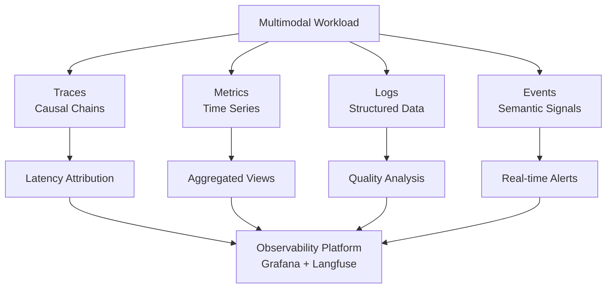

# Part 12 — Observability & FinOps for Multimodal AI

Deep technical reference for instrumenting, monitoring, and cost-managing multimodal AI systems at enterprise scale — covering distributed tracing, platform integrations, GPU cost optimization, and FinOps governance.

> **Audience:** AI Platform Engineers, MLOps Engineers, FinOps Architects, Principal AI Architects
> **Coverage:** OpenTelemetry · Langfuse · Arize Phoenix · GPU FinOps · Cost-Aware Routing · Multimodal Traces
> **As of:** July 2026

---

## Why Standard Observability Is Insufficient for Multimodal AI

Traditional application observability tools — APM platforms, log aggregators, infrastructure dashboards — were designed for request/response workloads where inputs and outputs are structured text and numerical payloads. Multimodal AI systems break every assumption underlying these tools.

A VLM inference call does not behave like an HTTP endpoint. The latency envelope depends on image resolution (a 4K frame takes 40× the preprocessing time of a 480p frame), not just network round-trip time. A single video analysis agent call may internally decompose into dozens of span types: frame extraction, scene change detection, multiple VLM inference calls, OCR on embedded text, embedding generation, and vector retrieval — none of which map cleanly to standard HTTP spans. When something goes wrong, "the inference was slow" tells you nothing; you need to know *which modality* was slow, *at what resolution*, *on which model version*, with *what confidence distribution*.

Standard observability also fails to connect quality signals to infrastructure signals. A degraded OCR confidence score on a corrupted document scan should be visible alongside the CPU time spent on that page — not buried in a separate quality dashboard. Multimodal observability must fuse operational telemetry (latency, errors, throughput) with quality telemetry (accuracy, confidence, hallucination indicators) in a single coherent trace.

The cost dimension adds a third layer. A single video inference pipeline can consume $0.003 per frame at full resolution. At 30 frames per second over a 60-minute video, that is 108,000 frames and $324 per video — before factoring in embedding generation, storage I/O, and post-processing. Without per-call cost attribution wired directly into the trace, engineering teams routinely discover overspend only at the monthly cloud bill, by which time hundreds of thousands of dollars have been consumed.

---

## The Four Pillars for Multimodal

### Traces

Distributed traces capture the causal chain of operations across a multimodal pipeline. Every VLM call, OCR pass, audio segment, embedding generation, and retrieval step must be captured as a child span under a root trace. The trace provides the single source of truth for latency attribution, error propagation, and cost roll-up.

### Metrics

Time-series metrics provide aggregated views that traces alone cannot support at scale. Key metric families for multimodal: inference latency histograms by modality and model, throughput counters (images/sec, audio-hours/hour, pages/sec), error rate by modality type, GPU utilization, and cost accumulator gauges.

### Logs

Structured logs capture per-inference detail at a verbosity level not appropriate for traces: full OCR output, bounding box coordinates, detected language, safety classifier scores. Logs feed downstream quality analysis and compliance audit requirements.

### Events

Events capture discrete semantic occurrences: model version change, safety guardrail triggered, human review escalation, circuit breaker opened, cache hit/miss. Events are attached to the trace and also emitted to an event bus for real-time alerting.



---

## Span Types for Multimodal Pipelines

Each span type carries modality-specific attributes alongside standard OpenTelemetry attributes.

**Image Processing Span**

Covers resize, format conversion, color space normalization, and metadata extraction before VLM inference.

```
span.name: "image.preprocess"
image.width: 3840
image.height: 2160
image.format: "jpeg"
image.size_bytes: 4218880
image.resize_target: "1024x1024"
image.resize_duration_ms: 18
```

**OCR Span**

Covers page segmentation, text detection, and character recognition.

```
span.name: "ocr.extract"
ocr.engine: "azure-document-intelligence"
ocr.page_count: 12
ocr.confidence_mean: 0.94
ocr.confidence_min: 0.71
ocr.language_detected: "en"
ocr.duration_ms: 340
```

**Audio Transcription Span**

Covers VAD, chunk segmentation, ASR inference, and post-processing.

```
span.name: "audio.transcribe"
audio.duration_seconds: 183.4
audio.sample_rate: 16000
audio.language: "en-US"
audio.model: "whisper-large-v3"
audio.wer_estimated: 0.04
audio.speaker_count: 3
audio.transcription_duration_ms: 8200
```

**Embedding Span**

Covers image/audio/document embedding generation.

```
span.name: "embedding.generate"
embedding.model: "text-embedding-3-large"
embedding.modality: "image"
embedding.dimensions: 1536
embedding.input_count: 24
embedding.cache_hit: false
embedding.duration_ms: 210
```

**VLM Inference Span**

Covers prompt construction, tokenization, model inference, and output parsing.

```
span.name: "vlm.infer"
gen_ai.system: "openai"
gen_ai.request.model: "gpt-4o"
gen_ai.usage.input_tokens: 1284
gen_ai.usage.output_tokens: 387
gen_ai.usage.image_tokens: 765
gen_ai.response.finish_reason: "stop"
vlm.image_count: 3
vlm.confidence: 0.89
vlm.duration_ms: 2340
vlm.cost_usd: 0.0087
```

---

## Distributed Tracing for Multimodal Agents

### OpenTelemetry Semantic Conventions for AI

The OpenTelemetry semantic conventions for Generative AI (`gen_ai.*`) provide a vendor-neutral schema for AI observability. Key attributes relevant to multimodal workloads:

| Attribute | Type | Description |
|-----------|------|-------------|
| `gen_ai.system` | string | Provider: `openai`, `anthropic`, `google`, `aws.bedrock` |
| `gen_ai.request.model` | string | Model identifier |
| `gen_ai.usage.input_tokens` | int | Total input tokens including image tokens |
| `gen_ai.usage.output_tokens` | int | Output tokens |
| `gen_ai.response.finish_reason` | string | `stop`, `length`, `content_filter` |
| `gen_ai.operation.name` | string | `chat`, `embeddings`, `image.generate` |

Multimodal-specific extensions (not yet in the official spec — use `extra_attributes` until standardized):

| Attribute | Description |
|-----------|-------------|
| `multimodal.modality_type` | `image`, `video`, `audio`, `document`, `mixed` |
| `multimodal.image_count` | Number of images in prompt |
| `multimodal.image_dimensions` | Comma-separated `WxH` per image |
| `multimodal.video_frame_count` | Frames extracted from video |
| `multimodal.audio_duration_seconds` | Audio segment length |
| `multimodal.ocr_confidence_mean` | Mean OCR confidence across pages |

### Trace Propagation Across Tool Chains

In a multimodal agent, a single user request spawns a tree of downstream calls across tools, models, and services. W3C TraceContext headers (`traceparent`, `tracestate`) must be propagated through every hop:

- From the orchestrator to each tool invocation
- From the tool to any downstream API call (OCR service, ASR service, VLM API)
- From async job dispatchers (Celery, Ray) through to worker processes
- From streaming gRPC calls (Triton) back to the calling agent

For async pipelines where HTTP header propagation is not available, embed the `trace_id` and `span_id` in the job payload as a baggage field and reconstruct the span context on the worker side using `opentelemetry.propagate.extract`.

### Sampling Strategies for High-Volume Multimodal Workloads

Sampling 100% of multimodal traces is prohibitively expensive at scale. A tiered strategy:

**Head-based sampling:** Sample 10% of low-value routine processing (document batches with high confidence, cache hits). Apply via OpenTelemetry SDK sampler configuration.

**Tail-based sampling:** Always retain traces where: total latency > p99 threshold, any span has `error=true`, OCR confidence < 0.8, VLM confidence < 0.7, or cost_usd > $0.05 per request. Implement with OpenTelemetry Collector's tail sampling processor.

**Modality-specific sampling rates:** Video inference (high cost, high value) at 50%, audio transcription at 25%, image classification at 5%.

---

## Observability Platform Integration

### Langfuse

Langfuse provides native support for multimodal traces with image attachment in trace UI, structured cost tracking across model calls, and dataset management for evaluation. The Python SDK supports attaching base64-encoded images directly to span observations, enabling visual inspection of what the model actually saw during each inference step. Cost tracking auto-populates from `gen_ai.usage.*` attributes if the model is in Langfuse's pricing catalog; for custom or self-hosted models, set `unit_price` manually per span.

### Arize Phoenix

Phoenix provides multimodal dataset management, visual embedding exploration (UMAP/t-SNE of image embeddings colored by label or confidence), and drift detection for multimodal features. The `phoenix.trace` decorator integrates with LangChain, LlamaIndex, and custom pipelines. Phoenix's embedding visualization is particularly valuable for detecting distribution shift — when production image embeddings drift from the training distribution, Phoenix surfaces this as a cluster anomaly before quality metrics degrade.

### MLflow

MLflow tracks multimodal experiment runs with artifact logging for images, audio clips, and video samples. Use `mlflow.log_image()` for visual QA examples, `mlflow.log_artifact()` for full inference outputs, and custom metrics for OCR accuracy, ASR WER, and VLM task accuracy. MLflow's model registry provides version control for VLMs including approval workflows for production promotion.

### OpenTelemetry + Grafana

Export spans to Tempo, metrics to Prometheus/Mimir, and logs to Loki. Build Grafana dashboards with:

- Latency heatmaps by span type and modality
- Cost accumulation time series by model and use case
- Error rate panels with drill-through to Tempo traces
- Confidence distribution histograms updated in real time

### Datadog LLM Observability

Datadog's LLM Observability extension (GA 2025) supports multimodal traces via the `ddtrace` LLMObs integration. Image inputs are captured as hashed references (not stored in full) with dimension metadata. Cost tracking uses Datadog's AI model cost catalog. Anomaly detection triggers on sudden cost spikes, latency degradation, or error rate increases.

### Prometheus: Custom Multimodal Metrics

```python
from prometheus_client import Histogram, Counter, Gauge

vlm_inference_duration = Histogram(
    'vlm_inference_duration_seconds',
    'VLM inference latency',
    ['model', 'modality', 'use_case'],
    buckets=[0.1, 0.5, 1.0, 2.0, 5.0, 10.0, 30.0]
)

multimodal_cost_total = Counter(
    'multimodal_cost_usd_total',
    'Cumulative inference cost',
    ['model', 'modality', 'department']
)

ocr_confidence = Histogram(
    'ocr_confidence_score',
    'OCR confidence distribution',
    ['engine', 'document_type'],
    buckets=[0.5, 0.6, 0.7, 0.8, 0.9, 0.95, 0.99]
)
```

### Cloud-Native Multimodal Observability

**AWS CloudWatch:** Use EMF (Embedded Metrics Format) to emit multimodal metrics from Lambda and ECS. CloudWatch Insights queries over structured JSON logs enable per-modality error analysis. X-Ray traces propagate through Bedrock and Textract calls natively.

**Azure Monitor:** Application Insights SDK supports custom dimensions for multimodal attributes. Azure Monitor Workbooks enable combined log/metric dashboards. Azure AI Foundry emits native telemetry to Application Insights when instrumented.

**GCP Cloud Monitoring:** Cloud Trace integrates with Vertex AI inference endpoints. Custom metrics via the Monitoring API support multimodal gauge and histogram types. BigQuery export enables long-term cost analysis and anomaly detection at scale.

---

## Key Metrics for Multimodal Systems

### Performance Metrics

| Metric | Target | Measurement |
|--------|--------|-------------|
| OCR accuracy (character level) | > 98% on clean docs | Character Error Rate on golden set |
| VLM task accuracy (visual QA) | > 85% on domain benchmark | Exact match / ROUGE on eval set |
| ASR Word Error Rate | < 5% on clean audio | WER on labeled audio corpus |
| Object detection mAP | > 0.75 for production | COCO mAP on held-out set |

### Latency Metrics

| Metric | Description |
|--------|-------------|
| TTFF (Time to First Frame Processed) | Latency from video ingestion to first frame analysis complete |
| p50/p95/p99 VLM inference latency | Per-model, per-image-resolution breakdown |
| OCR latency per page | Segmented by document quality tier |
| End-to-end pipeline latency | Root span duration from user request to final output |

### Throughput Metrics

- Images processed per second (by resolution tier)
- Video frames analyzed per second (by model and resolution)
- Audio hours transcribed per wall-clock hour
- Document pages OCR'd per minute

### Quality Metrics

- Confidence score distributions (histogram, not just mean)
- Hallucination rate: percentage of outputs with factual grounding failures detected by LLM-as-judge
- Grounding accuracy: percentage of citations that map to actual document regions

### Reliability Metrics

- Error rate by modality type (image errors vs audio errors vs OCR errors)
- Timeout rates by model and resolution
- Retry rates and retry success rates
- Circuit breaker open percentage over rolling 1-hour window

---

**This is Part 1 of 2. [Continue with Part 2 →](pathname:///archon/agentic-systems/multimodal/parts/12-12-part-12-observability-finops.md-part2.md) for FinOps strategy, cost optimization, and governance.**
