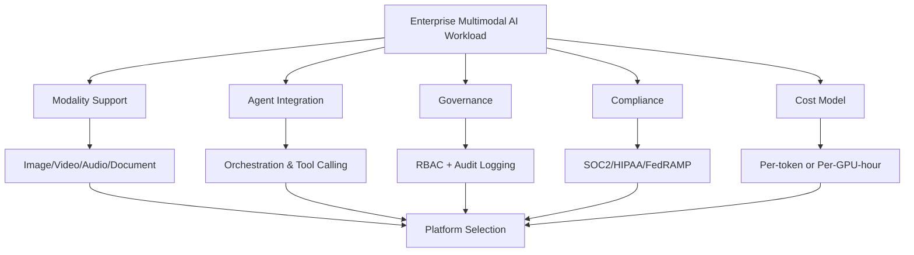

# Part 14 — Cloud Platform Comparison for Multimodal AI

Comprehensive evaluation of enterprise AI platforms for multimodal workloads — covering modality support, agent integration, compliance posture, governance tooling, and cost models across eight major platforms.

> **Audience:** Enterprise Architects, Cloud Solution Architects, AI Platform Engineers, AI Risk & Compliance Officers
> **Coverage:** OpenAI · Azure AI Foundry · AWS Bedrock · Google Vertex AI · Databricks · NVIDIA · Hugging Face · Anthropic
> **As of:** July 2026

---

## Evaluation Framework for Cloud Platforms

Selecting a cloud platform for enterprise multimodal AI is not a benchmark leaderboard exercise. The right platform depends on your existing cloud footprint, compliance requirements, data gravity, team expertise, and operational model. A platform that scores highest on a public benchmark may be completely unacceptable for a HIPAA-regulated healthcare workload running in a specific geography.

### Key Evaluation Dimensions

**Modality Support:** Which modalities are natively supported in the base model vs requiring integration with separate specialized services? A platform that offers vision in the foundation model but requires a separate service for audio adds integration complexity and multi-service compliance burden.

**Agent Integration:** Does the platform provide native agentic orchestration, tool calling, memory, and multi-step planning? Or does it require external frameworks (LangChain, LlamaIndex, custom code)?

**Guardrails:** Are content safety and policy enforcement built into the platform, or must they be implemented externally? Native guardrails are easier to audit and demonstrate to regulators.

**Governance:** What tooling exists for model versioning, policy-as-code, access control, audit logging, and cost attribution? Enterprise platforms must support RBAC, ABAC, and immutable audit logs without significant custom build.

**Cost:** What is the pricing model? Per-token API, per-GPU-hour, flat enterprise license, or reserved capacity? How does cost scale with multimodal inputs (images, audio minutes, video frames)?

**Compliance:** Which certifications and regulatory frameworks does the platform satisfy? SOC2, HIPAA BAA, FedRAMP, ISO 27001, PCI DSS, and regional data residency are the baseline enterprise requirements.

---

## Platform Deep Dives

### OpenAI Platform (API)

OpenAI's API platform is the widest-deployed multimodal foundation for enterprise AI, primarily through GPT-4o, which unifies vision, audio (voice mode), text, and document understanding in a single model endpoint.

**Multimodal Capabilities:** GPT-4o accepts images (JPEG, PNG, WebP, GIF), PDF documents (up to 2,048 pages), and text as inputs with native understanding — no separate preprocessing pipeline required. The Realtime API enables bidirectional audio streaming with sub-300ms round-trip latency, supporting voice-native applications. DALL-E 3 provides image generation. The Batch API processes requests asynchronously at 50% cost reduction versus synchronous inference — essential for cost optimization at scale.

**Assistants API:** Provides file uploads, retrieval, and code execution alongside vision, enabling multi-turn conversations grounded in uploaded documents. Supports up to 128K context.

**Enterprise Compliance:** SOC2 Type II certified. HIPAA BAA is available under the ChatGPT Enterprise agreement. Data is not used for training by default under the API terms.

**Limitations:** No native video understanding — video must be decomposed into frames by the application. No on-premises deployment option. Limited governance tooling — cost attribution and access control require custom build or third-party tools. No FedRAMP authorization.

---

### Azure AI Foundry / Azure OpenAI

Azure AI Foundry (formerly Azure AI Studio) is Microsoft's enterprise AI platform, integrating Azure OpenAI Service with Azure AI Vision, Azure Document Intelligence, Azure AI Speech, and Azure AI Content Safety into a unified development and deployment environment.

**Multimodal Capabilities:** GPT-4o deployments are available in Azure OpenAI with the same capabilities as the OpenAI API but running in Azure's global infrastructure with private network options. Azure AI Vision provides image analysis, OCR (Read API), spatial analysis, and custom vision models. Azure Document Intelligence (formerly Form Recognizer) delivers production-grade document extraction with layout analysis, form recognition, and custom model training. Azure AI Speech provides ASR, TTS, speaker recognition, and real-time transcription with 100+ language support.

**Agent Integration:** Azure AI Agent Service provides production-ready agentic orchestration with tool calling, memory, file retrieval, and built-in observability. Prompt Flow enables low-code multimodal pipeline orchestration with visual DAG authoring and built-in evaluation runs.

**Guardrails:** Azure AI Content Safety provides multimodal content filtering (text and image), hate/violence/sexual/self-harm detection, and Groundedness Detection for RAG outputs. Configurable severity thresholds per use case.

**Governance:** Azure Policy enforces organizational standards (e.g., models can only deploy in approved regions). RBAC via Azure Active Directory with fine-grained control over model access, fine-tuning, and deployment. Microsoft Purview integration enables data governance for AI — tracking which sensitive data is used in which AI pipelines. Cost attribution via Azure Cost Management with tag-based allocation.

**Compliance:** HIPAA BAA, FedRAMP High (Government cloud), SOC2 Type II, ISO 27001, PCI DSS, CSA Star. EU data residency available via EU data boundary. Private endpoints and VNet integration for data isolation. Suitable for most regulated industries.

---

### AWS Bedrock

AWS Bedrock is Amazon's managed foundation model service, providing access to a curated model catalog alongside Amazon's own multimodal models, with native integration into the broader AWS ecosystem including Textract, Rekognition, and Transcribe.

**Multimodal Capabilities:** Claude 3.5/3.7 Sonnet (vision + long document), Amazon Nova (multimodal: image, video, document), Stability AI (image generation) all available through a unified Bedrock API. Amazon Titan Multimodal Embeddings generates embeddings from images and text for multimodal RAG. Amazon Textract provides enterprise-grade document extraction with table, form, and signature detection. Amazon Rekognition handles object detection, facial analysis, content moderation, celebrity recognition, and custom label training. Amazon Transcribe provides ASR with speaker diarization, custom vocabulary, and real-time streaming support.

**Agent Integration:** Amazon Bedrock AgentCore is the production agent runtime — handles agent lifecycle, tool orchestration, memory, session management, and observability. Knowledge Bases for Amazon Bedrock provides managed multimodal RAG with automatic embedding, vector storage (Aurora PostgreSQL pgvector, OpenSearch, Pinecone), and hybrid retrieval.

**Guardrails:** Bedrock Guardrails provides configurable content filtering for text and image inputs/outputs, topic denial (blocking off-topic queries), PII detection and redaction, and grounding checks. Guardrails apply at the API layer before model inference — they cannot be bypassed by prompt engineering.

**Governance:** AWS Organizations and Service Control Policies (SCPs) enforce organizational guardrails across all accounts. IAM with resource-based policies controls model access at the identity level. AWS CloudTrail logs all Bedrock API calls for audit. Cost attribution via AWS Cost Explorer with tag-based allocation per team/use case/customer.

**Compliance:** HIPAA BAA, FedRAMP Moderate (GovCloud High in progress), SOC2 Type II, PCI DSS, ISO 27001, CSA Star. Data processed in Bedrock is not used for model training. GovCloud regions for US government workloads with stricter isolation.

---

### Google Vertex AI

Google Vertex AI is the enterprise ML platform from Google Cloud, anchored by the Gemini model family — the only natively omni-modal models available on a major cloud platform as of July 2026.

**Multimodal Capabilities:** Gemini 1.5 Pro supports up to 1M token context with native understanding of text, images, audio, video (up to 1 hour), and documents in a single model call — no frame extraction pipeline required for video analysis. Gemini 2.0 Flash adds native audio output and image generation alongside input understanding. Vertex AI Vision provides custom image classification and object detection with AutoML. Video Intelligence API delivers shot detection, label detection, transcription, and content moderation for video at scale. Speech-to-Text provides ASR with 125+ language support, speaker diarization, and streaming transcription. Document AI provides specialized processors for lending documents, identity documents, expense reports, and contracts with pre-trained extraction models.

**Agent Integration:** Vertex AI Agent Builder provides managed agent development with Gemini as the reasoning engine, tool calling, grounding with Google Search, and enterprise data connectors. Model Garden provides 100+ open and proprietary models for fine-tuning and deployment.

**Governance:** Vertex AI Model Registry with approval workflows for model promotion. Vertex AI Evaluation provides automated evaluation of multimodal model outputs. VPC Service Controls create a security perimeter around Vertex AI resources, preventing data exfiltration. RBAC via Google Cloud IAM. Organization Policy Service for centralized constraint enforcement.

**Compliance:** HIPAA BAA, FedRAMP Moderate, SOC2 Type II, ISO 27001, PCI DSS. Data residency enforced at region level. EU Sovereign Cloud option for European regulated workloads.

---

### Databricks Mosaic AI

Databricks Mosaic AI integrates foundation model APIs with the Databricks Lakehouse platform — the strongest platform for organizations whose primary data infrastructure is already Databricks and who want AI tightly coupled with their data engineering and governance layer.

**Multimodal Capabilities:** Foundation Model APIs provide access to Claude, Llama, DBRX, and custom VLMs through a unified endpoint with Databricks authentication and billing. MLflow 3 tracks multimodal experiments with image, audio, and video artifact logging. Vector Search provides managed vector indexing for multimodal RAG with integrated embedding generation.

**Agent Integration:** Databricks Agent Framework enables building agents that natively access Delta Lake tables, Unity Catalog-governed datasets, and MLflow-tracked models. Mosaic AI Agent Evaluation provides automated agent quality measurement including retrieval quality and response quality scoring.

**Governance:** Unity Catalog is the central governance layer — governing not just structured data tables but also model artifacts, feature tables, vector stores, and multimodal datasets. Fine-grained access control (row-level, column-level) on multimodal training data. AI Lineage tracks which datasets fed which model versions. Delta Lake provides ACID transactions on multimodal metadata tables.

**Compliance:** SOC2 Type II, ISO 27001, HIPAA BAA (Business Associate Agreement available). FedRAMP authorization in progress. Inherits cloud provider compliance (AWS, Azure, GCP) depending on deployment.

---

### NVIDIA AI Enterprise

NVIDIA AI Enterprise is the enterprise software platform for deploying AI on NVIDIA GPUs — available on-premises, in cloud provider instances, and through NVIDIA DGX Cloud. The defining advantage is full control over infrastructure and the ability to deploy in air-gapped environments.

**Multimodal Capabilities:** NIM (NVIDIA Inference Microservices) provide containerized, optimized inference for VLMs: NVCLIP (image embeddings), NEVA (vision-language), Kosmos (multimodal understanding), Whisper (ASR), Parakeet (ASR), and many open-source models including LLaVA variants and Qwen2-VL. Each NIM container is pre-optimized with TensorRT for the target GPU, providing 2–5× throughput improvement over vanilla PyTorch inference.

**Agent Integration:** NVIDIA Agent Intelligence toolkit provides primitives for building retrieval-augmented multimodal agents. Integration with LangChain, LlamaIndex, and custom frameworks through standard API endpoints.

**Guardrails:** NeMo Guardrails provides programmable safety for multimodal AI — defining allowed topics, response formats, and moderation actions through a declarative colang configuration. Supports integration with external content classifiers.

**Deployment:** Triton Inference Server is the production serving framework — supports ONNX, TensorRT, PyTorch, and custom backends; handles dynamic batching, concurrent model execution, and model versioning. Fully operational in air-gapped environments with no external network dependencies.

**Compliance:** On-premises deployment enables organizations to maintain their own compliance perimeter. No data leaves the organization's infrastructure. Suitable for defense, intelligence, and highly regulated healthcare.

---

### Hugging Face

Hugging Face Hub is the primary open-source model registry, hosting 10,000+ multimodal models including LLaVA, InternVL, Qwen2-VL, CogVLM, Whisper, and Stable Diffusion variants. For enterprises needing flexibility, cost control, and self-hosting, Hugging Face is the starting point.

**Multimodal Capabilities:** The Transformers library provides a unified API across all multimodal model architectures — the same `pipeline("image-to-text")` call works across dozens of VLMs. Inference Endpoints provides managed, dedicated endpoints for VLMs, Whisper, and document models — deployed in the cloud or on NVIDIA hardware, with SLA commitments. Spaces provides rapid prototyping environments.

**Governance:** Enterprise Hub provides private model repositories with RBAC, SSO (SAML, OIDC), and audit logs. Model Cards enforce documentation standards. Dataset access controls prevent unauthorized data access.

**Compliance:** Enterprise Hub has SOC2 Type II and GDPR compliance. Self-hosted inference (Inference Endpoints with dedicated hardware) keeps data within the organization's cloud account. No HIPAA BAA — for HIPAA workloads, deploy Inference Endpoints in a HIPAA-compliant cloud environment.

---

### Anthropic Claude (API)

Anthropic's Claude models are the strongest performers for long-context document understanding and nuanced reasoning over complex multimodal inputs, making them particularly suited for legal, compliance, and knowledge-intensive enterprise workflows.

**Multimodal Capabilities:** Claude 3.5/3.7 Sonnet accepts images (JPEG, PNG, GIF, WebP) and PDFs natively, with 200K token context window enabling analysis of book-length documents or large image collections in a single call. Computer Use capability enables Claude to interact with GUI applications by interpreting screenshots and generating keyboard/mouse actions — enabling a new class of workflow automation agents. Claude processes documents with layout understanding superior to most VLMs for complex mixed text-and-image layouts.

**Agent Integration:** The Anthropic Messages API supports tool use with parallel tool calling, enabling multi-tool agentic workflows. Integrates natively with LangChain, LlamaIndex, and Databricks Agent Framework. Amazon Bedrock and Google Vertex AI Model Garden both host Claude models, enabling integration within those platforms' governance and compliance tooling.

**Compliance:** SOC2 Type II certified. HIPAA BAA under development (check current status). No native video understanding. No FedRAMP authorization. Primarily API-only — no on-premises or VNet private deployment as of July 2026.

---

## Master Platform Comparison Matrix

| Capability | OpenAI | Azure AI Foundry | AWS Bedrock | Google Vertex AI | Databricks | NVIDIA AI Enterprise | Hugging Face | Anthropic |
|------------|--------|-----------------|-------------|-----------------|------------|---------------------|--------------|-----------|
| **Image** | Native | Native | Native | Native | Via FMAs | NIM VLMs | 10,000+ models | Native |
| **Video** | Frame only | Frame only | Amazon Nova | Native (1hr+) | Via FMAs | Via NIMs | Many models | No |
| **Audio** | Realtime API | Azure Speech | Transcribe | Native | Via FMAs | Whisper NIM | Whisper | No |
| **Document** | PDF native | Doc Intelligence | Textract | Document AI | Delta Lake | Via NIMs | Many models | PDF native |
| **Native Agents** | Assistants API | Agent Service | AgentCore | Agent Builder | Agent Framework | Partial | No | Tool use only |
| **Guardrails** | Moderation API | AI Content Safety | Bedrock Guardrails | Safety filters | NeMo (via NVIDIA) | NeMo Guardrails | Limited | Constitutional AI |
| **Managed RAG** | File Search | AI Search | Knowledge Bases | RAG on Vertex | Vector Search | No | No | No |
| **Evaluation SDK** | Evals API | AI Evaluation SDK | Bedrock Evaluation | Vertex Eval | Mosaic AI Eval | No | Evaluate library | No |
| **Fine-tuning** | Yes | Yes | Limited | Yes | Yes (custom) | Yes | Yes | Limited |
| **HIPAA** | BAA available | BAA available | BAA available | BAA available | BAA available | Self-managed | No | In development |
| **FedRAMP** | No | High (Gov) | Moderate (GovCloud) | Moderate | No | Self-managed | No | No |
| **VNet/Private** | No | Yes | VPC endpoints | VPC SC | Yes | Yes | Dedicated endpoints | No |
| **On-Premises** | No | No | No | No | No | Yes (DGX) | Self-hosted | No |
| **Cost Model** | Per token/image | Per token/image | Per token/image | Per token/image | Per token + DBU | Per GPU-hour | Per GPU-hour | Per token/image |
| **Terraform** | Unofficial | Yes (azurerm) | Yes (aws) | Yes (google) | Yes | Yes | Limited | Unofficial |

*Legend: "Via FMAs" = via Foundation Model APIs. "Native" = first-class model capability. As of July 2026 — verify current status.*

---

**This is Part 1 of 2. [Continue with Part 2 →](pathname:///archon/agentic-systems/multimodal/parts/14-part-14-cloud-platform-comparison-part2.md) for decision trees, multi-cloud architecture, and interview use cases.**
