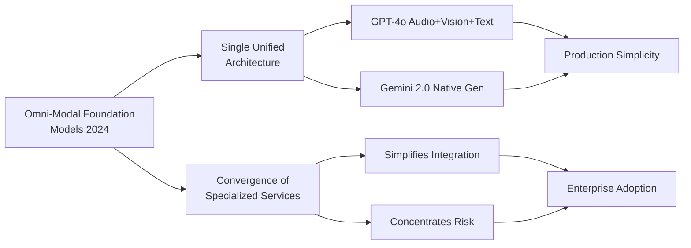

# Part 15 — Emerging Trends & Bibliography for Multimodal AI

Forward-looking analysis of the next wave of multimodal AI — omni-modal foundation models, real-time agents, embodied AI, privacy-preserving learning, and synthetic media governance — with a curated bibliography of foundational papers, standards, and open-source resources.

> **Audience:** AI Researchers, Principal AI Architects, Enterprise AI Strategy Leaders, AI Risk Officers
> **Coverage:** Omni-Modal Models · VLA Models · World Models · Edge AI · Federated Learning · C2PA · Research Bibliography
> **As of:** July 2026

---

## Omni-Modal Foundation Models

### GPT-4o: The First Widely Deployed Omni-Modal

GPT-4o (May 2024) marked the first deployment of a truly unified omni-modal model at enterprise scale — a single model architecture that processes and generates across text, images, and audio without routing between specialized modules. Earlier multimodal systems (GPT-4V, Claude 3 Opus with vision) were fundamentally text models with vision adapters bolted on; GPT-4o was trained end-to-end on all modalities simultaneously, enabling richer cross-modal reasoning. The consequence for enterprise architects is significant: a single API endpoint, a single pricing model, and a single point of governance versus the multi-service complexity of the previous generation.

The Realtime API (October 2024) extended GPT-4o to bidirectional audio streaming with sub-300ms voice latency — enabling voice-native applications that previously required separate ASR, LLM, and TTS components, each with its own failure mode and latency contribution.

### Gemini 2.0 Flash: Native Multimodal Generation

Gemini 2.0 Flash (December 2024) added native audio output and integrated image generation to Gemini's already strong video and audio input capabilities. A single model call can now accept a video with narration and return a text summary, an updated image, and a spoken response — all modalities unified. The 1M token context window (extended to 2M for certain configurations) enables temporal reasoning over hour-long videos in a way that frame-sampling-based approaches fundamentally cannot replicate.

### The Convergence Thesis

The architectural direction is clear: specialized modality models (a vision encoder, an ASR model, a TTS system) are being absorbed into unified foundation models. The convergence thesis holds that by 2027–2028, enterprise AI platforms will primarily expose two or three omni-modal models rather than ten or more specialized services. This simplifies integration significantly but concentrates capability risk — an outage or quality regression in the omni-modal model affects all modalities simultaneously.

### Challenges: Catastrophic Forgetting and Compute Requirements

Training omni-modal models at scale requires solving modality interference: adding audio training data can degrade vision quality, and adding synthetic image training can degrade text reasoning. Techniques being deployed include modality-specific learning rate schedules, mixture-of-experts routing that activates modality-specific parameter sets, and continual pretraining with careful data mixing ratios. The compute cost of training omni-modal models is 5–10× that of equivalent unimodal models — concentrating frontier model development at a handful of organizations with the necessary compute infrastructure.

---

## Real-Time Multimodal Agents

### OpenAI Realtime API

The Realtime API enables WebSocket-based bidirectional streaming — the application streams audio input, the model streams audio output, with sub-300ms end-to-end latency. Function calling works within the audio stream, enabling agents that listen to a conversation, perform tool calls (database lookup, calculation, calendar access) during a brief pause, and respond verbally with the result. This architecture replaces the ASR → LLM → TTS pipeline with a single endpoint, eliminating compound latency and error accumulation.

### Gemini Live

Google's Gemini Live (available in Gemini 2.0) provides real-time multimodal conversation with both audio and visual streaming — the agent can simultaneously see through a camera feed and listen to audio input, responding in real time. This enables use cases such as live equipment inspection guidance, real-time accessibility assistance, and live language interpretation with visual context.

### WebRTC-Based Multimodal Agents

For enterprise deployments requiring fine-grained latency control and on-premises deployment, WebRTC provides the transport layer for real-time multimodal agent communication. Audio is streamed as WebRTC audio tracks; video frames are transmitted as WebRTC video. The inference service (Triton + streaming VLM) connects as a WebRTC peer. Latency budgets for real-time multimodal agents: < 150ms ASR (speech to text), < 100ms LLM first token, < 50ms TTS (text to audio). Total end-to-end target: < 300ms — the threshold below which humans perceive a response as natural.

### Applications

Real-time multimodal agents are enabling: AI-powered customer service representatives that see and hear the customer; live meeting intelligence assistants that watch a presentation and answer questions in real time; real-time visual inspection for manufacturing quality control with voice feedback to operators; and live accessibility tools that describe visual content for visually impaired users.

---

## Computer-Use and GUI Agents

### Claude Computer Use

Anthropic's Computer Use capability (October 2024) enables Claude to interpret screenshots of arbitrary GUI applications and generate keyboard and mouse actions to interact with them. Unlike API-based automation (RPA), computer use requires no structured API — the agent interacts with the GUI as a human would. This enables automation of legacy enterprise systems with no API, software testing workflows, and multi-application data extraction.

### Operator (OpenAI)

OpenAI's Operator (early 2025) provides a web-based computer use agent capable of navigating websites, filling forms, and completing multi-step web workflows autonomously. Enterprise applications include web-based procurement workflows, online form completion, and web data collection.

### Security Challenges

Computer use agents introduce a new attack surface: malicious content on a screen can inject instructions into the agent's action stream (visual prompt injection). A document displayed on screen might contain invisible or camouflaged text instructing the agent to take unauthorized actions. Mitigations: constrain computer use agents to a sandboxed virtual environment; implement action authorization (require human approval before high-consequence actions like form submission or file deletion); monitor for unusual action sequences that deviate from the expected task pattern.

---

## Vision-Language-Action (VLA) Models

### RT-2 (Google DeepMind)

RT-2 (Robotic Transformer 2, 2023) demonstrated that a VLM pre-trained on internet-scale vision and language data could be fine-tuned to output robot action sequences — a direct bridge from multimodal understanding to physical action. RT-2 showed that language reasoning (chain-of-thought) transferred to robot manipulation tasks, enabling the robot to interpret novel instructions without task-specific training.

### π0 (Physical Intelligence)

Physical Intelligence's π0 (pi-zero, 2024) extended the VLA paradigm to diverse manipulation tasks using a flow-matching action head trained on cross-embodiment data — the same model controlling different robot hardware configurations. π0 demonstrated generalist robot capabilities (folding laundry, bussing tables, packing boxes) from a single foundation model, pointing toward a future where specialized robot programming is replaced by foundation model fine-tuning.

### OpenVLA

OpenVLA is the open-source VLA trained on the Open X-Embodiment dataset (1M+ robot demonstrations from 22 different robots). Fine-tunable on consumer hardware (QLoRA on a single A100), OpenVLA enables robotics researchers and enterprise teams to adapt a VLA to their specific robot hardware without the resources of a frontier lab.

### Enterprise Applications

VLA models are entering manufacturing (quality inspection with corrective action), surgical robotics (instrument guidance), warehouse automation (pick-and-place with natural language task specification), and agricultural robotics (crop inspection and selective harvesting). The key enterprise adoption barrier is safety certification — deploying an LLM-derived model in a physical environment requires validation frameworks that robotics regulators (ISO 10218, ISO/TS 15066) have not yet fully adapted to.

---

## World Models and Digital Twins

### Genie 2 (Google DeepMind)

Genie 2 (November 2024) is an interactive world model that generates a persistent, interactive 3D environment from a single image, where the user or an agent can take actions and observe consequences. Unlike video generation models that produce passive output, Genie 2 maintains a latent world state that responds to control inputs — enabling planning and simulation for embodied agents.

### Industrial Digital Twins with Multimodal Perception

Enterprise digital twins are evolving from CAD-model-based static representations to multimodal perception-driven dynamic models — continuously updated from camera feeds, LiDAR scans, IoT sensor streams, and maintenance records. A multimodal AI layer ingests these streams, detects anomalies, and updates the digital twin state in near-real-time. Siemens, GE Digital, and Bentley Systems are deploying this architecture in manufacturing and infrastructure management.

### Smart City Multimodal Digital Twins

Municipal digital twins aggregate camera feeds (traffic, pedestrian, parking), audio sensors (noise monitoring), environmental sensors, and real-time event data (emergency calls, transit GPS). Multimodal AI layers — VLMs for camera feeds, ASR for audio monitoring, anomaly detection for sensor streams — feed a city-wide situational awareness platform. Privacy implications require on-device processing for personally identifiable visual data before it reaches cloud aggregation.

---

## Embodied AI

### Foundation Models for Robotics

Figure AI, Boston Dynamics (Spot and Atlas with foundation model control), and 1X Technologies are deploying foundation models as robot controllers — replacing traditional hand-coded behavior trees with multimodal reasoning. Figure's humanoid robot (Figure 02) demonstrated natural language task specification and execution using an OpenAI foundation model fine-tuned on robot demonstrations.

### Multimodal Perception for Embodied Agents

Embodied AI requires perception across modalities unavailable to cloud AI systems: proprioception (joint positions, forces), touch (contact sensing, texture), depth perception (stereo cameras, LiDAR, structured light), and spatial audio (sound localization). Integrating these additional modalities with language and vision requires foundation models trained on embodied data — which remains scarce compared to internet-scale vision-language corpora.

### Sim-to-Real Transfer

Training in simulation is essential for robotic learning — physical hardware provides insufficient data volume at insufficient speed. Sim-to-real transfer (applying models trained in simulation to real hardware) using multimodal foundation models is improving rapidly: photorealistic simulation environments (NVIDIA Isaac Sim, Matterport) reduce the visual domain gap, and domain randomization techniques help bridge the remaining gap.

---

## Privacy-Preserving Multimodal AI

### Federated Learning for Multimodal Models

Federated learning for multimodal models faces challenges that don't arise in text-only federated learning: model communication overhead is prohibitively high for large VLMs (transmitting 70B parameter gradients is impractical), image data is inherently high-entropy making gradient inversion attacks more effective, and heterogeneous data quality across federation participants degrades aggregation.

Practical approaches: federate only the adapter layers (LoRA) rather than full model weights — reducing communication by 1000×; use secure aggregation protocols (SecAgg+) that prevent the server from observing individual participant contributions; and apply differential privacy noise calibrated per modality (images require more noise than text for equivalent privacy guarantees).

### Confidential Computing for Multimodal Inference

Intel TDX (Trust Domain Extensions) and AMD SEV-SNP provide hardware-enforced confidential virtual machines where the hypervisor and cloud provider cannot access the workload's memory. For multimodal AI, this means sensitive documents and images processed inside a confidential VM are not visible to the cloud provider — enabling compliant processing of PHI and legal documents on public cloud infrastructure. NVIDIA Confidential Computing on H100 GPUs extends this to the GPU — the GPU memory is encrypted and the cloud provider cannot observe inference inputs or outputs.

### Homomorphic Encryption for Embeddings

Fully homomorphic encryption (FHE) enables computation on encrypted data — theoretically enabling similarity search on encrypted embeddings without decrypting them. Current FHE performance is 10,000–100,000× slower than plaintext computation, making it impractical for real-time inference. Research from Microsoft SEAL and Zama TFHE shows promising acceleration with dedicated hardware; enterprise deployment may become feasible for batch embedding search by 2028.

### Differential Privacy for Multimodal Training

DP-SGD applies calibrated Gaussian noise to gradients during training, providing mathematical guarantees that training data cannot be reconstructed from model parameters. For multimodal models, the privacy-utility trade-off is more severe than for text-only models: images contain more entropy than text tokens, requiring more noise for equivalent privacy, which degrades accuracy more rapidly. Current state of the art achieves acceptable utility at ε ≈ 8 for classification tasks; generative tasks remain impractical with strong DP guarantees.

---

## Edge Multimodal AI

### On-Device VLMs

Apple Intelligence (iOS 18, macOS 15) deploys a sub-3B parameter VLM on-device, capable of image understanding, document analysis, and visual context in Siri interactions — without sending images to Apple servers. Samsung Gauss (on Galaxy S24+) provides on-device image generation and understanding. On-device Whisper (via Apple's Core ML export) runs real-time transcription entirely locally on the Neural Engine.

### Hardware Accelerators

| Accelerator | Platform | Key Capability |
|------------|---------|---------------|
| Apple M-series Neural Engine | Mac, iPhone, iPad | 38 TOPS (M4), optimized for Core ML |
| Qualcomm AI Hub | Android mobile, automotive | 75 TOPS (Snapdragon 8 Elite), Stable Diffusion < 1s |
| NVIDIA Jetson Orin NX | Edge/embedded | 100 TOPS, full CUDA support, JetPack SDK |
| Google Tensor G4 | Pixel phones | On-device Gemini Nano, privacy-preserving |

### Quantization Strategies for Edge

INT4 quantization (4-bit weights) reduces a 7B VLM from ~14GB to ~4GB, enabling deployment on devices with 6–8GB RAM. AWQ (Activation-aware Weight Quantization) minimizes accuracy loss at INT4 by protecting salient weights from aggressive quantization — achieving < 2% accuracy degradation on most benchmarks versus FP16. GPTQ provides similar accuracy with faster quantization speed, suitable for rapid model updates on edge devices.

### Split Inference

For tasks where full on-device inference is infeasible (large VLMs), split inference distributes computation: the vision encoder (ViT) runs on-device (< 500MB model, < 200ms latency), producing image embeddings; the embeddings are sent to the cloud for language model reasoning. This protects raw image privacy while enabling high-quality responses. The network payload is 1024×4 bytes (one embedding vector) rather than megabytes of image data.

---

## Content Provenance and Synthetic Media Detection

### C2PA Adoption Timeline

The Coalition for Content Provenance and Authenticity (C2PA) specification provides a technical standard for signing and verifying the provenance of digital media. C2PA v2.1 (2024) added support for AI-generated content disclosure and soft binding (provenance that survives format conversion).

Major platform support status:

- **Adobe:** C2PA Content Credentials embedded by default in Photoshop, Firefly, and Premiere Pro (2024)
- **Microsoft:** C2PA signing in Copilot Designer and Azure AI Image Generation (2024)
- **Google:** C2PA reading support in Search; generation signing in roadmap (2025)
- **Meta:** C2PA reading in Instagram and Facebook; generation signing under development (2025)
- **Sony, Nikon, Canon:** C2PA camera signing in professional camera firmware (2024–2025)

### Technical Implementation

A C2PA manifest is a JSON-LD document attached to media (in the XMP metadata or as a sidecar file) that contains: the content hash at time of signing, the signing identity (certificate chain), a list of actions performed (AI generated, edited, captured), and optionally a thumbnail of the content at each action point. The manifest is signed with an X.509 certificate issued by a C2PA-accredited Certificate Authority. Validators check the certificate chain, verify the content hash matches, and surface the provenance history to the end user.

### AI Watermarking

**Google SynthID:** Embeds an imperceptible watermark in generated images, audio, and text during the generation process. The watermark survives JPEG compression, cropping, and color adjustment. Detected by a companion classifier model with > 95% detection rate on unmodified images. Adversarially robust to many image transformations.

**Meta Invisible Watermarks:** Similar approach with cross-modal support (image, audio, video). Meta's detector API is publicly accessible for verifying Meta-watermarked content.

### Detection State of the Art

Deepfake face detection achieves > 95% accuracy on single-model, single-generation-method content under controlled conditions. However, cross-model generalization (detecting content from a model not seen during training) degrades to 60–75% accuracy. Adversarial robustness is poor — simple image transformations (JPEG recompression, slight Gaussian blur) can reduce detection accuracy below 70%. The practical conclusion: watermarking (provenance at generation time) is more reliable than forensic detection for enterprise content authenticity workflows.

### Regulatory Requirements

The EU AI Act (2024) Article 50 requires that providers of AI systems that generate synthetic audio, image, video, or text content that is not obviously artificial must ensure that the outputs are labeled in a machine-readable format as AI-generated. The Recitals indicate this obligation takes effect 12 months after entry into force (August 2025). This creates a direct compliance driver for C2PA adoption by EU-regulated AI deployments.

---

**This is Part 1 of 2. [Continue with Part 2 →](pathname:///archon/agentic-systems/multimodal/parts/15-15-part-15-emerging-trends-bibliography.md-part2.md) for research gaps, timeline, and comprehensive bibliography.**
