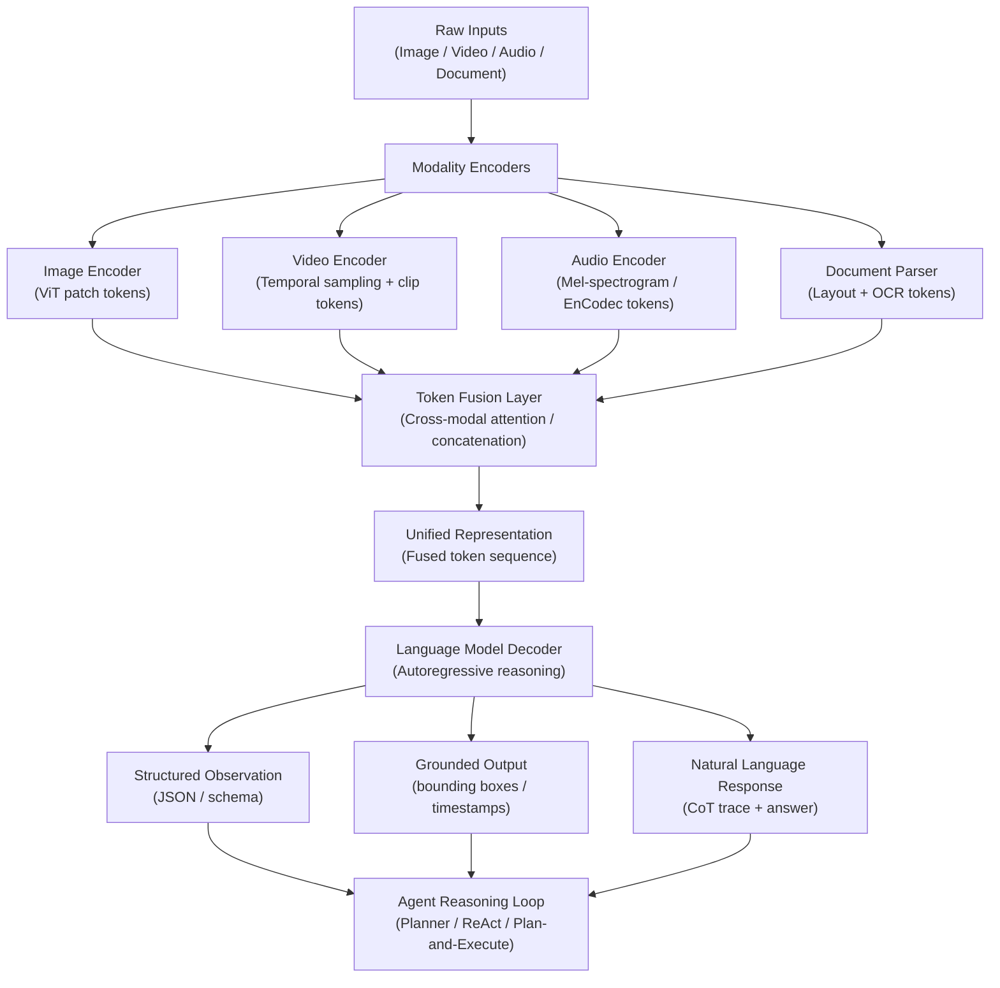

# Part 1 — Foundations of Multimodal AI (Part 2)

---

## 6. Agentic Perception and Reasoning

### Multimodal Inputs in Agent Reasoning Loops

In an agentic context, multimodal inputs are not endpoints — they are inputs to a perception layer that must produce structured observations the agent's reasoning loop can act upon. A raw image is not directly useful to a ReAct-style planner; a structured observation like `{"detected_objects": ["invoice", "signature", "table"], "ocr_text": "...", "table_data": [...]}` is.

This creates a two-stage perception pipeline: (1) a VLM inference call that converts raw visual input to a rich structured observation, and (2) an observation schema that the reasoning layer expects. The schema acts as a contract between perception and reasoning — changes to it require coordinated updates on both sides.

### Grounding: Spatial, Temporal, and Cross-Modal

*Spatial grounding* links a natural language reference ("the red clause in section 4") to a specific region in an image or document page. This is essential for document agents that must cite the exact location of extracted information. Grounding DINO and Florence-2 provide zero-shot spatial grounding; fine-tuned VLMs can do this with bounding box prediction heads.

*Temporal grounding* links a reference ("the moment the machine arm overextends") to a specific timestamp in a video. This requires the model to align its understanding of the language description with its temporal encoding of the video. Models like TimeChat and Gemini 1.5 Pro support temporal localization queries.

*Cross-modal grounding* links references across modalities — "the item mentioned in the audio at 2:34 that also appears in the accompanying invoice image." This is the hardest grounding problem and remains largely in the research domain as of mid-2026, though Gemini 2.0's unified audio-video-text processing begins to address it.

### Multimodal Chain-of-Thought

Multimodal chain-of-thought (CoT) extends text CoT prompting to include visual reasoning steps: "First, I observe that the image shows [X]. The relevant region in the upper-left quadrant indicates [Y]. Cross-referencing the text description, I conclude [Z]." Eliciting this behavior requires careful prompt engineering — models prompted only for a final answer tend to skip visual reasoning steps. Enterprise agents benefit from requiring explicit visual reasoning traces for audit purposes, as these traces double as explainability artifacts.

### Multimodal Architecture Diagram

---

## Interview Use Cases

### Q1: How would you explain the difference between a native multimodal model and a composed pipeline to a CTO?

A composed pipeline strings together specialist models: a PDF parser extracts text, an OCR model reads printed text from images, an ASR model transcribes audio, and a language model reasons over the combined text output. Each handoff is a lossy transformation — the PDF parser may drop table structure, the OCR model may misread low-resolution text, the ASR model may mishear domain-specific terminology. Errors compound, and the pipeline has no mechanism for the reasoning layer to ask the perception layer for clarification.

A native multimodal model ingests raw signals — the PDF, the image, the audio waveform — and performs joint reasoning over all modalities simultaneously in a single forward pass. There are no intermediate text representations for errors to accumulate in. The model can attend to the image while generating a text response, catching inconsistencies between what the document says and what the image shows. The tradeoff is cost (native multimodal inference is more expensive per call) and latency (larger models, longer context). For a CTO, the key message is: native multimodal is architecturally simpler, more accurate for cross-modal reasoning tasks, and more auditable because the reasoning trace is unified — but it costs more and requires more sophisticated evaluation.

### Q2: What are the grounding challenges when an agent needs to reason about a 2-hour video?

A 2-hour video at 24 fps contains 172,800 frames. Even at aggressive sampling (1 frame per second), that is 7,200 frames × ~196 tokens/frame = approximately 1.4 million visual tokens, exceeding even Gemini 1.5 Pro's 2M context limit when combined with text. The practical challenges are: (1) *Temporal localization*: finding the relevant segments in a 2-hour video requires either uniform sampling (which may miss brief but critical events) or a retrieval step that first identifies relevant time windows using lightweight scene-change or motion detection. (2) *Temporal drift*: models lose coherent reasoning over very long sequences; a reference to "the earlier action" 90 minutes into a video may fail to correctly resolve if the relevant frame was compressed out of context. (3) *Cross-segment reasoning*: a question like "did the machine state at 0:45 cause the failure at 1:52:10?" requires correlating widely separated segments. Current architectural mitigations include hierarchical encoding (encode each 5-minute clip to a summary embedding, then reason over summaries), temporal memory (maintain a structured log of events extracted from each clip), and query-guided retrieval (use the user's question to identify the most relevant clip segments before full-model inference).

### Q3: How does CLIP-style semantic alignment work and when does it fail?

CLIP trains two encoders (one image, one text) jointly with a contrastive objective. Given a batch of N image-text pairs, the loss maximizes cosine similarity for the N matched pairs and minimizes it for the N²-N unmatched pairs. The result is a shared embedding space where images and their descriptions cluster together. At inference, any image can be compared to any text description without task-specific training — enabling zero-shot classification, cross-modal retrieval, and embedding-based reranking.

It fails in three main scenarios: (1) *Distribution shift*: CLIP trained on web images produces poor embeddings for medical imaging, satellite imagery, or historical documents because these domains are underrepresented in its 400M pretraining pairs. The fix is domain-specific fine-tuning or using a domain-adapted CLIP variant. (2) *Fine-grained discrimination*: CLIP distinguishes coarse categories well but struggles with fine-grained differences (e.g., two similar lesion types, two similar material defects) because the pretraining captions don't provide attribute-level supervision for these distinctions. (3) *Compositional and relational reasoning*: CLIP embeddings encode a "bag of concepts" without preserving spatial or relational structure. A text description "red car to the left of a blue truck" may be indistinguishable from "blue car to the left of a red truck" in embedding space because neither the image nor text encoder explicitly models spatial relations.

### Q4: Design a tokenization strategy for processing 100-page PDFs with mixed text, charts, and images

A 100-page PDF with mixed content requires a multi-stage tokenization strategy that respects the token budget of the target model (typically 128K–200K tokens):

Stage 1 — *Layout extraction*: Use a layout parser (e.g., Docling, LayoutLMv3, or Azure Document Intelligence) to segment each page into regions: text blocks, tables, figures, and headers. Extract reading order and spatial coordinates for each region.

Stage 2 — *Region-level tokenization*: For text regions, tokenize directly using the language model tokenizer (approximately 750 tokens per page of dense text). For table regions, render as markdown or structured HTML — do not flatten to plain text, which destroys relational structure. For figures and charts, encode as image tokens using dynamic patching (e.g., 256–512 tokens per chart image depending on complexity).

Stage 3 — *Token budget allocation*: For a 100-page document at ~750 text tokens/page + ~300 image tokens/page for charts, the raw token count is approximately 105,000 tokens — close to the limit. Apply hierarchical summarization for text-heavy sections where full detail is not required, and apply selective image encoding (only encode charts that are referenced or contain quantitative data).

Stage 4 — *Cross-reference preservation*: Inject page number and region position metadata as special tokens or prefix strings so the model can cite specific locations in its output (enabling spatial grounding for downstream citation and audit).

### Q5: When would you choose Qwen2-VL over GPT-4o for an enterprise document processing use case?

Qwen2-VL under an Apache 2.0 license is self-hostable, meaning data never leaves your infrastructure — critical for GDPR Article 46 data residency requirements or classified government environments. Its document understanding benchmarks (DocVQA, ChartQA) are competitive with GPT-4o at the 72B parameter scale. For high-volume batch processing (e.g., 500,000 invoices per month), the per-token cost of a self-hosted Qwen2-VL deployment on A100 GPUs is substantially lower than GPT-4o API pricing. The tradeoffs are operational: you own the inference infrastructure, the model update cadence, the safety tuning, and the hallucination mitigation. GPT-4o remains the better default for organizations without ML platform capability or for use cases requiring real-time streaming, native audio, or the highest quality on novel visual reasoning tasks.

---

## Related

- [Part 2 — Enterprise Architecture](../02-part-02-enterprise-architecture.md) — how multimodal models slot into four-layer agent architectures
- [Part 5 — Multimodal RAG](../05-part-05-multimodal-rag.md) — embedding strategies and cross-modal retrieval built on CLIP and VLM encoders
- [Part 7 — Security & Threat Taxonomy](../07-part-07-security-threats.md) — adversarial attacks specific to each modality covered in this part
- [AI Foundations](../ai-foundations/index.md) — foundational transformer and attention architecture background

---

**[Back to Part 1 ←](pathname:///archon/agentic-systems/multimodal/01-part-01-foundations.md)**
