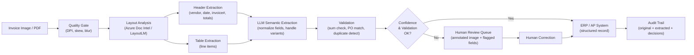

# Part 3 — Image & Document Intelligence (Part 2)

---

## 4. Enterprise Document Processing Patterns

### Invoice and Receipt Extraction Pipeline

The invoice extraction pipeline is the highest-volume IDP use case in enterprise. Key design decisions:

- **Template-based vs. template-free**: Template-based approaches (predefined field positions per vendor) are fast and accurate for known vendors but break on new vendors or layout changes. Template-free LLM-based extraction generalizes to novel layouts but is slower and more expensive. Production systems typically use template-based for high-volume known vendors and template-free for the long tail.
- **Line-item extraction**: Extracting individual line items from an invoice table is harder than header field extraction. Multi-row cells, wrapped text, and quantity/unit columns with implied multipliers are common failure modes.
- **Three-way matching**: The extracted invoice data is validated against the corresponding purchase order and goods receipt — "does the invoice quantity match the PO quantity and the delivered quantity?" This business logic lives above the IDP layer.

### Contract Analysis Workflow

Contract analysis agents extract defined terms, key clauses (termination, liability, IP assignment, data processing terms), obligations, and dates. The extraction challenge is semantic: the same concept may be phrased in a hundred different ways across different legal teams' drafting styles. LLM-based extraction with few-shot examples of clause types outperforms rule-based pattern matching significantly.

Key enterprise requirements: citation (each extracted clause must reference the exact page, paragraph, and sentence it was drawn from); completeness (missing a critical clause is worse than extracting a spurious one); cross-document comparison (compare this contract to the company's standard template and flag deviations).

### KYC / Identity Verification Pipeline

A KYC agent processes: (1) a government-issued ID (passport, driver's license, national ID); (2) a selfie or live video frame; (3) optionally, an address verification document (utility bill, bank statement). The pipeline stages are: ID authenticity check (detect photocopies, digital alterations, expired documents using specialized ID verification models); data extraction from the ID (name, date of birth, ID number, expiry, MRZ zone); face match between the ID photo and the selfie (using a face recognition model); liveness check (for live video, ensure the submitted image is of a live person, not a printed photo); address extraction from the supporting document; cross-validation of extracted data across all sources.

Regulatory requirements (FATF, EBA, FinCEN) mandate that the pipeline produces an evidence package — not just a pass/fail decision — that can be presented to regulators on demand.

### Financial Statement Parsing

Financial statement parsing (income statements, balance sheets, cash flow statements) combines table extraction with domain-specific semantic understanding. The same line item may appear as "Revenue", "Net revenue", "Total revenues", or "Gross sales" across different companies' filings. Standardization to a canonical schema (XBRL taxonomy, GAAP line items) is the primary semantic challenge. The extraction pipeline typically uses a combination of table extraction (Azure Textract, TATR), entity resolution (mapping variant phrasings to canonical concepts), and arithmetic validation (does the net income equal revenue minus expenses minus taxes?).

### Multi-Language Document Handling

Enterprise document pipelines in international organizations process documents in 20–50 languages. Key design considerations: use a multilingual OCR engine (Azure Document Intelligence and PaddleOCR have strong multilingual support); apply language detection before routing to language-specific extraction models; handle right-to-left scripts (Arabic, Hebrew) which require layout analysis to be direction-aware; handle ideographic scripts (Chinese, Japanese, Korean) where character-level OCR granularity is different from alphabetic scripts.

---

## 5. Failure Modes and Quality Assurance

### Low-Quality Scans and Skewed Images

The most common production failure mode is input quality below the model's training distribution. A model achieving 99% accuracy on clean scans may drop to 85% on photocopier artifacts, 75% on smartphone photos of paper documents, and 60% on fax-machine output. Quality assessment must happen *before* inference, not only after.

Quality metrics to measure: DPI (target ≥ 150 for general text, ≥ 300 for fine print); skew angle (automatically correctable up to ±5°, beyond that flag for manual deskew); blur (Laplacian variance below threshold indicates significant blur); contrast ratio (documents with low contrast between ink and paper require preprocessing enhancement).

### Confidence Scoring and Human Escalation

Production IDP systems implement a tiered confidence model:

- **Green tier (auto-accept)**: all fields above the high-confidence threshold, all validation checks pass → submit directly to downstream system.
- **Yellow tier (auto-accept with exception flag)**: most fields high-confidence but one or more fields in medium range, or a validation check shows a small discrepancy → submit to downstream but create an exception record for periodic human audit.
- **Red tier (human review required)**: one or more fields below low-confidence threshold, or a validation check fails critically → hold the document in the human review queue with the annotated image.

Threshold calibration is a deployment task. The thresholds should be set such that the human review queue is within the capacity of your human reviewers — typically targeting 2–5% of documents in the red tier for a mature, high-quality document population.

### Cross-Validation Strategies

Single-model extraction is brittle for high-stakes documents. Cross-validation strategies include:

- **Multi-model consensus**: run extraction with two independent models (e.g., Azure Document Intelligence + a local LayoutLM fine-tune) and flag documents where the two models disagree.
- **Arithmetic validation**: for financial documents, verify that extracted numerical values satisfy expected arithmetic relationships (line items sum to total; beginning balance + debits - credits = ending balance).
- **Reference data validation**: cross-check extracted identifiers against reference databases (validate routing numbers against the Federal Reserve routing number database; validate VAT numbers against the VIES database).
- **Temporal consistency**: for a series of related documents (e.g., monthly bank statements), validate that account balances are consistent across documents.

---

## Interview Use Cases

### Q1: How would you build a document intelligence pipeline for processing 10,000 insurance claim forms per day with a 99.5% accuracy SLA?

The architecture has five key components. First, a quality gate that rejects or flags documents below minimum scan quality, reducing the effective problem space to documents the model can actually handle. Second, a template registry: insurance claim forms for a given insurer have consistent structure — maintain a library of document templates keyed by insurer and form version, and route incoming documents to the matching template-specific extraction model for the 80% of volume that comes from known templates. Third, a general-purpose LLM-based extractor for the 20% long-tail of novel or non-standard forms. Fourth, a validation layer with arithmetic checks, reference data lookups, and business rule enforcement. Fifth, a human review queue targeted at 1–2% of volume (100–200 documents per day at 10,000/day throughput), sized appropriately for the human reviewer workforce.

Achieving 99.5% accuracy requires measuring accuracy at the field level (not the document level), defining exactly what "accuracy" means (is a correctly extracted value that fails a downstream validation rule "accurate"?), and establishing a ground-truth test set of human-verified extractions for continuous regression testing. The SLA also requires defining the accuracy denominator: are documents rejected by the quality gate counted as failures?

### Q2: What are the architectural differences between LayoutLM and a VLM-based approach for document understanding?

LayoutLM is a specialized Transformer pre-trained jointly on text tokens, 2D bounding box coordinates (position on the page), and image patches from the corresponding page region. It is discriminative — it produces embeddings used for classification tasks (field classification, token labeling). It requires an upstream OCR engine to provide the text tokens and bounding boxes; it does not perform OCR itself. LayoutLM is best used when the document structure is known (you know what fields to extract and can formulate the problem as a token classification task), the document population is large enough to fine-tune on, and low latency is required (LayoutLM inference is faster than a full VLM call).

A VLM-based approach (GPT-4o, Gemini, Claude) takes the full document image as input and generates free-form text output (the extracted fields, often in JSON format via prompt engineering). It is generative — it can extract any field you describe in the prompt without task-specific fine-tuning. It is better for novel document types, complex semantic extraction (interpreting clause meaning, not just locating a field), and cross-document reasoning. Its weaknesses are: higher cost and latency per call; less reliable structured output (JSON schema enforcement via tool use is required); and lower recall on fine-grained numerical extraction compared to a fine-tuned LayoutLM.

### Q3: How do you handle handwritten medical notes mixed with printed text in a healthcare document processing system?

The critical first step is *region classification*: use a layout model (e.g., a fine-tuned LayoutLMv3 or a CNN-based region classifier) to segment each page into printed regions and handwritten regions. This classification step itself requires training data specific to medical notes — generic document layout models may not distinguish printed form fields from handwritten fill-ins.

Printed regions are processed with standard neural OCR (TrOCR, Azure Document Intelligence). Handwritten regions are processed with an HWR model fine-tuned on medical handwriting — a generic HWR model trained on general cursive will perform poorly on medical shorthand, drug names, and dosage notation. The medical HWR model should incorporate a medical vocabulary prior to resolve ambiguous characters (the difference between "1 mg" and "I mg" may be a single pixel).

Confidence scores from both OCR paths are propagated to a human review queue. Medical handwriting extraction should be configured conservatively (lower confidence thresholds trigger human review) because errors in drug names or dosages have patient safety implications. All human corrections are fed back into a continuous learning pipeline to improve the HWR model on the specific handwriting styles encountered in the production document population.

### Q4: Design a KYC verification agent that processes passports, selfies, and bank statements

The KYC agent comprises three specialist models operating in parallel, coordinated by an orchestrator that handles sequencing and conflict resolution.

**ID Specialist**: Accepts the passport image. Classifies country of issue and document type. Applies an ID authenticity model (detecting photocopies, tampered holograms, font substitutions). Extracts MRZ (Machine-Readable Zone) — highly reliable because MRZ has a defined character set and checksum validation — and the visual inspection zone (name, photo, date of birth, expiry). Verifies MRZ checksum. Outputs structured identity record with per-field confidence and authenticity score.

**Face Match Specialist**: Accepts the passport photo (cropped from the ID) and the selfie. Applies a face recognition model (ArcFace or a commercial API) to compute a face similarity score. Applies a liveness detection model to the selfie (2D liveness for photos, 3D liveness for video). Outputs match confidence and liveness confidence.

**Address Verification Specialist**: Accepts the bank statement. Applies IDP extraction to extract account holder name, address, statement date, and issuing bank. Validates: does the name match the passport name (within fuzzy string tolerance)? Is the statement within the required recency window (typically last 3 months)? Is the bank a recognized institution (validate SWIFT/BIC code against the global bank register)?

The orchestrator assembles the three structured outputs and applies decision logic: all three specialists must return confidence above threshold for an auto-pass. Any specialist below threshold, or any detected inconsistency between the specialists' outputs, triggers a human review with the full evidence package. The audit log records the passport image hash, selfie image hash, bank statement hash, model versions, all extracted values, all confidence scores, the orchestrator's decision logic output, and the human reviewer's final decision.

---

## Related

- [Part 1 — Foundations](../01-part-01-foundations.md) — tokenization strategies for document image encoding
- [Part 2 — Enterprise Architecture](../02-part-02-enterprise-architecture.md) — document understanding agents in the four-layer architecture
- [Part 5 — Multimodal RAG](../05-part-05-multimodal-rag.md) — retrieving relevant document sections using multimodal embeddings
- [Part 8 — Guardrails & Sanitization](../08-part-08-guardrails-sanitization.md) — PII detection and redaction in extracted document content
- [Knowledge & RAG](../../../data-knowledge/index.md) — knowledge architecture patterns that consume IDP pipeline outputs

---

**[Back to Part 1 ←](pathname:///archon/agentic-systems/multimodal/03-part-03-modalities-image-document.md)**
