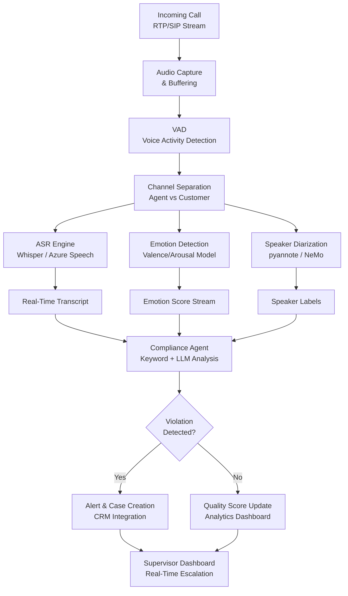
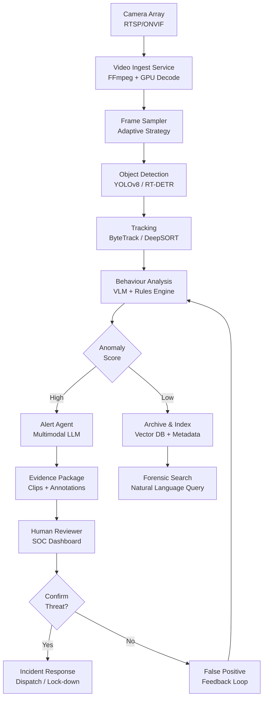

# Part 04 — Video & Audio Intelligence (Part 2)

---

## Call Center Audio Processing Pipeline

---

## Video Surveillance Agent Architecture

---

## Enterprise Use Cases

### Call Center Quality Monitoring Agent

A real-time agent processes every call in parallel:

- Transcribe with domain-tuned ASR (telephony acoustic model)
- Classify emotion every 30 seconds; flag if customer arousal exceeds threshold
- Scan transcript for prohibited phrases (compliance keyword list + LLM semantic check)
- Score call quality (0–100) and write to analytics data lake
- Trigger supervisor alert if escalation keywords + high arousal co-occur

### Meeting Transcription and Action Item Extraction

- Diarize speakers → attribute transcript segments by name (integrated with calendar identity)
- Segment by topic using BERTopic or LDA over rolling windows
- Extract action items with structured LLM output (owner, deadline, description)
- Push to task management system (Jira, Asana) via API integration

### Predictive Maintenance via Audio Anomaly Detection

- Establish spectral baseline during normal operation (rolling 7-day mean PSD)
- Continuously compute Mahalanobis distance from baseline in frequency domain
- Alert when distance exceeds 3-sigma threshold; correlate with vibration sensor data
- Generate maintenance work order with detected anomaly frequency band as evidence

### Security Surveillance with Behavioural Analytics

- Detect loitering (person in restricted zone &gt;60 seconds)
- Alert on perimeter breach with clip evidence attached to incident ticket
- Track vehicle trajectories; flag vehicles circling perimeter &gt;3 times
- Feed confirmed incidents back to model as hard negatives to reduce false positives

### Media Content Moderation Pipeline

- Audio: detect hate speech, explicit content, CSAM audio signatures
- Video: detect graphic violence using VLM + rule-based frame classifier
- OCR on frames: detect on-screen text violating policy
- Human review queue: route confidence 0.6–0.9 cases; auto-reject confidence &gt;0.9

---

## Interview Use Cases

**Q: How would you architect a real-time audio monitoring system for a 10,000-seat call center that detects compliance violations, customer emotion, and escalation triggers?**

A: The architecture separates concerns into three parallel inference paths running on every call stream simultaneously. The ingestion layer captures RTP streams per call, applies VAD to strip silence, and splits each stream into agent and customer channels. Path 1 runs ASR (Deepgram Nova-2 for low latency at $0.0043/min, or Azure Speech with custom acoustic model for telephony). Path 2 runs a lightweight emotion model (MFCCs → 3-layer LSTM → valence/arousal) on 5-second rolling windows — this runs on CPU to avoid GPU contention. Path 3 runs keyword spotting for a compliance phrase list. Results from all three paths merge into a stateful per-call aggregator. When compliance keyword + high arousal co-occur within a 30-second window, the aggregator triggers an LLM reanalysis of the last 2 minutes of transcript to reduce false positives before generating a supervisor alert. At 10,000 concurrent calls, partition across a Kafka cluster with one partition per call; each consumer group handles one inference path. Total throughput: ~10,000 audio streams × 3 paths = 30,000 concurrent lightweight inference jobs, served by a fleet of GPU-accelerated ASR workers and CPU-bound emotion workers behind an auto-scaling group.

**Q: What are the trade-offs between uniform frame sampling and adaptive frame sampling for a video surveillance system that needs to detect rare security events?**

A: Uniform sampling (e.g., 1 fps) is simple to implement and provides consistent coverage but wastes compute on static scenes — a camera watching an empty corridor at 1 fps generates 86,400 frames/day regardless of activity. Adaptive sampling uses motion detection (frame difference or optical flow magnitude) to trigger higher sampling rates only when activity occurs. For rare security events (which by definition happen infrequently), adaptive sampling dramatically reduces the baseline compute load — dropping inactive cameras to 0.1 fps — while triggering burst sampling at 5–10 fps when motion exceeds a threshold. The risk is threshold sensitivity: set too high, and a slow-moving intruder is missed; set too low, and wind-blown foliage causes false positives and wastes compute. The recommended architecture uses a two-stage approach: a lightweight motion detector on edge hardware (Frame Difference or background subtraction with MOG2) drives adaptive sampling, and only clips containing motion are forwarded to the GPU cluster for VLM-based behavioural analysis. This reduces cloud egress by 90%+ while maintaining detection sensitivity for true events.

**Q: How do you handle speaker diarization accuracy degradation in noisy environments like factory floors?**

A: Factory floors present three compounding challenges: high ambient SNR (80–100 dB), reverberation from hard surfaces, and overlapping speech in group settings. The mitigation stack is: (1) *Source enhancement*: deploy directional microphone arrays with beamforming (e.g., ReSpeaker 4-mic array or ODAS toolkit) to steer the beam toward a speaker and apply adaptive noise cancellation. (2) *VAD robustness*: replace energy-based VAD with a noise-robust model trained on industrial environments (Silero VAD or MarbleNet fine-tuned on factory audio). (3) *Speaker embedding robustness*: use ECAPA-TDNN embeddings, which are more robust to channel variability than x-vectors. Fine-tune on factory-recorded speech samples. (4) *Clustering*: use agglomerative hierarchical clustering with a conservative distance threshold to avoid over-splitting a single speaker into multiple clusters in noisy conditions. (5) *Post-processing*: apply minimum segment duration filter (1 second) to discard diarization fragments caused by noise bursts. Evaluate with DER (Diarization Error Rate) on a factory-domain dev set; target &lt;15% DER, which is acceptable for occupational safety logging use cases.

**Q: Design a predictive maintenance system that uses audio, vibration sensor data, and video to predict equipment failure 48 hours in advance.**

A: The system fuses three sensor modalities into a unified health index. *Audio*: microphones capture airborne sound from rotating machinery; extract MFCC features + spectral centroid + kurtosis; model normal distribution per frequency band; compute anomaly score as Mahalanobis distance. *Vibration*: accelerometers (MEMS ICP sensors) mounted on bearing housings; compute envelope spectrum (Hilbert transform → FFT); detect BPFO/BPFI harmonics that indicate bearing race defects; track RMS trend with exponential smoothing. *Video*: thermal camera images detect hotspots at bearing locations (&gt;10°C above baseline triggers alert); RGB camera monitors lubrication reservoir level and drive belt condition. Fusion layer: a gradient-boosted tree (XGBoost) takes the three modality anomaly scores + maintenance history + operating hours as features and outputs a failure probability for the next 48 hours. Calibration: use Platt scaling to ensure the probability output is well-calibrated. Deployment: edge inference for audio and vibration (ONNX runtime on industrial PC); cloud inference for thermal image analysis and fusion model. Alert threshold: 70% failure probability triggers a predictive maintenance work order; 90% triggers immediate planned shutdown.

**Q: How would you design the video pipeline to generate per-chapter summaries for a 90-minute recorded board meeting?**

A: Step 1 — scene segmentation: detect scene boundaries using PySceneDetect (histogram difference + content-aware) to identify presentation slide transitions, which correlate with topic changes. Step 2 — transcription: run Whisper large-v3 on the audio track for full verbatim transcript with timestamps. Step 3 — speaker diarization: run pyannote on the audio; align diarization labels with transcript words to produce attributed transcript. Step 4 — topic segmentation: apply BERTopic over sliding 5-minute windows of the attributed transcript to detect topic shifts; align topic boundaries with scene boundaries for chapter creation. Step 5 — chapter summary generation: for each chapter, construct an LLM prompt containing the attributed transcript segment + a description of the primary slide visible (extracted by GPT-4o Vision from the key frame). Generate a 3-sentence summary with speaker attribution. Step 6 — output: produce a structured JSON with chapter titles, timestamps, speaker breakdown, and summary text; render as an interactive transcript viewer with click-to-seek.

---

## Related

- [Part 01 — Foundations](../01-part-01-foundations.md) — foundational VLM architectures
- [Part 03 — Image & Document Intelligence](../03-part-03-modalities-image-document.md) — document processing modalities
- [Part 05 — Multimodal RAG](../05-part-05-multimodal-rag.md) — retrieval over video and audio indexes
- [Part 06 — Agentic Workflows](../06-part-06-agentic-workflows.md) — orchestrating audio/video agents

---

**[Back to Part 1 ←](pathname:///archon/agentic-systems/multimodal/04-part-04-modalities-video-audio.md)**
