# Part 8 — Guardrails & Sanitization for Multimodal AI (Part 2)

## Sanitization Pipeline Design

### Image Sanitization Pipeline

```mermaid
flowchart LR
    RAW["Raw Image Input"] --> FV["Format Validation\n(magic bytes check)"]
    FV --> EXIF["EXIF Stripping\n(GPS, device ID, timestamps)"]
    EXIF --> MAL["Malware Scan\n(TIFF/SVG scripts)"]
    MAL --> PII["PII Masking\n(faces, plates, docs)"]
    PII --> WM["Watermark Detection"]
    WM --> ADV["Adversarial Perturbation\nDetection"]
    ADV --> NORM["Resolution & Size\nNormalization"]
    NORM --> CS["Color Space\nNormalization"]
    CS --> CLEAN["Sanitized Image"]
```

**Format validation** reads the first 16 bytes (magic bytes) of the file to verify the actual format matches the claimed extension. A JPEG disguised as a PNG, or a malicious TIFF with embedded scripts claiming to be a JPG, is detected here. Use libmagic or equivalent — never trust the file extension alone.

**EXIF stripping** removes all EXIF metadata using a library such as piexif (Python), ExifTool, or libexif. EXIF can contain GPS coordinates (revealing user location), device serial number (linking anonymous uploads to specific devices), and software version (fingerprinting user environment). Strip before any processing that persists the image.

**Malware scanning** is non-trivial for images. TIFF and SVG formats can embed JavaScript (SVG is XML, can contain `<script>` tags). Modern malware also hides payloads in high-bit-depth PNG metadata sections. Scan with ClamAV plus custom rules for image-specific vectors. For DICOM medical images, remove private DICOM tags which can embed executable code.

**PII masking** runs face detection, license plate detection, and document detection in parallel. Each detected region is masked using the policy-specified strategy (blur, pixelate, redact). Confidence thresholds: face detection >0.7, license plate >0.85, document >0.8.

**Adversarial perturbation detection** identifies images with crafted pixel noise designed to fool downstream classifiers or VLMs. Detection approaches include: JPEG compression artifact analysis (adversarial perturbations survive JPEG decompression poorly), high-frequency component analysis (adversarial patches have distinctive spectral signatures), and consistency checks between multiple detection models.

**Resolution and size normalization** enforces enterprise limits: maximum input dimensions (e.g., 4096×4096), minimum dimensions for quality assurance, and file size caps. Downsampling uses Lanczos resampling for quality preservation.

**Color space normalization** converts all inputs to sRGB (or the model's expected color space). Medical DICOM images use MONOCHROME2 grayscale — VLMs not trained on grayscale input need appropriate pre-processing.

### Video Sanitization

Container validation verifies the video container format (MP4, MKV, WebM) matches its declared type. Codec normalization transcodes all input video to a standardized codec (H.264 baseline profile) to eliminate codec-level vulnerabilities. Metadata stripping removes all container-level metadata (creation date, encoder software, GPS tags in MP4). Frame extraction with per-frame malware checks runs the image sanitization pipeline on sampled keyframes. Audio track isolation separates the audio channel for independent audio sanitization before reassembly. Keyframe selection for model input uses scene change detection to select maximally informative frames within the model's context window.

### Audio Sanitization

Format normalization standardizes all audio to 16 kHz, mono channel, 16-bit PCM WAV — the format expected by Whisper and most production ASR systems. Silence removal using Voice Activity Detection (VAD, e.g., Silero VAD) strips non-speech segments. Noise reduction (RNNoise, DeepFilterNet) improves ASR accuracy and removes background audio that might contain unintended PII. Malware scanning for audio containers (MP4, OGG Vorbis) checks for embedded metadata scripts. Profanity masking replaces detected profanity spans with 200 Hz sine wave tone (the "bleep"). Speaker anonymization uses voice conversion (CycleGAN-VC or similar) to change speaker characteristics while preserving linguistic content — used when audio must be shared externally without identifying the original speaker.

### Document Sanitization

OCR cleanup and whitespace normalization removes OCR artifacts (broken words, spurious characters, inconsistent spacing) using a post-OCR correction model. Macro and embedded script detection scans DOCX, XLSX, and PDF files for macros (python-docx, openpyxl) and embedded scripts before any content extraction. PDF JavaScript stripping removes all JavaScript from PDF files using PyMuPDF's `set_js()` method with empty string, or pikepdf's `open()` and `save()` with `linearize=True` to strip non-essential streams. Hidden text extraction reviews and classifies text with white-on-white color, font size 0, or rendering mode "invisible" — a common exfiltration vector in adversarially crafted documents. Metadata stripping removes author name, revision history, tracked changes, and custom properties that may reveal internal system information.

---

## Enterprise Guardrail Architecture Pattern

The **gateway pattern** places a dedicated guardrail middleware service between the API gateway and the model inference service. All requests pass through the guardrail middleware, which fans out to modality-specific checkers (image, audio, document) in parallel, collects results, applies the policy engine decision, and either forwards the sanitized request to inference or returns a policy violation response.

**Async vs synchronous guardrail execution**: synchronous execution is required for inputs that are too risky to process speculatively (high-volume consumer platforms, regulatory environments). Async execution (submit for guardrail check, receive callback when cleared) is appropriate for batch document processing workflows where sub-second latency is not required and throughput is paramount.

**Caching guardrail results**: identical inputs (same content hash) need not be re-evaluated. A Redis or Memcached layer with a TTL of 24 hours caches (content_hash, policy_version) → (decision, confidence). Cache invalidation is triggered by policy version updates. This reduces guardrail infrastructure cost by 30–60% in workloads with repeated inputs (e.g., a customer service bot processing the same product image multiple times per day).

**Confidence-based human escalation**: guardrail decisions below a confidence threshold (typically 0.7–0.8) route to human reviewers rather than making an automated decision. Enterprise systems implement a review queue with SLA-based routing: high-risk content (probable policy violation) to a 15-minute SLA queue, low-risk borderline content to a 4-hour SLA queue.

**Audit logging** captures for every guardrail decision: input content hash (SHA-256), timestamp, policy version applied, each checker's result and confidence, final decision, and reviewer outcome if escalated. Logs are written to an append-only audit store (AWS S3 with Object Lock, Azure Immutable Blob Storage) for regulatory compliance. Retention minimum: 7 years for financial services, 6 years for healthcare.

---

## Interview Use Cases

### Q1: How would you design a guardrail system for a consumer-facing multimodal chatbot that must comply with both GDPR and COPPA while maintaining sub-500 ms latency?

The architecture layers three concerns: GDPR (data minimization, consent, right to erasure), COPPA (minor protection, parental consent), and the 500 ms latency budget.

For COPPA, the first guardrail is age gate enforcement at account creation (verified by parental consent flow), but the system cannot rely on this alone — users can lie. Therefore every image input runs a real-time minor detection check: face detection followed by age estimation. For any face with estimated age below 18, the input routes through an enhanced review pipeline and NSFW classifiers are forced to maximum sensitivity. This adds ~80 ms for face detection + age estimation (MiVolo model on GPU).

For GDPR, EXIF stripping runs on every image before any model inference — this is non-negotiable data minimization. Face blurring is applied to any faces in the sanitized image stored in session logs. Content analysis results are stored but the original images are not persisted beyond the session (right to erasure is trivial — only session metadata needs deletion).

For the 500 ms budget: run format validation (5 ms), EXIF stripping (10 ms), malware scan (20 ms), and content classification (80 ms GPU) in series; run PII detection (60 ms), minor detection (80 ms), and NSFW classification (70 ms) in parallel with content classification on separate GPU threads. The critical path is approximately 115 ms for pre-processing, leaving 385 ms for model inference — achievable with a quantized VLM (GPT-4o mini, Claude Haiku, or Gemini Flash). Post-processing (toxicity check, PII leakage) runs in 40 ms. Total: ~155 ms guardrails + ~300 ms inference + ~40 ms post-processing = ~495 ms.

### Q2: What are the technical challenges of deepfake detection in real-time video streams, and how would you build a production-grade detection system?

The core technical challenge is that deepfake detection accuracy degrades severely under real-world conditions: social media compression (H.264 at low bitrates destroys the spectral artifacts that detection models rely on), lighting variation (models trained on studio-quality deepfakes fail on low-light video), and continuous model advancement (new generation models like Sora and Veo produce content that defeats detectors trained on previous generation content).

A production-grade system uses a multi-signal ensemble: (1) Frequency domain analysis — compute the DCT frequency spectrum of each frame; GAN-generated content has characteristic high-frequency artifacts that survive moderate compression. Compute cost: <5 ms per frame on CPU. (2) Biological signal analysis — rPPG detects natural skin color oscillation at 0.75–3 Hz (heartbeat rate); synthetic faces lack this signal. Requires a 10-second clip for reliable detection. Compute cost: 50 ms per 10-second window. (3) Facial landmark trajectory analysis — track 68 facial landmarks across frames; synthetic faces exhibit unnatural jitter patterns (too smooth or unnaturally erratic). Compute cost: 10 ms per frame. (4) Scene consistency analysis — detect blending boundaries at the face boundary using edge-aware filtering. Compute cost: 15 ms per frame.

For real-time streams (30 fps), implement the lightweight signal (frequency domain + landmark trajectory) at full frame rate and the expensive signals (rPPG) at 10-second windows. Ensemble the signals with a calibrated logistic regression meta-classifier. Key operational requirement: log a detection confidence history, not a single binary decision — trend analysis over 30+ seconds is far more reliable than per-frame binary classification. Threshold for automated action (blocking): >0.9 confidence sustained over 10+ seconds. Between 0.7 and 0.9: flag for human review. Below 0.7: pass with warning flag in audit log.

### Q3: How do you implement PII sanitization for audio recordings in a healthcare call center that processes 50,000 calls per day?

A 50,000 call/day workload at an average call length of 8 minutes is approximately 6,600 hours of audio per day. This is a batch processing problem — real-time sanitization is not required, but throughput and HIPAA compliance are paramount.

Architecture: a Kafka queue receives completed call recordings from the telephony system. A fleet of Kubernetes pods runs the sanitization pipeline: (1) Silero VAD segments audio into speech/silence; (2) Whisper large-v3 transcribes each segment (running on A10G GPUs, ~7× real-time throughput = one GPU processes ~168 minutes of audio per hour; for 6,600 hours/day you need ~40 GPU-hours, so ~2 GPUs running 24/7 with buffer); (3) a PII NER model (GLiNER fine-tuned on healthcare vocabulary) detects PHI spans in transcripts — patient names, dates, MRNs, phone numbers, medication names combined with patient identifiers; (4) detected spans are aligned back to audio timestamps using Whisper's word-level timestamps; (5) the audio is rewritten with silence replacing each PHI span; (6) the sanitized audio and redacted transcript are written to a HIPAA BAA-covered S3 bucket with SSE-KMS encryption; (7) the original audio is retained in a separate restricted-access vault for legal hold.

For the HIPAA Safe Harbor de-identification standard, 18 PHI identifiers must be removed including names, dates (other than year), geographic data below state level, and phone numbers. The Expert Determination standard requires a statistician to certify that re-identification risk is acceptably low — appropriate when some date precision must be preserved for clinical quality metrics.

### Q4: Design a document sanitization pipeline for a bank that receives 1 million PDFs per day from customers and must prevent all macro/script attacks

One million PDFs per day is ~11.6 PDFs per second peak (assuming uniform distribution) or ~30–50 PDFs/second at peak business hours. The pipeline must be horizontally scalable and stateless.

Stage 1 — Triage (5 ms per document): compute file hash (SHA-256), check against known-malicious hash blocklist (ClamAV virus signature database + FS-ISAC threat intelligence), and route PDF to quarantine on match. No content parsing needed for known-bad files.

Stage 2 — Static analysis (20–50 ms per document): use pikepdf to open the PDF in strict mode. Check for: JavaScript presence (`/JS` or `/JavaScript` dictionary entries), launch actions (`/Launch`), form submission actions (`/SubmitForm`), embedded files (`/EmbeddedFile`), hidden annotation actions. Strip all detected active content using pikepdf's save with `object_stream_mode=pikepdf.ObjectStreamMode.generate` and no JavaScript. Log all stripped elements to the security event stream.

Stage 3 — Structural analysis (50–100 ms): extract page count, font list, image count, embedded objects. Flag structural anomalies: >200 pages from a customer submission (potential zip bomb analogue), >50 MB uncompressed, embedded PDF-within-PDF (common exploit vector). Route flagged documents to a sandboxed rendering environment.

Stage 4 — Sandboxed rendering (200–500 ms): render each page in a gVisor-isolated container using a hardened Ghostscript or MuPDF build with all network access disabled and filesystem access limited to a tmpfs mount. If the renderer crashes, classify the PDF as malicious. Extract rendered page images and text from the safe rendering output.

Scale: Stage 1–3 runs on CPU-based containers at ~200 documents/second per pod. Stage 4 (sandboxed rendering) requires ~5 containers per 10 PDFs/second throughput target. At 50 PDFs/second peak: ~25 rendering containers, horizontally autoscaled via KEDA based on queue depth.

---

## Related

- [Part 7 — Security & Threat Taxonomy](./part-07-security-threats) — adversarial attacks and threat modeling for multimodal systems
- [Part 9 — Compliance & Responsible AI](./part-09-compliance-responsible-ai) — regulatory requirements for multimodal guardrail systems
- [AI Security Governance](../ai-security-governance/index.md) — enterprise security controls and governance frameworks
- [Enterprise AI Architecture Patterns](../enterprise-architecture/ai-architecture/enterprise-ai-architecture-patterns.md) — architectural patterns including guardrail middleware
