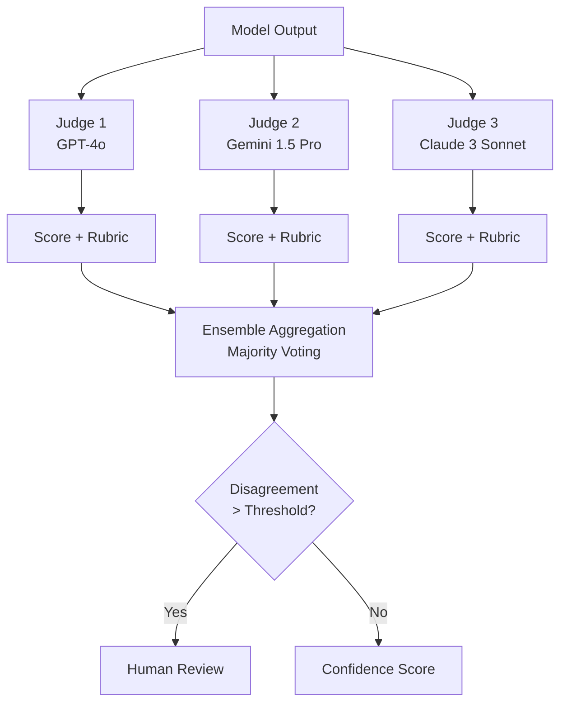

# Part 10 — Evaluation & Benchmarks for Multimodal AI (Part 2)

## LLM-as-Judge for Multimodal

### When LLM-as-Judge Works

LLM-as-Judge (using a powerful model to evaluate another model's output) works well for: evaluating open-ended VQA responses where multiple correct phrasings exist; assessing output coherence and relevance; evaluating answer completeness; and comparing two candidate responses for preference. GPT-4o and Gemini 1.5 Pro are the most commonly used multimodal judges as of July 2026.

### When LLM-as-Judge Fails for Visual Evaluation

LLM-as-Judge fails or produces unreliable results for: verifying visual grounding (whether a claim is actually supported by the image — the judge VLM may itself hallucinate); evaluating spatial precision (is the bounding box accurate?); low-level perceptual quality assessment (is this OCR output correct character by character?); and domain-specific correctness that requires expert knowledge (is this medical diagnosis appropriate?).

### Rubric Design for Visual Quality Evaluation

Effective judge prompts for multimodal evaluation specify: (1) the specific aspect being evaluated, not "overall quality"; (2) a concrete 1–5 scale with behavioral anchors at each level; (3) explicit instructions to verify claims against the provided image before scoring; (4) chain-of-thought elicitation before the score to improve calibration. Example rubric for OCR accuracy evaluation:

- 5: All text extracted with no errors, correct spatial ordering maintained
- 4: Minor formatting differences but all information correctly captured
- 3: Some text missing or incorrect, but key information present
- 2: Significant text loss or errors that affect comprehension
- 1: Output does not represent the document content

### Bias Patterns in Multimodal Judges

*Position bias:* When presented with two responses (A vs B), the judge prefers the first response 55–65% of the time independent of content quality. Mitigation: always evaluate both orderings and average the scores.

*Sycophancy / verbosity preference:* Longer, more detailed responses are preferred even when less accurate. Mitigation: include explicit rubric instructions that penalize unnecessary verbosity; evaluate a random sample with human judges to calibrate.

*Self-preference:* GPT-4o as judge tends to prefer GPT-4o outputs; Gemini prefers Gemini outputs. Mitigation: use a different model family as judge than the models being evaluated, or use an ensemble of judges from different families.

*Overconfidence for visual claims:* LLM judges sometimes confidently evaluate visual grounding claims they cannot actually verify because the image is not in the judge's context, or because the judge itself hallucinates from the image. Mitigation: always include the source image in the judge context; add explicit verification instructions.

### Calibration: Correlation with Human Judgments

A multimodal judge is well-calibrated if its scores correlate with human judgments at Spearman ρ ≥ 0.8. Calibrate judges by: (1) collecting 200–500 human-judged examples on the specific task; (2) computing Spearman correlation between judge scores and human scores; (3) adjusting judge temperature and rubric until correlation meets threshold; (4) re-calibrating quarterly as model behavior evolves.

### Ensemble Judging for Multimodal

A single LLM judge has variance that makes it unreliable for individual evaluations. An ensemble of 3–5 judges (from different model families) with majority voting or score averaging reduces variance by √N. For high-stakes model selection decisions, use a 3-judge ensemble with tie-breaking by human evaluation.

---

## Golden Dataset Construction

### Principles for Multimodal Golden Datasets

A golden dataset is the definitive ground-truth evaluation set for a specific enterprise task. Principles:

*Task-representative sampling:* Sample from the actual production input distribution, not a convenience sample. For a document processing system, sample from the actual document intake queue with stratification by document type, quality level, and originating source.

*Adversarial coverage:* Include deliberately challenging cases — low-quality images, accented speech, damaged documents, atypical layouts. A golden dataset that tests only easy inputs gives overoptimistic accuracy estimates.

*Demographic diversity:* For systems processing faces or voices, include balanced representation across demographic groups. Demographic imbalance in the golden dataset conceals disparate performance.

*Ground truth quality:* Each golden example should have ground truth verified by at least two independent annotators. Examples with annotator disagreement should either be resolved by a domain expert or held in a separate "ambiguous" subset that is tracked but not used for binary pass/fail gates.

*Size:* Minimum 500 examples for statistical reliability of 5 percentage point accuracy differences at 95% confidence. Minimum 200 examples per demographic subgroup for subgroup fairness evaluation.

### Annotation Tooling

- *Images/Video:* CVAT (Computer Vision Annotation Tool), Labelbox, Scale AI, Roboflow for bounding box, segmentation, and classification annotation
- *Documents:* Label Studio (multi-modal, supports PDF annotation), UBIAI (document IE annotation), Prodigy (programmatic annotation with active learning)
- *Audio:* Audacity + Praat for speech annotation; EasyTranscript for transcription; Scale AI for speaker diarization annotation
- *Multimodal cross-reference:* CVAT supports linked annotations across video frames, audio segments, and transcription spans

### Inter-Annotator Agreement

Measure agreement before finalizing ground truth. For classification tasks: Cohen's Kappa ≥ 0.7 is acceptable; ≥ 0.8 is good; < 0.6 indicates annotation guideline ambiguity that must be resolved before the dataset is used.

For bounding box tasks: Intersection over Union (IoU) ≥ 0.7 between annotators indicates acceptable spatial precision. For transcription: character-level agreement ≥ 95% indicates acceptable ASR ground truth quality.

### Dataset Versioning and Drift Detection

Tag every golden dataset with a semantic version (MAJOR.MINOR.PATCH). MAJOR version increment when ground truth labels are revised (breaking change for historical comparisons). MINOR increment when new examples are added. PATCH increment for metadata corrections.

Drift detection: track the distribution of input characteristics (image resolution, audio SNR, document quality score) in the production input stream. When Kullback-Leibler divergence between the production distribution and the golden dataset distribution exceeds a threshold (typically KL > 0.1), trigger a golden dataset refresh to add examples representative of the new distribution.

### Adversarial Test Set Construction

Construct adversarial test sets for each modality:

- *Image adversarial:* FGSM (Fast Gradient Sign Method) perturbations at ε = 8/255 and ε = 16/255; PGD (Projected Gradient Descent) attacks; common corruptions from ImageNet-C (noise, blur, JPEG compression, weather)
- *Audio adversarial:* Additive white noise at SNR 10 dB and 0 dB; room impulse response convolution (reverb); codec compression artifacts (MP3 64 kbps); speed perturbation ±10%
- *Document adversarial:* Scan quality degradation (Gaussian blur, salt-and-pepper noise, binary thresholding); font size reduction to 6pt; column layout variations; mixed language documents

---

**This is Part 2 of 3. [Continue with Part 3 →](pathname:///archon/agentic-systems/multimodal/parts/10-part-10-evaluation-benchmarks-part3.md) for evaluation pipeline architecture, interview use cases, and related resources.**
