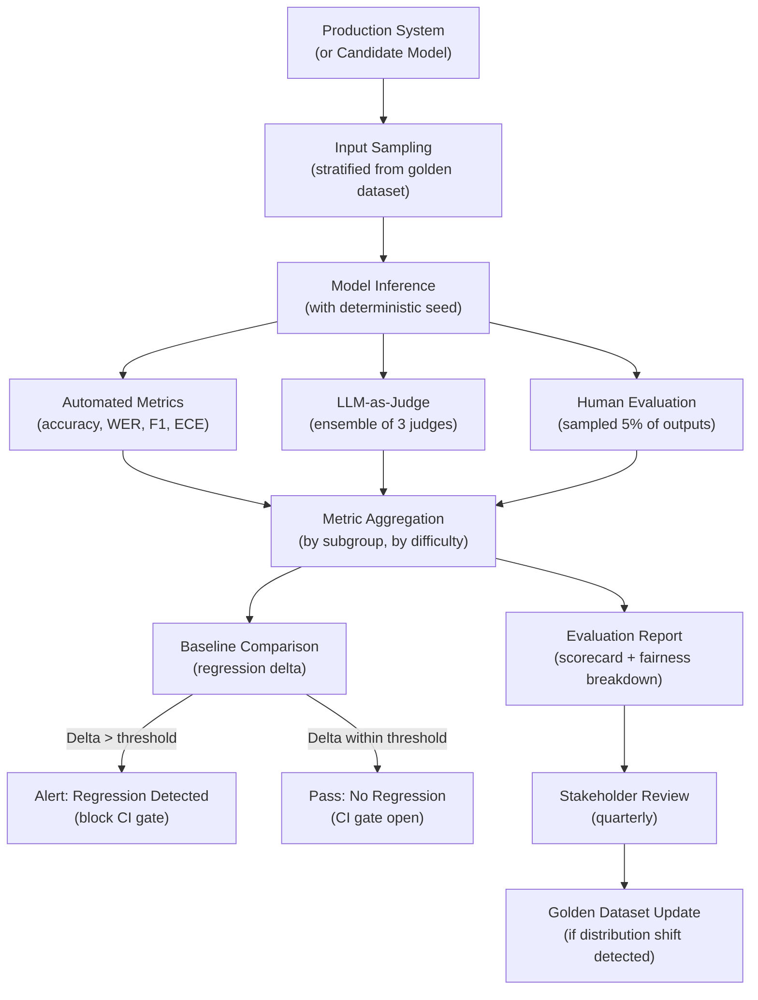

# Part 10 — Evaluation & Benchmarks for Multimodal AI (Part 3)

## Evaluation Pipeline Architecture

---

## Evaluation for Specific Enterprise Domains

### Medical Imaging Evaluation

For clinical AI systems, benchmark metrics must reflect clinical utility, not just technical accuracy. Key metrics:

*Sensitivity (recall):* The fraction of actual positive cases (disease present) correctly identified. For cancer screening, sensitivity targets are typically ≥ 0.95 — missing a cancer is a higher-cost error than a false alarm.

*Specificity:* The fraction of negative cases (disease absent) correctly identified as negative. High specificity reduces unnecessary follow-up procedures.

*AUC-ROC:* Area under the receiver operating characteristic curve — measures discrimination performance across all classification thresholds. AUC ≥ 0.90 is the typical target for AI-assist tools.

*Radiologist concordance rate:* The fraction of AI assessments that agree with the consensus of two or more board-certified radiologists on the same case. For regulatory submission (FDA 510(k)), concordance is typically required ≥ 85% on a locked validation set.

*Subgroup performance:* Report sensitivity/specificity separately by patient age cohort, biological sex, imaging protocol, and scanner manufacturer — these all affect AI performance in clinical deployment.

### Document Processing Evaluation

*Field-level accuracy:* For each extracted field (invoice number, vendor name, total amount, line item), measure exact match rate and near-match rate (allowing minor formatting differences). Report per-field — an overall accuracy of 95% concealing 70% accuracy on line items is a deployment risk.

*End-to-end accuracy:* The fraction of complete documents where all fields are correctly extracted. A document is only correctly processed if every field is correct — this is typically 15–25 percentage points lower than average field-level accuracy.

*Error type analysis:* Categorize extraction errors: OCR errors (incorrect character recognition), segmentation errors (wrong region attributed to wrong field), reasoning errors (correct text read but wrong interpretation), and missing fields (field not detected). Error type distribution guides where to invest improvement effort.

### Call Center Evaluation

*Intent accuracy:* Does the AI correctly classify the customer's intent (billing dispute, technical support, account change)? Measure per-intent and overall. Intents with low accuracy require additional training data or specialist handling.

*Sentiment accuracy:* Does the AI's sentiment assessment (positive/neutral/negative/distressed) agree with human reviewers? Sentiment accuracy by demographic group is critical — sentiment models frequently perform worse on non-native English speech.

*Compliance violation detection rate:* For regulated industries, measure the fraction of actual compliance violations (script deviations, incorrect disclosures) that are correctly detected. False negative rate (violations missed) is the primary risk metric.

---

## Interview Use Cases

### Q1: How would you set up a continuous evaluation system for a multimodal AI system that processes insurance claim documents? What metrics, benchmarks, and evaluation cadence would you use?

An insurance claim document processing system needs to handle three modalities: scanned document images (damage photos, medical reports, police reports), structured documents (claim forms, invoices), and potentially audio (recorded claimant statements).

**Metrics by modality:**

For document image processing: field extraction F1 per field type (claim amount, date of loss, policy number), end-to-end accuracy (all fields correct), confidence calibration ECE for downstream escalation decisions, and document type classification accuracy (medical report vs invoice vs police report). Target: field-level F1 ≥ 0.95 for structured fields, ≥ 0.88 for free-text fields.

For damage photo assessment: agreement rate with human adjusters on damage severity classification (minor/moderate/major/total loss), localization accuracy for damage region identification. Target: adjuster agreement ≥ 80% within one severity class.

For audio (claimant statements): WER ≤ 10% on test set representative of claimant demographics, intent classification accuracy ≥ 90%, sentiment accuracy ≥ 85%.

**Benchmarks:** Use DocVQA and SROIE as pre-deployment baseline checks for document extraction capability. Build a domain-specific golden dataset of 1,000 real claims (anonymized, de-identified) with ground truth labeled by senior adjusters — this is the primary evaluation dataset.

**Cadence:** Daily CI gate — run 200-example smoke test from golden dataset, alert if any metric drops >2 percentage points from baseline. Weekly regression test — full 1,000-example golden dataset, report trend analysis. Monthly fairness audit — analyze metrics by claimant demographic group (age, geographic region), document quality quartile. Quarterly adversarial testing — deliberately degrade document quality (scan at lower resolution, add noise), test robustness. Annual golden dataset refresh — add 200 new examples to capture distribution shift.

### Q2: Why is MMMU a better benchmark than ImageNet for evaluating enterprise VLMs, and what are its blind spots?

ImageNet tests single-label image classification from a fixed 1,000-class vocabulary. Enterprise VLMs are not image classifiers — they are multi-turn, multi-task systems that need to read documents, understand charts, interpret diagrams, answer complex questions, and combine visual and textual reasoning. ImageNet accuracy tells you almost nothing about these capabilities: GPT-4o achieves ~90% ImageNet accuracy (when evaluated as a classifier), but so does a ResNet-50 trained specifically for classification — the comparison is meaningless for enterprise use.

MMMU is better for enterprise VLMs because: (1) It tests 30 subject domains including business (accounting, finance, law, management, marketing) that directly overlap with enterprise use cases; (2) It uses 6 image types (diagrams, tables, charts, chemical structures, photographs, music sheets) that reflect the diversity of enterprise documents; (3) Questions require multi-step reasoning, not pattern matching; (4) It includes text within images (charts, tables, diagrams) where the model must perform OCR as part of answering.

**Blind spots of MMMU:** Questions are multiple-choice — enterprise tasks are typically open-ended extraction or generation, not choosing from 4 options; the benchmark has no evaluation of grounding (whether the answer is actually supported by the image); it has no multilingual content; it does not test low-quality or degraded inputs; and its academic subject focus means business-domain documents (invoices, contracts, regulatory filings) are underrepresented.

For a complete enterprise VLM evaluation, use MMMU alongside DocVQA (document extraction), ChartQA (business charts), and a domain-specific golden dataset.

### Q3: How do you detect when a VLM is hallucinating about visual content, and what evaluation strategy would you build to measure hallucination rates in production?

Hallucination detection in VLMs operates at two levels: offline evaluation using benchmark datasets and online detection in production inference.

**Offline evaluation:** Use POPE for object existence hallucination (binary: is object X present? with adversarial sampling) and HallusionBench for counterfactual hallucination (the model claims things that contradict the image). Run these benchmarks on every model version. Report per-category hallucination rates — a model may hallucinate differently for people vs objects vs text.

**Online production detection:** Three complementary approaches:

*Consistency checking:* For claims about specific visual elements (numbers in a chart, text in a document), extract the claimed value and verify it against the source using an independent OCR or specialized extraction model. Flag inconsistencies. Implementation: for every invoice extraction, compare the VLM-extracted total against a regex-extracted total from the raw OCR output. If they disagree, flag as potential hallucination.

*Confidence thresholding:* Calibrate the VLM's output probabilities against ground truth on a held-out set. A well-calibrated model's stated confidence should reflect its actual accuracy. In production, route responses below a calibrated confidence threshold to human review — these are the high-hallucination-risk outputs.

*Sampling consistency:* For important claims, sample the VLM 3–5 times at temperature 0.3–0.7. If the model gives inconsistent answers across samples (claims the invoice total is $1,250 in one sample and $1,240 in another), the uncertainty indicates potential hallucination. Log consistency scores as a production metric.

Track hallucination rate as a first-class KPI: target <2% hallucination rate for enterprise document processing. Alert when hallucination rate trends above 3% — this often indicates distribution shift (new document types the model was not trained on).

### Q4: Design a golden dataset for evaluating a medical imaging AI system that must achieve radiologist-level concordance

**Scope definition:** Specify the exact clinical task: for example, detecting pulmonary nodules ≥ 6mm in chest CT scans from a specific scanner manufacturer using a specific protocol. Scope matters because accuracy varies dramatically by task, anatomy, scanner, and protocol.

**Collection:** Retrospectively collect 2,000 chest CT scans from the target clinical environment over a 12-month period to capture seasonal variation and patient population diversity. Stratify by nodule size (6–10mm, 10–20mm, >20mm), morphology (solid, part-solid, ground-glass), patient age quartile, and scanner model.

**Annotation:** Recruit 3 board-certified thoracic radiologists. Each radiologist independently reads each case without knowledge of the others' readings. Use a standardized reading protocol (Lung-RADS 1.1 or equivalent). Reconcile disagreements: cases where all 3 radiologists agree constitute the "consensus ground truth" subset (use for primary evaluation). Cases with 2/3 agreement are included with the majority label. Cases with no agreement are reviewed in a consensus session — the reconciled reading becomes ground truth.

**De-identification:** Apply HIPAA Safe Harbor de-identification: remove all 18 DICOM PHI tags, black out any patient-identifying text visible in the scan (name labels burned into the image), replace dates with relative days-since-scan-start.

**Ground truth quality metrics:** Report inter-radiologist agreement (Cohen's Kappa for nodule presence/absence; IoU ≥ 0.5 for nodule localization). Target Kappa ≥ 0.75 for the primary classification task before accepting the dataset as evaluation-ready.

**Evaluation protocol:** Evaluate the AI system against the consensus ground truth subset (cases where all 3 radiologists agreed). Report sensitivity/specificity/AUC with 95% confidence intervals. For concordance comparison: compare AI sensitivity and specificity against individual radiologist performance on the same cases — the AI should fall within the confidence interval of radiologist performance.

---

## Related

- [Part 11 — Evaluation Harnesses & CI/CD](../11-part-11-evaluation-harnesses-cicd.md) — implementing evaluation pipelines in production CI/CD systems
- [Part 9 — Compliance & Responsible AI](../09-part-09-compliance-responsible-ai.md) — fairness requirements and regulatory evaluation obligations
- [Part 8 — Guardrails & Sanitization](../08-part-08-guardrails-sanitization.md) — guardrail evaluation as part of the overall evaluation strategy
- AI Development — Testing & Evaluation (complementary evaluation frameworks for agentic systems; not yet migrated)
