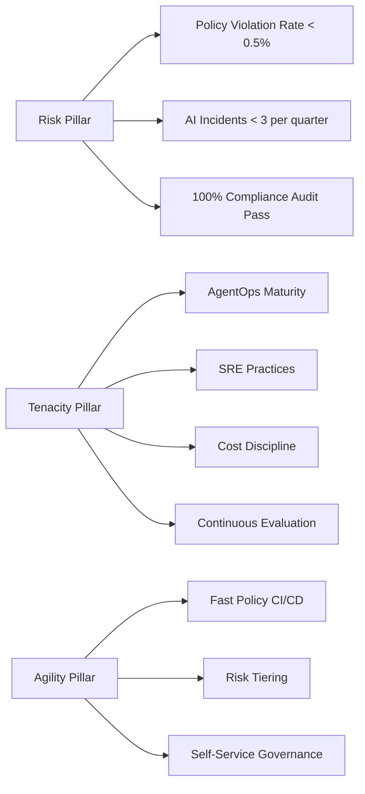

# Part 13 — Enterprise Governance & Production Engineering for Multimodal AI (Part 2)

Continuation covering the A.R.T. Framework applied to multimodal governance, operational discipline, and related architecture reference materials.

---
## A.R.T. Framework Applied to Multimodal Governance & Production

The [A.R.T. Framework (Agility · Risk · Tenacity)](../enterprise-architecture/ai-architecture/ART-Framework-Agentic-AI-Execution.md) provides a validated execution model for governing and sustaining multimodal AI systems. In the governance and production domain, the *Risk* and *Tenacity* pillars dominate — with *Agility* ensuring governance processes do not become bottlenecks to innovation.

### Risk Pillar — Governance Implementation

A.R.T. defines Risk as the governance discipline to identify, measure, control, and learn from AI-related risks. For multimodal AI in regulated industries, this translates to concrete governance controls:

| A.R.T. Risk KPI | Multimodal Governance Implementation |
|-----------------|-------------------------------------|
| Policy violation rate < 0.5% | OPA policies at API gateway; automated test suite against policy changes |
| AI incidents < 3 medium per quarter | AIDR-equivalent runtime monitoring for multimodal inputs (adversarial image detection, audio anomaly detection) |
| 100% compliance audit pass rate | Quarterly evidence pack: policy bundle versions, audit log samples, training certificates |
| Shadow AI score = 100% | Model registry enforced: no VLM endpoint reachable from production unless registered in MLflow |
| MTTC < 30 minutes | Kill switch + circuit breaker automation; runbook tested monthly in game day exercises |

**Governance Operating Model (A.R.T. aligned):**

```text
AI Council (strategic Risk ownership)
  ↓
AI Risk Officer (NIST AI RMF MAP/MEASURE/MANAGE ownership)
  ↓
Model Owner (per-agent accountability)
  ↓
Data Owner (modality-level data governance)
  ↓
Platform Team (OPA policy enforcement, audit log infrastructure)
```

### Tenacity Pillar — Sustained Production Operations

A.R.T. Tenacity addresses the operational discipline to keep AI systems healthy and improve them continuously. The multimodal production engineering section above implements Tenacity through:

| A.R.T. Tenacity Dimension | Multimodal Production Practice |
|---------------------------|-------------------------------|
| *AgentOps maturity* | Per-modality dashboards (OCR accuracy, VLM latency, ASR WER); automated alerting on regression |
| *SRE practices* | SLOs per workflow; error budgets; circuit breakers on VLM and OCR services; on-call runbooks |
| *Cost discipline* | GPU utilization targets (>70%); adaptive sampling; embedding caches; model tiering |
| *Continuous evaluation* | Nightly regression suite; adversarial red team quarterly; monthly HITL calibration session |
| *Organizational resilience* | Governance processes documented and tested; kill switch drilled; successor plans for key roles |

**A.R.T. Tenacity KPIs for Multimodal Production:**

| KPI | Target |
|-----|--------|
| Multimodal agent task success rate | > 90% (domain-dependent) |
| MTTR for P1 multimodal failures | < 15 minutes |
| Agent uptime (critical workflows) | > 99.5% |
| Cost per processed media unit | Tracked; trending down QoQ |
| Continuous improvement rate | ≥ 2 measured improvements per agent per sprint |

### Agility Pillar — Governance Without Bottleneck

Governance processes that take weeks to review model changes kill Agility. A.R.T. demands that governance enable speed, not just control:

- **Policy-as-Code CI/CD**: OPA policy changes reviewed and deployed in < 4 hours via automated PR gates, not manual approval chains
- **Risk tiering**: low-risk changes (prompt updates, confidence threshold tuning) on fast-track approval; high-risk changes (new modality, new data source, new external integration) on full ARB review
- **Self-service governance**: model owners access a governance dashboard showing their agent's current policy compliance, audit log health, and evaluation scores — without opening tickets

**Target:** time from model change approval to production deployment < 1 business day for low-risk changes.

---





## Related

- [A.R.T. Framework](../enterprise-architecture/ai-architecture/ART-Framework-Agentic-AI-Execution.md) — the execution methodology underpinning multimodal governance
- [Part 12 — Observability & FinOps](./part-12-observability-finops.md) — instrumentation and cost management that feeds into governance dashboards
- [Part 09 — Compliance & Responsible AI](./part-09-compliance-responsible-ai.md) — regulatory requirements and fairness obligations
- [Part 07 — Security & Threat Taxonomy](./part-07-security-threats.md) — threat model underlying many governance controls
- [Part 14 — Cloud Platform Comparison](./part-14-cloud-platform-comparison.md) — platform-specific governance tooling (Azure Policy, AWS Organizations, GCP Org Policy)


**This is Part 2 of 2. [Return to Part 1 ←](pathname:///archon/agentic-systems/multimodal/13-part-13-governance-production) for governance framework, approval workflows, policy-as-code, audit logging, risk scoring, kill switches, production engineering, GPU infrastructure, large media processing, and caching architecture.**
