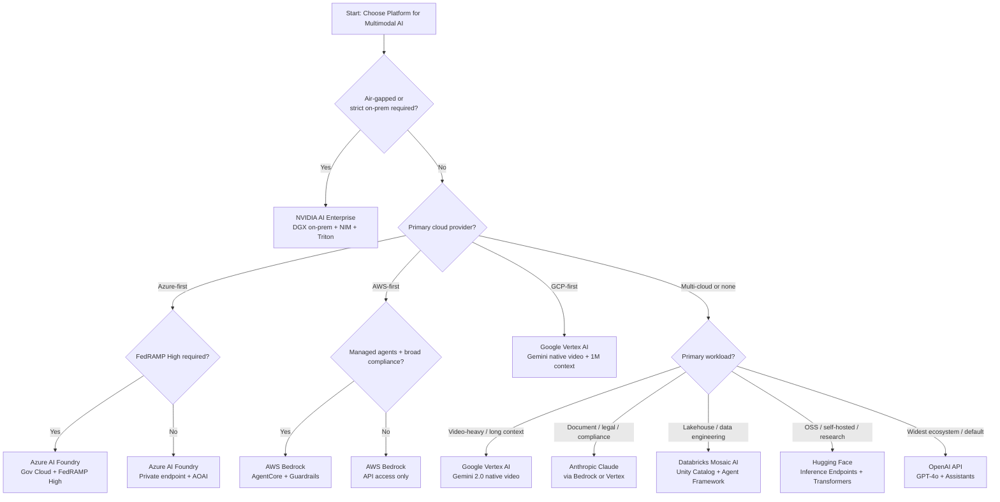

# Part 14 — Cloud Platform Comparison for Multimodal AI (Part 2)

## Selection Decision Tree

---

## Multi-Cloud Multimodal Architecture

### Why Single-Cloud for Multimodal Is a Risk

Single-cloud dependency for multimodal AI introduces three compounding risks:

**Model availability risk:** Cloud provider VLMs can be deprecated, rate-limited, or geographically unavailable during outages. GPT-4o was unavailable for several hours during major Azure incidents in 2024–2025. A platform solely dependent on one provider's VLM cannot route to an alternative without significant re-engineering.

**Compliance risk:** As multimodal AI regulations evolve, a single cloud provider may fail to achieve required certifications in new geographies (e.g., EU AI Act compliance, regional data residency). Organizations with operations across multiple jurisdictions need flexibility to route workloads to compliant providers.

**Cost lock-in risk:** Providers can and do increase API pricing. A customer entirely dependent on one provider for VLM inference has no negotiating leverage and no fallback. Having a qualified alternative reduces pricing risk significantly.

### Cross-Cloud Routing Patterns

**Abstraction layer:** Implement a model router that accepts a standard inference request and routes to the appropriate provider based on configured rules. The abstraction layer normalizes provider API differences (token counting, image encoding, response format) behind a unified internal API.

**Capability-based routing:** Route based on the required capability: long-video tasks to Vertex AI (Gemini); document understanding to Anthropic (Claude via Bedrock); standard visual QA to whichever provider has lowest latency and cost at the time of the request.

**Failover routing:** Primary provider configured per use case; secondary provider pre-configured and tested as failover. Automated circuit breaker triggers failover on primary provider errors. Regular quarterly failover drills ensure the secondary path remains operational.

### Data Gravity Considerations for Video and Audio

Large media files (video archives, audio recordings) create data gravity — the cost and latency of moving data between cloud providers makes it economically impractical to route processing away from the storage location. For a 5PB video archive stored in S3, routing to Vertex AI for Gemini video inference would cost millions in egress fees.

Design principle: **process data where it lives, or replicate at ingest time**. For multi-cloud multimodal, either run inference in the same cloud as storage (using the native provider) or implement a data replication strategy that pre-positions data in each cloud before inference season begins.

---

## Interview Use Cases

**Q: A global bank needs to deploy a multimodal AI system that processes customer documents and voice calls. It must meet GDPR (EU), MAS TRM (Singapore), and APRA (Australia) simultaneously, with data residency in each region. How do you architect this?**

A: I would deploy a geographically isolated multi-region architecture with three sovereign data planes — EU, Singapore, and Australia — and a single global control plane for governance and orchestration. Each data plane contains a complete multimodal AI stack: document processing (OCR, VLM), voice transcription and analytics, and vector search — all running within the regulatory boundary of that jurisdiction. Data never crosses regulatory boundaries at rest or in transit. For the EU data plane, I would deploy Azure AI Foundry in an EU-only region (Netherlands, France) with Azure Private Link for all API access, ensuring no data transits through non-EU Azure infrastructure. Azure's EU data boundary commitment provides the GDPR Article 44 data transfer mechanism. For Singapore (MAS TRM), I would use AWS Bedrock in the Singapore region (ap-southeast-1) with AgentCore and Knowledge Bases. MAS TRM requires that material workloads have documented business continuity with recovery time < 4 hours — implement active-passive failover to the Malaysia region. For Australia (APRA CPS 234), I would use Google Vertex AI in the Australia region (australia-southeast1) — APRA requires that data be stored in Australia and that the bank maintains control over security of the data. The global control plane (hosted in a neutral region or on-premises) handles model governance: model registry, policy-as-code (OPA), compliance reporting, and cost attribution across all regions. Each regional data plane reports aggregated metrics (no PII) to the global control plane. The model registry approves which model versions may run in each region — a model approved for EU must separately pass review for Singapore and Australia given different regulatory requirements.

**Q: Compare AWS Bedrock and Azure AI Foundry for building a healthcare multimodal agent that processes radiology images and clinical notes. Which would you recommend and why?**

A: Both platforms satisfy HIPAA BAA requirements, which is the threshold question. The choice comes down to three factors specific to healthcare multimodal. First, existing cloud footprint: if the hospital or health system is primarily Microsoft-invested (Epic on Azure, Microsoft 365), Azure AI Foundry wins on integration — Azure AD SSO, Teams integration, and Microsoft Purview for data governance are already in use. If the health system is AWS-native (Cerner on AWS, data lake in S3), Bedrock is the obvious choice. Second, specialized clinical services: Azure has a meaningful advantage with Azure Health Data Services (FHIR R4 API, DICOM service, MedTech service for IoT) — for a radiology workflow that ingests DICOM images, Azure's native DICOM service eliminates a significant integration build. AWS has Amazon HealthLake but it is less mature for imaging workflows. Third, model quality for clinical reasoning: Claude 3.7 Sonnet (available on both platforms) consistently outperforms GPT-4o on long-context clinical document analysis in published evaluations. On AWS Bedrock, I would use Claude via Bedrock + Amazon Textract for clinical note structure extraction + custom HealthLake FHIR integration. On Azure, I would use Claude or GPT-4o via AOAI + Azure Document Intelligence for clinical note extraction + Azure Health Data Services DICOM service. My recommendation in most cases: Azure AI Foundry, because the DICOM service + Health Data Services + Purview governance integration is materially ahead of AWS for DICOM-native workflows, and the Microsoft ecosystem alignment matters for enterprise healthcare clients. The exception: if the health system's data lake is in S3 and they use AWS data analytics services, Bedrock is the practical choice to avoid cross-cloud data movement.

**Q: How would you migrate from a single-cloud multimodal AI deployment to a multi-cloud architecture without downtime?**

A: A five-phase migration over 12–18 weeks. Phase 1 (weeks 1–2): Introduce an abstraction layer — a model router service that sits between the application and the cloud provider API. The router initially passes all traffic to the existing provider. This is a non-breaking change and can be deployed and validated without any user impact. Phase 2 (weeks 3–4): Implement the secondary provider integration behind the router. Test all use cases against the secondary provider in a staging environment. Validate output quality parity, response format normalization, error handling, and cost instrumentation. Phase 3 (weeks 5–8): Shadow routing — route 100% of traffic to the primary provider but simultaneously replay a copy to the secondary provider. Compare outputs without surfacing secondary results to users. This validates that the secondary provider produces acceptable quality on production traffic distribution. Phase 4 (weeks 9–12): Canary shift — route 5% of traffic to the secondary provider, monitor error rates, latency, and quality metrics. Increase to 20%, then 50% over two weeks, with rollback capability at each stage. Phase 5 (weeks 13–18): Capability-based routing configured per use case. Long-video tasks routed to Vertex; document analysis to Claude via Bedrock; standard visual QA load-balanced across providers by cost and latency. Full failover automation tested quarterly. The key success factor is the abstraction layer — without it, multi-cloud migration requires application changes at every provider integration point, which is prohibitively expensive and risky.

**Q: A government agency needs to process classified documents with vision AI in an air-gapped environment. Walk through the architecture.**

A: The architecture must assume zero internet connectivity and operate entirely from pre-loaded artifacts. Six components. Infrastructure: NVIDIA DGX H100 systems or equivalent on-premises GPU hardware. Kubernetes cluster (k3s for simplified air-gap operation) running the inference stack. No external network interfaces — physically isolated rack. Model delivery: ship model weights and NIM container images on approved removable media (encrypted, hash-verified) from an internet-connected build environment. Establish a formal model approval process: each model version is digitally signed on the internet side by the AI governance team, signature verified on the air-gapped side before deployment. Inference stack: NVIDIA Triton Inference Server running VLM NIM containers (Qwen2-VL or InternVL depending on document classification requirements). OCR via Tesseract or a validated commercial OCR engine packaged as a container. Embedding generation via a locally deployed embedding model. Vector search via Milvus or Weaviate running on-cluster. Governance: OPA running on-cluster evaluates policies against the classification level of each document. Model registry (MLflow on-premises) tracks all model versions and approvals. Audit logs written to an on-premises WORM storage system (NetApp ONTAP SnapLock or equivalent) — no log egress. Security controls: all inference requests authenticated against an on-premises identity provider (Active Directory). Input sanitization pipeline validates document format and classification markings before inference. Output review gate — inference outputs are queued for human review before any downstream action. Outputs containing classification markings are automatically redacted from logs (only metadata retained). Updates: model updates follow a periodic offline update process — authenticated media transfer with signature verification. A quarterly update cycle is typical for government air-gapped environments.

---

## Related

- [Part 12 — Observability & FinOps](../12-part-12-observability-finops.md) — platform-specific cost models and observability tooling
- [Part 13 — Governance & Production Engineering](../13-part-13-governance-production.md) — governance tooling available per platform
- [Part 9 — Compliance & Responsible AI](../09-part-09-compliance-responsible-ai.md) — regulatory mapping that drives platform selection criteria
- Databricks Agentic AI Reference (deep dive on Databricks Mosaic AI capabilities; not yet migrated)
