# Part 15 — Emerging Trends & Bibliography for Multimodal AI (Part 2)

## Continual and Federated Multimodal Learning

### Catastrophic Forgetting in Multimodal Models

Catastrophic forgetting occurs when fine-tuning a multimodal model on new domain data degrades performance on previously learned capabilities. For enterprise applications, this manifests as: a VLM fine-tuned on medical images that degrades its performance on document understanding, or a model updated on new product images that loses recall on historical product designs. Elastic Weight Consolidation (EWC) addresses this by penalizing changes to weights that are important for previously learned tasks, estimated via Fisher information. LoRA adapters for new domains avoid forgetting entirely by keeping the base model frozen and adding domain-specific delta parameters — the preferred approach for enterprise domain adaptation.

### Federated Multimodal Learning: Healthcare Consortia

Cross-hospital federated learning for medical imaging enables a shared model to benefit from data across 500 hospitals without any patient data leaving its originating institution. The model improves from the diversity of pathologies, imaging equipment, and patient demographics across institutions — addressing the long-standing problem of single-institution bias in medical AI models. The NVIDIA FLARE framework and PySyft provide the infrastructure for federated learning in regulated environments, with SecAgg+ for secure gradient aggregation and differential privacy guarantees.

---

## Open Research Gaps

The following problems remain substantially unsolved as of July 2026 — relevant for architects designing systems that depend on capabilities in these areas:

**Long-video understanding beyond 1 hour:** Even with 1M token context (Gemini 2.0), precise temporal grounding (locating the specific moment an event occurs in a 10-hour video) remains unreliable. The model can summarize, but cannot reliably timestamp.

**Multi-speaker diarization in noisy environments:** Speaker diarization accuracy drops sharply below 20dB SNR and with more than 6 simultaneous speakers — conditions common in factory floors, crowded public spaces, and emergency situations.

**Robust multimodal reasoning under adversarial conditions:** VLMs exhibit significantly lower accuracy on adversarially perturbed images compared to clean images. Unlike text, where adversarial robustness is better studied, visual adversarial robustness lacks standardized benchmarks and mitigations.

**Cross-lingual multimodal understanding:** Most VLM evaluation is English-centric. Performance on Arabic, Swahili, and many Southeast Asian languages in multimodal tasks (reading multilingual documents, understanding multilingual video) is significantly below English performance.

**Grounding accuracy for spatial reasoning:** VLMs struggle with precise spatial relationship reasoning ("the red box is to the left of the blue circle") in complex visual scenes with many objects. This is critical for robotics, GIS, and medical imaging applications.

**Temporal grounding precision in long videos:** Identifying the exact timestamp of an event in a long video with second-level precision is not reliably achievable with current models.

**Multimodal hallucination measurement standards:** Unlike text hallucination (where benchmarks like TruthfulQA and HallucinationBench exist), there is no broadly accepted benchmark for measuring cross-modal hallucination (e.g., VLM asserting the presence of objects not in the image).

**Privacy-preserving multimodal learning at scale:** Federated learning for large multimodal models with strong differential privacy guarantees while maintaining acceptable model quality remains an open research problem.

---

## Emerging Trends Timeline

```mermaid
timeline
    title Multimodal AI Emergence Timeline
    section 2023
        GPT-4V GA : Vision capability widely deployed
        LLaVA open source : Open VLM era begins
        Whisper v3 : ASR open source milestone
        Flamingo → open models : Research to production
    section 2024
        GPT-4o omni-modal : Unified audio+vision+text
        Claude Computer Use : GUI agent capability
        Gemini 1.5 Pro 1M context : Long video reasoning
        Realtime API : Sub-300ms voice agents
        C2PA v2.1 : Provenance standard matures
        RT-2 → pi-zero : VLA models practical
        EU AI Act enacted : Regulatory baseline set
    section 2025
        Gemini 2.0 multimodal gen : Native audio output
        On-device VLMs (Apple M4) : Privacy-first inference
        NVIDIA NIM production : Enterprise VLM serving
        Federated multimodal healthcare : Cross-hospital AI
    section 2026
        Omni-modal default : Single endpoint all modalities
        VLA enterprise adoption : Manufacturing + robotics
        C2PA mandatory (EU AI Act) : Provenance required
        Confidential GPU inference : TEE-protected VLMs
    section 2027 onwards
        World model planning : Agent simulation
        FHE embeddings : Encrypted semantic search
        Embodied foundation models : General-purpose robots
        Multimodal DP-SGD practical : Private training at scale
```

---

## Curated Bibliography

### Foundational Papers

**Vision-Language Models**

- Radford, A. et al. (2021). *Learning Transferable Visual Models From Natural Language Supervision* (CLIP). OpenAI. https://arxiv.org/abs/2103.00020
- Alayrac, J.B. et al. (2022). *Flamingo: a Visual Language Model for Few-Shot Learning*. DeepMind. https://arxiv.org/abs/2204.14198
- Liu, H. et al. (2023). *Visual Instruction Tuning* (LLaVA). https://arxiv.org/abs/2304.08485
- OpenAI (2023). *GPT-4V(ision) System Card*. https://openai.com/research/gpt-4v-system-card
- Google DeepMind (2023). *Gemini: A Family of Highly Capable Multimodal Models*. https://arxiv.org/abs/2312.11805
- Chen, Z. et al. (2024). *InternVL: Scaling up Vision Foundation Models and Aligning for Generic Visual-Linguistic Tasks*. https://arxiv.org/abs/2312.14238
- Wang, P. et al. (2024). *Qwen2-VL: Enhancing Vision-Language Model's Perception of the World at Any Resolution*. https://arxiv.org/abs/2409.12191
- Wang, W. et al. (2023). *CogVLM: Visual Expert for Pretrained Language Models*. https://arxiv.org/abs/2311.03079
- Li, K. et al. (2023). *VideoChat: Chat-Centric Video Understanding*. https://arxiv.org/abs/2305.06355

**Audio Foundation Models**

- Radford, A. et al. (2022). *Robust Speech Recognition via Large-Scale Weak Supervision* (Whisper). OpenAI. https://arxiv.org/abs/2212.04356
- Rubenstein, P.K. et al. (2023). *AudioPaLM: A Large Language Model That Can Speak and Listen*. Google. https://arxiv.org/abs/2306.12925

---

### Security and Safety

- OWASP Foundation (2025). *OWASP Top 10 for LLM Applications 2025*. https://owasp.org/www-project-top-10-for-large-language-model-applications/
- MITRE (2024). *MITRE ATLAS: Adversarial Threat Landscape for Artificial-Intelligence Systems*. https://atlas.mitre.org
- Gu, J. et al. (2024). *Agent Smith: A Single Image Can Jailbreak One Million Multimodal LLM Agents Exponentially Fast* (visual prompt injection taxonomy). https://arxiv.org/abs/2402.08567
- Brown, T.B. et al. (2017). *Adversarial Patch*. https://arxiv.org/abs/1712.09665
- Mazeika, M. et al. (2024). *HarmBench: A Standardized Evaluation Framework for Automated Red Teaming and Robust Refusal*. https://arxiv.org/abs/2402.04249

---

### Evaluation Benchmarks

- Yue, X. et al. (2024). *MMMU: A Massive Multi-discipline Multimodal Understanding and Reasoning Benchmark*. https://arxiv.org/abs/2311.16502
- Mathew, M. et al. (2021). *DocVQA: A Dataset for VQA on Document Images*. https://arxiv.org/abs/2007.00398
- Fu, C. et al. (2024). *Video-MME: The First-Ever Comprehensive Evaluation Benchmark of Multi-modal LLMs in Video Analysis*. https://arxiv.org/abs/2405.21075
- Guan, T. et al. (2024). *HallusionBench: An Advanced Diagnostic Suite for Entangled Language Hallucination and Visual Illusion in Large Vision-Language Models*. https://arxiv.org/abs/2310.14566
- Mialon, G. et al. (2023). *GAIA: A Benchmark for General AI Assistants*. Meta AI. https://arxiv.org/abs/2311.12983

---

### Standards and Regulations

- European Parliament (2024). *Regulation (EU) 2024/1689 on Artificial Intelligence (EU AI Act)*. Official Journal of the European Union. https://eur-lex.europa.eu/legal-content/EN/TXT/?uri=OJ:L_202401689
- NIST (2023). *AI Risk Management Framework 1.0 (AI RMF 1.0)*. National Institute of Standards and Technology. https://airc.nist.gov/RMF
- NIST (2023). *AI 100-1: Trustworthy and Responsible AI*. https://doi.org/10.6028/NIST.AI.100-1
- C2PA (2024). *C2PA Specification v2.1: Coalition for Content Provenance and Authenticity*. https://c2pa.org/specifications/specifications/2.1/specs/C2PA_Specification.html
- ISO/IEC (2023). *ISO/IEC 42001:2023 — Artificial Intelligence Management System (AIMS)*. International Organization for Standardization.

---

### GitHub Repositories

- Awesome Multimodal Large Language Models (comprehensive survey and model list): https://github.com/BradyFU/Awesome-Multimodal-Large-Language-Models
- VLMEvalKit — evaluation toolkit for multimodal LLMs: https://github.com/open-compass/VLMEvalKit
- Microsoft Prompt Flow — multimodal pipeline orchestration: https://github.com/microsoft/promptflow
- NVIDIA NeMo-Guardrails — programmable multimodal safety: https://github.com/NVIDIA/NeMo-Guardrails

---

### Conference Tracks

- NeurIPS 2024: Multimodal Foundation Models track — papers on cross-modal training, emergent capabilities, and evaluation
- CVPR 2024: Vision-Language Models workshop — architectural advances and benchmark evaluations
- ICLR 2024: Embodied AI workshop — VLA models, sim-to-real transfer, and robot foundation models

---

## Interview Use Cases

**Q: How would you advise a Fortune 500 company deciding whether to invest in building their own omni-modal foundation model vs fine-tuning existing models vs using API-only?**

A: Almost universally, the answer for a Fortune 500 company is fine-tuning existing models rather than building from scratch. The economics of foundation model training are prohibitive outside frontier AI labs: GPT-4-scale training costs $50M–$100M+ in compute alone, requires a team of 50+ ML researchers, and takes 6–12 months. The resulting model will be worse than frontier models available on-demand for < $0.01 per 1,000 tokens. The only legitimate reason a non-AI-product company would train a foundation model from scratch is for a highly specialized modality not covered by any existing model (e.g., proprietary scientific instrument data, classified defense sensor data) or for a case where all-weights ownership is a hard regulatory requirement. Fine-tuning or PEFT (LoRA, QLoRA) on existing models is the appropriate path for domain specialization — adapting Qwen2-VL or InternVL to a specific document type, industrial defect taxonomy, or specialized medical imaging modality costs $10,000–$100,000 in compute and 4–12 weeks of engineering. For 80% of enterprise use cases, API-only with carefully engineered prompts, retrieval augmentation, and output validation achieves production-grade quality without any fine-tuning. My framework: start with API-only and measure quality against business requirements. If quality gaps persist after prompt engineering and RAG, consider fine-tuning on domain data. Only if fine-tuning is insufficient and the use case involves proprietary modalities or all-weights ownership requirements should the company explore training. The strategic value is in the data pipeline, the domain knowledge embedded in training data, and the evaluation framework — not in owning the weights of a commodity transformer architecture.

**Q: A government wants to regulate synthetic media. Walk through the technical feasibility of mandating C2PA provenance on all AI-generated content.**

A: C2PA provenance mandates are technically feasible for content generated by registered AI services, but face three implementation challenges. First, coverage: a mandate only covers compliant implementations. Open-source generative AI (Stable Diffusion, Flux, Comfy UI) can generate content without any provenance signature — the creator simply does not sign, and the mandate is bypassed. This is analogous to requiring seat belts in factory-built cars but not home-built vehicles. The mandate would cover commercial AI services (OpenAI, Midjourney, Adobe Firefly) but not local generation. Estimate: 60–70% of commercial synthetic media would be covered by a provider-level mandate; perhaps 30–40% of all synthetic media (excluding open-source generation). Second, verification infrastructure: C2PA verification requires that platforms (social media, news sites, email clients) implement C2PA readers that surface provenance to end users. Without platform-level enforcement, users have no mechanism to check provenance. The EU's DSA (Digital Services Act) could mandate platform-level C2PA support for large platforms — this is the more tractable regulatory lever than requiring generators to sign. Third, adversarial robustness: C2PA soft binding (watermarks and perceptual hashes) survives typical manipulations (compression, resizing, color grading) but is defeated by aggressive adversarial processing. A determined attacker can strip or forge provenance. C2PA is not a tamper-proof solution — it is a friction-adding and deterrence mechanism for casual misuse, not a defense against sophisticated actors. My assessment: C2PA mandates are worth implementing because they address the majority of casual synthetic media misuse (disinformation campaigns using commercially generated images, non-consensual intimate imagery from commercial generators) while acknowledging that sophisticated adversaries will circumvent them. Complement with platform-level forensic detection as a second layer, and regulatory liability for platforms that knowingly host provenance-free synthetic media.

**Q: How would you design a federated learning system for multimodal medical imaging that allows 500 hospitals to collaboratively improve a model without sharing patient data?**

A: The architecture has six layers. Federation infrastructure: NVIDIA FLARE or PySyft as the federated learning orchestration framework — both support medical imaging workflows and have been deployed in clinical research contexts. The central server coordinates training rounds but never accesses raw data or individual gradients in the clear. Hospital clients: each hospital runs a local training node within its secure perimeter. The node has access to the hospital's labeled DICOM images and ground truth (radiologist annotations). It fine-tunes only the LoRA adapter layers of a base VLM (InternVL or a medical variant like BioViL), not the full model — this reduces gradient communication volume by 1,000× compared to full-model federated learning. Secure aggregation: use SecAgg+ protocol — hospitals encrypt their gradient updates before transmitting, and the server aggregates the encrypted gradients without seeing individual contributions. Only the aggregated (averaged) update is decrypted. Differential privacy: apply DP-SGD with calibrated Gaussian noise at each hospital before submitting gradients. The privacy budget (ε, δ) is chosen based on the hospital IRB requirements — typical values are ε = 4–8 for medical imaging. Data heterogeneity handling: hospital populations differ systematically (age, demographics, equipment, imaging protocols). Implement FedProx or SCAFFOLD instead of FedAvg to handle heterogeneous data distributions more gracefully. Evaluate model quality per hospital after each federation round — flag hospitals whose local data distribution causes their updates to diverge significantly (these may need custom federated averaging weights). Governance: an independent federation coordinator (e.g., a medical research consortium) manages the central server and audits the protocol. Each hospital signs a federation agreement specifying the purpose limitation (model improvement only), the data retained at the central server (none — only aggregated model updates), and the right to exit the federation and revoke their contribution at any time. Model quality is evaluated on a held-out multi-site evaluation dataset at the coordinator, with results shared with all participants.

**Q: What are the key architectural decisions when deploying a VLA (Vision-Language-Action) model in a manufacturing environment with strict safety requirements?**

A: Seven decisions dominate the architecture. First, inference latency vs safety margin: VLA models must produce actions faster than the robot's safety-critical decision window — typically < 100ms for stop decisions in collaborative robots (ISO/TS 15066). Profile the VLA inference latency at the 99th percentile and ensure the robot controller's safety layer can act on a conservative safe-stop command independent of the VLA output. The safety layer must never depend on the VLA being available. Second, action space restriction: constrain the VLA's output to a bounded action vocabulary specific to the manufacturing task. The VLA should output discrete actions (pick, place, inspect, reject, escalate) rather than raw joint positions — raw joint position output from a language model requires a downstream inverse kinematics layer and creates too large a failure surface. Third, confidence-based action gating: require a minimum confidence score before any action with physical consequences is executed. Below-threshold outputs trigger a safe-stop and escalate to a human operator. Fourth, simulation validation: every new VLA model version must pass simulation testing (NVIDIA Isaac Sim or Mujoco) across 10,000 randomized scenarios before physical deployment. Track success rate, collision rate, and graceful degradation rate under adversarial inputs. Fifth, fail-safe modes: define what the robot does when the VLA is unavailable (network timeout, model error, confidence below threshold): stop in place and signal for human intervention — never default to continuing the last action. Sixth, physical safety layer: the VLA operates above a deterministic safety controller (a PLC or safety-rated motion controller). The safety controller enforces hard limits (maximum force, workspace boundaries, collision detection via lidar/vision) that cannot be overridden by VLA outputs. Seventh, audit and change control: every VLA model version change in a manufacturing environment requires a formal Machine Safety Assessment (EN ISO 13849) and re-validation. Maintain a model registry with the validation evidence package (simulation results, physical trial results, failure mode analysis) for each approved version.

---

## Related

- [Part 1 — Foundations](../01-part-01-foundations.md) — foundational concepts this trends analysis builds on
- [Part 9 — Compliance & Responsible AI](../09-part-09-compliance-responsible-ai.md) — regulatory context including EU AI Act
- [Part 8 — Guardrails & Sanitization](../08-part-08-guardrails-sanitization.md) — deepfake detection and C2PA verification in guardrail pipelines
- [Part 14 — Cloud Platform Comparison](../14-part-14-cloud-platform-comparison.md) — current platform capabilities that emerging trends are extending
