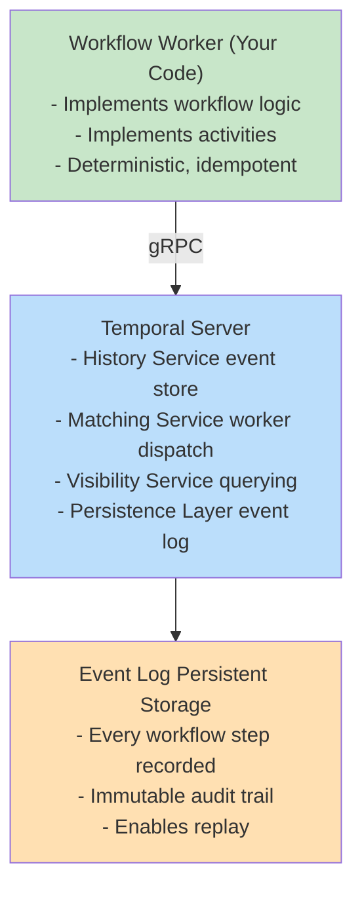
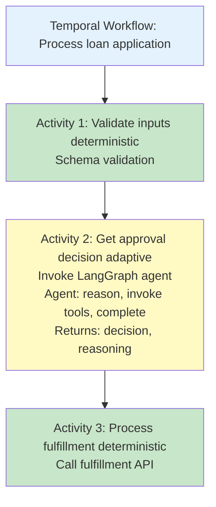

# Temporal Deep Dive

## Overview

Temporal is the de facto standard for **durable execution** in microservice architectures. Built by Uber to solve their own workflow coordination problems, Temporal provides a programming model where distributed systems failures become non-events—the framework recovers automatically.

**Key claim**: Temporal makes distributed transactions reliable without sacrificing performance or scalability.

---

## Core Architecture

### The Stack



### Key Concepts

#### 1. **Workflows** (Orchestration Logic)

```typescript
workflow MyWorkflow {
  // This code runs once per workflow execution
  // But can be replayed multiple times for recovery

  const result1 = await activity1()
  const result2 = await activity2(result1)

  if (result2.needsApproval) {
    await waitForSignal('approval')
  }

  return { status: 'complete', data: result2 }
}
```

**Properties**:

- Must be **deterministic** (same inputs → same code path)
- Can be replayed from any checkpoint
- Never loses state (even if server crashes)
- Single-threaded execution

---

#### 2. **Activities** (Real Work)

```typescript
activity getCustomer(customerId: string) {
  // This can fail, timeout, be retried
  // Temporal handles retry logic automatically

  const customer = await db.query({ id: customerId })
  return customer
}
```

**Properties**:

- Can fail, timeout, be retried
- Side effects are OK (calling APIs, writing to DB)
- Retry policy is declarative
- Timeout handling is automatic

---

#### 3. **Event Sourcing & Replay**

**Example: What happens if worker crashes during activity?**

```
Timeline:
  T1: Workflow starts
      → Event: WorkflowStarted

  T2: Activity1 invoked
      → Event: ActivityTaskScheduled

  T3: Activity1 completes
      → Event: ActivityTaskCompleted { result: "..." }

  T4: Activity2 invoked
      → Event: ActivityTaskScheduled

  T5: WORKER CRASHES
      → No event written yet for Activity2 result

  [Worker restarts]

  T6: Temporal server checks history
      → Sees: Started, Activity1Done, Activity2Scheduled
      → "Activity2 was scheduled but never completed"
      → Reschedules Activity2 on another worker

  T7: Activity2 completes on retry
      → Event: ActivityTaskCompleted

  T8: Workflow resumes from T4
      → (No need to re-run Activity1)
      → (Temporal replays to T4, then continues)
```

**Key insight**: Temporal's event log allows **checkpoint recovery**—restart from where you left off.

---

#### 4. **Determinism Requirement**

Temporal enforces determinism:

```typescript
// ❌ WRONG: Non-deterministic
workflow Workflow {
  const now = Date.now()  // Different each replay!
  const random = Math.random()  // Different each replay!
}

// ✅ CORRECT: Deterministic
workflow Workflow {
  const startTime = await activities.getCurrentTime()
  const random = await activities.getRandom()
}
```

**Why?** Temporal replays workflows from the event log. If the code path differs on replay, recovery breaks.

---

## Advanced Patterns

### 1. **Saga Pattern** (Distributed Transactions)

Problem: How to handle "transaction" across multiple services?

```typescript
workflow TransferMoney {
  try {
    await activity.withdrawFromA(accountA, amount)
    await activity.depositToB(accountB, amount)
  } catch (error) {
    // Compensate: reverse the operations
    await activity.depositToA(accountA, amount)  // Undo withdraw
    throw error
  }
}
```

**Semantics**:

- If both succeed: transfer complete
- If deposit fails: automatically refund A
- Temporal ensures compensation runs even if server crashes

---

### 2. **Long-Running Tasks with Human Approval**

```typescript
workflow ApprovalProcess {
  const submission = await activity.getSubmission(id)

  // Wait for human to approve (could be days)
  const approval = await waitForSignal('approval')

  if (approval.approved) {
    await activity.processApproved(submission)
  } else {
    await activity.processRejected(submission)
  }
}
```

**Key**: Workflow pauses without consuming resources. When signal arrives, it resumes.

---

### 3. **Cron Workflows** (Recurring Execution)

```typescript
workflow CronJob {
  // Schedule this to run every hour
  await activity.doSomething()
  // Continue to next period
}
```

Temporal automatically schedules and tracks recurring jobs.

---

### 4. **Versioning Workflows**

```typescript
const version = await Temporal.getVersion("my-change", 1, 2)

if (version < 2) {
  // Old behavior for existing workflows
  await activity.oldLogic()
} else {
  // New behavior for new workflows
  await activity.newLogic()
}
```

**Why?** You can't just change workflow code; existing workflows would replay incorrectly. Versioning lets you support both old and new workflows simultaneously.

---

## Temporal vs. AI Integration

### The Challenge: LLMs Break Determinism

```typescript
// ❌ PROBLEM: Non-deterministic
workflow DecisionWorkflow {
  const decision = await activity.askLLM("Should we approve?")
  // LLM might answer "yes" on first run, "no" on second run
  // Replay fails because decision changes
}
```

### Solution: Treat LLM as Deterministic Activity

```typescript
// ✅ SOLUTION: Deterministic
workflow DecisionWorkflow {
  // Invoke LLM, but cache the result
  const decision = await activity.askLLM({
    prompt: "...",
    model: "claude-3.5-sonnet",  // Fix the model version
    temperature: 0,              // Deterministic sampling
    cache_key: "loan-approval-123"  // Cache prevents re-running
  })
  // Result is deterministic within a workflow run
}
```

**Key**: The LLM call happens once per workflow execution. On replay, Temporal uses cached result. No re-invocation.

---

### Can Agents be Activities?

**Yes, but with caveats**:

```typescript
workflow ProcessWithAgent {
  // Invoke agent as a single activity
  const agentResult = await activity.runAgent({
    objective: "Approve this loan",
    tools: [...],
    context: applicationData
  })

  // Agent completes internally
  // Result is deterministic for this workflow run
}
```

**Design**: Agent runs to completion within one activity. Results are cached. Workflow sees only final result.

---

## Temporal Limitations with Agentic AI

| Aspect | Traditional Workflow | Agentic Integration | Gap |
| --- | --- | --- | --- |
| **Determinism** | Required | Breaks easily | Need versioning + caching |
| **Tool invocation** | Fixed set of activities | Unbounded tools | Need tool registry |
| **Reasoning** | Rules engine | LLM reasoning | Can't replay LLM internal state |
| **Learning** | Not applicable | Models improve | Models can't be versioned in event log |
| **Memory** | Workflow state | Agent memory (RAG) | Separate layers |
| **Observability** | Event history | Reasoning trace | Different trace formats |

---

## Reference: Temporal Concepts Glossary

| Term | Meaning |
| --- | --- |
| **Workflow** | Orchestration logic; the "script" |
| **Activity** | A unit of work; can fail and retry |
| **Worker** | Process running workflow/activity code |
| **Task Queue** | FIFO queue for work items |
| **History** | Event log of workflow execution |
| **Event Sourcing** | Deriving state from immutable event log |
| **Replay** | Re-executing workflow logic to recover state |
| **Signal** | Async message to pause/resume workflow |
| **Query** | Read-only question about workflow state |
| **Namespace** | Logical partition of workflows |
| **Search Attributes** | Indexed metadata for workflow queries |

---

## Decision: When to Use Temporal

### ✅ Good Fit

- Payment settlements (long-running, must be reliable)
- Order fulfillment (distributed, retry-heavy)
- Saga transactions (coordination across services)
- SLA-critical workflows (must complete predictably)

### ❌ Poor Fit

- Workflows requiring reasoning (use agents instead)
- High-frequency decisions (sub-second)
- Highly variable processes (use agents)

### ⚖️ Hybrid (Most Enterprises)

- **Temporal**: Coordinates the flow
- **Agent (Activity)**: Makes complex decisions
- **Result**: Reliable + Adaptive

---

## Architecture: Temporal + LangGraph



**Ownership**:

- Temporal: Reliability, state, retry logic
- Agent: Reasoning, tool invocation, adaptivity

---

## Temporal in 2026: Predictions

**Likely Evolution**:

1. Better LLM integration (built-in prompt versioning?)
2. Agent SDK compatibility (agents as first-class)
3. Reasoning trace export (to match agent tracing)

**Unlikely**:

- Temporal adding agentic reasoning (stays deterministic)
- LLMs replacing workflows (different concerns)

**Most Likely**: Temporal + LangGraph becomes the de facto pattern for enterprise orchestration.


## Related

- [Workflow vs Agent Architecture - Determinism, Adaptivity, and Design Principles](03-workflow-vs-agent-architecture.md) — the previous section in this series.
- [Camunda Deep Dive - BPMN, BPM, and AI Integration](05-camunda-deep-dive.md) — the next section in this series.

---

**Next**: Explore [Camunda and BPM](./05-camunda-deep-dive.md) for comparison, or jump to [Hybrid Architectures](./19-reference-architectures.md).
