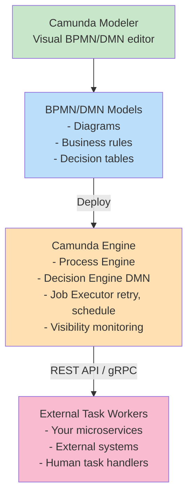
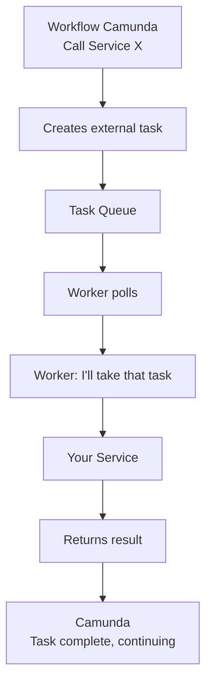
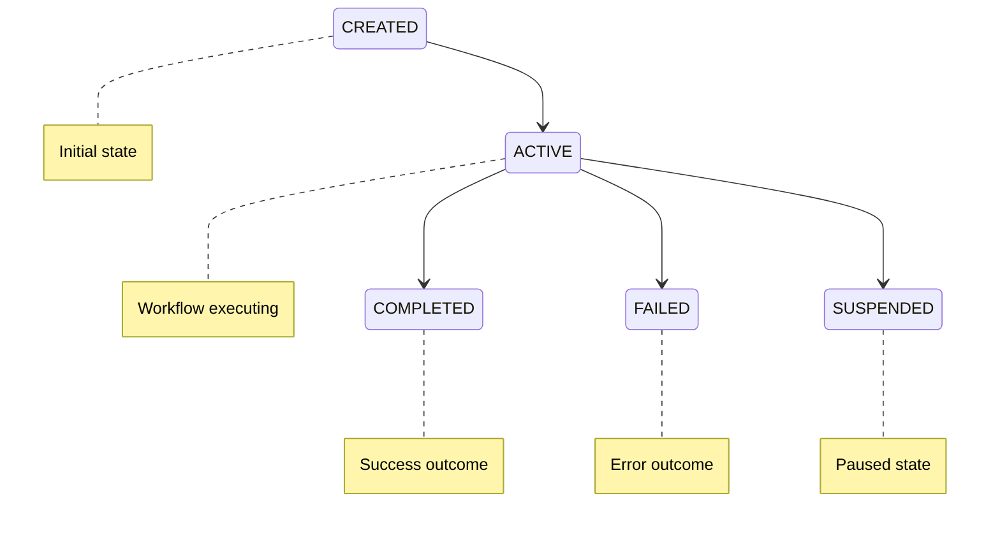
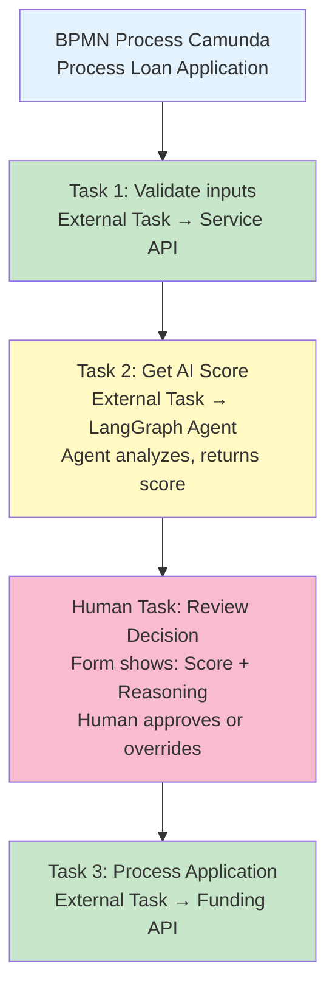

# Camunda Deep Dive

## Overview

Camunda is the **process governance engine** for enterprises. Where Temporal is built for developers (code-first, microservices), Camunda is built for enterprises (model-first, visual, compliance).

**Key claim**: Camunda lets business stakeholders define processes visually, then execute them reliably at scale.

---

## Core Architecture

### The Stack



---

## Key Concepts

### 1. **BPMN** (Business Process Model and Notation)

Visual standard for process modeling. Example:

Start → Validate → Decision: Valid?
- If YES: Process → End
- If NO: Reject → End

**Visual elements**:

- **Events**: Start, End, Intermediate
- **Tasks**: Service, User, Script, Send, Receive
- **Gateways**: Exclusive (if/else), Parallel (AND), Inclusive (OR)
- **Flows**: Sequence flow, message flow
- **Sub-processes**: Nested workflows

**Advantages over code**:

- Business analysts can read/modify it
- Visual inspection catches logic errors
- Easier to document processes
- Non-technical stakeholders understand it

---

### 2. **DMN** (Decision Model and Notation)

Decision tables replace business logic code:

**Input**: Income, Credit Score  
**Output**: Approval Status

| Income  | Credit Score | Approval |
|---------|--------------|----------|
| > $100k | > 700        | Approve  |
| > $50k  | > 650        | Manual   |
| &lt; $50k  | Any          | Reject   |

**Benefits**:

- Non-technical business users can maintain rules
- Version control is easy (compare table versions)
- Easy to test (input → expected output)
- Audit trail: "Rule V2.1 was applied"

---

### 3. **External Task Pattern**

Camunda doesn't execute your code directly. It **orchestrates external workers**:



**Advantages**:

- Workers can be written in any language
- Workers can be deployed independently
- Camunda doesn't need to run your code

---

### 4. **Human Tasks**

Process pauses for human action:

```
Workflow: "This order needs approval"
         ↓
Human Task Queue
         ↓
Human logs in, sees pending task
         ↓
Human reviews + approves/rejects
         ↓
Workflow resumes with decision
```

**Features**:

- Task assignment (by role, pool, or claim)
- Forms (collect data from user)
- Due dates and escalations
- Audit trail of who did what

---

## Camunda Architecture Patterns

### 1. **Process Instance Lifecycle**



Each instance has:

- **State**: Which element are we at?
- **Variables**: Data accumulated during execution
- **History**: Full log of what happened

---

### 2. **Job Executor** (Retry & Schedule)

```
Task scheduled with retry policy:
  max_retries: 3
  backoff: exponential (1s, 2s, 4s)

Execution 1: FAILED → backoff 1s
Execution 2: FAILED → backoff 2s
Execution 3: FAILED → backoff 4s
Execution 4: FAILED → move to dead letter queue
```

---

### 3. **Clustering & Scalability**

Multiple engine instances share:

- Single database
- Distributed lock on tasks
- Automatic load balancing

---

## Camunda vs. Temporal: Head to Head

| Aspect | Camunda | Temporal |
| --- | --- | --- |
| **Model** | Visual (BPMN/DMN) | Code (TypeScript, Java, Python) |
| **Primary audience** | Business analysts | Developers |
| **Determinism** | Supported | Required |
| **Long-running** | ✅ Human tasks supported | ✅ Signals for pausing |
| **Scalability** | Good (100k+ instances) | Excellent (100M+ instances) |
| **Observability** | UI dashboard | Event-driven traces |
| **DevOps** | Operate Cockpit UI | CLI + APIs |
| **Learning curve** | Easier for business users | Steeper for pure devs |
| **Cost** | License + self-hosted | Self-hosted or SaaS |

---

## Camunda + AI Integration

### Challenge: BPMN Doesn't Capture AI Reasoning

```
BPMN Decision:
  {Income > $100k, CreditScore > 700} → Approve

But agents don't use simple rules. They reason:
  "Income is $110k (stable for 3 years)
   Credit score is 680 (improving)
   Similar cases were approved
   → Approve with monitoring"
```

**Gap**: BPMN assumes discrete, deterministic decisions. AI makes probabilistic, reasoned decisions.

---

### Solution 1: AI as External Task

Replace DMN table with AI service:

```bpmn
[Loan Application] →
  [Service Task: Get Approval Decision] →
    Calls: LangGraph Agent (via REST)
    Agent reasons → returns decision
  → [Decision node] → Continue
```

**Trade-off**:

- ✅ Camunda retains control flow
- ✅ Process is still visible in BPMN
- ❌ Decision logic is hidden in agent
- ❌ Can't see why agent decided

---

### Solution 2: AI + Decision Review

Make AI-aided decision explicit:

```bpmn
[Loan Application] →
  [Service Task: Get AI Score] →
    LangGraph agent analyzes → outputs score + reasoning
  [Human Review Task] →
    Human sees AI reasoning → Approves or Overrides
  [Apply Decision] →
    Process application
```

**Trade-off**:

- ✅ Human-in-loop (governance)
- ✅ Transparent AI reasoning
- ❌ Slower (human review step)
- ✅ Audit trail (who approved)

---

### Solution 3: Prompts as Decision Logic

Treat prompts like business rules:

```bpmn
[Loan Application] →
  [DMN Decision: LLM-Based] →
    (Replaces decision table)
    Prompts LLM: "Analyze this application"
    Version: "ApprovalPrompt-v3"
  → [Result] → Continue
```

**Challenges**:

- Prompt becomes "production code" (needs versioning, testing, CR)
- Behavior can change with model updates
- Non-deterministic (same input ≠ same output)

**How to handle**:

- Version prompts (semantic versioning)
- Fix model version (Claude 3.5 Sonnet vs. Claude 4)
- Add temperature/seed for partial reproducibility

---

## Camunda in 2026: AI Integration Strategy

### Phase 1: Today (Service Integration)

```
BPMN → External Task → AI Service (LangGraph) → Result
```

- AI runs outside Camunda
- BPMN sees only result
- Camunda unchanged

### Phase 2: Near-term (Prompt-as-Task)

```
BPMN → New element: "Prompt Task" → LLM → Result
```

- Camunda adds native prompt invocation
- Prompts versioned like BPMN models
- Decision trace visible

### Phase 3: Long-term (Process Generation)

```
"Describe process in English" → AI generates BPMN → Deploy
```

- Prompts design processes
- BPMN is generated artifact
- Manual editing still possible

---

## Reference: Camunda Concepts Glossary

| Term | Meaning |
| --- | --- |
| **Process** | BPMN model definition |
| **Instance** | Running execution of a process |
| **Activity** | Task, sub-process, or event |
| **External Task** | Work item for external worker |
| **Human Task** | Pauses for human decision |
| **Variable** | Data associated with instance |
| **Message** | Async event triggering instance |
| **Signal** | Broadcast event to instances |
| **Job** | Scheduled/failed task |
| **Listener** | Hook called on events |
| **Decision** | DMN model for rule evaluation |

---

## Decision: When to Use Camunda

### ✅ Good Fit

- Regulated industries (compliance, audit)
- Long-running human processes (approval chains)
- Visual process understanding needed (stakeholders)
- Business users modify processes (self-service)
- Complex business rules (DMN)

### ❌ Poor Fit

- Microservice coordination (use Temporal)
- Real-time latency-critical workflows (use Temporal)
- Purely deterministic code (use Temporal)

### ⚖️ Hybrid (Enterprise)

- **Camunda**: User-facing processes (compliance, approval)
- **Temporal**: Internal orchestration (services)
- **Both**: Larger enterprises run both

---

## Architecture: Camunda + AI



---

## Camunda Predictions (2026–2030)

**Likely**:

1. Native prompt task support
2. Reasoning trace export
3. Tighter integration with AI frameworks

**Unlikely**:

- Camunda abandoning BPMN (visual is core value)
- Camunda competing with Temporal (different audiences)

**Most likely**: Camunda becomes the "AI-enhanced BPM platform" (visual + AI reasoning).

---

## Comparing Platforms: When to Choose What

```
Choose CAMUNDA if:
  - Non-technical stakeholders need to see/modify
  - Compliance/audit is critical
  - Long-running human processes

Choose TEMPORAL if:
  - Microservice reliability matters
  - Determinism is required
  - High throughput/scale needed

Choose HYBRID if:
  - You have both requirements above
  - (Camunda for user processes, Temporal for backend)
```


## Related

- [Temporal Deep Dive - Architecture, Patterns, and AI Integration](04-temporal-deep-dive.md) — the previous section in this series.
- [Durable Execution vs. Cognitive Execution](06-durable-vs-cognitive-execution.md) — the next section in this series.
- [Workflow Protocols: BPMN vs. Code-First Orchestration](../../protocols/24-workflow-protocols-bpmn-temporal.md) — why BPMN's standardization matters at the protocol level, beyond Camunda's own implementation of it.

---

**Next**: Explore [AI Coding Orchestrators](./07-ai-coding-orchestrators.md) to see how Claude Code/GitHub Copilot orchestrate differently, or read [Decision Matrix](./20-decision-matrix.md) for a comprehensive comparison.
