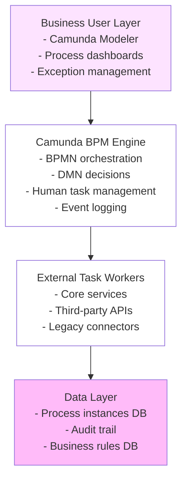
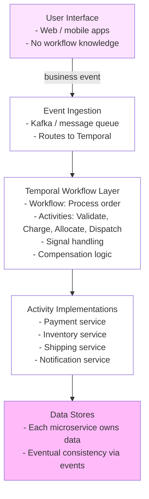
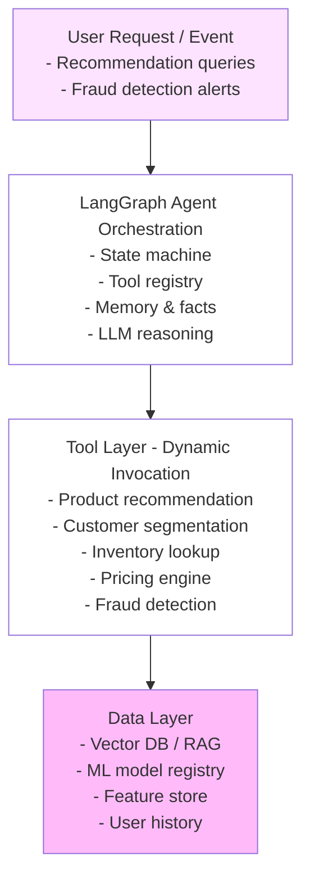
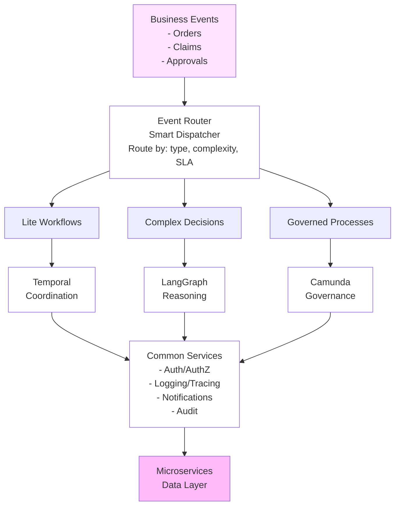
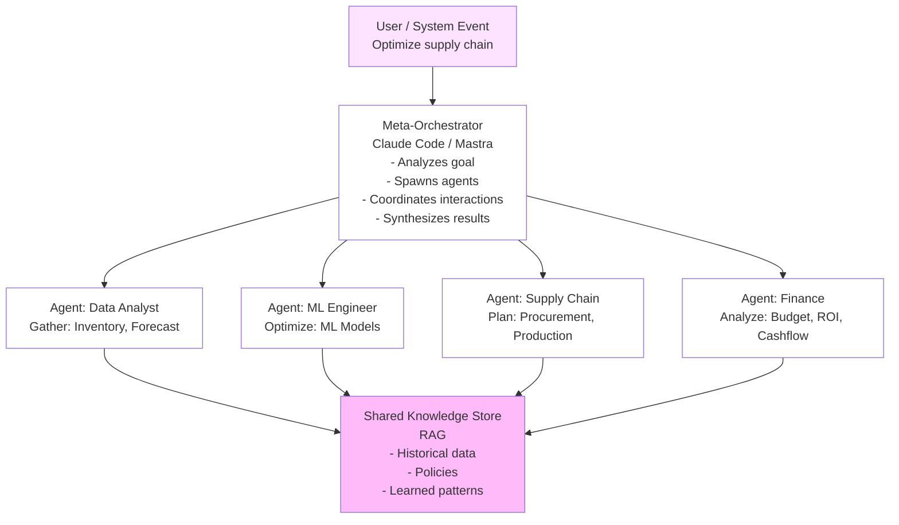

# Reference Architectures - From BPM-First to AI-Native

Five end-to-end architecture patterns for different enterprise contexts in 2026.

---

## Architecture 1: BPM-First Enterprise (Regulated Industries)

**Ideal for**: Banks, insurance, government  
**Constraint**: Compliance, audit, visual processes  
**Maturity**: Today (proven patterns)

### Design



### Characteristics

- **Orchestration**: Camunda (visual)
- **Decisions**: DMN tables (business rules)
- **AI**: Optional (via external service)
- **Audit**: Full trail in Camunda history
- **Human loop**: Native (human task elements)

### Example: Loan Approval

```
1. Application received (message trigger)
2. Data validation (service task)
3. Check business rules (DMN decision)
   - Income requirements?
   - Credit score thresholds?
   - Existing debt limits?
4. Route to appropriate approver (user task)
   - Loan officer if borderline
   - Manager if high-value
   - Automated if clear-cut
5. Approval decision (user input)
6. Fund if approved (service task)
7. Notify applicant (send task)
8. Complete
```

### Strengths

- ✅ Non-technical stakeholders understand process
- ✅ Visual audit trail
- ✅ Business rules easily changed
- ✅ Full compliance trail

### Weaknesses

- ❌ Difficult to add AI reasoning
- ❌ Can't discover new process paths at runtime
- ❌ Human approval becomes bottleneck at scale

### Governance

- Process versions in Camunda (version control)
- DMN versions (decision table history)
- Manual approvals logged with user ID/timestamp
- Audit export to compliance systems

---

## Architecture 2: Temporal-First Enterprise (Microservice Orchestration)

**Ideal for**: Tech companies, SaaS, real-time systems  
**Constraint**: Reliability, determinism, distributed coordination  
**Maturity**: Proven (2020+)

### Design



### Characteristics

- **Orchestration**: Temporal (code-first)
- **Decisions**: Code logic (if/then)
- **AI**: Via activities (agent as black box)
- **Audit**: Event sourcing (immutable history)
- **Human loop**: Signals (pause/resume)

### Example: Order Processing

```typescript
workflow ProcessOrder(orderId) {
  const order = await getOrder(orderId)

  try {
    await validateOrder(order)           // Can fail/retry
    await chargePayment(order)            // Can fail/retry
    await allocateInventory(order)        // Can fail/retry
    await dispatchShipment(order)         // Can fail/retry
  } catch (error) {
    // Compensation: refund payment
    await refundPayment(order)
    throw error
  }

  // Wait for signal from customer
  const cancellation = await waitForSignal('cancel')

  if (cancellation) {
    await cancelOrder(order)
  }
}
```

### Strengths

- ✅ Reliable across service failures
- ✅ Full replay and recovery
- ✅ Deterministic (audit-friendly)
- ✅ Scales to 100M+ workflows

### Weaknesses

- ❌ Determinism prevents AI reasoning
- ❌ Code-first means developers design processes
- ❌ Harder to adapt to changing business rules

### Governance

- Workflow code in Git (version control)
- Semantic versioning for workflows
- Test coverage for new workflow versions
- Replay testing (verify recovery works)

---

## Architecture 3: LangGraph-First Enterprise (AI-Native)

**Ideal for**: Analytics, personalization, data-driven decisions  
**Constraint**: Adaptivity, reasoning, learning  
**Maturity**: Emerging (2024+)

### Design



### Characteristics

- **Orchestration**: LangGraph (agent reasoning)
- **Decisions**: LLM with tools (adaptive)
- **AI**: Native (agents all the way down)
- **Audit**: Reasoning trace + outcome log
- **Human loop**: Via tool (agent can request human input)

### Example: Recommendation Engine

```python
agent_state = {
  "user_id": "123",
  "request": "What should I buy?",
  "context": {},  # Filled by agent
  "reasoning": [],  # Agent's thoughts
  "recommendation": None
}

# Agent loop
while not done:
  # 1. Reason about what to do
  reasoning = llm.think(agent_state)
  tool = reasoning.select_tool()

  # 2. Invoke tool
  if tool == "customer_profile":
    profile = get_customer_profile(user_id)
    agent_state.context.update(profile)
  elif tool == "product_search":
    products = search_products(agent_state.context)
    agent_state.context.products = products
  elif tool == "check_inventory":
    for p in agent_state.context.products:
      p.in_stock = check_inventory(p.id)
  elif tool == "price_products":
    for p in agent_state.context.products:
      p.price = get_price(p.id, user_id)  # Personalized
  elif tool == "finish":
    agent_state.recommendation = reasoning.output
    done = True

  agent_state.reasoning.append(reasoning)
```

### Strengths

- ✅ Adaptive (agent chooses best path)
- ✅ Learning (models improve over time)
- ✅ Flexible (easy to add new tools)
- ✅ Reasoning is transparent

### Weaknesses

- ❌ Non-deterministic (audit harder)
- ❌ LLM latency (not sub-second)
- ❌ Can hallucinate/fail in unexpected ways
- ❌ Compliance team anxious

### Governance

- Prompt versioning (semantic versioning)
- Model version tracking (Claude 3.5 vs 4.0)
- Tool registry (approved tools only)
- Reasoning audit log (why did agent choose this?)
- A/B testing (new agent version vs. old)

---

## Architecture 4: Hybrid Enterprise (Temporal + LangGraph + Camunda)

**Ideal for**: Large enterprises, multiple use cases  
**Constraint**: Balance all concerns  
**Maturity**: Emerging standard (2025+)

### Design



### Routing Logic

```
if (useCase.sla_critical && useCase.predictable) {
  // Payment settlement, order fulfillment
  → Route to Temporal

} else if (useCase.reasoning_heavy && useCase.adaptive) {
  // Recommendations, support classification
  → Route to LangGraph

} else if (useCase.human_approval && useCase.visible) {
  // Loan approval, contract review
  → Route to Camunda
}
```

### Characteristics

- **Temporal**: Coordination + reliability (payment, settlement)
- **LangGraph**: Reasoning + adaptation (decisions)
- **Camunda**: Governance + visibility (approvals)
- **Dispatcher**: Routes work to appropriate engine
- **Audit**: Unified trace across all three

### Example: Order Processing (Hybrid)

**Hybrid Order Processing Flow:**
1. Customer places order
2. Event Router determines: "This is predictable, high-SLA"
3. Temporal Workflow: ProcessOrder
   - Activity 1: Validate order
   - Activity 2: Check inventory (calls LangGraph)
     - LangGraph Agent analyzes demand patterns
     - Predicts availability
     - Suggests alternatives if needed
     - Returns availability data
   - Activity 3: Charge payment
   - Activity 4: Dispatch (calls Camunda if special case)
     - Camunda Process: SpecialOrder (human approval if needed)

### Strengths

- ✅ Each platform used for its strength
- ✅ Handles diverse use cases
- ✅ Mature (Temporal/Camunda proven)
- ✅ AI-ready (LangGraph integrated)

### Weaknesses

- ❌ Complex to operate (3 platforms)
- ❌ Latency: cross-platform calls add overhead
- ❌ Governance: need policy across platforms

### Governance Strategy

```
Layer 1: Dispatcher
  - Routes correctly? (unit tests)
  - Prevents infinite loops? (circuit breaker)
  - Tracks cross-platform traces? (correlation IDs)

Layer 2: Per-platform
  - Temporal: Workflow versioning, replay testing
  - LangGraph: Prompt versioning, model versioning
  - Camunda: BPMN approval, DMN testing

Layer 3: Unified
  - Business audit trail (all three platforms log to central store)
  - Reasoning trace (both Temporal and LangGraph export reasoning)
  - Outcome tracking (did the decision work?)
```

---

## Architecture 5: Multi-Agent Enterprise (AI-Orchestrated)

**Ideal for**: Next-gen AI systems, autonomous operations  
**Constraint**: Self-organizing, emergent behavior  
**Maturity**: Emerging (2025+)

### Design



### Agent Hierarchy

```
Agent 1 (Data Analyst)
  → Gathers: Current inventory, demand forecast, capacity
  → Uses tools: DB query, ML models, analytics
  → Outputs: { inventory: [...], forecast: [...], gaps: [...] }

Agent 2 (ML Engineer)
  → Receives: Data from Agent 1
  → Optimizes: Demand forecasting models
  → Outputs: { better_model: ..., accuracy_gain: 5% }

Agent 3 (Supply Chain)
  → Receives: Optimized forecast
  → Plans: Procurement, production, distribution
  → Outputs: { plan: {...}, cost: $X, lead_time: Y days }

Agent 4 (Finance)
  → Receives: Supply chain plan
  → Analyzes: Budget impact, ROI, cash flow
  → Outputs: { approved: true/false, reasoning: "..." }

Meta-Orchestrator
  → Coordinates all agents
  → Resolves conflicts (Agent 3 needs $10M, Finance only has $8M)
  → Synthesizes: Final optimization plan
  → Outputs: Executive summary + detailed recommendations
```

### Characteristics

- **Orchestration**: Multi-agent choreography (Mastra / CrewAI / Claude Code)
- **Reasoning**: Each agent is specialized LLM
- **Memory**: Shared knowledge base (RAG)
- **Learning**: Agents improve from past decisions
- **Autonomy**: Can execute changes (with human approval gate)

### Strengths

- ✅ Handles complexity (many specialized agents)
- ✅ Learns over time
- ✅ Highly adaptive
- ✅ Can discover new solutions

### Weaknesses

- ❌ Governance nightmare (who decided what?)
- ❌ Debugging is hard (complex agent interactions)
- ❌ Compliance teams very nervous
- ❌ Still immature (2025+)

### Governance Strategy

```
Approval Tier 1 (Automated)
  - Agents propose changes < $100k
  - Auto-approved if within policy

Approval Tier 2 (Manager Review)
  - $100k-$1M: Manager reviews reasoning traces
  - Decision time: < 1 day

Approval Tier 3 (Executive)
  - > $1M: Executive review + reasoning
  - Decision time: < 1 week

Audit Layer (Always)
  - All agent reasoning logged
  - All decisions tracked
  - Rollback capability for wrong decisions
```

---

## Choosing Your Architecture

**If you're building a new system:**
- **Year 1**: Start with one platform (Temporal or Camunda)
- **Year 2**: Add complementary platform
- **Year 3+**: Add LangGraph/Claude Code as needed

**If you're evolving an existing system:**
- **Legacy + Camunda**: Keep Camunda, add Temporal for new services
- **Temporal only**: Add LangGraph for reasoning
- **All three**: Add Claude Code for meta-orchestration

---

**Next**: Read [Future Predictions](./21-future-predictions.md) to understand where this is all headed, or jump to [Decision Matrix](./20-decision-matrix.md) for platform selection.
