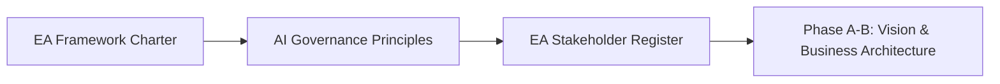

# AIDLC TOGAF Artifacts: Preliminary Phase

Part 1 of 4 — continues to [Part 2: Vision & Business Architecture (Phase A-B)](./parts/05-aidlc-artifacts-togaf-vision-business-architecture.md).

Enterprise architecture artifacts for TOGAF ADM Preliminary Phase, with AI-First extensions that adapt TOGAF 10 for AI-integrated enterprises.

This part covers artifact templates for the TOGAF 10 Preliminary phase, showing the enterprise-architecture governance artifacts an EA team maintains around an AIDLC delivery. All templates trace to the same illustrative example — a Credit Risk AI Scoring Model — shown here for a fictional "GlobalBank plc" as the EA-programme sponsor.

**Audience:** Enterprise Architects, Chief Technology Officers, Governance Leaders, AI Governance Council Members

**Coverage:** TOGAF ADM Preliminary Phase · AI-First Extensions

**As of:** 2026

## How to Read This Document

This guide presents artifact templates structured around TOGAF 10 ADM phases. Each artifact uses a fictional "GlobalBank AI Transformation Programme 2026" as example content. Blue italic text shows example field values. Replace all blue italic example values with your actual project data.

All field labels are mandatory unless marked [OPTIONAL]. Mandatory fields require approval before phase advancement.

Fields marked ! are AI-First extensions added to TOGAF 10 and not present in standard TOGAF 10. These are required for AIDLC-integrated EA and for organizations pursuing ISO/IEC 42001 or EU AI Act compliance.

Artifact IDs follow the format: EA-[Phase]-[Type]-[NNN]. For example, EA-B-HATB-001 = Business Architecture, Human-AI Task Boundary, first instance.

Each artifact shows upstream inputs and downstream outputs to trace lineage through the ADM cycle.

**TOGAF 10 Compliance:** All standard TOGAF 10 artifacts are included at their minimum viable form. AI-First extension fields are additive — they do not replace standard TOGAF artifacts.

---

## TOGAF ADM Preliminary Phase

**ARTIFACTS: EAFC-001 · AGP-001 · ESR-001**

The Preliminary phase establishes the EA framework, governance model, and AI governance principles before any architecture work begins. In AI-first enterprises, this phase must produce a Constitutional AI commitment and establish the AI Governance Council as an EA stakeholder.

### EA Framework Charter

**EAFC-001**

Owner: Chief Architect / CIO | ADM Phase: PRE | TOGAF 10 + AI-First Extension

| **Charter Scope & Authority** | |
|---|---|
| **Organisation** | *GlobalBank plc — Digital & Technology Division* |
| **EA Framework Adopted** | *TOGAF 10 (The Open Group Architecture Standard, 10th Edition, 2022)* |
| **Charter Version / Status** | *v2.1 — Approved 15 January 2026* |
| **EA Programme Scope** | *Enterprise-wide: all business units, all technology investments &gt;£500K, all AI systems (any cost)* |
| **EA Authority** | *Architecture Review Board (ARB) has binding authority over all technology architecture decisions. No AI system may be deployed without ARB sign-off at AIDLC Phase 6.* |
| **Chief Architect** | *Dr. Priya Mehta, Group Chief Architect (Board-level authority)* |
| **Review Cycle** | *Annual framework review; quarterly AI governance review; immediate review on regulatory change* |

**AI-First Extensions**

| **AI Governance Council** | *Established as permanent EA stakeholder body. Composition: CRO, CPO, CISO, Chief Data Officer, Chief Architect, External AI Ethics Advisor. Quorum: 4 of 6 required for AI system approval.* |
|---|---|
| **Constitutional AI Commitment** | *GlobalBank commits to AIDLC governance for all AI systems. Constitutional AI Policy is a mandatory output of Phase 4 (Model Design). No AI system proceeds to development without an approved CAP.* |
| **AIDLC Integration** | *TOGAF ADM phases B, C, D incorporate AIDLC Phase Gates as mandatory Architecture Compliance milestones. See ACC-001 for the compliance checklist.* |
| **Regulatory Alignment** | *EA framework explicitly aligned with: EU AI Act (all risk tiers), NIST AI RMF (Govern-Map-Measure-Manage), ISO/IEC 42001, FCA operational resilience requirements.* |

### AI Governance Principles

**AGP-001**

Owner: AI Governance Council | ADM Phase: PRE | TOGAF 10 + AI-First Extension

| **#** | **Principle** | **Statement** | **Implementation Mechanism** |
|---|---|---|---|
| AGP-1 | Human Primacy | AI systems augment human judgment; they do not replace it for consequential decisions. Human override capability is mandatory in all TIER 1–2 AI systems. | HITL controls documented in AIDLC Phase 4; HITL trigger rates monitored Phase 8 |
| AGP-2 | Explainability by Design | Explainability is an architecture constraint, not a post-hoc addition. Every AI system must explain its outputs in terms meaningful to affected stakeholders. | Explainability approach selected in Phase 4 ADR; tested in Phase 6 red-teaming |
| AGP-3 | Fairness & Non-Discrimination | AI systems must not perpetuate or amplify discrimination against legally protected groups. Bias assessment is mandatory before and after training. | Bias Baseline in Phase 3; Fairness Evaluation in Phase 6; ongoing monitoring Phase 8 |
| AGP-4 | Privacy by Design | Personal data used in AI must be processed lawfully, fairly, and with purpose limitation. PII must be masked before LLM processing. | Privacy Impact Assessment Phase 3; data minimisation in Data Sheet; PII masking in deployment |
| AGP-5 | Transparency | Individuals affected by AI decisions must be informed that AI was used, understand the decision basis, and have a clear path to challenge. | User Disclosure Documentation Phase 7; adverse action notices; appeal mechanisms |
| AGP-6 | Security & Robustness | AI systems must be designed to resist adversarial attack, distributional shift, and prompt injection. Security is assessed by the red team in Phase 6. | AI Threat Model Phase 4; Red Team Report Phase 6; Zero Trust enforcement Phase 7 |
| AGP-7 | Accountability | A named individual owns every deployed AI system. Ownership includes governance compliance, performance monitoring, and incident response. | AI System Inventory records owner; owner signs off Phase 7 deployment runbook |
| AGP-8 | Proportionality | AI governance intensity scales with risk tier. TIER 4 (minimal risk) follows lightweight AIDLC; TIER 1 (unacceptable risk) is prohibited. | Risk Classification (RCS-001) determines AIDLC governance track at Phase 1 |

### EA Stakeholder Register

**ESR-001**

Owner: Chief Architect | ADM Phase: PRE | TOGAF 10 + AI-First Extension

| **Stakeholder Group** | **Members** | **Interest** | **Influence** | **EA Role** | **Engagement Points** |
|---|---|---|---|---|---|
| AI Governance Council | CRO, CPO, CISO, CDA, Chief Architect, Ethics Advisor | High | High | Approve AI system deployments; review CAP; set AGP | Monthly governance review; Phase 4 & 6 gates |
| Architecture Review Board (ARB) | Chief Architect, Domain Architects, Security Architect, Data Architect | High | High | Approve all architecture decisions; review ADRs | Phase gate reviews; emergency sessions for P0 incidents |
| Business Unit Owners | VPs per domain (Credit, Operations, Marketing, HR, Security) | High | Medium | Sponsor AI use cases; approve business architecture | Phase A discovery; Phase B capability mapping |
| Data Governance Board | Chief Data Officer, Domain Data Owners, DPO | High | High | Approve data strategy; sign off Data Sheet and PIA | Phase C1 data architecture reviews |
| Model Risk Management | Chief Risk Officer, Model Risk Managers | High | High | Assess and sign off high-risk AI model deployments | Phase 6 evaluation sign-off; Phase 8 quarterly audit |
| External Regulators | FCA, ICO, EU AI Act National Authority | High | Low (can influence) | Regulatory compliance; supervisory examination | Annual regulatory reporting; incident notification &lt;72h |
| Technology Teams | Engineering, DevOps, MLOps, Data Engineering | Medium | High | Implement architecture; operate AI systems | All phases; primary AIDLC delivery |
| Affected Customers | Retail and corporate banking customers | High | Low (consulted) | Fairness, transparency, right to explanation | FRIA consultation; user testing; appeal channel |

---

## Related

- [01-aidlc-artifacts-discovery-to-model.md](01-aidlc-artifacts-discovery-to-model.md) — AIDLC Phases 1–4 artifact templates
- [02-aidlc-artifacts-development-to-retirement.md](02-aidlc-artifacts-development-to-retirement.md) — AIDLC Phases 5–8 artifact templates
- [parts/05-aidlc-artifacts-togaf-vision-business-architecture.md](./parts/05-aidlc-artifacts-togaf-vision-business-architecture.md) — Part 2: Vision & Business Architecture (Phase A-B)
- [parts/06-aidlc-artifacts-togaf-data-application-architecture.md](./parts/06-aidlc-artifacts-togaf-data-application-architecture.md) — Part 3: Data & Application Architecture (Phase C1-C2)
- [parts/07-aidlc-artifacts-togaf-technology-architecture.md](./parts/07-aidlc-artifacts-togaf-technology-architecture.md) — Part 4: Technology Architecture (Phase D)
- [04-aidlc-artifacts-togaf-migration-to-ea.md](04-aidlc-artifacts-togaf-migration-to-ea.md) — TOGAF ADM Migration through EA Cross-Cutting artifacts

## Sources

None currently documented.
