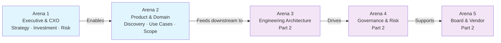
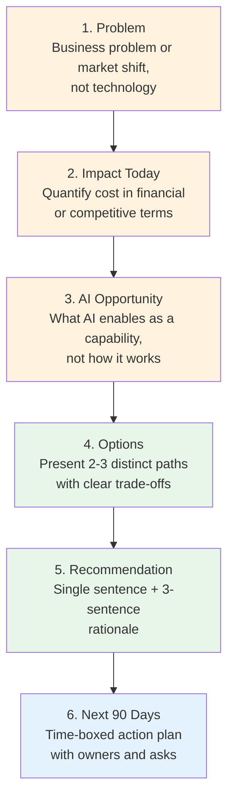

# EA Architect Deep Dive — The Five Arenas (Part 1 of 2)

This document covers two arenas of architect communication: Executive & CXO (Arena 1) and Product & Domain Stakeholder Communication (Arena 2). For Engineering & Architecture, Governance/Risk/Operations, and Board/Vendor/External arenas, see [Part 2 of 2](./parts/37-ea-architect-deep-dive-five-arenas-part2.md).

Continues from [Part 1 — Foundation](./05-ea-architect-deep-dive-foundation.md).

## The Five Arenas Communication Model

Architect credibility depends on fluency across five distinct communication arenas. Each arena has its own audience, vocabulary, decision criteria, and artifact requirements. Master all five, and you shape enterprise AI strategy at scale. Master only one or two, and you remain technically competent but strategically marginal.

The two arenas in this part—Executive & CXO and Product & Domain Stakeholder—form the business-facing foundation of AI architecture communication.

---

## Section 04 — Arena 1: Executive & CXO

Translating AI/agentic architecture into business value, risk, and investment choices for the people who control budget, policy, and strategic direction.

## Executive / CXO Arena

**Strategy · Investment · Risk · Competitive Positioning**

### The Fundamental Shift in This Arena

Executives are not interested in how AI works. They are interested in what it does to the business — and what happens if it goes wrong. Every technical concept must be translated into one of five business lenses before it is ready for an executive audience: revenue impact, cost impact, risk exposure, speed advantage, or competitive position. If you cannot connect an architectural decision to at least one of these lenses, it should not appear in an executive communication.

The second critical shift is from monologue to decision-support. The purpose of executive communication is not to inform — it is to enable a decision. Every executive conversation should end with a clear answer to: "What are you asking me to decide or approve?" If that question cannot be answered, the communication is not ready.

### The Six-Part Storyline Structure

Use this structure for every executive communication — whether a 2-minute hallway conversation, a steering committee update, or a board presentation. The structure is the same; only the depth changes.

**Problem:** Open with the business problem or market shift, not the technology. The problem must be one the executive already recognises and cares about. If you spend more than 20 seconds establishing the problem, you have chosen the wrong problem.

Example: "Our compliance team reviews 4,000 contracts monthly. It takes 3 weeks and costs $2.1M annually. Meanwhile, contract cycle time is one of our top 3 customer complaints."

**Impact Today:** Quantify the cost of the current situation in financial or competitive terms. Use specific numbers wherever possible. Executives distrust vague impact statements ("significant inefficiency") and respond to concrete ones ("$2.1M annually, 21-day cycle time"). If you do not have exact numbers, use ranges with sources.

Example: "The 21-day review cycle is costing us approximately 3 deals per quarter in a market where close speed is a top-3 buying factor."

**AI Opportunity:** Describe specifically what AI enables — not how it works. Frame the opportunity as a capability the business gains, not a technology the IT department deploys. Connect it directly to the problem and impact you just described.

Example: "An AI contract review capability could reduce review time from 21 days to 4 days for standard contracts, handling 70% of volume automatically."

**Options:** Present 2–3 distinct paths forward, each with a clear trade-off statement. Executives who are given only one recommendation feel railroaded; those given more than three feel overwhelmed. Two or three options, clearly differentiated, is the optimal structure. Name each option simply: "Fast Track", "Measured", "Strategic".

Example: "Option A — Fast Track: Deploy a vendor solution in 90 days, $400K. Option B — Build: Custom solution in 12 months, $1.2M with higher long-term control."

**Recommendation:** State your recommendation in a single, unambiguous sentence. Then give the three-sentence rationale. Do not hedge excessively — executives read hedging as lack of conviction. If you are genuinely uncertain, say so explicitly and state what information would resolve the uncertainty.

Example: "I recommend Option A. It hits the speed-to-value threshold at acceptable risk, and the vendor contract includes a data portability clause that protects us if we decide to build in-house later."

## Related

- [EA Architect Deep Dive: Foundation](05-ea-architect-deep-dive-foundation.md) — Part 1 of this series.
- [EA Architect Deep Dive: Toolkit & Practice](07-ea-architect-deep-dive-toolkit-practice.md) — Part 3, following this stakeholder-communication part.
- [Business Communication & Executive Skills](82-ea-business-communication-executive-skills.md) — deeper dive on the executive-communication arena.

**Next 90 Days:** Close with a specific, time-boxed action plan. Name owners, milestones, and the specific approval or resource you need from this audience. The 90-day window is deliberate — it is long enough to show meaningful progress, short enough to feel accountable. Do not end with "we will need to discuss further" — end with a specific ask.

Example: "To proceed, I need approval for $50K in Q3 to run a 60-day pilot with three contract types. By day 60, we will have accuracy data to make the full deployment decision."

### Executive Vocabulary — Complete Shift Table

Internalise this table. The goal is not to dumb down the communication — it is to connect the technical reality to the frame the executive already uses to make decisions. Precision is preserved; jargon is replaced.

| Technical Term | Executive Translation | Why the Translation Works |
|---|---|---|
| Large Language Model (LLM) | AI reasoning engine | Focuses on function, not implementation |
| Embedding / vector search | Semantic knowledge search | Describes the business outcome |
| RAG pipeline | AI with verified knowledge retrieval | Emphasises accuracy controls |
| Hallucination | AI accuracy risk / unreliable responses | Maps to a known risk category |
| Fine-tuning | Domain specialisation investment | Frames as a strategic capability build |
| Agentic system | Autonomous AI workflow | Connects to process automation frame |
| Multi-agent orchestration | AI workflow coordination across tasks | Describes the capability |
| Prompt engineering | AI behaviour configuration | Positions as a managed control |
| Token limits / context window | AI working memory capacity | Frames as a resource constraint |
| Latency / p99 | Response speed under load | Connects to user experience |
| MLOps / LLMOps | AI operating model | Uses familiar operations language |
| Model drift | AI performance degradation over time | Maps to known quality risk frame |
| RLHF / alignment | AI behaviour training for organisational standards | Frames as a governance control |
| Vector database | AI knowledge base infrastructure | Functional description |
| Inference cost | AI operating cost per interaction | Direct financial connection |
| Model evaluation / evals | AI quality assurance | Maps to existing QA mental model |
| Guardrails / safety layers | AI policy enforcement controls | Governance-ready language |

### The Three Artifacts You Must Always Have Ready

Maintain these three artifacts in a state of permanent readiness — updated at least quarterly. They are the tools of executive communication:

**AI Strategy One-Pager:** Vision + 3 strategic themes + non-negotiable guardrails + 90-day next actions. Fits on one A4 page. Written in business language throughout. Reviewed and updated at every strategy cycle. The test: a CFO who has never met you should understand it in under 3 minutes.

**Capability Heatmap:** A grid of business capabilities on one axis and AI readiness dimensions on the other (data, technology, governance, change). Cells are coloured green/amber/red. Shows where AI investment applies across the organisation and what the sequencing logic is. Updated as initiatives progress.

**Investment Roadmap:** A phased timeline across four investment buckets: Platform (infrastructure), Pilots (validated use cases), Scale (production deployment), Governance (controls and compliance). Shows cash flow, value milestones, and decision gates. Updated quarterly.

### Investment Framing Patterns

Executives think in investment frames aligned to business decision processes. Know which one applies to your conversation and frame accordingly:

| Frame | When to Use | Language Pattern | Risk to Avoid |
|---|---|---|---|
| Cost Reduction | When AI replaces manual effort at scale | "Currently costs $X. AI reduces this to $Y, saving $Z annually at current volume." | Overpromising automation percentage before pilot data exists |
| Revenue Enablement | When AI accelerates revenue-generating activities | "Each week of cycle time reduction is worth approximately $X in close-rate improvement." | Attributing all revenue gain to AI without accounting for other factors |
| Risk Reduction | When AI prevents costly errors or compliance breaches | "The current process misses an estimated X% of compliance flags. AI reduces this to Y%." | Framing risk reduction without quantifying the cost of the risk being mitigated |
| Competitive Parity | When competitors have AI capability you lack | "Competitors A and B have deployed this capability. Our gap creates X specific vulnerability." | Using fear without a credible plan — this reads as panic, not strategy |
| Option Value | When the investment creates future capability without locking in | "This $X investment creates the data and model foundation that enables $Y of future value." | Using "option value" as cover for uncertain ROI — executives see through this |

### What Distinguishes Principal-Level Executive Communication

Principal architect signal: If you walk into every executive conversation with the six-part storyline structure memorised, the vocabulary shift table internalised, and the three artifacts updated, you will consistently sound like someone who understands the business — not just the technology. That is the signal that generates invitations to the conversations that shape strategy.

---

## Section 05 — Arena 2: Product & Domain Stakeholder Communication

Bridging business problems and AI solutions without overwhelming domain stakeholders — and building the co-ownership that makes AI adoption stick.

## Product / Domain Arena

**Discovery · Use Cases · Scope · Co-ownership**

### The Co-ownership Principle

The fundamental goal in Arena 2 is not to deliver a correct AI specification — it is to create a stakeholder who co-owns the use case definition. When domain stakeholders feel that the AI solution was built with them rather than for them, adoption rates are significantly higher, scope creep is lower, and the feedback loop in production is far more productive. The discovery conversation is the mechanism for building that co-ownership.

This arena is where the listening skills from foundational work are most directly applied. The diagnostic conversation is not a needs-gathering exercise — it is a shared exploration in which the stakeholder arrives at a clearer understanding of their own problem, with your help. That experience of being helped to think more clearly is what builds the trust that sustains the AI initiative through its inevitable difficult moments.

### The Discovery Conversation Flow — In Full

This is a structured sequence of six conversation phases. The sequence matters — do not skip phases or reorder them. Each phase builds the foundation the next one requires.

| Phase | Business Objective | Key Actions & Questions |
|---|---|---|
| 1. Business Objective Alignment | Open every conversation by establishing what business outcome the stakeholder is ultimately accountable for — not the AI project objective, but the business objective the AI project is meant to serve. | Opening questions: "What does success look like for your team this year?" / "What outcome would make the biggest difference to your business KPIs?" / "What would need to be true in 12 months for this to have been worth it?" |
| 2. Current Workflow Mapping | Walk through the current process step by step. Ask the stakeholder to describe it as if explaining to someone who has never seen it. Resist the urge to mentally jump to the AI insertion point — the value is in the details. | Probe questions: "What happens right before that step?" / "Who else is involved at that point?" / "How long does that typically take?" / "What does the output of that step look like?" |
| 3. Pain Point Excavation | Ask about friction, errors, delays, and workarounds — not about what they want AI to do. The gap between current reality and desired outcome is where AI value lives. Do not accept the first pain point as the real one — probe deeper. | Probe questions: "Where does the process most often break down?" / "What workarounds have people developed?" / "If you could change one thing about this process, what would it be and why?" / "What does a bad day look like in this workflow?" |
| 4. Data Reality Check | Establish where the relevant data lives, who owns it, how clean it is, and what the access model looks like. This is the phase most often skipped — and the one most likely to kill an AI initiative in delivery. Be specific and persistent. | Data questions: "Where exactly does that data live?" / "Who owns it?" / "What format is it in?" / "How often is it updated?" / "Is there a data quality problem we should know about?" / "What would it take to access it?" |
| 5. Decision & Action Mapping | Identify precisely where decisions are made in the current workflow, who makes them, and what information they use. This reveals where an AI agent can insert most effectively — at decision points, not at information-gathering steps. | Decision questions: "Who makes the final call on X?" / "What information do they need to make that decision?" / "How confident do they typically feel?" / "What happens when they get it wrong?" / "How would they feel about AI assisting here?" |
| 6. AI Insertion Point Design | Only after the first five phases are complete should you begin discussing where AI can help. This sequence ensures the insertion point is grounded in real workflow understanding — not in a pattern you recognised before you started listening. | Design questions: "Based on what I've heard, I see three potential AI insertion points. Let me walk you through each and you tell me which resonates most." / "What would the AI need to do — and not do — to actually help here?" |

### The AI Use Case Sheet — Full Template

After the discovery conversation, produce this one-page document. Its purpose is not documentation — it is alignment. Send it to the stakeholder within 24 hours and ask them to correct anything that does not match their understanding.

| Field | What to Capture | Depth Required | Common Errors |
|---|---|---|---|
| Business Problem | One sentence problem statement with a quantified baseline metric | Specific, measurable — not "we have inefficiencies" | Too vague; missing baseline; stakeholder hasn't agreed the framing |
| Success Metric | Primary KPI, target value, measurement method, timeline | Must be measurable before and after — not just after | Metric defined only post-launch; no measurement plan; metric not owned |
| Users / Personas | Who interacts with the AI, in what context, with what prior experience of AI | Named roles, not vague "users". Include volume and frequency. | Assuming all users have similar AI literacy; ignoring power users vs. novices |
| Current Process | Step-by-step workflow with owners, tools, time, and handoff points | Enough detail that an engineer could build the integration without guessing | Too high-level; missing handoff points; ignoring exception paths |
| AI Interaction Design | Specific prompts, decision points, outputs, and actions the AI will take | Concrete enough to begin prompt design — not "AI will help with X" | Vague interaction description; no input/output specification; no error handling |
| Data Sources | Named systems, data types, access model, quality assessment, update frequency | Enough to assess technical feasibility and data readiness | Missing data owner; assuming data is cleaner than it is; ignoring access barriers |
| System Touchpoints | APIs, databases, UIs, and third-party systems the AI must integrate with | Named systems with contact points for integration design | Missing legacy systems; assuming APIs exist; underestimating integration complexity |
| Risks / Failure Modes | What happens when the AI is wrong, slow, or unavailable | At least 5 named failure modes with impact assessment | Assuming happy path only; not quantifying failure impact; ignoring availability risk |
| What AI Will NOT Do | Explicit list of out-of-scope actions and decisions the AI will not take | At least 5 explicit exclusions — negotiated and agreed with stakeholder | Omitting this field entirely; too vague ("will not make decisions about X") |
| Guardrails | Technical controls, policy rules, and human review triggers | Connected to each risk — not a generic list | Generic guardrails not connected to specific risks; missing escalation path |
| MVP Definition | Exact scope for v1 — what the AI will definitely do in the first release | Narrow and achievable in the agreed timeline | MVP too broad; not differentiated from v2; no release criteria defined |
| Aspirational Behaviour | Features and capabilities intended for future iterations | Separate from MVP — prevents scope creep into v1 | Mixing MVP and aspirational; aspirational used to justify overbuilding v1 |

### Scope Discipline — The Most Underrated Skill

The "What AI Will NOT Do" field is where most AI architects lose credibility. Domain stakeholders fill in blanks optimistically. They hear "AI contract review" and imagine a system that handles every edge case, integrates with every downstream system, and never makes mistakes. The gap between that imagination and the MVP creates disappointment, distrust, and failed adoption — even when the technical delivery was flawless.

The ritual of explicit scope exclusion — discussed in the discovery conversation and documented in the use case sheet — is the primary tool for closing this gap before delivery begins. It is not a negative communication; it is an act of professional care.

| Exclusion Category | Example Exclusion | Why It Must Be Explicit |
|---|---|---|
| Decision finality | This AI will not make the final approval decision on any contract | Prevents stakeholders from assuming human review is optional |
| Edge case handling | This AI will not process contracts in languages other than English and Spanish | Prevents complaints about "missing" scope that was never included |
| Data scope | This AI will not access HR or payroll data, even if referenced in a contract | Prevents data governance incidents and sets clear privacy boundaries |
| Integration scope | This AI will not automatically update the ERP system in v1 | Prevents expectation of downstream automation that is a v2 feature |
| Accuracy guarantees | This AI will not achieve 100% accuracy — human review of flagged items is required | Prevents the "it made a mistake" response from destroying trust |
| Volume limits | This AI is designed for standard commercial contracts up to 50 pages | Prevents scope creep to edge-case document types not in the training set |

### Negotiating Scope — Conversation Patterns

When stakeholders push for scope expansion, these patterns allow you to hold the boundary without being adversarial:

**The "Yes, and..." pattern:**
"Yes, that capability makes a lot of sense — and it belongs in v2 because it requires data from the ERP system that isn't available in the v1 timeline. Let me add it to the v2 backlog now so it doesn't get lost."

**The sequencing frame:**
"I want to make sure v1 delivers the core value quickly and reliably. If we add this to v1, we risk both slipping the date and diluting the quality of the core capability. What matters most to you — speed or scope?"

**The data reality check:**
"That's a great capability. The constraint is that the data it needs lives in a system we don't have API access to yet. Here's what that access would require and how long it would take. Do you want to pursue that in parallel?"

**The explicit trade-off:**
"I can add this to v1, but it will push the timeline by approximately 6 weeks. I want to make that trade-off explicit so we're deciding together, not discovering it in delivery."

### The Co-ownership Principle in Practice

The co-ownership principle is what separates AI projects that get adopted from those that get delivered and ignored. When stakeholders have shaped the use case definition, they defend it in the organisation. When they feel it was done to them, they distance from it the moment something goes wrong.

Your job in Arena 2 is not to be right. It is to make the stakeholder feel heard, understood, and genuinely involved. That is what drives adoption.

---

## Series Navigation

- **Part 1 of 4 (Foundation):** [EA Architect Deep Dive — Foundation](./05-ea-architect-deep-dive-foundation.md)
- **Part 2 of 4 (Five Arenas - Part 1 of 2 split):** EA Architect Deep Dive — The Five Arenas (Part 1 of 2) — This document
- **Part 2 of 4 (Five Arenas - Part 2 of 2 split):** [EA Architect Deep Dive — The Five Arenas (Part 2 of 2)](./parts/37-ea-architect-deep-dive-five-arenas-part2.md)
- **Part 3 of 4 (Toolkit & Practice):** [EA Architect Deep Dive — Toolkit & Practice](./07-ea-architect-deep-dive-toolkit-practice.md)
- **Part 4 of 4 (Measurement & Growth):** [EA Architect Deep Dive — Measurement & Growth](./08-ea-architect-deep-dive-measurement-growth.md)
