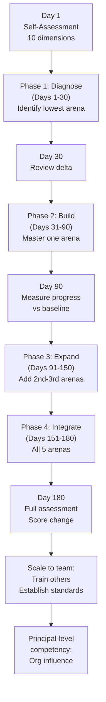

# EA Architect Deep Dive Part 4: Measurement & Growth

Continues from [Part 3 — Toolkit & Practice](./07-ea-architect-deep-dive-toolkit-practice.md).

## Section 13 — The Self-Assessment Rubric — Full Edition

Ten dimensions, five maturity levels — a complete framework for measuring your communication maturity as an Enterprise AI / Principal Architect. Rate yourself honestly; stakeholder perception matters more than your own assessment.

### How to Use This Rubric

Rate yourself on each dimension from 1 (Developing) to 5 (Distinguished). Do this three times: once at the start of your development journey (Day 1), once at Day 90, and once at Day 180. The delta is more informative than the absolute score. If possible, ask a trusted colleague or manager to rate you independently and compare. Systematic divergence between self-rating and external rating is the most important diagnostic signal.

### Dimension 1: Executive Storyline

**Level 1 (Developing)**: Leads with technology. Business context is absent or minimal. Stakeholders must do their own translation.

**Level 2 (Intermediate)**: Attempts business framing but reverts to technical language under pressure. Storyline is present but incomplete — missing impact or ask.

**Level 3 (Proficient)**: Consistent six-part storyline structure in all executive communications. Business language throughout. Explicit ask always present.

**Level 4 (Advanced)**: Adapts the storyline in real time to the specific executive's priorities. Uses quantified financial levers fluently. Earns decisions in meetings.

**Level 5 (Distinguished)**: Shapes executive mental models about AI strategy. Is invited into strategic conversations proactively. Teaches others the executive communication pattern.

### Dimension 2: Business Vocabulary Fluency

**Level 1 (Developing)**: Uses technical jargon with all audiences. Does not adapt vocabulary to the room.

**Level 2 (Intermediate)**: Translates technical terms when reminded or prompted. Has a partial vocabulary shift available.

**Level 3 (Proficient)**: Consistently uses business language with non-technical audiences. Full vocabulary shift table internalised and applied.

**Level 4 (Advanced)**: Invents new translations for novel concepts on the fly. Never needs to be reminded to shift register.

**Level 5 (Distinguished)**: Teaches others to translate. Has published vocabulary guides used by the team. External audiences describe communications as 'refreshingly clear'.

### Dimension 3: Discovery & Listening Quality

**Level 1 (Developing)**: Presents solution before completing discovery. Assumptions are never surfaced or tested.

**Level 2 (Intermediate)**: Asks some diagnostic questions but skips phases of the discovery flow. Readiness check is inconsistent.

**Level 3 (Proficient)**: Runs the full six-phase discovery conversation consistently. Uses assumption surfacing and 'what else' systematically.

**Level 4 (Advanced)**: Uncovers unstated constraints, political obstacles, and hidden failure modes in the first conversation. Stakeholders describe the experience as 'clarifying'.

**Level 5 (Distinguished)**: Discovery conversations are used as a model by the team. Has developed domain-specific readiness diagnostics. Teaches the discovery methodology to others.

### Dimension 4: AI Use Case Discipline

**Level 1 (Developing)**: Use case documentation is ad hoc. No consistent template. Scope exclusions absent.

**Level 2 (Intermediate)**: Uses the use case template inconsistently. 'What AI Will NOT Do' field is often missing or vague.

**Level 3 (Proficient)**: Complete use case sheet for every initiative. Explicit scope exclusions negotiated with stakeholders. Sent for stakeholder confirmation within 24 hours.

**Level 4 (Advanced)**: Use case sheets become the reference document for delivery teams. No scope creep incidents because boundaries were established upfront.

**Level 5 (Distinguished)**: Use case template adopted as team or organisational standard. Has trained others to produce and review use case sheets.

### Dimension 5: 4-View Architecture Narrative

**Level 1 (Developing)**: Architecture presented as a single diagram or set of slides. No consistent structure across initiatives.

**Level 2 (Intermediate)**: Produces 2 of the 4 views inconsistently. Governance view is typically absent.

**Level 3 (Proficient)**: Full 4-view narrative for all major initiatives. All views current and internally consistent.

**Level 4 (Advanced)**: Adapts which views to emphasise based on the specific audience and their concerns. Engineering audiences describe the views as 'the clearest architecture docs we have'.

**Level 5 (Distinguished)**: 4-view approach adopted as team architectural standard. Has facilitated view-design workshops for other architects.

### Dimension 6: Trade-off Framing & Decision Support

**Level 1 (Developing)**: Presents single recommendations without alternatives. Trade-offs are not discussed.

**Level 2 (Intermediate)**: Occasionally presents 2 options but trade-offs are vague. NFR anchoring is absent.

**Level 3 (Proficient)**: Consistently presents 3 options with explicit trade-offs anchored to NFRs. Engineering audiences can evaluate the reasoning.

**Level 4 (Advanced)**: Facilitates group trade-off decisions. Helps engineering teams reason through decisions independently using the framework.

**Level 5 (Distinguished)**: Trade-off framework is used by the broader architecture team. Has developed domain-specific decision criteria. Is the person called when teams are stuck on architectural decisions.

### Dimension 7: Governance Communication

**Level 1 (Developing)**: Risk is an afterthought. Governance audiences must ask for controls information.

**Level 2 (Intermediate)**: Lists risks reactively when asked. Control chain is not structured. Monitoring is described generically.

**Level 3 (Proficient)**: Complete four-part control chain for every material risk. Feedback loop design is included in all architecture documentation.

**Level 4 (Advanced)**: Governance audiences describe the control documentation as 'the best they have seen for an AI system'. Sign-offs are granted without requests for additional information.

**Level 5 (Distinguished)**: Owns the AI governance narrative for the organisation. Is consulted by legal, compliance, and risk teams. Has contributed to AI policy development.

### Dimension 8: Readiness Assessment Discipline

**Level 1 (Developing)**: Assumes organisational readiness. Hidden blockers emerge in delivery.

**Level 2 (Intermediate)**: Asks data-related readiness questions but misses political, change, and governance dimensions.

**Level 3 (Proficient)**: Runs the full six-dimension readiness assessment before every engagement. Documents assumptions with owners and review dates.

**Level 4 (Advanced)**: Surfaces hidden blockers in the first conversation that stakeholders had not previously identified. Prevents project failures before they start.

**Level 5 (Distinguished)**: Readiness assessment methodology adopted by the delivery organisation. Has trained project managers and product owners to use it.

### Dimension 9: Artifact Cadence & Quality

**Level 1 (Developing)**: Artifacts produced only when explicitly requested. No consistent quality or structure.

**Level 2 (Intermediate)**: Some artifacts produced but irregular cadence. Not always current. Version dates absent.

**Level 3 (Proficient)**: All five core artifacts produced and maintained on a defined cadence. Version dates visible. Artifacts drive stakeholder conversations.

**Level 4 (Advanced)**: Stakeholders request the artifacts proactively. Artifacts are referenced in delivery and governance meetings. Quality is consistently excellent.

**Level 5 (Distinguished)**: Artifact standards adopted across the team or organisation. Has created artifact quality guidelines used by others.

### Dimension 10: External & Board Communication

**Level 1 (Developing)**: Has not presented to board-level or external audiences. No preparation for this arena.

**Level 2 (Intermediate)**: Has presented externally but without a structured board-register. Vendor conversations are not architecturally structured.

**Level 3 (Proficient)**: Can present a credible AI strategic narrative at board level. Vendor evaluations follow a structured five-dimension framework.

**Level 4 (Advanced)**: Board-level stakeholders describe the AI narrative as 'clear and reassuring'. Vendor negotiations produce architecturally sound outcomes.

**Level 5 (Distinguished)**: Is sought as an external speaker or thought leader. Represents the organisation credibly with regulators and industry bodies. Sets the external AI communication standard for the organisation.

### Scoring & Interpretation

| Total Score | Development Stage | Priority Action |
|---|---|---|
| 10–19 | Foundation Building | Focus entirely on your lowest-scoring arena for 90 days. Do not attempt to develop multiple arenas simultaneously. |
| 20–29 | Developing Competence | You have some patterns working. Identify your 2 lowest-scoring dimensions and go deep on each for 60 days. |
| 30–39 | Practising Systematically | Solid foundation. Focus now on consistency, speed, and teaching — these are the markers of Level 4+ performance. |
| 40–45 | Approaching Principal Level | Strong across most dimensions. Identify the 1-2 dimensions below Level 4 and address them specifically. |
| 46–50 | Distinguished | Benchmark performance. Your development focus should shift to scaling your approach to your team and organisation. |

## Section 14 — Staying Market-Relevant as an Enterprise AI Architect

The AI architecture landscape moves fast. Staying current requires a systematic approach to market signal gathering and framework refresh — not passive reading.

### The Market Signal Loop

The most reliable signal of what principal architects are expected to communicate is what organisations are asking for in hiring and in vendor conversations. Job descriptions are the most honest, real-time expression of market expectations — they reflect what is currently missing, not what was needed two years ago.

| Signal Source | What It Tells You | How Often | What to Extract |
|---|---|---|---|
| Principal Architect JDs | What capabilities and communication skills organisations are currently paying for at the top of the architecture market | Monthly | New vocabulary; new competency language; emerging architecture patterns; governance and regulatory themes |
| Head of AI Architecture JDs | What leadership-level AI communication looks like — the communication expectations one level above your current role | Monthly | Board-level communication expectations; vendor strategy language; budget and investment framing patterns |
| Vendor solution briefs | How the commercial AI market is positioning capabilities — which often previews the language enterprises will adopt | Quarterly | New capability categories; emerging use case frames; governance positioning language |
| Industry analyst reports | The strategic frames analysts use when advising boards and CXOs — the language that will arrive in your next executive meeting | Quarterly | Strategic AI themes; maturity model language; risk taxonomy updates |
| Regulatory guidance | The compliance language that will affect your governance communication in the next 12-24 months | Quarterly | New control requirements; audit expectations; regulatory vocabulary |

### Framework Currency — What to Stay Current In

**Enterprise & Business Architecture**: Business capability maps, value streams, and operating models remain the bridge between AI strategy and business language. EA frameworks are more relevant in 2026 than they were five years ago — because AI decisions are now capability decisions, not just technology decisions.

- TOGAF 10 and its AI extensions
- Archimate 3.x capability and motivation viewpoints
- Business capability modelling patterns
- Value stream mapping for AI use case identification

**Agentic AI Architecture Patterns**: The agentic AI pattern landscape is evolving rapidly. Orchestration frameworks, multi-agent coordination patterns, and tool-use architectures are changing on a 6-12 month cycle. Stay current through vendor architecture guides and open-source framework evolution.

- Multi-agent orchestration patterns (hierarchical, collaborative, competitive)
- Memory architecture patterns (short-term, long-term, episodic, semantic)
- Tool-use and function-calling patterns
- Agent evaluation and testing frameworks

**AI Governance & Regulatory**: Governance expectations are hardening globally. The EU AI Act, NIST AI RMF, and sector-specific regulations are creating concrete compliance requirements that architects must translate into architecture controls.

- EU AI Act risk classification and control requirements
- NIST AI Risk Management Framework (AI RMF 1.0)
- ISO/IEC 42001 AI management system standard
- Sector-specific AI regulations (financial services, healthcare, public sector)

**GenAI as Communication Amplifier**: Use GenAI to accelerate artifact production, generate stakeholder-specific views, and maintain vocabulary currency. But the structure, the storyline, and the stakeholder insight must remain yours — GenAI amplifies your communication system; it does not replace it.

- Prompt patterns for architecture one-pager generation
- GenAI for stakeholder-specific vocabulary translation
- Automated artifact versioning and consistency checking
- GenAI-assisted readiness assessment question generation

### The Compounding Return

Communication systems compound. Every template you refine, every vocabulary shift you internalise, every diagnostic conversation you master — they build on each other. The principal architect who communicates with consistent clarity across all five arenas does not just sound senior. They become the person the organisation turns to when the stakes are highest. That is the compounding return on this investment.

## Section 15 — Case Studies — Communication Patterns in Practice

Three worked examples showing communication patterns applied in real situations across executive, engineering, and governance arenas. Each case shows the before pattern, the after pattern, and the outcome.

### CASE STUDY 1: The Stalled AI Investment

**Context**: An AI architect had built a compelling technical case for an enterprise knowledge management platform using RAG architecture. The initiative had been through two steering committee meetings and both times left without a decision. The technical documentation was thorough; the business case was absent.

**Arena**: Arena 1 — Executive Communication

**Before**: The architect presented a detailed system architecture, a vendor comparison matrix, and a technical roadmap. The steering committee appreciated the thoroughness but could not answer the question 'why should we fund this now, ahead of other priorities?' No explicit financial case. No explicit ask. No options presented. Third meeting scheduled.

**Diagnosis**: Missing: quantified impact today (cost of the problem). Missing: options with trade-offs (single recommendation only). Missing: explicit ask (approval for what, exactly, in the next 90 days). Present: technical detail the committee was not equipped to evaluate.

**After**: The architect produced a two-page executive document using the six-part storyline structure: 14,000 employee hours per year spent searching for information → $4.2M cost → RAG platform enables 40% reduction → Option A: Vendor (90 days, $380K) vs Option B: Build (12 months, $900K) → Recommend A → Decision needed today: $50K pilot approval for 60 days of evaluation with 3 business units. Steering committee approved in 12 minutes.

**Key Pattern**: Quantified impact + explicit options + specific ask = decision. The technical content did not change. The frame changed everything.

### CASE STUDY 2: The Architecture Review Resistance

**Context**: A principal architect proposed a centralised AI orchestration platform for a large financial services organisation. Engineering teams from three different business units resisted — they felt the central platform would reduce their autonomy and create a bottleneck. The architect had presented a single recommendation without alternatives.

**Arena**: Arena 3 — Engineering Communication

**Before**: The architect presented the central platform as the recommended architecture, with a strong technical rationale. Engineering leads from BU A and BU B immediately objected, raising concerns about governance, customisation, and deployment speed. The meeting became adversarial. Architecture decision deferred for 3 months.

**Diagnosis**: Missing: trade-off presentation (single recommendation only). Missing: NFR anchoring (the governance and autonomy concerns were valid NFRs). Missing: explicit acknowledgement of the trade-offs the recommendation made. Present: technical correctness, which was not in dispute.

**After**: The architect restructured the presentation as a three-option trade-off: Option A (central), Option B (federated), Option C (federated + shared governance). Each option was anchored to explicit NFRs: governance maturity, deployment speed, cost at scale, security control. The recommendation shifted to Option C as the path that preserved BU autonomy while providing shared guardrails. All three BU leads agreed in one session.

**Key Pattern**: Options + NFR anchoring + acknowledging what the recommendation gives up = alignment. Engineers do not resist recommendations; they resist recommendations that appear to ignore their real concerns.

### CASE STUDY 3: The Governance Blocker

**Context**: An AI-powered customer service automation initiative had been technically ready for production deployment for 6 weeks. The risk and compliance team had not signed off. The architect's communications to the governance team described the system's capabilities and accuracy metrics — not its controls.

**Arena**: Arena 4 — Governance Communication

**Before**: The architect shared a technical one-pager describing the system's accuracy (94.2%), latency (sub-200ms), and integration architecture. The risk team requested a 'full risk assessment' — a vague ask that led to two weeks of back-and-forth. The governance team felt they were being asked to sign off on something they did not understand.

**Diagnosis**: Missing: risk register (no named risks for the governance team to evaluate). Missing: control chain (no connection from risk to control to monitoring). Missing: feedback loop design (no description of how ongoing compliance is maintained). Present: capability information the governance team was not equipped to evaluate.

**After**: The architect produced the Risk & Feedback Loop View: 8 named risk categories, each with a four-part control chain (policy → architecture → runtime check → escalation). Plus a feedback loop table with 5 named loops, owners, and intervention triggers. The governance team reviewed it in one meeting and requested two additional controls (added within 48 hours). Production sign-off granted the following week.

**Key Pattern**: Governance teams cannot sign off on capabilities — they sign off on controls. Give them a risk register and a control chain, not a system description. The fastest path to a governance sign-off is the language of risk and control, not the language of technology.

### The Pattern That Unlocks Stalled Situations

These three patterns — quantify + options + ask, trade-offs + NFR anchoring, and risk register + control chain — are not the only patterns in this guide. But they are the ones that most consistently unlock stalled situations. The architect who can deploy the right pattern in the right arena, on demand, is the one who becomes indispensable — not just technically capable.

## Communication Maturity Growth Framework

---

## Series Complete

This closes the four-part **Communication Mastery — Deep Dive Edition** series. Return to [Part 1 — Foundation](./05-ea-architect-deep-dive-foundation.md) to restart the recommended reading path from the self-assessment rubric, or review [Part 2 — The Five Arenas](./06-ea-architect-deep-dive-five-arenas.md) and [Part 3 — Toolkit & Practice](./07-ea-architect-deep-dive-toolkit-practice.md) as reference.

The principal architect who masters communication across all five arenas does not just sound senior. They become the person the organisation turns to when the stakes are highest.
