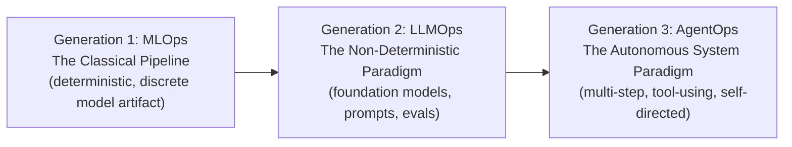

# AIDLC Agile & CI/CD Transformation: The Grand Transformation & Lifecycle

Part 1 of 3 — continues to [Part 2: Agile Evolution & CI/CD Transformation](./parts/10-aidlc-agile-cicd-agile-evolution-cicd-transformation.md).

How AI is redefining the development lifecycle, Agile methodologies, and CI/CD pipelines.

**Audience:** Engineering Leaders, Platform Engineers, DevOps Teams, Enterprise Architects

**Coverage:** The Grand Transformation · AIDLC Phases · MLOps to AgentOps Evolution

**As of:** March 2026

---

## The Grand Transformation

Why the way software is built is undergoing its biggest structural break since Agile 2001.

The software development industry is experiencing its most significant structural transformation since the Agile Manifesto was signed in 2001. But this time the disruption is deeper, faster, and more comprehensive — it reaches every layer of how software is conceived, built, tested, deployed, and maintained. Three disciplines are being simultaneously reimagined: the AI/software development lifecycle itself, the Agile methodologies teams use to organise work, and the CI/CD pipelines that deliver software to production.

### The Three Simultaneous Transformations

| **Discipline** | **The Old Reality** | **The New Reality** | **What Changed** |
|---|---|---|---|
| AIDLC (Dev Lifecycle) | Sequential phases: ideation→design→code→test→deploy. Weeks to months per cycle. | Concurrent AI-agent execution. Specs flow to parallel agent teams. Cycles measured in hours. | AI agents execute phases simultaneously; humans define intent, review output, validate quality. |
| Agile / Scrum | 2-week sprints. Manual story pointing. Velocity measured in human coding hours. | Intent-driven sprints. AI-executed tasks. Zero-point stories for fully-automatable work. Outcome-focused metrics. | AI executes implementation tasks; humans focus on product decisions, architecture, and validation. |
| CI/CD Pipelines | Static scripts running fixed test suites. Binary pass/fail assertions. Human triage of failures. | Agentic pipelines with AI code analysis, self-healing tests, LLM-as-Judge evaluation, autonomous rollback. | AI agents embedded throughout the pipeline — from code commit to production monitoring and self-repair. |

### The Central Shift: From Typing to Orchestrating

The most important mental model shift for every software professional is this: **developers are no longer primarily typists of code — they are orchestrators of intelligence.** As of early 2026, approximately 46% of code written by active developers comes from AI. GitHub Copilot, Claude Code, Cursor, and similar tools are now involved in the majority of pull requests at technology companies that have adopted them. The question is no longer 'How do I write this code?' — it is 'How do I specify, constrain, review, and validate what the AI writes?' This is a profound skill shift that touches every role: engineers, product managers, QA, architects, and DevOps.

"Software practice will evolve from vibe coding to Objective-Validation Protocol. Users define goals and validate while collections of agents autonomously execute, extending the idea of human-in-the-loop, requesting human approval at critical checkpoints." — Ismael Faro, VP AI at IBM Research, 2026

### The Historical Evolution of Software Development Practices

**Era 1: Waterfall**
- Sequential phases: requirements → design → build → test → deploy
- Documentation-first; changes are expensive; 18-month release cycles
- Human executes every step manually; long feedback loops

**Era 2: Agile/Scrum (2001–2016)**
- Iterative 2-week sprints; working software over documentation
- Collaboration over process; response to change over following a plan
- XP practices: TDD, pair programming, continuous integration

**Era 3: DevOps/CI/CD (2009–2022)**
- Everything-as-code; automated pipelines from commit to production
- Cultural shift: Dev and Ops as one team; shift-left testing
- Docker, Kubernetes, Terraform; deploy 10-100x per day

**Era 4: AI-Augmented (2022–2024)**
- Copilots assist individual developers; AI suggests, human decides
- Prompt engineering as new skill; RAG, fine-tuning enter toolkit
- GitHub Copilot, ChatGPT; 40-60% productivity gains reported

**Era 5: Agentic Native (2025–2026+)**
- AI agents execute full tasks autonomously; specs→running code
- Spec-Driven Development, BMAD, Context Engineering emerge as disciplines
- Pipelines are AI-native; LLM-as-Judge replaces static assertions

---

## The AI Development Lifecycle (AIDLC)

From MLOps to LLMOps to AgentOps — three generations of AI operations.

The AI development lifecycle has gone through three distinct generations in five years. Each generation introduced new complexities that the previous generation's tooling could not handle. Understanding where each generation ends and the next begins is critical for engineering leaders making tooling, hiring, and process investments.

### Generation 1: MLOps — The Classical Pipeline

Traditional Machine Learning Operations addressed a specific, bounded problem: how do you build repeatable, deployable, monitorable ML models? MLOps applied DevOps principles to the ML lifecycle. The model was a discrete artifact with known inputs, known outputs, and measurable performance. Testing was deterministic. Monitoring tracked accuracy against holdout sets. Retraining was triggered by measured drift.

| **Phase** | **Activity** | **Key Challenge** | **Primary Tool** |
|---|---|---|---|
| Data Management | Feature engineering, dataset versioning, lineage tracking | Data quality, reproducibility across runs | DVC, Feast, Tecton |
| Experiment Tracking | Hyperparameter tuning, metric logging, run comparison | Managing hundreds of parallel experiments | MLflow, Weights &amp; Biases |
| Model Training | Distributed training, resource management, checkpointing | GPU utilisation efficiency, training cost | Kubeflow, SageMaker, Vertex AI |
| Model Registry | Version control, approval workflows, metadata management | Model lineage and audit trail | MLflow Registry, SageMaker Registry |
| Deployment | A/B testing, canary releases, shadow mode | Rollback on performance regression | Seldon, BentoML, Ray Serve |
| Monitoring | Data drift, concept drift, performance tracking | Catching silent model degradation | Evidently, WhyLabs, Arize |

### Generation 2: LLMOps — The Non-Deterministic Paradigm

Large Language Models broke every assumption MLOps was built on. The model was no longer a deployable artifact — it was a foundation model that could not be retrained on demand. Outputs were non-deterministic: the same input could produce 100 different correct answers. Performance was subjective: was this response 'good'? Traditional unit tests were meaningless. Context management became mission-critical.

| **New LLMOps Concern** | **Why MLOps Cannot Handle It** | **LLMOps Solution** |
|---|---|---|
| Prompt Engineering | Prompts don't exist in MLOps — everything is code or config | Prompt registries with version control, A/B testing, regression detection |
| Non-deterministic Outputs | MLOps tests expect exact output values; LLM output varies every run | Semantic evaluation, LLM-as-Judge, human preference scoring, evals frameworks |
| Context Window Management | Traditional models have fixed input dimensions; context has unlimited variety | Context curation, RAG pipelines, retrieval quality monitoring, context compression |
| Foundation Model Dependency | You own your trained model; LLM is a vendor API | Model gateway abstraction, multi-model routing, fallback chains, cost tracking |
| Hallucination &amp; Factuality | Traditional models either work or don't; LLMs fabricate confidently | Retrieval augmentation, faithfulness scoring, groundedness metrics, human review |
| Token Cost as KPI | Compute cost per prediction is negligible; LLM cost scales with context | Token cost tracking per workflow, prompt compression, model tier routing |
| Fine-tuning Lifecycle | Full model retraining is feasible; LLM full fine-tuning is expensive | LoRA/QLoRA adapter management, RLHF pipelines, DPO preference datasets |
| Guardrails &amp; Safety | Safety is model accuracy; LLMs can output harmful content | Input/output classifiers, constitutional AI, Guardrails AI, Lakera, NeMo |

### Generation 3: AgentOps — The Autonomous System Paradigm

AgentOps is the operational backbone for intelligent agents — systems that plan, use tools, adapt to intermediate results, and execute multi-step workflows with minimal human intervention. By 2027, Deloitte predicts 50% of enterprises using generative AI will deploy AI agents. By 2028, an estimated 1.3 billion active agents will be operating in enterprise environments (Splunk).

| **AgentOps Challenge** | **Why It's Harder Than LLMOps** | **How to Address It** |
|---|---|---|
| Multi-step Trace Monitoring | A single LLM call is observable. A 50-step agent trace across 12 tools is not. | Distributed tracing across all tool calls; trace visualisation; step-level replay |
| State Management | LLMs are stateless. Agents maintain state across long-running tasks (hours/days). | Versioned state snapshots; checkpoint/resume; state corruption detection |
| Tool Call Audit Trails | LLMs output text. Agents write files, call APIs, send emails, execute code. | Immutable action logs; reversal mechanisms; approval gates for destructive actions |
| Non-deterministic Multi-agent Coordination | One agent is complex. A network of 10 agents is exponentially harder. | A2A-native orchestration; agent health monitoring; deadlock detection |
| Cost Explosion at Agent Scale | One LLM call costs pennies. 1000 agent steps costs dollars per task. | Task-level cost budgets; circuit breakers; step count limits; model tier routing |
| Agent Security | LLMs can be prompt-injected. Agents can be prompt-injected into taking real actions. | Sandboxed execution; action whitelisting; OWASP LLM Excessive Agency controls |
| Goal Drift Detection | Agents can pursue goals subtly different from intended over long tasks. | Goal alignment checks at each milestone; intermediate output validation; HITL gates |
| Quality Evaluation | Did the agent complete the task? 'It ran without error' is NOT a success metric. | Task completion rate; outcome quality scoring; human validation at milestones |

### The Complete AIDLC for Agentic AI Systems

The modern AI development lifecycle for agentic systems has eight distinct phases:

| **Phase** | **What Happens** | **Critical Tools** | **Human Role** |
|---|---|---|---|
| 1. Intent &amp; Spec | Define the agent's purpose, capabilities, constraints, and success criteria in structured documents | AWS Kiro, GitHub Spec Kit, BMAD, Claude/GPT | Human writes, AI assists — human APPROVES before any code generation begins |
| 2. Context Engineering | Curate the information environment the agent will work within | Claude Code, Cursor, CLAUDE.md system, RAG knowledge bases | Human defines the context boundaries and tests for agent drift from them |
| 3. Agent Architecture | Design the agent graph: components, tool integrations, memory system, orchestration pattern, guardrails | LangGraph, CrewAI, Google ADK, AutoGen, BMAD Architect Agent | Human architect defines topology; AI can draft based on spec |
| 4. Development &amp; Generation | AI agents generate code, tests, and documentation from specifications | Claude Code, GitHub Copilot, Cursor, Windsurf, Amazon Q Developer | Human reviews PRs; AI generates; human validates spec adherence |
| 5. Evaluation (Evals) | Test AI agent behaviour against quality criteria using semantic evaluation, not just unit tests | Braintrust, LangSmith, Promptfoo, Agenta, Maxim AI, PromptLayer | Human defines eval criteria; AI runs evals; human interprets results |
| 6. CI/CD for AI | Automated pipeline for prompt versioning, agent testing, quality gates, and deployment with rollback | GitHub Actions + LangSmith, AgentOps, Azure AI Foundry pipelines | Human monitors; AI pipeline self-heals minor failures; human reviews regressions |
| 7. Production Monitoring | Continuous observability of agent behaviour, cost, latency, quality, and security in production | AgentOps, LangSmith, Arize, Helicone, WhyLabs, Splunk AI | Human sets thresholds and reviews; AI monitors and auto-alerts |
| 8. Continuous Learning | Feedback loops from production improve agent quality over time via RLHF, DPO, or prompt optimisation | Weights &amp; Biases, MLflow 3.0, fine-tuning platforms, DSPy | Human labels and curates feedback; AI learns from demonstrated preferences |

---

## Related

- [parts/10-aidlc-agile-cicd-agile-evolution-cicd-transformation.md](./parts/10-aidlc-agile-cicd-agile-evolution-cicd-transformation.md) — Part 2: Agile Evolution & CI/CD Transformation
- [parts/11-aidlc-agile-cicd-roles-disciplines-roadmap-principles.md](./parts/11-aidlc-agile-cicd-roles-disciplines-roadmap-principles.md) — Part 3: Roles, Disciplines, Roadmap & Principles
- [01-aidlc-artifacts-discovery-to-model.md](01-aidlc-artifacts-discovery-to-model.md) — AIDLC Phases 1–4 artifact templates
- [02-aidlc-artifacts-development-to-retirement.md](02-aidlc-artifacts-development-to-retirement.md) — AIDLC Phases 5–8 artifact templates
- [14-aidlc-enterprise-framework-2025.md](14-aidlc-enterprise-framework-2025.md) — Enterprise AI framework

## Sources

InfoQ (Feb 2026), Thoughtworks SDD Guide (Dec 2025), O'Reilly Signals 2026, IBM Think, Microsoft Azure AI Foundry (Jan 2026), AWS Kiro Documentation, AWS Prescriptive Guidance CI/CD for AI, BMAD-METHOD (Jan 2026), Optimum Partners (Dec 2025), DevOps.com (Feb 2026), mabl Blog (Jan 2026), Unosquare Agile 2026, Medium (Agile Practitioner's Guide), Pulumi Blog AI Predictions 2026, XenonStack AgentOps (Jan 2026), ResearchGate: LLMOps AgentOps MLOps Review, WeBuild-AI Context Engineering (Feb 2026), Alex Cloudstar SDD 2026 (Mar 2026)
