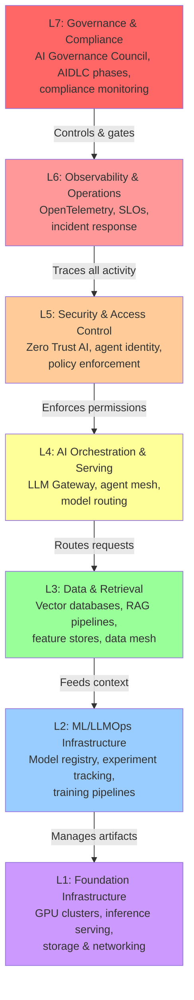

# Impact of AIDLC on Enterprise Architecture — The AI Tooling Revolution

How AIDLC and the 2026 AI tooling stack are dismantling legacy EA assumptions and forcing a ground-up redesign of enterprise technology foundations.

> **Audience:** Principal Enterprise Architects, CTO Organizations, EA Practice Leads
> **Coverage:** Four EA Layers · TOGAF ADM · AI Tooling Stack · AgentOps · Transformation Roadmap
> **As of:** 2026 (McKinsey · Deloitte · Gartner · AWS · Microsoft · Google · IBM · NIST)

## 00  EXECUTIVE SUMMARY

Enterprise Architecture (EA) is undergoing its most profound transformation since cloud adoption. The AI Development Lifecycle (AIDLC), combined with a new generation of AI tools — agentic platforms, RAG systems, LLMOps, vector databases, and intelligent orchestration layers — is systematically dismantling legacy EA assumptions and forcing a ground-up redesign of how enterprises structure their technology foundations.

This report examines every dimension of that impact: from how AIDLC reshapes the four classic EA layers (Business, Data, Application, Technology) to how zero-trust security must evolve for autonomous agents, how TOGAF 10 is being adapted for AI-first architecture, and what the 2026 enterprise AI tech stack actually looks like in production-grade deployments.

The core finding is stark: architecture — not model capability — is the primary determinant of AI success at scale. MIT research shows 95% of enterprise AI pilots fail to scale. The constraint is operational fit: the ability to integrate AI into fragmented enterprise workflows shaped by legacy systems, siloed data, and approval layers. AIDLC provides the lifecycle discipline; EA provides the structural foundation.

## TABLE OF CONTENTS

**1. EA Fundamentals Redefined by AI & AIDLC** The shift from static to intelligent EA

**2. AIDLC Impact on the Four EA Layers** Business · Data · Application · Technology

- **Reference Architecture: The AI-First EA Stack** 7-layer canonical reference

**3. Architecture Patterns for AI Systems** RAG · Agentic · Event-Driven · Data Mesh

- **MLOps & LLMOps: The Operational Architecture** Model lifecycle in production

- **5. Security Architecture: Zero Trust for AI** ZTA, threat models, agentic security

**6. TOGAF 10 & AI-First Architecture** ADM adapted for agentic AI systems

**7. AI Tooling Landscape & Platform Architecture** Complete 2026 enterprise AI tool stack

**8. EA Role Transformation** New roles, skills, and responsibilities

**9. Anti-Patterns & Failure Modes** What breaks at scale and why

**10. 12-Month EA Transformation Roadmap** Phased plan for AI-ready enterprise

**11. Strategic Recommendations** C-suite and EA team action items

## 1  EA FUNDAMENTALS REDEFINED BY AI & AIDLC

## 1.1 The Static-to-Intelligent Shift

Traditional Enterprise Architecture was a planning discipline — producing blueprints, roadmaps, and governance artifacts that aged slowly. AIDLC changes this fundamentally. AI systems are dynamic: they drift, they learn, they surface emergent behaviors, and they create new integration dependencies continuously. EA must become a living operational system, not a static documentation practice. By 2028, 55% of enterprise architecture teams are expected to transition from traditional business-outcome-driven approaches (BODEA) to AI-based autonomous governance.

|**EA Dimension**|**Traditional EA**|**AI-Augmented EA (AIDLC Era)**|
|---|---|---|
|**Planning Cycle**|Annual/bi-annual roadmaps|Continuous adaptive planning driven by AI scenario modeling|
|**Documentation**|Static diagrams, Visio/ArchiMate|AI-generated living architecture maps with real-time system state|
|**Governance**|Point-in-time reviews, committee gates|Continuous AI-monitored governance with automated compliance checks|
|**Data Role**|Input/output artifact, lineage incidental|First-class asset; lineage, quality, provenance are core EA concerns|
|**Security Model**|Perimeter-based, role-based access|Zero-trust per agent identity, continuous verification, action boundaries|
|**Integration**|ESB / API gateway patterns|MCP (Model Context Protocol), agent-safe APIs, semantic integration layers|
|**Risk**|Primarily technical bugs, outages|Bias, hallucination, autonomous agent misuse, regulatory exposure|
|**Human Role**|Architect as designer and decision-maker|Architect as validator, AI orchestrator, and governance director|
|**Tooling**|ARIS, Sparx EA, LeanIX|AI-native EA tools + agentic capabilities in repository analysis|

## 1.2 Why the Add-On Approach Fails at Scale

- **API Timeout Cascades:** Legacy API gateways designed for human-rate requests collapse under agentic AI's burst call patterns. AI agents make hundreds of API calls per second; traditional ESBs throttle and fail.

- **Data Pipeline Lag:** Agents working from stale or inconsistent data produce unreliable outputs. Real-time AI demands real-time data architecture — a problem that batch pipelines cannot solve.

- **Context Window Starvation:** Without semantic context layers, AI models lack organizational knowledge. RAG without proper data architecture returns irrelevant or outdated context, degrading model performance.

- **Governance Reactivity:** Monitoring dashboards built for human-speed applications miss AI incidents that occur in milliseconds. Reactive governance is structurally incompatible with autonomous agent behavior.

- **Model Inconsistency Under Load:** LLMs exhibit distributional shift under changed input patterns. Without drift monitoring integrated into EA, production models silently degrade.

• **Vendor Lock-in Compounding:** Each proprietary AI orchestration layer adds another lock-in dimension. Enterprises without a defined agentic AI architecture strategy are already making a default choice — driven by vendor marketing rather than governance posture.

## 2  AIDLC IMPACT ON THE FOUR EA LAYERS

|**BUSINESS ARCHITECTURE**|AI-Driven Operating Model · Workforce Redesign · AI Governance Org Structure · Value Stream Mapping for AI|
|---|---|
|**DATA ARCHITECTURE**|Data Mesh · Lakehouse · Vector Databases · Feature Stores · Data Lineage · RAG Pipelines|
|**APPLICATION ARCHITECTURE**|Microservices + AI · Agentic Orchestration · LLM Gateway · Copilot Stack · Agent Mesh|
|**TECHNOLOGY ARCHITECTURE**|GPU Infrastructure · MLOps/LLMOps · Zero Trust AI Security · Edge AI · Hybrid Cloud AI|

*Figure 1: The Four EA Layers Redefined by AIDLC (bottom = infrastructure, top = business)*

## 2.1 Business Architecture — AI-Driven Operating Model

AIDLC fundamentally changes how business capabilities are mapped and owned. The emergence of Human-Agentic Workforce models (Deloitte 2026) means that traditional business process maps become outdated within months. EA's Business Architecture layer must continuously model which tasks are human-led, which are AI-augmented, and which are fully autonomous — and govern transitions between these states. McKinsey's Superagency framework shows that redesigning workflows has the single biggest effect on EBIT impact from AI deployment.

• **Operating Model Redesign:** Every business function must be re-mapped against the human/AI task boundary. Business Analysts evolve into AI-powered strategists; Designers into creative directors; Developers into systems architects. Business Architecture must codify these new role definitions and their authority boundaries.

• **AI Capability Modeling:** New business capabilities (AI-driven demand forecasting, autonomous customer service, AI-powered compliance monitoring) must be registered in the capability map with associated AIDLC metadata: risk tier, governance owner, compliance obligations.

• **Value Stream Transformation:** AI compresses value streams from weeks to hours. Business Architecture must model the new AI-accelerated value chains — including the human oversight checkpoints — and ensure governance gates do not become bottlenecks that negate AI's speed advantages.

• **AI Governance Org Structure:** The AI Governance Council, DPO, Model Risk Manager, and AI Compliance Lead are new organizational structures that Business Architecture must formalize. These roles span business and IT — they belong in the business architecture layer, not as IT afterthoughts.

• **Workforce Impact Modeling:** Business Architecture must explicitly model workforce displacement and augmentation. MIT research shows AI task redesign is already selectively reducing clerical and customer support roles. EA must include workforce transition planning as a first-class architecture concern.

## 2.2 Data Architecture — The Foundation That Determines AI Success

The enterprise data management market reached $124.9 billion in 2025, yet spending has not translated cleanly into capability. Data architecture is the single most critical enabler of AI success — and the most common failure point. AI cannot be better than the data it consumes. Harvard Business Review and MIT Sloan both identify data architecture as the foundation of AI success. AIDLC forces five major evolutions in Data Architecture:

|**Evolution**|**Description**|
|---|---|
|**Data Mesh Adoption**|Domain-oriented data ownership replaces centralized data lakes. Each domain owns its AI training data, feature stores, and RAG knowledge bases as data products. Domains must meet enterprise standards for quality, lineage, and compliance. This is the architecture that makes AIDLC governance scalable across large organizations.|
|**Lakehouse Architecture**|Delta Lake / Apache Iceberg-based lakehouses unify batch and streaming data with ACID transactions, time-travel queries for model reproducibility, and versioning for audit trails. The lakehouse pattern is now the dominant AI-ready data architecture, replacing data warehouse + data lake two-tier patterns.|
|**Vector Database Integration**|Retrieval-Augmented Generation (RAG) demands vector databases (Pinecone, Weaviate, Qdrant, pgvector) as first-class EA components. Vector indexes store semantic representations of enterprise knowledge. EA must govern their versioning, freshness SLAs, embedding model lifecycle, and access controls.|
|**Feature Stores**|Feature stores (Feast, Tecton, Hopsworks) decouple feature computation from model training, enabling feature sharing across teams and ensuring training/serving consistency — a common source of model degradation in production. EA must standardize on feature store patterns to prevent feature drift.|
|**Real-Time Data Pipelines**|AI agents require real-time data. Apache Kafka, AWS Kinesis, and Azure Event Hubs replace batch ETL as the primary data transport for AI systems. EA must architect event-driven pipelines that deliver millisecond-fresh data with exactly-once semantics and full lineage capture.|
|**Data Lineage & Provenance**|EU AI Act Article 10 mandates data governance for high-risk AI systems. EA must implement automated lineage tracking (Apache Atlas, OpenLineage) that traces every data element from source through transformation to model training and inference — creating the audit-ready evidence regulators now require.|

## 2.3 Application Architecture — From Microservices to Agent Meshes

The O'Reilly 2026 Signals report identifies agentic AI as having a microservices-to-monolith level of impact on application architecture: "Agentic AI is to GenAI what microservices were to monoliths." Application architecture must evolve to accommodate AI models, orchestration frameworks, safety layers, and human oversight interfaces as first-class architectural components.

**LLM Gateway Pattern:** A central API gateway for all LLM calls providing: rate limiting, prompt injection detection, cost tracking, model routing (load-balancing across GPT-4/Claude/Gemini), response caching, and audit logging. Every enterprise LLM call passes through the gateway. This is the application-layer analog to the network security perimeter.

**Copilot Stack Pattern:** A layered architecture where foundation LLMs are grounded with enterprise data via RAG, enriched with agent tool-calling capabilities, constrained by Constitutional AI policy, and served through a user interface layer. This is the dominant enterprise GenAI application pattern (Microsoft 365 Copilot uses this).

**Agent Orchestration Pattern:** Multi-agent architectures where a supervisor/orchestrator agent delegates tasks to specialized sub-agents (data retrieval agent, code execution agent, API integration agent). Each agent has defined scope, tool access, memory, and HITL triggers. LangGraph, AutoGen, and CrewAI implement this pattern.

**Agent-Safe API Design:** APIs consumed by AI agents require additional design considerations: idempotency for retry safety, semantic versioning communicated in metadata (not just URLs), clear action boundary documentation, rate limits tuned for burst AI traffic, and webhook callbacks for long-running operations.

**Semantic Integration Layer:** The Model Context Protocol (MCP) is emerging as the integration standard for AI agents connecting to enterprise services. MCP replaces custom API integrations with a standardized protocol that agents can use to discover and invoke enterprise capabilities — reducing integration complexity by orders of magnitude.

**Event-Driven AI Architecture:** AI agents subscribe to enterprise event streams (Kafka/Kinesis) to receive triggers and publish results. This decouples AI processing from synchronous request cycles, enabling autonomous AI to operate at enterprise event scale without blocking application threads. Circuit breakers and dead-letter queues manage failure modes.

## 2.4 Technology Architecture — Infrastructure for AI at Enterprise Scale

The technology layer faces the most immediate and tangible restructuring. GPU infrastructure, vector compute, real-time inference serving, and the MLOps/LLMOps operational layer all represent net-new technology architecture requirements with no legacy analog. Teams running mature MLOps typically report 10× faster release cycles and 40–60% infrastructure cost reductions through compute optimization and pipeline automation.

|**Component**|**Purpose**|**Leading Platforms**|**EA Impact**|
|---|---|---|---|
|**GPU Cluster / Accelerated Compute**|Model training, fine-tuning, high-throughput inference|NVIDIA A100/H100, AMD MI300, AWS Inferentia|New procurement model; FinOps for AI required|
|**Inference Serving Layer**|Low-latency model serving at enterprise scale|NVIDIA Triton, vLLM, TorchServe, KServe|SLA design: p99 latency &lt;200ms for production|
|**Vector Database**|Semantic search, RAG retrieval, embedding storage|Pinecone, Weaviate, Qdrant, pgvector, Chroma|New persistence tier; index freshness SLAs|
|**Model Registry & Versioning**|Versioned model artifacts, lineage, deployment tracking|MLflow, Weights & Biases, DVC, Azure ML|Mandatory for EU AI Act technical documentation|
|**Feature Store**|Training/serving feature consistency, feature sharing|Feast, Tecton, Hopsworks, Vertex AI Feature Store|Eliminates training-serving skew; reduces duplication|
|**Observability Platform**|Drift detection, bias monitoring, performance tracking|Arize AI, WhyLabs, Fiddler, Evidently AI|Extends APM to include model behavioral monitoring|
|**AI Gateway / LLM Proxy**|API management, rate limiting, audit for LLM calls|Kong AI Gateway, Apigee, LiteLLM, Portkey|New perimeter for LLM traffic; cost control mechanism|
|**Edge AI Runtime**|On-device inference for low-latency, privacy-sensitive use|ONNX Runtime, TensorRT, Apple CoreML|Extends EA to device layer; OTA model updates|

## 3  REFERENCE ARCHITECTURE: THE AI-FIRST EA STACK

The 2026 production-grade enterprise AI architecture comprises seven horizontal layers, each with specific components, governance controls, and AIDLC touchpoints. This reference architecture synthesizes patterns from AWS, Azure, Google Cloud, and leading enterprise deployments.

### 7-Layer AI-First Enterprise Architecture Stack

**7-Layer AI-First EA Stack** — Governance at the top (L7) sets policy and gates. Observability (L6) monitors all activity. Security (L5) enforces access controls. Orchestration (L4) routes agentic requests through LLM gateways and agent meshes. Data (L3) provides context via RAG and feature stores. MLOps (L2) manages the model lifecycle. Foundation (L1) provides compute infrastructure. Each layer implements AIDLC controls appropriate to its domain.

*Figure 2: 7-Layer AI-First Enterprise Architecture Reference Stack (L1=Foundation, L7=Governance)*

#### CROSS-CUTTING ARCHITECTURE CONCERNS

***Cross-cutting concerns that span all 7 layers: Security & Zero Trust (identity verification at every layer), Observability (metrics, logs, traces from L1 through L7), Governance & AIDLC Controls (phase gates, compliance evidence, audit logs), and FinOps for AI (compute cost tracking from GPU through to business value attribution).***

## 4  ARCHITECTURE PATTERNS FOR AI SYSTEMS

## 4.1 RAG Architecture Pattern (Retrieval-Augmented Generation)

|**Dimension**|**Detail**|
|---|---|
|**Pattern Intent**|Ground LLM responses in authoritative enterprise knowledge to reduce hallucination, improve accuracy, and provide citable sources.|
|**Components**|Query encoder→Vector retrieval→Context assembly→LLM inference→Response with citations|
|**Data Architecture Requirements**|Vector database (embedding store), document chunking pipeline, embedding model (versioned), metadata filtering layer, freshness SLA monitoring|
|**AIDLC Integration**|Phase 3: Data Strategy governs knowledge base curation; Phase 6: Evaluation measures RAG hallucination rate; Phase 8: Monitor tracks retrieval quality and embedding drift|
|**EA Governance Controls**|Knowledge base owner per domain (Data Mesh alignment), versioned embedding models in Model Registry, GDPR-compliant data removal from vector indexes, access control per namespace|
|**Common Failure Modes**|Stale knowledge base (>24hr lag), embedding model/query model mismatch, chunking strategy mismatch, over-retrieval noise overwhelming context window|
|**Production Metrics**|Recall@K >85%, Precision >70%, End-to-end p99 latency &lt;500ms, Knowledge freshness &lt;4 hours|

## 4.2 Agentic Architecture Pattern (Multi-Agent Systems)

|**Dimension**|**Detail**|
|---|---|
|**Pattern Intent**|Decompose complex tasks into specialized agents coordinated by a supervisor, enabling autonomous multi-step reasoning and action across enterprise systems.|
|**Components**|Supervisor Agent→Planner→Tool-Calling Agents (retrieve, analyze, write, execute)→Memory (working + episodic)→Human-in-the-Loop Interface|
|**Architecture Requirements**|MCP server for enterprise tool access, action boundary enforcement, agent identity and authentication (separate from human identity), circuit breakers, idempotent APIs|
|**AIDLC Integration**|Phase 4: Agent action boundaries defined in Constitutional AI policy; Phase 6: Red-teaming covers agent jailbreak, tool misuse; Phase 7: HITL workflows configured per agent risk tier|
|**EA Governance Controls**|Agent identity registry (separate from human IAM), tool access ACLs per agent, action audit log (what agent did, when, why), rollback capability for reversible actions|
|**IAPP 3-Tier Guardrails**|Tier 1: Standard safety; Tier 2: Action boundaries + memory governance + tiered HITL; Tier 3: Context-specific constraints by deployment domain|
|**Zero Trust Requirement**|Agents must not inherit user permissions by default. Principle of least privilege applies per tool, per API endpoint, per data namespace accessed.|

## 4.3 Data Mesh + AI Pattern

|**Dimension**|**Detail**|
|---|---|
|**Pattern Intent**|Distribute AI data ownership to business domains while maintaining enterprise-wide governance, lineage, and discoverability — enabling AIDLC to scale across the enterprise.|
|**Core Principles**|Domain ownership, data as product, self-serve platform, federated computational governance|
|**AI Extensions**|Each domain provides AI-ready data products (training sets, feature stores, RAG knowledge bases) published to a central AI Data Catalog with AIDLC metadata|
|**Governance Federation**|Central AI Governance Council sets standards (data quality, lineage, bias documentation). Domain teams own compliance within their data products. Violations block AI deployment.|
|**AIDLC Integration**|Phase 3: Data Strategy maps AI use case to owning domain(s); Phase 5: Training data sourced from certified domain data products only; Phase 8: Domain teams own ongoing data quality monitoring|
|**Architecture Requirements**|Data Catalog (Databricks Unity Catalog, Collibra, Atlan), Domain data product APIs, Federated governance policy engine, Cross-domain lineage tracking|

## 4.4 Event-Driven AI Architecture Pattern

|**Dimension**|**Detail**|
|---|---|
|**Pattern Intent**|Decouple AI processing from synchronous request cycles, enabling agents to respond to enterprise events asynchronously at scale without blocking application threads.|
|**Components**|Event broker (Kafka/Kinesis)→AI consumer group→Inference service→Result publisher→Downstream consumers→Dead-letter queue for failed inferences|
|**AIDLC Integration**|Phase 4: Event schema design includes AI metadata envelope (model version, confidence, lineage); Phase 7: Consumer group lag monitored as production health metric; Phase 8: Replay capability for model audits|
|**EA Governance Controls**|Event schema registry (Confluent Schema Registry) with AI metadata standards, consumer isolation by AI risk tier, audit log for all AI-produced events, replay capability for regulatory investigation|
|**Production Patterns**|Exactly-once semantics for financial AI events, saga pattern for multi-agent workflows spanning multiple services, CQRS for separating AI write and read models|

## 5  MLOps & LLMOps: THE OPERATIONAL ARCHITECTURE

MLOps (for traditional ML models) and LLMOps (for generative AI) are converging in 2026 into unified operational platforms. Teams running mature MLOps report 10× faster releases and 40–60% infrastructure cost reductions. The operational architecture is the connective tissue between AIDLC phases and production AI systems — it is where governance becomes executable.

|**MLOps Phase**|**Traditional ML**|**LLMOps (GenAI)**|**AIDLC Phase**|
|---|---|---|---|
|**Data Management**|Feature engineering, tabular data pipelines|Document chunking, embedding pipelines, RAG index management|Phase 3|
|**Experimentation**|Hyperparameter tuning, cross-validation|Prompt engineering, few-shot design, RAG configuration|Phase 5|
|**Model Registry**|Model artifacts, metrics, parameters|Model artifacts + system prompts + RAG config + Constitutional AI policy|Phases 5–6|
|**Testing & Validation**|Hold-out test sets, statistical tests|LLM evaluation (RAGAS, DeepEval), red-teaming, constitutional compliance|Phase 6|
|**Deployment**|Canary/blue-green, A/B testing|Prompt versioning, model routing, shadow mode testing|Phase 7|
|**Monitoring**|Accuracy drift, data drift, latency|Hallucination rate, toxicity, topic drift, cost per query, RAG recall|Phase 8|
|**Retraining**|Scheduled or drift-triggered retraining|RAG knowledge base refresh, fine-tuning on new data, prompt updates|Phase 8|
|**Governance**|Model cards, bias reports|Constitutional compliance audits, EU AI Act documentation, FRIA|All Phases|

## 5.1 The LLMOps Monitoring Stack

• **Hallucination Detection:** Factual consistency scoring using models like RAGAS, TruEra, or custom NLI classifiers. Alert when hallucination rate exceeds threshold. For RAG systems, measure faithfulness (does response align with retrieved context?)

• **Toxicity & Safety Monitoring:** Continuous Constitutional AI compliance scoring on sampled outputs. Automated flagging for policy violations. Human review queue for borderline cases.

- **Cost per Query:** Token consumption tracking per model, per use case, per user. FinOps dashboards linking GPU spend to business value. Budget guardrails with automatic throttling.

• **Latency Distribution:** p50/p95/p99 latency for full RAG pipeline (retrieval + inference + response). SLA breach alerting. Bottleneck identification (retrieval vs inference vs post-processing).

- **RAG Quality Metrics:** Retrieval recall@K, precision@K, mean reciprocal rank. Knowledge base staleness tracking. Embedding drift detection (cosine similarity degradation over time).

- **Topic & Semantic Drift:** Cluster user query embeddings over time. Alert when query distribution shifts significantly from training distribution. Trigger retraining review.

- **Audit Log Completeness:** 100% coverage for high-risk (T2) systems: every inference logged with input, output, model version, timestamp, user context, retrieved documents.

## 5.2 Autonomous Retraining Architecture

Closed-loop autonomous retraining represents the frontier of MLOps maturity: drift detection → automated evaluation of whether retraining is cost-justified → retraining pipeline execution → automated validation → staged deployment. Humans review policies and exceptions rather than individual retraining decisions. This architecture requires: drift threshold policy (AIDLC Phase 8 artifact), cost-benefit model for retraining ROI, automated test suites for regression detection, and rollback automation for failed retraining cycles.

## 6  SECURITY ARCHITECTURE: ZERO TRUST FOR AI

Traditional Zero Trust Architecture (ZTA) assumes a human identity initiates every session. Agentic AI shatters this assumption: autonomous agents execute chains of tool calls, spawn sub-agents, and interact with external systems in ways that bypass traditional user-identity boundaries. A new security architecture — Zero Trust for AI — must be designed from first principles.

## 6.1 The MAESTRO AI Threat Model

The MAESTRO framework (Machine learning, Agent, Embedding, System, Topology, Runtime, Orchestration) provides a systematic threat model for AI systems. Combined with the STRIDE framework, it maps threats across the full AI architecture:

|**Threat Category**|**STRIDE Mapping**|**AI-Specific Risk**|**Architectural Mitigation**|
|---|---|---|---|
|**Prompt Injection**|Tampering|Adversarial inputs manipulate agent behavior, bypass constitutional controls|Input validation layer, prompt injection scanner (Rebuff), content safety API|
|**Training Data Poisoning**|Tampering|Contaminated training data embeds backdoors in model behavior|Data provenance tracking, anomaly detection in training data, differential privacy|
|**Model Inversion / Extraction**|Info Disclosure|Attacker reconstructs training data or steals model weights via API queries|Rate limiting, output perturbation, query logging and anomaly detection|
|**Agent Identity Spoofing**|Spoofing|Malicious agent masquerades as trusted agent to gain elevated tool access|Agent identity registry, mutual TLS for agent-to-agent, signed agent manifests|
|**Privilege Escalation**|Elevation of Privilege|Agent chains tool calls to accumulate permissions beyond intended scope|Per-tool ACLs, session-scoped permissions, action boundary enforcement|
|**Supply Chain Attack**|Tampering|Compromised model weights, libraries, or training data from third-party sources|Model provenance verification, SBOM for AI, vendor security assessment (TPRM)|
|**Data Exfiltration via LLM**|Info Disclosure|Sensitive data retrieved by RAG and included in responses to unauthorized users|RAG namespace access control, output filtering, DLP on LLM responses|
|**Hallucination-Based Fraud**|Repudiation|AI generates false information used in financial or legal decisions|Hallucination detection, HITL for high-stakes outputs, citation enforcement|

## 6.2 Zero Trust AI Architecture Principles

• **Never Trust Agent Identity by Default:** Agents receive time-limited, scope-limited credentials. No agent inherits human user permissions. All agent identities are registered in an Agent Identity Registry separate from IAM.

• **Continuous Verification:** Agent authorization is verified at every tool call, not just at session initiation. Actions are re-authenticated against current policy before execution.

- **Least-Privilege Action Boundaries:** Each agent is granted the minimum tool access required for its defined task. Tool access is scoped to session, not persistent. Privilege escalation triggers immediate human review.

- **Assume Breach at the Agent Layer:** Security architecture assumes any agent can be compromised (prompt injection, jailbreak). Circuit breakers, dead-letter queues, and rollback capabilities limit blast radius.

- **Audit Everything:** Every agent action — tool call, API request, data access, output generation — is logged with full context: agent identity, tool name, parameters, response, timestamp, session ID.

- **Agentic Trust Framework (ATF) Levels:** Agents are promoted through trust levels (0=observe only → 1=recommend → 2=act with HITL → 3=act with notification → 4=fully autonomous) based on demonstrated accuracy, security audit, operational history, and stakeholder approval.

## 6.3 Security Architecture Layers for AI Systems

|**Layer**|**Controls**|**Tooling**|
|---|---|---|
|**Perimeter**|WAF with AI-specific ruleset, DDoS protection, rate limiting tuned for agent traffic|AWS WAF + Shield, Cloudflare, Azure Front Door|
|**Identity & Access**|Agent Identity Registry, PKCE for agent OAuth, short-lived tokens (&lt;15min), per-tool ACLs|HashiCorp Vault, AWS IAM, Azure Managed Identity|
|**API / LLM Gateway**|Prompt injection detection, token budget enforcement, output DLP, request signing|Kong AI Gateway, Apigee, LiteLLM, Lakera Guard|
|**Data Layer**|Encryption at rest + in transit, vector namespace ACLs, PII masking in RAG retrieval, GDPR deletion from vector indexes|AWS KMS, Vault, Presidio, Pinecone namespaces|
|**Model Layer**|Model provenance verification, weight integrity checks, Constitutional AI enforcement in system prompt|MLflow lineage, Sigstore for model signing|
|**Runtime**|Circuit breakers (halt runaway agents), action replay logs, anomaly detection on agent behavior patterns|Kubernetes Network Policy, Istio mTLS, OPA|
|**Observability**|Security event correlation across agent actions, SIEM integration for AI incidents, audit log immutability|Splunk, Datadog, Elastic, AWS CloudTrail|

## 7  TOGAF 10 & AI-FIRST ARCHITECTURE

TOGAF 10 (2022) is used by over 80% of Global 50 companies. Its Architecture Development Method (ADM) provides the iterative structure for enterprise architecture governance. For AI-first enterprises, TOGAF 10's ADM must be extended at every phase to incorporate AIDLC requirements, agentic AI governance, and the new EA artifacts the AI era demands.

|**TOGAF ADM Phase**|**Standard Outputs**|**AI-Specific Extensions**|
|---|---|---|
|**Preliminary**|EA framework, governance model, principles|Add AI Governance Principles (Constitutional AI Policy, RAI commitments). Establish AI Governance Council as EA stakeholder.|
|**A: Architecture Vision**|Stakeholder map, business goals, statement of architecture work|Define AI capability ambition. Map AI use cases to business goals. Identify first AIDLC use case candidates. Risk tier classification.|
|**B: Business Architecture**|Business process models, capability maps, organization models|Map Human/AI task boundaries for all processes. Model AI Governance Council org structure. Define Human-Agentic Workforce model.|
|**C: IS Architecture**|Data and application architecture|C1 (Data): Data Mesh design, vector database topology, RAG pipeline architecture, lineage model, feature store design. C2 (Application): LLM Gateway, agent orchestration, Copilot Stack, agent mesh design.|
|**D: Technology Architecture**|Technology standards, platforms, infrastructure|GPU infrastructure standards, MLOps/LLMOps platform selection, Zero Trust AI security architecture, Edge AI standards, observability platform.|
|**E: Opportunities & Solutions**|Implementation roadmap, work packages|Sequence AI use cases by risk tier (T4→T3→T2). Map AIDLC phases to ADM work packages. Identify Quick Wins vs Structural Changes.|
|**F: Migration Planning**|Transition architectures, migration plan|Define AI-readiness transition states. Plan legacy system modernization required for AI integration. Data pipeline migration sequence.|
|**G: Implementation Governance**|Architecture contracts, compliance reviews|AIDLC Phase Gates as Architecture Compliance checkpoints. AI system registration in EA repository. Model Card and Data Sheet review.|
|**H: Change Management**|Architecture change requests, lessons learned|AI-triggered architecture change requests (model capability expansion, new regulation). Quarterly AI Portfolio Review. Architecture debt from AI legacy.|

## 7.1 New EA Artifacts Required by AIDLC

- **AI System Inventory:** A living registry of every AI system (including embedded SaaS AI) with model purpose, data sources, risk tier, governance owner, compliance obligations, and AIDLC phase status.

- **AI Capability Map:** Extension of the TOGAF capability map to include AI capabilities (demand forecasting, autonomous customer service, AI-assisted code review) with associated AIDLC metadata.

• **Constitutional AI Policy Document:** Per-system document defining the eight core AI principles (harmlessness, honesty, fairness, privacy, transparency, HITL priority, regulatory compliance, security) and their operational implementation.

• **Agent Action Boundary Register:** Documents the permitted tools, API endpoints, data namespaces, and action types for each deployed AI agent. The source of truth for runtime access control.

- **AI Architecture Decision Records (ADRs):** AI-specific ADRs covering: model selection rationale, RAG vs fine-tuning decision, vector database selection, MLOps platform choice, agentic framework selection.

- **Data Lineage Map:** End-to-end lineage from source data through transformation, training, and inference — the mandatory artifact for EU AI Act Article 10 compliance.

## 8  AI TOOLING LANDSCAPE & PLATFORM ARCHITECTURE

The enterprise AI tool landscape has consolidated dramatically in 2025–2026 into recognizable platform patterns. The global AI system integration and consulting market reached $11 billion in 2025. Enterprises must make architecture-level tooling decisions that balance capability, governance posture, vendor lock-in risk, and total cost of ownership.

|**Category**|**AWS**|**Azure**|**Google Cloud**|**Best-of-Breed / OSS**|
|---|---|---|---|---|
|**Foundation Models**|Bedrock (Claude, Titan)|Azure OpenAI (GPT-4o)|Vertex AI (Gemini)|Anthropic, Cohere, Meta Llama|
|**MLOps Platform**|SageMaker|Azure ML|Vertex AI Pipelines|MLflow, Kubeflow, W&B|
|**Agent Orchestration**|Amazon Q, Strands|Azure AI Agent Service|Vertex AI Agent Builder|LangGraph, AutoGen, CrewAI|
|**Vector Database**|Aurora pgvector, OpenSearch|Azure AI Search|Vertex AI Vector Search|Pinecone, Weaviate, Qdrant|
|**Data Platform**|S3 + Glue + Athena|ADLS + Synapse + Fabric|BigQuery + Dataflow|Databricks, Snowflake, dbt|
|**Observability**|CloudWatch + SageMaker Monitor|Azure Monitor + Responsible AI dashboard|Cloud Monitoring|Arize AI, WhyLabs, Fiddler|
|**AI Security**|GuardDuty + Macie + AI Content Safety|Azure AI Content Safety + Defender|SAIF + DLP API|Lakera Guard, Rebuff, Presidio|
|**AI Gateway**|API Gateway + Bedrock Guardrails|APIM + Azure Content Filters|Apigee + Vertex Guardrails|Kong AI Gateway, LiteLLM, Portkey|
|**EA/AI Governance**|AWS Config + CloudTrail|Microsoft Purview + Compliance Center|Dataplex + Data Catalog|Collibra, Atlan, OneTrust, IBM OpenPages|

## 8.1 Vendor Lock-In Risk Assessment

• **Orchestration Layer Lock-in:** If agents run on a vendor's proprietary orchestration layer (AWS Strands, Azure AI Agent Service), lock-in compounds at every layer of the stack. The MCP standard provides a lock-in mitigation strategy for tool integration.

• **Model API Lock-in:** Applications hard-coded to a single model provider's API format become vulnerable to pricing changes, capability gaps, or service disruptions. LiteLLM / model routing layers provide provider abstraction.

• **Vector Database Lock-in:** Migrating embedding stores between providers requires re-embedding all documents (expensive compute). Architecture should standardize on open formats (OpenAI embedding API compatibility) and maintain embedding pipeline independence.

• **MLOps Platform Lock-in:** SageMaker and Azure ML have proprietary training and serving APIs. MLflow (open source) as the metadata layer with cloud-specific compute backends provides the best balance.

• **Mitigation Strategy:** Open standards first (MLflow, MCP, OpenLineage, OpenTelemetry), proprietary services for undifferentiated compute (GPU, storage), portability tests included in AIDLC Phase 7 deployment requirements.

## 9  EA ROLE TRANSFORMATION IN THE AI ERA

Every role in the enterprise architecture function is being redefined. New roles are emerging; existing roles are gaining new responsibilities; and some traditional EA activities are being automated by AI itself. The EA market surpassed $1 billion in tooling in 2025, with AI-native capabilities becoming a vendor differentiator.

|**Role**|**Traditional Focus**|**AI-Era Evolution**|**New Skills Required**|
|---|---|---|---|
|**Enterprise Architect**|TOGAF ADM, capability mapping, roadmaps|Governs AI system portfolio; defines AI architecture standards; drives AIDLC adoption across BU; owns AI Architecture Decision Records|MLOps fundamentals, LLM architecture patterns, NIST AI RMF, EU AI Act|
|**Data Architect**|Data warehousing, ERD, data integration|Designs Data Mesh + AI data products; governs RAG knowledge architecture; owns vector database strategy; implements OpenLineage|Vector databases, RAG design, Iceberg/Delta Lake, embedding pipelines|
|**Solution Architect**|Application design, integration patterns|Designs LLM Gateway, Copilot Stack, Agent Orchestration patterns; implements Agent-Safe API standards; governs MCP integration|LangGraph/AutoGen, MCP protocol, agentic architecture patterns|
|**Security Architect**|Network security, IAM, compliance|Designs Zero Trust for AI; builds Agent Identity Registry; leads MAESTRO threat modeling; governs AI supply chain security|Zero Trust AI, prompt injection defense, AI SBOM, agentic security patterns|
|**NEW: AI Governance Architect**|(New role — no traditional analog)|Owns Constitutional AI Policy; manages AI System Inventory; coordinates AIDLC phase gates; produces EU AI Act documentation; chairs AI Governance Council|NIST AI RMF, EU AI Act, ISO 42001, Constitutional AI, red-teaming|
|**NEW: LLMOps Engineer**|(Evolved from MLOps Engineer)|Operates LLM serving infrastructure; implements hallucination monitoring; manages RAG index freshness; runs prompt regression testing; manages model routing|vLLM, LLM evaluation frameworks, vector database operations, LangSmith|
|**NEW: AI Product Architect**|(Evolved from Technical PM)|Bridges business use cases and AI architecture; owns AI capability roadmap; maps Human/AI task boundaries; defines HITL UX requirements|AI product patterns, Copilot UX design, Human-in-the-Loop workflow design|

**GARTNER 2028 PREDICTION**

***By 2028, 55% of enterprise architecture teams will transition to AI-based autonomous governance (Gartner). The most consequential structural development in EA tooling is agentic capabilities — AI components that proactively monitor repository patterns, identify inconsistencies, and suggest corrective actions rather than merely responding to user prompts.***

## 10  ANTI-PATTERNS & FAILURE MODES

MIT research shows 95% of enterprise AI pilots fail to scale. The following anti-patterns are the documented root causes — observed across hundreds of enterprise deployments. Each AIDLC phase has specific anti-patterns that the governance framework is designed to prevent.

|**Anti-Pattern**|**Description**|**Failure Mode**|**AIDLC Prevention**|
|---|---|---|---|
|**AI Add-On Syndrome**|Bolting AI onto legacy architecture without modernizing the underlying foundation|API timeouts, data lag, model inconsistency, governance blindspots|Phase 2: Architecture feasibility assessment requires baseline modernization|
|**Data Lake Swamp**|Dumping all data into a lake with no governance, lineage, or quality controls|AI trained on garbage data; lineage non-existent; EU AI Act non-compliant|Phase 3: Data Strategy gate requires quality and lineage certification|
|**Pilot Purgatory**|AI use cases perpetually trapped in PoC mode; never reach production scale|No business value; growing technical debt; organizational AI fatigue|Phase 2: Go/No-Go must include production architecture feasibility|
|**Shadow AI Proliferation**|Business units deploying AI tools outside of EA and governance oversight|Unmanaged data exposure, regulatory violations, fragmented user experience|Phase 1: AI System Inventory + Acceptable Use Policy enforcement|
|**AI-Managed Anti-Pattern**|Expecting AI to autonomously build complete systems without developer oversight (AWS AI-DLC identified)|Code quality degradation, security vulnerabilities, governance bypass|Phase 5: Developer understanding mandate — every AI-generated line reviewed|
|**Model Monoculture**|Entire enterprise dependent on single LLM provider with no fallback|Single point of failure; pricing leverage by vendor; no competitive benchmarking|Phase 4: Architecture mandates model routing layer with multi-provider support|
|**Governance Theater**|Ethics principles and RAI policies published but never operationalized or measured|False sense of compliance; actual bias and risk undetected; regulatory exposure|Phase 8: RAI KPIs with automated monitoring; quarterly audit verification|
|**Agentic Overreach**|Deploying autonomous agents without defined action boundaries, memory governance, or HITL|Agents take unintended irreversible actions; data exfiltration; cascading failures|Phase 4–7: Agent Action Boundary Register; ATF trust level gating|
|**Explainability Debt**|Deploying black-box models to high-risk use cases without explainability mechanisms|EU AI Act non-compliance; inability to appeal AI decisions; loss of user trust|Phase 4: Explainability approach selected at architecture phase, not as afterthought|
|**FinOps Blindness**|No cost attribution for AI compute; GPU spend unlinked to business value|Budget overruns; inability to justify AI investments; ungoverned compute sprawl|Phase 7: FinOps dashboard linking per-query cost to business value attribution|

## 11  12-MONTH EA TRANSFORMATION ROADMAP

This roadmap synthesizes the collective guidance of AWS, McKinsey, Deloitte, Accenture, and PwC into a phased enterprise architecture transformation plan. It is structured around four 90-day horizons, each with specific deliverables, governance milestones, and success metrics.

## Q1 (Days 1–90): FOUNDATION

|**Timeline**|**Activity & Deliverable**|
|---|---|
|**Week 1–2**|Charter AI Governance Council with executive sponsorship. Define scope, authority, budget.|
|**Week 2–4**|Complete AI System Inventory: catalog every AI tool in use (including shadow AI and embedded SaaS AI). Assign EU AI Act risk tiers.|
|**Week 3–6**|EA Baseline Assessment: evaluate current-state architecture against AI-readiness criteria (data architecture maturity, API modernization, observability gaps).|
|**Week 4–8**|Publish Constitutional AI Policy, Acceptable Use Policy, and AI Incident Response Plan. Get C-suite sign-off.|
|**Week 6–10**|Select first 2–3 T4 (minimal risk) AIDLC pilot use cases. Run full AIDLC cycle as learning exercise.|
|**Week 8–12**|Define AI Architecture Standards: model selection criteria, LLM Gateway requirements, vector database standards, MLOps platform selection.|

## Q2 (Days 91–180): BUILD CAPABILITY

|**Timeline**|**Activity & Deliverable**|
|---|---|
|**Month 4**|Deploy LLM Gateway as mandatory traffic control for all LLM calls. Implement prompt injection detection and audit logging.|
|**Month 4–5**|Launch Data Architecture modernization: pilot Data Mesh for 2 domains, deploy vector database infrastructure, implement OpenLineage for data lineage tracking.|
|**Month 4–5**|Stand up MLOps/LLMOps platform. Configure model registry, experiment tracking, and production monitoring. Run first model through complete lifecycle.|
|**Month 5**|Deploy Agent Identity Registry and Zero Trust foundations for AI. Define ATF trust levels for all current AI agents.|
|**Month 5–6**|Integrate AIDLC Phase Gates into delivery process: Phase 1–4 gates operational. Train all product teams on AIDLC.|
|**Month 6**|First Quarterly AI Portfolio Review: governance metrics baseline established. Gaps documented and remediation planned.|

## Q3 (Days 181–270): SCALE & GOVERN

|**Timeline**|**Activity & Deliverable**|
|---|---|
|**Month 7**|Launch T3 (limited risk) use cases through full AIDLC. Apply all governance gates. Generate first complete set of regulatory artifacts.|
|**Month 7–8**|Extend Data Mesh to all domains. Feature Store operational for all ML use cases. RAG pipeline standardized.|
|**Month 8**|First agentic AI deployment using Agentic Architecture Pattern with full ATF controls. HITL workflows configured. Agent Action Boundary Register published.|
|**Month 8–9**|TOGAF ADM integration: update EA repository with AI System Inventory, AI Capability Map, and Agent ADRs. TOGAF Phase G now includes AIDLC compliance verification.|
|**Month 9**|Begin ISO/IEC 42001 gap assessment and remediation. Target certification within 6 months.|
|**Month 9**|AIDLC Phase 5–8 gates fully operational. All active AI projects tracked through lifecycle dashboard.|

## Q4 (Days 271–365): OPTIMIZE & LEAD

|**Timeline**|**Activity & Deliverable**|
|---|---|
|**Month 10**|First T2 (high-risk) AI use case through full AIDLC with FRIA, external audit, and complete EU AI Act technical documentation.|
|**Month 10–11**|Launch autonomous retraining for established models. Drift thresholds defined. Retraining pipeline automated with human policy oversight.|
|**Month 11**|Publish AI Architecture Reference Guide for the enterprise: patterns, standards, tooling decisions, anti-patterns, lessons learned.|
|**Month 11**|EA capability upgrade: AI-native EA tooling deployed. Agentic EA repository analysis operational. Architecture compliance automated.|
|**Month 12**|Annual AI Governance Review: RAI KPI performance vs targets, regulatory posture assessment, vendor landscape review, roadmap for Year 2.|
|**Month 12**|ISO/IEC 42001 certification audit. EU AI Act high-risk system documentation submitted for review. Target: full compliance posture.|

## 12  STRATEGIC RECOMMENDATIONS

### FOR THE CIO / CTO

- Mandate AIDLC as the required lifecycle for all AI initiatives in 2026. No AI system reaches production without completing Phases 1–7. Non-compliance is a risk event.

- Fund AI architecture as infrastructure — not as project cost. MLOps platform, LLM Gateway, vector databases, and AI observability are enterprise platforms that require sustained investment.

- Declare architecture readiness — not model capability — as the gating criterion for AI scale. Benchmark every business unit against the AI-Readiness architecture checklist.

- Establish a FinOps for AI function. GPU compute costs are the new data center costs. Unmanaged, they will consume disproportionate technology budget without clear value attribution.

- Lead the AI Governance Council personally, or appoint a direct report to chair it. Delegating AI governance to IT alone is the single strongest predictor of governance failure (Deloitte 2026).

### FOR THE ENTERPRISE ARCHITECT

- Update your TOGAF ADM immediately to include AI-specific artifacts: AI System Inventory, Constitutional AI Policy, Agent Action Boundary Register, AI Capability Map, and Data Lineage Map.

- Adopt the 7-Layer AI-First EA Reference Architecture as your enterprise standard. Every new initiative is evaluated against this stack — gaps identified and remediated before deployment.

- Champion the Data Mesh + AI integration. Data architecture is the single most common failure point in AI at scale. Your most leveraged EA investment is fixing the data foundation.

- Design for anti-pattern prevention. Build the top 10 AI anti-patterns into your architecture review checklist. Gate advancement requires anti-pattern assessment sign-off.

- Learn Zero Trust for AI as a core competency. Agentic AI security architecture is not optional — it is the security perimeter of the AI era.

### FOR AI & DATA ARCHITECTS

- Design RAG pipelines with enterprise-grade SLAs: knowledge freshness &lt;4 hours, retrieval latency p99 &lt;200ms, namespace-level access control, and GDPR-compliant deletion capability.

- Standardize on open formats: MLflow for model registry, OpenLineage for data lineage, OpenTelemetry for observability, MCP for agent tool integration. Avoid proprietary lock-in at every layer.

- Implement the full LLMOps monitoring stack: hallucination detection, toxicity monitoring, RAG quality metrics, cost per query, and semantic drift detection before production launch.

- Build the Agent Identity Registry as a separate service from human IAM. Every agent has a unique identity, scoped permissions, and a revocable credential with &lt;15-minute TTL.

- Treat the Feature Store as enterprise infrastructure, not project artifact. Feature sharing across teams eliminates training-serving skew — the most common cause of model performance degradation.

**CLOSING THESIS 2026**

***The enterprises that will define the next decade are building AI-ready architectures today — not AI-augmented architectures built on legacy foundations. AIDLC provides the lifecycle discipline. The 7-Layer Reference Architecture provides the structural blueprint. Zero Trust for AI provides the security posture. And TOGAF 10, properly extended, provides the governance framework that makes it all accountable, auditable, and scalable. The architecture decisions made in 2026 will determine AI competitive advantage through 2030.***

## Related

- [AIDLC Enterprise Framework](14-aidlc-enterprise-framework-2025.md) — the framework this research examines the impact of.
- [Agile in the Age of Agentic AI](15-agile-in-the-age-of-agentic-ai-2026.md) — companion piece on agile practice under AIDLC.

