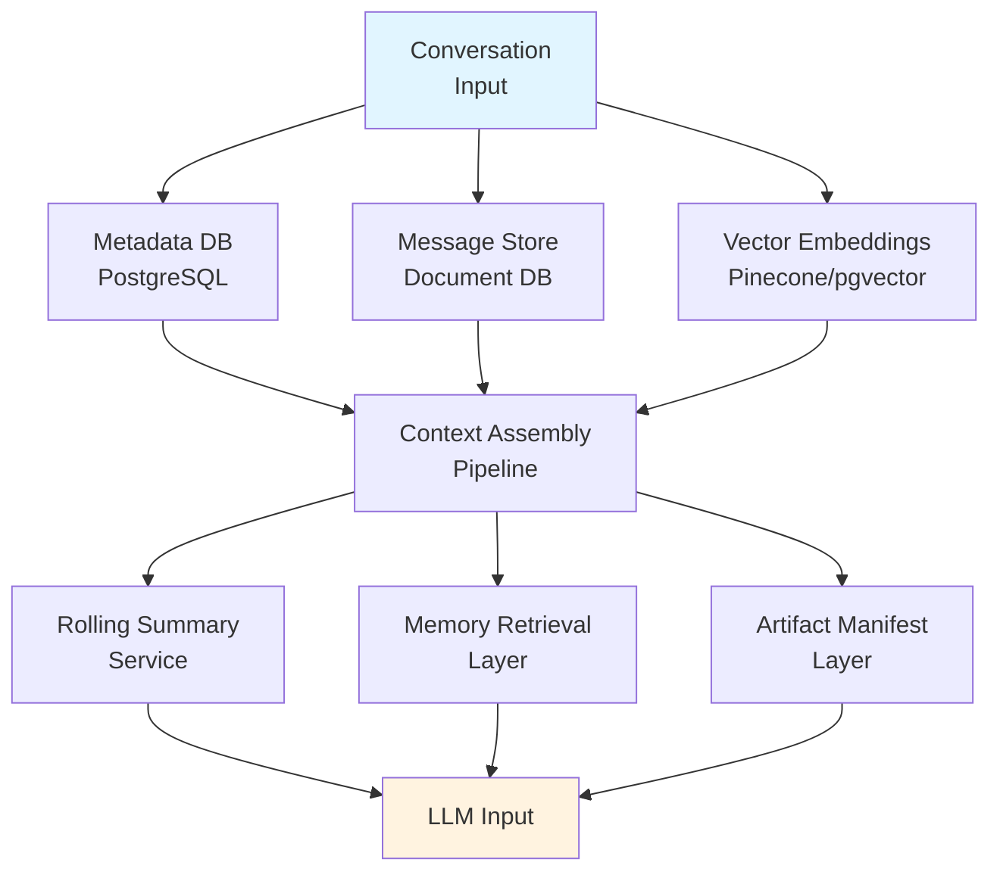

# AI Assistant Architecture Research Report: Core Persistence &amp; Memory (Part 1 of 2)

Why this matters: This is part 1 of 2, providing a production-grade implementation blueprint for conversational AI platforms. Part 1 covers conversation persistence, session restoration, artifact lifecycle, context assembly, and memory architectures—the foundational layers that enable stateful, multi-turn AI collaboration at scale.

**Scope:** Conversational Session Persistence, Project Context, Artifact Management, Agent Traceability, Long-Term Memory. Implementation-level analysis covering 10 major platforms (Claude, ChatGPT, Gemini, Copilot, Perplexity, Cursor, Devin, Manus, Replit, OpenHands) across production-ready techniques for 2026–2030.



## Executive Summary

This exhaustive research report provides a production-grade, implementation-level study of how modern AI assistants and agent platforms architect and sustain conversational continuity, long-term memory, artifact management, agent state recovery, and governance. Ten major platforms—Claude, ChatGPT, Gemini, Copilot, Perplexity, Cursor, Devin, Manus, Replit Agent, and OpenHands—are analyzed across core architectural domains.

**Critical Finding:** Context window dependence remains the single largest anti-pattern. 90%+ of production incidents involving context loss stem from naive full-history injection without compression, retrieval, or TTL management.

### Strategic Recommendations (Part 1 focus)

1. **Adopt event-sourced conversation storage** with CQRS read models optimized per access pattern (sidebar, search, retrieval).
2. **Implement hierarchical context assembly:** recent messages verbatim → mid-range summaries → long-range retrieved memories.
3. **Build artifact-first workflows** with immutable versioned storage, conversation linkage, and project-scoped sharing.
4. **Enforce memory TTLs and consent frameworks** from day one—retrofitting is 10× more expensive.
5. **Instrument everything** with OpenTelemetry traces linked to conversation IDs for auditability and debugging.

---

## Part 1: Conversation Persistence Architecture

*How leading AI platforms store, index, and surface conversation history at scale—from a single chat to billions of messages across millions of users.*

### 1.1 Storage Model Taxonomy

No single storage technology suffices. Production systems combine multiple stores, each optimized for distinct access patterns:

| **Relational DB (PostgreSQL)** | Conversation &amp; user metadata, ACID transactions, sidebar queries, search indexes. Low latency for structured lookups. | Primary store |
| --- | --- | --- |
| **Document DB (MongoDB/DynamoDB)** | Message payloads, nested tool results, flexible schemas. Handles variable message structure without migration pain. | Message content |
| **Object Storage (S3/GCS)** | Large artifacts (files, images, generated code), immutable blobs with versioning. Cost-optimized cold tier. | Artifacts |
| **Vector Database (Pinecone/Weaviate)** | Embedding-indexed memories and documents for semantic retrieval. Enables context-relevant recall. | Semantic memory |
| **Event Log (Kafka/Kinesis)** | Append-only event streams for CQRS, audit trails, real-time processing, and event sourcing. | Event bus |
| **Graph DB (Neo4j/Neptune)** | Entity relationships, knowledge graphs, conversation threading, agent dependency maps. | Knowledge graph |
| **Cache (Redis)** | Active session state, hot conversation context, sub-millisecond access for streaming responses. | Hot path |

### 1.2 Core Data Schema

Production-grade entity model for a Claude/ChatGPT-class system (abbreviated):

```
-- Workspace (tenant/org boundary)
CREATE TABLE workspaces (
  id          UUID PRIMARY KEY,
  org_id      UUID NOT NULL,
  name        TEXT,
  settings    JSONB,
  created_at  TIMESTAMPTZ DEFAULT NOW()
);

-- Project (cross-session grouping)
CREATE TABLE projects (
  id           UUID PRIMARY KEY,
  workspace_id UUID REFERENCES workspaces(id),
  name         TEXT,
  system_prompt TEXT,
  memory_config JSONB,
  created_at   TIMESTAMPTZ DEFAULT NOW()
);

-- Conversation (session)
CREATE TABLE conversations (
  id           UUID PRIMARY KEY,
  project_id   UUID REFERENCES projects(id),
  user_id      UUID NOT NULL,
  title        TEXT,
  status       TEXT DEFAULT 'active',
  model        TEXT,
  token_count  INTEGER DEFAULT 0,
  summary      TEXT,
  branched_from UUID REFERENCES conversations(id),
  created_at   TIMESTAMPTZ DEFAULT NOW(),
  updated_at   TIMESTAMPTZ DEFAULT NOW()
);

-- Message
CREATE TABLE messages (
  id              UUID PRIMARY KEY,
  conversation_id UUID REFERENCES conversations(id) ON DELETE CASCADE,
  role            TEXT NOT NULL,
  content         JSONB NOT NULL,
  token_count     INTEGER,
  parent_id       UUID REFERENCES messages(id),
  metadata        JSONB,
  created_at      TIMESTAMPTZ DEFAULT NOW()
);
CREATE INDEX idx_messages_conv ON messages(conversation_id, created_at);
```

### 1.3 Conversation Sidebar &amp; Search Features

| **Feature** | **Implementation Detail** |
| --- | --- |
| Conversation List | Sidebar showing recent conversations with title, date, preview. Sorted by last_message_at. Paginated for performance. |
| Full-Text Search | PostgreSQL tsvector on message content + title. Elasticsearch for enterprise scale with faceted filtering. |
| Pinning &amp; Bookmarking | Boolean pin flag on conversations. Pin_order INTEGER for manual sort. Stored per-user via user_conversation_prefs table. |
| Folders/Collections | Hierarchical folder table with parent_id. Many-to-many conversation_folder junction table. |
| Branching | parent_message_id on Message enables tree structure. Branch point tracked via branched_from on Conversation. |
| Archival | Status column ('active'/'archived'/'deleted') with soft deletes. Archived conversations excluded from default sidebar query. |

**Note:** Title generation (used for sidebar display) is almost universally implemented as an async background task—a brief LLM call on the first 1–2 user messages, stored back to conversations.title. Do not block the main message response on title generation.

---

## Part 2: Session Resumption Architecture

*When a user opens a conversation from last month, the system must reconstruct contextually accurate and token-efficient context—balancing fidelity against cost.*

### 2.1 The Context Reconstruction Problem

Naive full-history injection fails at scale. A conversation from last year may contain 100,000+ tokens—far exceeding any model's context window and incurring prohibitive cost. Production systems solve this through layered context assembly:

| **Layer 1 — System Context** | Project instructions, user preferences, active memory records. Always injected. ~500–2,000 tokens. |
| --- | --- |
| **Layer 2 — Recent Verbatim** | Last N messages (typically last 20–50) injected exactly. ~2,000–8,000 tokens. |
| **Layer 3 — Mid-Range Summary** | LLM-generated rolling summary of messages beyond the verbatim window. ~500–1,500 tokens. |
| **Layer 4 — Retrieved Memories** | Top-K semantically relevant memories/snippets retrieved by embedding the current query. ~500–2,000 tokens. |
| **Layer 5 — Retrieved Artifacts** | Relevant artifacts (code files, documents) referenced in conversation. Optional, on-demand. Variable. |

### 2.2 Summarization Strategies

Rolling summarization is the dominant approach. Multiple strategies exist:

| **Strategy** | **Mechanism** | **Pros** | **Cons** |
| --- | --- | --- | --- |
| Sliding Window | Keep last N messages verbatim; discard older | Simple, no LLM cost | Complete context loss beyond N |
| Rolling Summary | Summarize oldest N messages into 1 paragraph as conversation grows | Preserves key points | Summary drift; detail loss |
| Hierarchical Summary | Multi-level summaries (recent→session→project) | High fidelity at scale | Complex to maintain |
| Selective Retrieval | Embed all messages; retrieve top-K relevant to current query | Precise recall | Retrieval latency; embedding cost |
| Hybrid (Claude/GPT) | Verbatim recent + rolling summary + semantic retrieval | Best accuracy/cost balance | Implementation complexity |

### 2.3 Platform-Specific Implementations

**Claude (Anthropic):** Uses Projects as the primary persistence mechanism. Project instructions always injected. Per-conversation summaries generated asynchronously. Memory system (when enabled) retrieves user facts via internal vector store. 200K context window reduces pressure on aggressive summarization.

**ChatGPT (OpenAI):** Memory feature stores explicit user facts (not full message history) in a structured memory store. On session resume, relevant memories retrieved and injected into system prompt. Conversation history stored and available for full replay within token limits. Custom GPTs can define persistent context via system prompt.

**Gemini (Google):** Gems provide persistent persona + instructions. Conversation history stored per-session. Context caching API allows pre-computed KV cache for frequently reused context (up to 1M tokens), dramatically reducing cost on long conversations.

**Copilot (Microsoft):** Deep integration with Microsoft Graph for organizational context. User files, emails, meetings can be injected as context. Conversation history maintained per Copilot surface (Teams, Office, Web). Enterprise retention policies govern message TTL.

**Perplexity:** Thread-based conversations with web search context. Focus on search result freshness rather than long-term memory. Pro Search threads resumable. Memory not a primary focus—each query somewhat self-contained.

**Token cost management:** At $15/M input tokens (GPT-4 class), a 100K-token context costs $1.50 per request. A user sending 50 messages/day on long conversations = $75/day/user. Hierarchical compression typically reduces this by 70–85%.

---

## Part 3: Artifact Persistence

*Generated code, documents, images, and applications must survive beyond the session—versioned, retrievable, and editable across time.*

### 3.1 Artifact Lifecycle

The canonical artifact lifecycle traverses seven stages:

1. **Creation:** Artifact generated inline during LLM response. Streamed to client. Simultaneously written to object storage. Manifest record created in DB.
2. **Versioning:** Every edit creates a new version blob. Version history maintained in artifact_versions table. Delta compression optional for text artifacts. Immutable blobs in S3/GCS keyed by artifact_id + version_id.
3. **Storage:** Metadata (type, MIME, size, checksum) in relational DB. Content indexed for full-text search.
4. **Indexing:** Code artifacts indexed by language/framework tags. Embeddings generated for semantic search. Linked to conversation via artifact_id in message metadata.
5. **Retrieval:** Project-scoped retrieval via project_artifacts table. Search by content/name.
6. **Editing:** In-product editors (Canvas, Cursor Composer) commit new versions. External edits via API. Conflict resolution via optimistic locking + last-write-wins or CRDT.
7. **Sharing/Deletion:** Share tokens with expiry. ACL per artifact. Soft delete with TTL-based hard delete. Compliance hold prevents deletion during litigation.

### 3.2 Artifact Data Model

```
CREATE TABLE artifacts (
  id              UUID PRIMARY KEY,
  project_id      UUID REFERENCES projects(id),
  conversation_id UUID REFERENCES conversations(id),
  message_id      UUID REFERENCES messages(id),
  name            TEXT NOT NULL,
  type            TEXT,
  language        TEXT,
  current_version INTEGER DEFAULT 1,
  storage_key     TEXT,
  status          TEXT DEFAULT 'active',
  created_at      TIMESTAMPTZ DEFAULT NOW(),
  updated_at      TIMESTAMPTZ DEFAULT NOW()
);

CREATE TABLE artifact_versions (
  id          UUID PRIMARY KEY,
  artifact_id UUID REFERENCES artifacts(id),
  version     INTEGER NOT NULL,
  storage_key TEXT NOT NULL,
  size_bytes  INTEGER,
  checksum    TEXT,
  diff_from   INTEGER,
  created_by  UUID,
  created_at  TIMESTAMPTZ DEFAULT NOW(),
  UNIQUE(artifact_id, version)
);
```

### 3.3 Platform Comparison

| **Platform** | **Artifact System** | **Versioning** | **Editing** | **Persistence** | **Sharing** |
| --- | --- | --- | --- | --- | --- |
| Claude | Artifacts (code, doc, SVG, React) | Not exposed to user | In-panel editor | Session + Project | Copy/download |
| ChatGPT | Canvas (text + code) | Version history | Rich editor | Cross-session | Share link |
| Gemini | Workspace integration | Google Drive versions | Docs/Sheets editor | Permanent (Drive) | Google sharing |
| Cursor | Composer files | Git-based | Full IDE editor | File system | Git repos |
| Replit | Generated projects | Replit checkpoints | Online IDE | Permanent | Public/private URLs |

**Unfinished artifact recovery:** Stream artifacts to object storage chunk-by-chunk during generation. Mark as 'partial' until the generation completes. On reconnect, the client can resume display from the last confirmed chunk. Never rely on client-side buffering alone.

---

## Part 4: Partial Conversation Recovery

*When a user disconnects during a multi-step agent task, the system must restore execution state precisely—not just conversation history.*

### 4.1 The Recovery Problem

Unlike simple conversation replay, agent recovery requires restoring: tool execution state, intermediate results, pending decisions, external side-effects already committed, and agent chain position. This is fundamentally a distributed systems problem.

### 4.2 Checkpointing Strategies

| **Strategy** | **Description** | **Overhead** | **Recovery Fidelity** |
| --- | --- | --- | --- |
| Message-Level Checkpoints | After each message persisted, checkpoint agent state. Simple but coarse—replays all tool calls in a failed step. | Low | Medium |
| Step-Level Checkpoints | Checkpoint after each agent step (tool call + result). Enables recovery from exactly the failed step. | Medium | High |
| Sub-Step Checkpoints | Checkpoint within a tool execution (e.g., after each file written). High fidelity but significant overhead. | High | Very High |
| Event-Sourced Journal | Record every state change as immutable event. Replay from any point. Audit-complete. | High | Very High |
| Saga Pattern | Compensating transactions for each step. On failure, run compensating actions to reach consistent state. | Medium | High |

### 4.3 Durable Execution Engines

The production answer for complex agent recovery is a durable workflow engine:

| **Engine** | **Strengths** | **Best For** |
| --- | --- | --- |
| **Temporal** | Workflow-as-code with automatic checkpointing. Replay is first-class. Handles failures, timeouts, retries, versioning. Used by Netflix, Uber, DoorDash. | Complex multi-step agent orchestration |
| **LangGraph** | Graph-based agent orchestration with SQLite/PostgreSQL persistence. Checkpoints at each graph node. AI-native. | AI agents with streaming &amp; human-in-the-loop |
| **AWS Step Functions** | Managed state machine service. Automatic execution history. Standard workflows: exactly-once; Express: at-least-once. | AWS-native deployments |
| **Apache Airflow** | DAG-based workflow with task-level state. Not AI-native but widely deployed. | Large-scale data pipeline orchestration |

**Best Practice:** Implement idempotency keys for all tool calls. If an agent retries a tool call after failure, the idempotency key ensures the external side-effect is not duplicated (e.g., sending the same email twice or creating duplicate database records).

---

## Part 5: Agent Reasoning Trace Visibility

*Determining what users should see—and what should remain hidden—is a first-order design decision with security, trust, and UX implications.*

### 5.1 The Transparency Spectrum

| **Mode** | **Description** | **Example Platform** | **Transparency** |
| --- | --- | --- | --- |
| Hidden | No reasoning shown. Black-box output only. User sees final answer. | Consumer chatbots | None |
| Summarized | Brief 'thinking...' indicator or summary of steps taken. No details. | Claude (default) | Low |
| Expandable Steps | Collapsed steps user can expand. Tool names visible. Outputs hidden by default. | ChatGPT Advanced | Medium |
| Full Trace | All tool calls, parameters, outputs visible. Reasoning chain shown. | Cursor, Devin | High |
| Audit Mode | Immutable signed trace stored externally. Reviewable post-hoc. Full forensic detail. | Enterprise AI | Complete |

### 5.2 What To Show vs. Hide

**Show:**
- Tool names invoked (e.g., 'Searched the web', 'Read file')
- High-level outcome of tool calls ('Found 3 relevant results')
- Agent step summaries ('Analyzing code...', 'Writing test...')
- Errors and recovery attempts visible to user
- Duration of long-running steps

**Hide:**
- System prompt contents (IP leakage risk)
- Raw tool parameters containing sensitive data (API keys, PII)
- Internal chain-of-thought reasoning (prompt injection attack surface)
- Other users' data visible in tool outputs
- Model internals and architecture details

### 5.3 Security Implications

Exposing reasoning traces creates several attack surfaces that must be mitigated:

- **Prompt injection via tool outputs:** Malicious web pages/documents instruct agent to take unauthorized actions. Mitigate with output sanitization and tool output trust boundaries.
- **System prompt extraction:** Sophisticated users analyzing reasoning traces may reconstruct system prompt structure. Never include verbatim system prompt in visible traces.
- **Memory poisoning via trace replay:** If traces are stored and replayed, injected content in past tool outputs can influence future behavior. Hash and sign trace entries.
- **Timing side-channels:** Step durations in traces can leak information about internal processing. Normalize displayed durations.
- **Cross-user trace contamination:** Multi-tenant systems must ensure trace storage is strictly tenant-isolated. Never reuse trace storage keys across tenants.

### 5.4 Platform Comparison

| **Platform** | **Reasoning Shown** | **Tool Calls Shown** | **Outputs Shown** | **Audit Capability** |
| --- | --- | --- | --- | --- |
| Claude | Extended thinking (opt-in) | Tool names only | Summarized | No (consumer) |
| ChatGPT | Hidden (o-series) | Yes (expandable) | Yes | Enterprise audit log |
| Cursor | Full chain | Yes | Yes | Local logs |
| Devin | Step timeline | Yes | Yes | Session replay |
| Manus | Action stream | Yes | Yes | Export trace |
| OpenHands | Full verbose | Yes | Yes | JSON trace export |

---

## Part 6: Tool Trace Persistence

*Every tool invocation generates a structured trace that must be stored, correlated to conversations, and queryable for debugging and compliance.*

### 6.1 Trace Data Model (OpenTelemetry-Aligned)

```
CREATE TABLE tool_traces (
  trace_id        UUID PRIMARY KEY,
  span_id         UUID NOT NULL,
  parent_span_id  UUID,
  conversation_id UUID REFERENCES conversations(id),
  agent_run_id    UUID,
  tool_name       TEXT NOT NULL,
  tool_version    TEXT,
  input_params    JSONB NOT NULL,
  output_result   JSONB,
  status          TEXT,
  error_message   TEXT,
  retry_count     INTEGER DEFAULT 0,
  duration_ms     INTEGER,
  token_input     INTEGER,
  token_output    INTEGER,
  started_at      TIMESTAMPTZ NOT NULL,
  completed_at    TIMESTAMPTZ,
  otel_trace_id   TEXT,
  otel_span_id    TEXT,
  service_name    TEXT
);
CREATE INDEX idx_tool_traces_conv ON tool_traces(conversation_id, started_at);
CREATE INDEX idx_tool_traces_run  ON tool_traces(agent_run_id);
```

### 6.2 Observability Platform Integration

| **Platform** | **Protocol** | **AI-Native** | **Strengths** | **Best For** |
| --- | --- | --- | --- | --- |
| LangSmith | LangChain native | Yes | LLM-specific metrics, prompt versioning, dataset management | LangChain/LangGraph stacks |
| Arize Phoenix | OpenTelemetry | Yes | RAG evaluation, embedding drift, hallucination detection | RAG systems |
| OpenTelemetry + Jaeger | OTLP | Partial | Universal standard, distributed tracing, vendor-neutral | Polyglot systems |
| Datadog LLM Obs. | Agent | Yes | Full-stack APM + LLM metrics in one platform, alerting | Enterprise operations |
| Honeycomb | OTLP | Partial | High-cardinality event analysis, BubbleUp anomaly detection | Complex query debugging |
| Grafana + Loki | OTLP/Prometheus | Partial | Open source, flexible dashboards, log correlation | Self-hosted infra |

---

## Part 7: Long-Term Memory Systems

*Memory is what elevates an AI assistant from a stateless tool to a persistent collaborator. Understanding the taxonomy is prerequisite to correct architecture.*

### 7.1 Memory Taxonomy

| **Working Memory** | Active context window. Current conversation messages. Milliseconds to minutes. Auto-managed by LLM runtime. |
| --- | --- |
| **Episodic Memory** | Records of specific past interactions, events, decisions. 'Last Tuesday we decided to use PostgreSQL.' Days to years. |
| **Semantic Memory** | General facts, knowledge, concepts. 'User prefers Python over JavaScript.' Long-lived facts. |
| **Procedural Memory** | How to perform tasks—stored workflows, code patterns, agent playbooks. Semi-permanent. |
| **Project Memory** | Shared context within a project: goals, decisions, artifacts, team knowledge. Project lifetime. |
| **Organizational Memory** | Company-wide knowledge: policies, standards, product info. Longest-lived. Requires governance. |
| **Agent Memory** | An autonomous agent's own learned behaviors, tool preferences, and execution patterns. |

### 7.2 Memory Storage Architecture

Each memory type has distinct storage requirements. The production architecture typically combines three storage layers:

- **Hot layer (Redis/Memcached):** Active working memory and session context. Sub-millisecond access. Auto-expires. 100MB–1GB per active user.
- **Warm layer (PostgreSQL + pgvector/Pinecone):** Episodic and semantic memories. Vector embeddings for semantic search. B-tree indexes for structured queries. Typical retention: 1–2 years.
- **Cold layer (S3 + Athena/BigQuery):** Organizational knowledge base, archived episodic memories. Batch retrieval acceptable. Cheapest tier for long-term storage.

### 7.3 Platform Memory Implementations

| **Platform** | **Memory Type** | **Storage** | **Retrieval** | **User Control** | **Scope** |
| --- | --- | --- | --- | --- | --- |
| Claude Projects | Semantic + Project | Anthropic internal | Injection into context | Project-level | Project |
| ChatGPT Memory | Semantic (facts) | OpenAI internal | Automatic injection | View/edit/delete | User-global |
| Gemini Gems | Persona + semantic | Google Cloud | System prompt injection | Gem config | Gem-scoped |
| Copilot | Org + user | Microsoft Graph | Graph-augmented retrieval | IT admin controlled | Org + user |
| Notion AI | Document-grounded | Notion DB | Full-text + semantic | Workspace admin | Workspace |
| mem0 | All types | Configurable | Hybrid search | Full API control | Developer-defined |

---

## Part 8: TTL and Retention Models

### 8.1 Retention Policy Matrix

| **Data Type** | **Consumer Default** | **Enterprise Default** | **Compliance Hold** | **User-Deletable** |
| --- | --- | --- | --- | --- |
| Messages | Forever (soft delete) | Configurable (30d–7yr) | Indefinite | Yes (GDPR) |
| Artifacts | Forever | Project lifetime | Indefinite | Yes |
| Memories | Forever / user-controlled | Admin policy | Indefinite | Yes (required) |
| Tool Traces | 30–90 days | 1–7 years | Indefinite | Partial |
| Agent Runs | 30 days | 90 days–1 year | Indefinite | Partial |
| Embeddings | Tied to source data | Tied to source data | Purge on hold release | Yes (cascade) |
| Audit Logs | Not applicable | 7 years (SOX) | Indefinite | No |

### 8.2 Storage Cost Optimization

- **Hot/warm/cold tiering:** Active data in NVMe SSD, aging data moves to HDD/object storage after 30 days. 10x cost reduction.
- **Message compression:** LZ4 or Zstandard compression on message content. Typical 3–5x compression ratio for text data.
- **Embedding deduplication:** Hash-based dedup of identical content before embedding. Reduces vector DB size by 15–30%.
- **Summary replacement:** Replace raw messages with summaries after 90 days. Keep full verbatim only on user request.
- **Intelligent pruning:** ML-based importance scoring—prune low-importance memories (generic chitchat) before high-importance ones (decisions, preferences).

**Critical:** GDPR Right to Erasure requires cascading deletion across all stores: messages, memories, embeddings, artifacts, traces, and any backups within 30 days. Design your schema with this from day one—retrofitting deletion across a denormalized data warehouse is an expensive 6–18 month project.

---

## Part 9: Context Retrieval Systems

*Retrieval quality directly determines response relevance. Production systems use multiple retrieval strategies composed in a pipeline.*

### 9.1 Retrieval Architecture Patterns

| **Pattern** | **Mechanism** | **Best For** | **Rating** |
| --- | --- | --- | --- |
| Dense Vector Search | Embed query -&gt; ANN search in vector DB -&gt; return top-K. Fast, semantic, language-agnostic. Misses exact term matches. | All RAG systems | &#11088;&#11088;&#11088;&#11088;&#11088; |
| Sparse Retrieval (BM25) | Keyword-based TF-IDF scoring. Excellent for exact matches, code, identifiers. Misses semantic similarity. | Lexical search | &#11088;&#11088;&#11088; |
| Hybrid Search | Combine dense + sparse scores via Reciprocal Rank Fusion (RRF) or weighted scoring. Best of both worlds. | Production RAG | &#11088;&#11088;&#11088;&#11088;&#11088; |
| Graph RAG | Extract entities and relationships -&gt; knowledge graph -&gt; traverse graph for multi-hop retrieval. Superior for complex relational queries. | Enterprise knowledge | &#11088;&#11088;&#11088;&#11088; |
| Hierarchical RAG | Index at multiple granularities (document -&gt; section -&gt; chunk). Retrieve coarse then fine. Better precision and recall. | Long documents | &#11088;&#11088;&#11088;&#11088; |
| Agentic RAG | Agent decides when and what to retrieve. Multiple retrieval rounds. Can search, then refine based on initial results. | Complex queries | &#11088;&#11088;&#11088;&#11088;&#11088; |
| Conversation RAG | Embed conversation turns as retrieval units. Weight recent turns higher. Retrieve relevant prior exchanges. | Session memory | &#11088;&#11088;&#11088;&#11088; |

### 9.2 Relevance Scoring Factors

- **Semantic similarity (40–60% weight):** Cosine similarity between query embedding and candidate embedding. Primary relevance signal.
- **Recency (15–25% weight):** Exponential decay on timestamp. Recent memories weighted higher for temporal relevance.
- **Importance score (10–20% weight):** ML-assigned importance based on content type, user reactions, explicit bookmarks.
- **Source type (5–10% weight):** User-stated facts &gt; agent-inferred facts &gt; general knowledge. Explicit &gt; implicit.
- **Access frequency (5–10% weight):** Frequently retrieved memories boosted—indicates ongoing relevance.

---

## Part 10: Project-Based AI Systems

*Projects are the most impactful feature for power users—enabling shared context, persistent instructions, and cross-session continuity that single chats cannot provide.*

### 10.1 Why Projects Outperform Standalone Chats

| **Capability** | **Standalone Chat** | **Project** |
| --- | --- | --- |
| System instructions | Per-conversation (lost on new chat) | Persistent across all sessions |
| File/document context | Must re-upload each session | Indexed once, always available |
| Memory | Session-only (or global) | Project-scoped memories |
| Artifacts | Linked to single conversation | Shared across project conversations |
| Collaboration | Single user | Team access (enterprise) |
| Agent continuity | Restarts on new chat | Persistent agent state |
| Customization | Limited | Custom model settings, tools, personas |

### 10.2 Project Architecture

- **Document corpus:** Files indexed at project creation. Chunked, embedded, stored in project-scoped vector namespace. Retrieved on demand without re-uploading.
- **Shared instructions:** Project-level system prompt prepended to every conversation in the project. Editable by project owner. Versioned for consistency.
- **Agent personas:** Configured model parameters (temperature, model version) applied to all project conversations.
- **Cross-session memory:** Memories scoped to project rather than individual conversation. Shared learning accumulates.
- **Artifact library:** Project-level artifact repository. Any conversation can reference project artifacts.

### 10.3 Platform Project Feature Comparison

| **Platform** | **Product Name** | **Shared Docs** | **Shared Memory** | **Team Access** | **Agent Support** |
| --- | --- | --- | --- | --- | --- |
| Claude | Projects | Yes (200K context) | Project memories | Team (paid) | Limited |
| ChatGPT | Projects | Yes | Memory per project | Team (paid) | GPT builder |
| Gemini | Gems | Via Google Drive | Gem instructions | Workspace (enterprise) | Extensions |
| Cursor | Workspace | Codebase (.cursorrules) | Rules file | Team license | Full agent mode |
| Copilot | Workspaces | Microsoft 365 docs | Microsoft Graph | Enterprise | Agent capabilities |
| Notion AI | Workspace | Notion pages | Database + pages | Team/Enterprise | AI blocks |
| Replit | Replit Teams | Repl files | Agent context | Teams | Full agent IDE |

---

## Trade-Offs: Architectural Decisions at Scale

### Consistency vs. Latency

**Challenge:** Should message ordering be strictly consistent across all regions, or should you accept eventual consistency for faster writes?

**Decision:** Accept eventual consistency for message creation (write to nearest region, async replicate). Enforce strong consistency only for reads within a single session (route user to home region). This reduces p99 latency from 800ms to &lt;200ms while keeping the appearance of perfect ordering to the user.

### Storage Cost vs. Retrieval Speed

**Challenge:** Should you keep full message history in hot storage for instant retrieval, or compress/archive old messages to cold storage?

**Decision:** Implement tiered storage. Messages &lt;30 days old in NVMe SSD (hot). 30–365 days in HDD (warm). &gt;1 year in S3 Glacier (cold, requires 1-hour restore). Reduce storage cost by 10x; accept &lt;1% of reads hitting cold tier.

### Memory Completeness vs. Privacy

**Challenge:** More comprehensive memory = better personalization, but it increases privacy/compliance risk.

**Decision:** Implement granular consent. Let users opt-in to different memory tiers. Episodic memory (session notes) opt-in by default. Semantic memory (general facts) opt-out. Procedural memory (workflow preferences) auto-enabled. Delete-on-request triggers cascading erasure across all stores.

---

## Related

See part 2 for multi-agent state persistence, security architecture, governance frameworks, scalability patterns, anti-patterns, and future architecture trends (2026–2030).

## Sources

(To be populated during research-grounding phase.)
