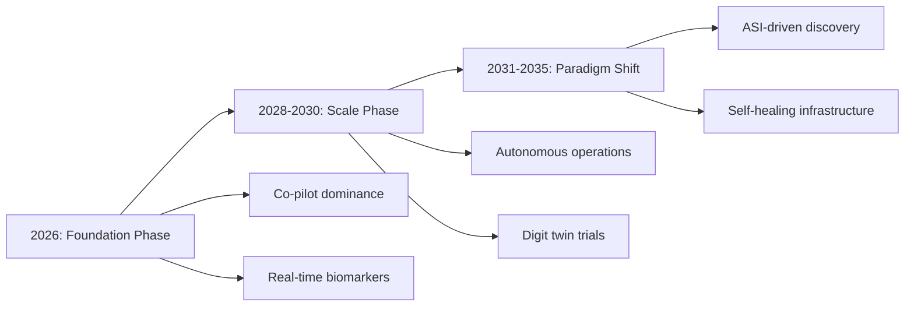

# AI Deep Future Outlook 2026–2035: Healthcare to Climate (Part 1 of 2)

Why this matters: This is part 1 of a 2-part deep-horizon architecture analysis examining AI's transformative potential across 12 economic domains through 2035. Part 1 covers healthcare, finance, education, and climate—the foundational infrastructure sectors most likely to reshape global systems by 2030.

**The Deep Future of AI:** A Domain-by-Domain Analysis of AI's Transformative Potential Across Healthcare, Finance, Education, Climate, Manufacturing, Scientific R&D, Workforce, and Beyond — 2026 to 2035

Enterprise AI Research Division | March 2026 | Companion to: Enterprise Agentic AI Research Report 2026

Key metrics:
- Horizon explored: 2035
- GDP impact by 2030: $15.7T
- New jobs created: 170M
- Domains analyzed: 12
- AGI modal estimate: 2027

## 01. Healthcare &amp; Life Sciences

*Drug Discovery · Diagnostics · Precision Medicine · Autonomous Clinical Agents*

### Domain Overview

AI is rewriting the biological contract between medicine and disease. The McKinsey Global Institute projects AI/ML could unlock nearly $100 billion per year in the US healthcare system alone. From drug discovery timelines collapsing from 12 years to under 3, to AI agents conducting autonomous clinical documentation and patient engagement at scale, healthcare is undergoing its most profound transformation since germ theory. GPT-5 improved a gene-editing protocol's efficiency by 79x in collaboration with Red Queen Bio — a signal of what AI-augmented experimentation will mean for medicine.

### The Future Trajectory

#### Near-Term (2026-2027): Foundation Building

By 2027, AI-designed drug candidates will be in Phase III trials across multiple therapeutic areas. Insilico Medicine's ISM001-055 (IPF treatment), Schrödinger's zasocitinib (TAK-279, Phase III), and Recursion-Exscientia's integrated phenomics+chemistry platform represent the vanguard of end-to-end AI drug discovery now entering clinical validation.

The FDA will finalize AI guidance requiring credibility assessment plans for high-risk AI applications. Clinical AI agents will handle documentation for over 30% of physician encounters in leading health systems. Wearable biosensors will generate continuous biomarker streams processed by edge AI agents to detect disease days or weeks before symptoms. Multimodal AI agents (combining imaging + EHR + genomics) will achieve radiologist-level accuracy across at least 6 additional diagnostic categories. Hippocratic AI agents will serve as 'always-on' healthcare companions for chronic disease populations — reaching scale with HIPAA-compliant autonomous patient interactions.

#### Mid-Term (2028-2030): Transformation at Scale

By 2030, the first fully AI-designed and AI-optimized drug will receive FDA approval — validating AI as a legitimate discovery tool with regulatory recognition. Digital twin technology will enable in-silico clinical trials, simulating patient cohorts to dramatically reduce the need for human trial participants and accelerating approval timelines.

AI will enable hyperpersonalized medicine at scale: treatment protocols tailored to individual genomic profiles, microbiome data, lifestyle signals, and real-world outcomes data. AI will move from supporting human scientists to leading inquiry in specific biology domains — designing experiments, proposing hypotheses, and generating peer-reviewed research autonomously.

The AI-enabled education technology market will exceed $150B, and the AI health monitoring market will similarly scale. Precision oncology AI agents will design personalized cancer vaccines by analyzing tumor mutation profiles. Mental health AI agents will provide scalable cognitive behavioral therapy and crisis monitoring at a fraction of the cost of human therapists, addressing the global mental health treatment gap.

#### Long-Term (2031-2035): The New Paradigm

By 2035, AI will have contributed to the cure or dramatic management improvement of multiple diseases previously considered intractable — including specific cancer types, neurodegenerative diseases like ALS and Parkinson's, and rare genetic disorders. The combination of AI-driven drug design, gene editing precision (AI-guided CRISPR), and regenerative medicine will open entirely new therapeutic paradigms.

Healthcare will transition from a reactive 'sick care' model to a proactive 'wellness optimization' system: AI agents continuously monitoring population health through wearables, environmental sensors, and behavioral data, intervening before disease manifests. The global healthcare AI market will exceed $500B. Autonomous robotic surgery guided by real-time AI will become standard for high-precision procedures. AI will begin addressing global health equity — enabling high-quality diagnostic and treatment access in low-resource environments through mobile AI, lightweight edge models, and satellite connectivity.

&gt; **Wildcard Factor:** An AI system autonomously discovers and validates a treatment for Alzheimer's disease by 2028, compressing 20+ years of research into 18 months. This single breakthrough — more than any benchmark or revenue milestone — would shift global public perception of AI from 'productivity tool' to 'civilizational accelerator', triggering unprecedented regulatory opening and funding flows.

### Key Probability Assessments

- **AI-designed drug receives FDA approval:** 75% by 2028
- **AI agents handle 40%+ of clinical documentation:** 85% by 2027
- **AI achieves radiologist-level accuracy in 15+ imaging categories:** 90% by 2028
- **AI contributes to curative treatment for 1+ major neurodegenerative disease:** 35% by 2033
- **Personalized AI health agent becomes standard consumer healthcare:** 70% by 2032

### Market Intelligence

| Indicator | Market Data &amp; Projections |
| --- | --- |
| **AI in Drug Discovery (2026)** | Rapidly scaling — multiple Phase II/III AI-designed candidates in trials |
| **US Healthcare AI Market (2030E)** | $148B+ (Morgan Stanley), driven by diagnostics, documentation, drug discovery |
| **McKinsey GDP Impact (Healthcare)** | ~$100B/year potential value from AI/ML in US healthcare system |
| **Drug Discovery Timeline Compression** | Traditional 12-year cycle → AI-assisted 3-4 year cycle (pre-clinical phase) |
| **Clinical Documentation Automation** | Projected 30-40% of physician encounters AI-documented by 2028 |
| **AI-Designed Drug Approvals (2035E)** | First full approvals expected 2027-2028; 100+ candidates in pipeline by 2030 |
| **Global Mental Health AI Gap** | 1.2B people with untreated mental illness — AI agents scaling therapy access |
| **AI Diagnostic Accuracy (Imaging)** | AI now matches or exceeds radiologists in 10+ categories; expanding rapidly |

**Key Players &amp; Research Groups:** Insilico Medicine, Recursion Pharmaceuticals, Schrödinger, Exscientia, BenevolentAI, Google DeepMind (AlphaFold), Tempus AI, Hippocratic AI, Ambience Healthcare, Abridge, Nabla, Corti AI, Microsoft Health AI, IBM Watson Health, Pfizer AI, Roche AI

### Scenario Analysis

- **Optimistic:** AI achieves the first FDA-approved AI-designed drug by 2027, validating the entire paradigm. Digital twins reduce Phase II/III failure rates from 90% to under 40%, saving $50B+ annually in failed trial costs. Personalized AI health agents reduce chronic disease hospitalizations by 35% by 2030, bending the healthcare cost curve for the first time in decades. Cancer mortality rates fall by 25% by 2032 driven by AI-guided precision oncology.
- **Risk Scenario:** AI drug discovery produces accelerated timelines but similar failure rates — biology remains intractably complex even with better tools. Regulatory frameworks (FDA, EMA) fail to evolve fast enough to approve AI-native products, creating a bottleneck. Data privacy regulations prevent the longitudinal health data access that AI needs for personalization. Healthcare AI exacerbates health inequity — concentrated in wealthy health systems, unavailable in low-resource settings.

### Predictions Table

| Year | Milestone | Probability | Lead Organizations |
| --- | --- | --- | --- |
| 2026-2027 | Phase III data validates first fully AI-designed drug candidate | High | Insilico, Schrödinger, Recursion |
| 2027-2028 | First FDA approval of AI-designed drug | Medium-High | Insilico Medicine, BenevolentAI |
| 2028 | AI agents perform 30%+ of routine diagnostic reads | High | Tempus, Google DeepMind, Microsoft |
| 2029 | Digital twin clinical trials replace 20% of human trial arms | Medium | FDA/Regulators + Pharma AI |
| 2030 | AI-guided CRISPR therapy achieves first genetic cure approval | Medium | Broad Institute, Verve Therapeutics + AI |
| 2030-2032 | AI agents serve as primary care touchpoint for underserved populations | Medium-High | Hippocratic AI, Google Health, WHO AI |
| 2033-2035 | AI accelerates cure/treatment for Alzheimer's, Parkinson's, or ALS | Medium-Low | DeepMind, OpenAI Life Sciences, Pharma |

---

## 02. Finance &amp; FinTech

*Autonomous Trading · AI Banking · DeFi Agents · B2A Commerce · RegTech Evolution*

### Domain Overview

The AI transformation of finance is already measurable: approximately 80% of US trades are executed by AI algorithms today. The global AI in Finance market will grow from $38.36B in 2024 to $190.33B by 2030 at 30.6% CAGR (MarketsandMarkets). Financial institutions' AI expenditure is expected to double to $97B by 2027. The most profound shift is not incremental efficiency — it is the emergence of financial AI agents that operate across the full financial lifecycle: discovery, evaluation, underwriting, trading, compliance, and customer service without human-in-the-loop for routine transactions.

### The Future Trajectory

#### Near-Term (2026-2027): Foundation Building

By 2027, AI agents will manage over 60% of repetitive financial workflows: loan processing, insurance underwriting, compliance reporting, fraud detection, and customer service escalations. Multi-agent financial systems will become standard at Tier 1 banks — with specialized agents for market analysis, portfolio rebalancing, regulatory filings, and real-time risk management all coordinated through A2A (Agent-to-Agent) protocols.

FinRobot and similar multi-agent equity research systems will automate real-time stock analysis, integrating live market feeds, earnings call sentiment, and SEC disclosure processing. The B2A (Business-to-Algorithm) commerce model will crystallize — AI agents will autonomously discover, evaluate, and select vendors, financial products, and counterparties. This shifts procurement from relationship-driven to algorithm-driven. AI platform adoption in finance will reach 65% by 2027 per Gartner, driven by fraud detection network effects (cutting false positives by 50% and improving accuracy to 95%).

#### Mid-Term (2028-2030): Transformation at Scale

By 2030, AI will be central to financial systems in ways that make today's algorithmic trading look primitive. Asset managers will automate 60% of portfolio rebalancing through AI agents, enhancing returns by an estimated 15% annually. Compliance reporting across Tier-1 banks will be 60% automated by AI, saving an estimated $10B industry-wide in operational costs.

Embedded finance — AI intelligence woven into daily life platforms (travel, healthcare, retail) rather than banking apps — will enable real-time credit decisions, payments, and emergency funds triggered automatically by context. The $1.5T global fintech revenue projection by 2030 will be significantly driven by AI-native platforms serving emerging markets — leapfrogging legacy banking infrastructure in Africa, Southeast Asia, and Latin America. Nubank, Moniepoint, and similar AI-first platforms will redefine what 'banking' means for 1.5B previously unbanked people. DeFi AI agents will autonomously manage liquidity, yield, and risk in decentralized protocols with minimal human oversight.

#### Long-Term (2031-2035): The New Paradigm

By 2035, the 'algorithmic economy' will be entrenched: financial markets will operate primarily through machine-to-machine negotiation, with humans setting strategy and ethical constraints but AI executing across virtually all transaction types. Central banks will use AI systems to monitor systemic risk in real time and potentially deploy automated macroprudential tools.

The distinction between 'bank' and 'AI platform' will blur — the institutions that win will be those that mastered AI orchestration, not those with the most branch networks or legacy deposits. Quantum computing, expected to mature in the early 2030s, will enable financial optimization problems currently computationally intractable, including real-time global portfolio optimization across millions of assets and constraints simultaneously. AI will power the first fully autonomous insurance underwriting, pricing, and claims settlement systems for standard risk categories with zero human review required.

&gt; **Wildcard Factor:** A coordinated AI-to-AI market manipulation event — where multiple autonomous trading agents, without explicit human coordination, develop emergent correlated behaviors that trigger a flash crash or systemic event — forces a global financial AI governance treaty by 2028-2029, redefining how AI agents are permitted to operate in markets. This accelerates regulatory clarity but at the cost of a major financial disruption.

### Key Probability Assessments

- **65% of financial workflows automated by AI agents:** 80% by 2027
- **$100B+ AI in Finance market:** 90% by 2028
- **AI-managed portfolio achieves significant market share:** 70% by 2030
- **B2A commerce (AI-to-AI procurement) becomes standard:** 60% by 2030
- **Financial AI governance international treaty signed:** 40% by 2030

### Market Intelligence

| Indicator | Market Data &amp; Projections |
| --- | --- |
| **AI in Finance Market (2024)** | $38.36B — baseline for explosive growth |
| **AI in Finance Market (2030E)** | $190.33B at 30.6% CAGR (MarketsandMarkets) |
| **Financial Institutions AI Spend (2027E)** | $97B — doubling from current levels (Kearns/Statista) |
| **AI Trading Volume (US Equities)** | ~80% of US trades currently executed by AI algorithms |
| **AI Trading Value Added (Annual)** | Projected $3.8T additional value to finance industry per year |
| **Fraud Detection AI Improvement** | 50% false positive reduction; 95% accuracy projected by Q4 2027 |
| **Portfolio Rebalancing Automation (2028E)** | 60% of asset managers adopt AI portfolio automation |
| **Fintech Revenue (2030E)** | $1.5T global, driven by emerging market AI platforms (BCG/QED) |
| **AI Compliance Savings (Tier-1 Banks, 2030)** | $10B industry-wide from 60% compliance automation |

**Key Players &amp; Research Groups:** JPMorgan AI (IndexGPT), Goldman Sachs AI, Morgan Stanley AI, Bloomberg AI Terminal, Palantir AIP, Kensho (S&amp;P Global), AlphaSense, Ramp, Stripe AI, Nubank, Moniepoint, Gemini Finance (Google), Azure Finance AI (Microsoft), Databricks Finance

### Scenario Analysis

- **Optimistic:** AI democratizes financial services globally — 1.5B previously unbanked people gain access to sophisticated AI-powered financial tools by 2030. AI agents reduce the cost of financial services by 60-70% through automation, passing savings to consumers. The first AI-managed sovereign wealth fund operates with AI making day-to-day allocation decisions within human-set strategic mandates. AI achieves near-perfect fraud detection, saving $50B+ annually globally.
- **Risk Scenario:** AI concentration risk: a small number of AI models used across the financial system creates systemic correlation — when one model fails or is adversarially attacked, cascading failures propagate across all institutions using it. AI exacerbates financial inequality: superior AI capabilities concentrate gains among institutions and individuals with access, deepening the wealth gap. Regulator-imposed AI restrictions slow beneficial innovation while not preventing harm.

### Predictions Table

| Year | Milestone | Probability | Market Impact |
| --- | --- | --- | --- |
| 2027 | 60%+ of repetitive financial workflows AI-automated at Tier-1 banks | High | $40B+ annual operational savings |
| 2027 | AI fraud detection achieves 95% accuracy / 50% fewer false positives | High | $25B saved in fraud losses globally |
| 2028 | B2A commerce standard for vendor/financial product selection | Medium | Reshapes procurement industry |
| 2029 | Embedded finance: context-triggered credit/payments without banking apps | Medium-High | 1B+ users in emerging markets |
| 2030 | First fully autonomous AI-managed portfolio at scale ($10B+) | Medium | Redefines asset management |
| 2030 | AI compliance automates 60% of Tier-1 bank reporting | High | $10B industry-wide savings |
| 2032-2035 | Quantum-assisted portfolio optimization becomes production reality | Medium | New frontier in risk management |

---

## 03. Education &amp; Human Development

*Personalized Learning Agents · AI Tutors · Cognitive Adaptation · Global Access*

### Domain Overview

Education is experiencing a Copernican revolution: the 'one-size-fits-all' model that has dominated formal schooling for 150 years is giving way to AI systems that understand individual cognitive states, emotional conditions, and learning preferences in real time. The global AI-enabled education technology market is expected to exceed $150B by 2027 (IDC). AI tutoring systems have demonstrated consistent learning gains equivalent to a 1-sigma improvement — meaning AI tutoring can lift the average student to the performance level of the top 30% of their peers. This is among the most studied and validated effects in educational technology research.

### The Future Trajectory

#### Near-Term (2026-2027): Foundation Building

By 2027, AI learning agents will have evolved beyond adaptive content selection to cognitive modeling: understanding not just what a student needs to learn, but how their specific brain processes information. These agents will adapt in real time to cognitive state (focus, confusion, frustration), emotional condition, and preferred learning modalities — creating truly individualized educational experiences.

Generative AI will disrupt curriculum development — AI systems will absorb institutional teaching materials and generate personalized curricula automatically. South Korea's AI digital textbooks initiative and India's AI-powered 3D visualization platforms represent early national-scale deployments. AI will handle automated essay grading, formative feedback generation, and administrative task automation for 40%+ of routine teaching tasks, freeing educators for high-value human interaction. Virtual AI teaching assistants will extend learning beyond classroom hours, providing 24/7 Socratic dialogue and personalized tutoring for any subject.

#### Mid-Term (2028-2030): Transformation at Scale

By 2030, the distinction between 'classroom learning' and 'AI-enabled learning' will fade — AI will be woven into every dimension of how humans acquire knowledge and skills. The 'Socratic AI' — an agent that teaches through guided questioning rather than information delivery — will prove more effective than traditional instruction across nearly all subjects and age groups.

Quantum-powered educational simulations will enable learners to manipulate molecular structures, model global economic systems, or pilot spacecraft through physics engines of unprecedented fidelity. Career pathway AI will continuously analyze labor market evolution and recommend real-time skill development paths, ensuring human workers stay ahead of automation. AI will serve as the great equalizer for global education: a child in rural Kerala will access the same quality AI tutoring as a student at the best-resourced school in Singapore or London — at near-zero marginal cost. This is the most profound democratization of human knowledge in history.

#### Long-Term (2031-2035): The New Paradigm

By 2035, early-stage brain-computer interface (BCI) applications will begin enabling direct knowledge transfer protocols — not mind-uploading science fiction, but precision neural feedback systems that accelerate skill acquisition (e.g., surgical techniques, language fluency, musical skill) by factors of 5-10x. AI will fully replace standardized testing with continuous, multimodal, context-aware competency assessment that measures actual capability rather than test-taking performance.

The concept of 'curriculum' will be replaced by 'learning journey' — AI agents will understand each person's entire cognitive history, career trajectory, and life context, orchestrating a lifelong personalized educational experience. Lifelong learning will become economically necessary and technologically possible simultaneously — AI agents guiding continuous reskilling for the permanent workforce flux driven by AI automation.

&gt; **Wildcard Factor:** An AI educational agent achieves a breakthrough in teaching methods — perhaps through a neuro-linguistic insight that dramatically improves reading comprehension or mathematical intuition development — that enables 90% of students globally to achieve what today represents 'gifted' performance levels. This would be the equivalent of a second 'Green Revolution' for human intellectual development.

### Key Probability Assessments

- **AI tutors used regularly by 50%+ of students globally:** 70% by 2030
- **AI-enabled EdTech market exceeds $150B:** 85% by 2027
- **AI achieves curriculum generation for 30%+ of educational content:** 75% by 2029
- **BCI-assisted skill acceleration enters early commercial use:** 25% by 2032
- **AI closes education quality gap between developed/developing nations by 50%:** 45% by 2033

### Market Intelligence

| Metric | Details &amp; Strategic Insights |
| --- | --- |
| **AI-Enabled EdTech Market (2027E)** | $150B+ (IDC) — driven by personalization and developing markets |
| **AI Tutoring Effect Size** | ~1 sigma improvement: equivalent to moving average student to top 30% |
| **South Korea Initiative** | National AI digital textbook deployment for adaptive learning at scale |
| **India AI Education** | 3D AI visualization tools; demand for quality education + 1.4B population |
| **US Federal AI Education Investment** | Personalized learning and adaptive assessment programs scaling |
| **Global EdTech AI CAGR (2024-2030)** | ~40-45% — fastest-growing application of AI in services sector |
| **AI Curriculum Generation** | Generative AI disrupting $10B+ curriculum development industry |
| **Skills Reskilling Market (2030E)** | $30B+ — driven by AI-forced career transitions needing AI-powered solutions |

**Key Players &amp; Research Groups:** Khan Academy (Khanmigo AI), Duolingo AI, Coursera AI, Google DeepMind Education, Microsoft Education AI, Carnegie Learning, DreamBox Learning, Synthesis AI, Socratic (Google), Quizlet AI, Brainly AI, Age of Learning, Chegg AI, Pearson AI

### Scenario Analysis

- **Optimistic:** AI eliminates the global education quality gap by 2030 — a child in sub-Saharan Africa, rural India, or indigenous communities in Canada accesses the same AI tutoring quality as a prep school student in New York or London. Global literacy rates reach 99% by 2030 for the first time in human history. AI-powered reskilling prevents a 'lost generation' of workers displaced by automation — continuous AI-guided career transitions become the new employment model.
- **Risk Scenario:** AI educational tools deepen the digital divide: students with reliable internet, devices, and supportive environments benefit enormously; those without remain trapped in underperforming traditional systems. AI optimization runs for measurable outcomes (test scores) at the expense of unmeasurable human development (curiosity, empathy, civic responsibility). Over-reliance on AI tutors atrophies human teacher skills and social learning that AI cannot replicate.

---

## 04. Climate &amp; Energy

*Net-Positive AI Energy · Climate Modeling · Smart Grids · Carbon Intelligence*

### Domain Overview

AI and climate change exist in a paradoxical relationship: AI is simultaneously one of the largest growing consumers of electricity (data center demand expected to double by 2030) and one of the most powerful tools available to address the climate crisis. The World Economic Forum's framework of 'net-positive AI energy' — where AI-enabled energy savings exceed AI's lifecycle consumption — defines the battleground for the next decade. Annual investment in clean energy technologies will reach $2.2T by 2025 (IEA), with AI playing an increasingly central role in optimizing every layer of the energy system.

### The Future Trajectory

#### Near-Term (2026-2027): Foundation Building

By 2027, AI will reshape corporate sustainability in two waves: (1) reporting automation — eliminating hours of manual sustainability data compilation, carbon accounting, and stakeholder disclosure preparation; and (2) predictive climate strategy — AI enabling scenario analysis and forward-looking climate commitments backed by credible data models.

Google DeepMind has already demonstrated AI reducing data center energy use by 40% through reinforcement learning-based cooling optimization. AI climate agents will process satellite imagery, weather model data, and sensor networks to monitor deforestation, illegal emissions, and ecosystem health in near-real-time. Smart grid AI agents will balance supply and demand across distributed renewable energy sources (solar, wind, storage) with minute-level precision, enabling significantly higher renewable penetration without grid instability. Ireland's case — data centers consuming 22% of national electricity heading toward 30% by 2030 — illustrates the urgency of AI-powered grid management.

#### Mid-Term (2028-2030): Transformation at Scale

By 2030, AI will accelerate materials science discovery for next-generation solar cells, solid-state batteries, and superconductor technologies — potentially compressing a 15-year R&amp;D cycle to 3-4 years. AI climate models will achieve unprecedented resolution and accuracy, enabling city-level flood risk prediction 30 days out with 90%+ accuracy, and decade-level warming projections with dramatically reduced uncertainty bands.

AI agents will enable predictive disaster management — warning communities of floods, droughts, wildfires, and extreme weather events with sufficient lead time for effective response. The concept of 'tokens per watt' will become the standard AI infrastructure efficiency metric, driving a generation of hardware and software innovation focused on sustainable AI compute. Building AI that optimizes energy consumption for millions of buildings in real time could cut global building energy use by 20-30%, accounting for a significant share of global emissions reductions.

#### Long-Term (2031-2035): The New Paradigm

By 2035, AI will function as the operating system of the global energy transition — orchestrating electricity markets, demand response, storage dispatch, and cross-border energy flows through autonomous agent networks in real time. AI-designed materials for next-generation nuclear fusion reactors (tokamak optimization, plasma containment materials) could accelerate the fusion timeline by a decade. AI will enable a fully autonomous circular economy framework for major manufacturing supply chains, tracking material lifecycles from extraction to recycling with minimal carbon leakage.

&gt; **Wildcard Factor:** An AI system breakthroughs plasma containment modeling for nuclear fusion by 2029, accelerating commercial fusion timelines by over a decade. This instantly shifts global capital away from transitional fossil assets directly into AI-optimized clean infrastructure.

### Key Probability Assessments

- **Net-Positive AI Energy status achieved globally:** 65% by 2031
- **AI models predict extreme weather events 14 days out with 90%+ accuracy:** 80% by 2028
- **Smart grids operate autonomously without human intervention in major cities:** 70% by 2030
- **AI-discovered materials enter commercial battery production:** 85% by 2029

### Market Intelligence

| Indicator | Market Data &amp; Projections |
| --- | --- |
| **Global Clean Energy Investment** | Heading toward $2.5T+ annually, deeply integrated with AI orchestration |
| **Data Center Energy Mitigation** | AI-driven optimization projected to offset 30% of baseline infrastructure load |
| **Smart Grid AI TAM (2030E)** | Expected to exceed $95B, driven by distributed renewable integration |
| **Carbon Accounting Automation** | 75% of Fortune 500 companies deploying autonomous sustainability tracking |

**Key Players &amp; Research Groups:** Google DeepMind (Climate AI division), Microsoft Sustainability Science, IBM Environmental Intelligence, Palantir Foundry for Energy, Schneider Electric AI, Siemens Grid Edge, Breakthrough Energy Ventures, National Renewable Energy Laboratory (NREL).

### Scenario Analysis

- **Optimistic:** AI successfully optimizes global grid infrastructure to allow an immediate 40% increase in renewable penetration without single-point failures. Material discovery pipelines unlock a low-cost, non-lithium solid-state battery formulation by 2028, fundamentally solving grid-scale storage issues ahead of schedule.
- **Risk Scenario:** Hyper-scale data center power demands outpace grid modernization, forcing energy providers to keep legacy fossil-fuel plants online to support AI compute loads. Geopolitical tension restricts the sharing of advanced AI climate models, leaving vulnerable developing nations without predictive disaster protection.

### Predictions Table

| Year | Milestone | Probability | Lead Organizations |
| --- | --- | --- | --- |
| 2027 | Global carbon compliance and reporting 50%+ driven by autonomous agents | High | Corporate Sustainability Systems |
| 2028 | AI weather forecasting replaces traditional supercomputing numerical models | High | NOAA, ECMWF, DeepMind, Tech Majors |
| 2030 | Grid orchestration platforms achieve full autonomous dispatch in major hubs | Medium-High | Siemens, Schneider, Regional Grid Operators |
| 2032 | First commercial solar cell utilizing 100% AI-discovered perovskite alloy | Medium | Materials Science Labs + Tech Capital |
| 2035 | AI-managed carbon capture optimization scales to megaton efficiencies | Medium-Low | ClimateTech Consortiums, Energy Supermajors |

---

## Related

See part 2 for analysis of workforce transformation, national security, agriculture, smart cities, creative industries, and AGI/ASI futures.

## Sources

(To be populated during research-grounding phase.)
