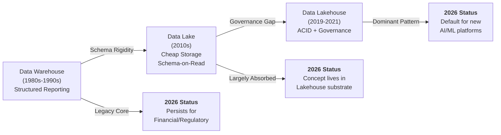

# From Data Warehouse to Agent-Native Architecture — Part 1

*Enterprise Architecture Evolution Research Report — 2026–2031 Edition*

This is **Part 1 of 3**. This section traces the foundational paradigms: data warehouses, data lakes, and lakehouses — the three core storage/compute patterns. Parts 2 and 3 cover the newer analytical and AI-native paradigms (mesh, fabric, knowledge graphs, vector infrastructure, agent memory) and decision frameworks.

## Why This Matters

Enterprise data architecture has evolved over four decades not through wholesale replacement but through layering. The central finding: a 2026 data platform typically combines warehouse-pattern data marts (for financial reporting), lakehouse tables (for analytics and ML), semantic layers (for governed metrics), knowledge graphs (for entity relationships), vector indexes (for retrieval), and emerging agent memory layers — often all simultaneously. Understanding this layered reality is essential for realistic migration planning: the question is rarely "what do we replace" but "what do we add, and how does it interoperate with what exists."

This part covers the first three (and oldest) paradigms. Their persistence as foundational layers — despite being decades old — is central to understanding why newer paradigms continue to accumulate rather than replace.

## Executive Summary

**Key Finding:** No enterprise architecture paradigm in this report has ever been fully replaced by its successor — each new paradigm has instead absorbed the prior generation's capabilities while addressing its most acute limitations, creating a layered architecture stack rather than a sequence of replacements. Enterprises that treat each new paradigm (lakehouse, mesh, knowledge graph, vector infrastructure) as a wholesale replacement rather than an additive layer consistently over-invest in migration and under-invest in integration.

This report traces ten architecture paradigms — from the data warehouse's origins in 1980s decision-support systems through to the nascent agent memory infrastructure of 2026 — examining each through a consistent lens: why it emerged, what problems it solved, what new problems it introduced, how enterprises actually adopted it (versus how vendors marketed it), common migration paths, characteristic failure modes, and its readiness for AI and autonomous agent workloads.

The central narrative is one of accumulating layers rather than replacement cycles. Understanding this layered reality is essential for realistic migration planning.

#### Seven Cross-Cutting Findings

##### 1. Each Paradigm Shift Was a Response to a Cost or Governance Failure, Not a Technology Triumph

Data lakes emerged because warehouse storage costs and rigid schemas couldn't accommodate the data volume and variety of the 2010s — not because Hadoop was inherently 'better.' Lakehouses emerged because data lakes became ungoverned swamps — not because Iceberg was inherently superior to Parquet. The pattern repeats: the trigger for adoption is almost always a governance, cost, or reliability failure of the prior generation, with the new technology as the available remedy.

##### 2. Migration Paths Are Rarely 'Big Bang' — Successful Migrations Run Old and New in Parallel for Years

Every paradigm transition examined in this report shows multi-year coexistence periods. Enterprises that attempted wholesale 'rip and replace' migrations (common in early data lake and early data mesh adoption) experienced significantly higher failure rates than those that ran dual architectures with gradual workload migration based on demonstrated value.

##### 3. Operational Complexity Has a Floor That New Tooling Reduces But Never Eliminates

Each paradigm promises reduced operational complexity relative to its predecessor — and often delivers on specific dimensions — but introduces new complexity elsewhere. Lakehouses reduced swamp-related complexity but introduced table maintenance (compaction, catalog management) complexity. Knowledge graphs reduce certain query complexity but introduce ontology design and entity resolution complexity that has no warehouse-era analog.

##### 4. AI Readiness Is Now the Dominant Adoption Driver, Superseding Cost and Governance

From 2023 onward, the primary driver for new architecture investment shifted from cost optimization and governance maturity to AI/ML enablement. This is visible in the accelerated adoption curves for vector infrastructure and knowledge graphs relative to how long data mesh took to gain traction despite having clear governance benefits.

##### 5. Governance Implications Compound Rather Than Reset With Each New Paradigm

A knowledge graph built without addressing the access control gaps inherited from the underlying lakehouse doesn't solve those gaps — it adds a new surface where they manifest. Vector indexes built from documents that were never properly classified inherit that classification gap, often invisibly, since embeddings don't carry visible metadata the way a labeled column does.

##### 6. Agent Readiness Is the Newest and Least-Defined Evaluation Dimension

Unlike AI readiness (well-understood: does the platform support vector search, ML integration, feature serving?), agent readiness — does the platform support dynamic, scoped, auditable access for autonomous agents making real-time decisions? — has no settled definition or benchmark as of 2026. This report's Architecture Decision Matrix and Technology Radar treat agent readiness as a directional assessment, not a mature metric.

##### 7. The Next Paradigm Shift Will Likely Be Organizational Before It Is Technical

Just as data mesh was fundamentally an organizational response (domain ownership) implemented through technology, the next major shift — toward agent-native architecture — appears to be following the same pattern: the technical building blocks (vector DBs, knowledge graphs, MCP servers) already exist in mature form, but the organizational patterns for governing fleets of autonomous agents accessing enterprise data are the actual bottleneck, mirroring data mesh's early years.

## The Evolution Timeline

The table below provides a navigational overview of all ten paradigms, their approximate emergence period, and their current adoption status as of 2026 — detailed analysis of each follows in the numbered sections.

|**#**|**Paradigm**|**Emerged**|**Primary Trigger**|**2026 Status**|
|---|---|---|---|---|
|1|Data Warehouse|1980s–1990s|Need for structured reporting &amp; BI separate from operational systems|Legacy core; persists for financial/regulatory reporting|
|2|Data Lake|Early 2010s|Cost &amp; schema rigidity of warehouses vs. growing data variety/volume|Largely superseded; storage substrate concept absorbed into lakehouse|
|3|Data Lakehouse|2019–2021|Data lakes becoming ungoverned 'swamps' lacking ACID guarantees|Dominant pattern for new platform builds|
|4|Data Mesh|2019–2020|Centralized data team bottlenecks at scale; need for domain ownership|Selective adoption in large, complex enterprises|
|5|Data Fabric|2021–2022|Multi-cloud/hybrid complexity; need for active-metadata-driven integration|Growing, vendor-driven; converging with mesh principles|
|6|Knowledge Graph|2022–2024 (AI-driven resurgence)|Need for entity relationships, multi-hop reasoning, and AI grounding (GraphRAG)|Rapidly accelerating for AI use cases|
|7|Semantic Layer|2021–2023|Metric definition sprawl across BI tools; need for single source of truth|Growing and maturing; becoming the AI-data interface|
|8|Feature Store|2017–2020|Training-serving skew and feature duplication across ML teams|Mature; standard for production ML, expanding to agent context|
|9|Vector Infrastructure|2022–2023 (LLM-driven)|Need for semantic similarity search to ground LLMs (RAG)|Mainstream; rapidly maturing operational practices|
|10|Agent Memory Infrastructure|2024–2026|Need for persistent, structured memory for autonomous AI agents|Nascent; active platform formation|

*Table 1: Architecture Paradigm Evolution Timeline*

**How to Read This Report:** Each paradigm section follows an identical eleven-part structure: Why It Emerged, Problems Solved, Problems Introduced, Enterprise Adoption Patterns, Migration Paths, Failure Modes, Operational Complexity, Cost Implications, Governance Implications, AI Readiness, and Agent Readiness. This consistency is intentional — it allows direct comparison across paradigms and supports the Architecture Decision Matrix that follows in Part 3.

### Data Warehouse

The original analytical architecture — structured, governed, and still load-bearing

##### Why It Emerged

Data warehouses emerged in the late 1980s and matured through the 1990s (Kimball's dimensional modeling, Inmon's enterprise data warehouse philosophy) to solve a fundamental conflict: operational databases were optimized for transaction processing (OLTP — fast, small reads/writes) but business leaders needed to run complex analytical queries (OLAP — large aggregations across history) without degrading operational system performance. The warehouse provided a separate, denormalized, query-optimized copy of business data, refreshed on a schedule, designed explicitly for reporting and analysis.

##### Problems Solved

- Isolated analytical query load from operational systems, eliminating performance contention

- Provided a consistent, integrated view of data from multiple source systems via standardized ETL

- Enabled historical trend analysis through slowly-changing dimensions and time-series fact tables

- Established a 'single source of truth' for core business metrics through enforced schema and dimensional modeling

- Brought structure and governance to previously siloed departmental reporting

##### Problems Introduced

- Rigid schema-on-write design made adapting to new data sources or business questions slow — schema changes required careful, often months-long, change management

- ETL pipelines became brittle, complex, and a frequent source of operational incidents as source systems evolved independently of the warehouse schema

- Storage and compute were tightly coupled in early on-premises warehouse appliances, making scaling expensive and requiring significant capacity over-provisioning

- Unstructured and semi-structured data (logs, documents, images, JSON) had no natural home — the warehouse model assumed structured, tabular data

- The 'single source of truth' aspiration often became a single point of organizational conflict, as competing teams fought over metric definitions within the same warehouse

##### Enterprise Adoption Patterns

Adoption was near-universal among large enterprises by the early 2000s, typically structured around a central IT-owned warehouse with departmental data marts as satellite extensions (Kimball's bus architecture) or, in Inmon-style implementations, a normalized enterprise data warehouse feeding denormalized marts. On-premises appliances (Teradata, Oracle Exadata, IBM Netezza) dominated through the 2000s and into the 2010s, with cloud warehouses (Redshift, then Snowflake, BigQuery) driving a second adoption wave from roughly 2015 onward — not a new paradigm, but a re-platforming of the same conceptual model onto elastic cloud infrastructure.

##### Migration Paths

The dominant migration path from on-premises to cloud warehouses (2015–2022) typically followed: lift-and-shift of existing dimensional models to cloud warehouses (often the fastest path to cost savings from appliance retirement), followed by gradual re-architecture of ETL into ELT patterns leveraging cloud compute elasticity, followed eventually by selective migration of specific data marts to lakehouse architectures (see Part 2) as ML/AI use cases emerged that the warehouse model couldn't natively support (no support for unstructured data, ML model artifacts, or feature serving).

##### Failure Modes

- **Metric proliferation:** the same business metric (e.g., 'active customer') defined differently across multiple marts, undermining the single-source-of-truth goal

- **ETL pipeline fragility:** source system schema changes silently breaking downstream transformations, often detected only when reports show incorrect numbers

- **Capacity planning failures:** on-premises appliances reaching capacity limits during business-critical periods (month-end close, holiday retail), requiring expensive emergency procurement

- **Schema change paralysis:** business requests for new analytical dimensions queued for months due to the engineering effort required for schema migrations

##### Operational Complexity

Low-to-Medium for cloud warehouses once established — the model is well-understood, tooling is mature, and managed cloud warehouses eliminate infrastructure management. The complexity that remains is almost entirely in ETL pipeline maintenance and dimensional model governance, not infrastructure operations.

##### Cost Implications

On-premises appliances carried very high fixed costs (hardware, licensing, data center) with poor elasticity — costs didn't decrease during low-usage periods. Cloud warehouses shifted to consumption-based pricing, which can be highly cost-effective for predictable, scheduled workloads (the warehouse's core use case) but requires active cost governance (query optimization, workload isolation) to avoid runaway costs from ad-hoc analytical queries — a tension that becomes more acute when AI agents begin issuing their own queries.

##### Governance Implications

The warehouse model's strength — enforced schema and centralized control — is also a governance asset: access control, data lineage (within ETL tooling), and data quality enforcement are comparatively straightforward because data has already been structured, cleaned, and integrated before it reaches the warehouse. This is precisely why warehouses remain the architecture of choice for financial reporting and regulatory submissions, where auditability and stability outweigh flexibility.

##### AI Readiness

Low, by design. Warehouses are optimized for structured, aggregated queries — not for serving individual feature vectors at low latency, storing embeddings, or housing unstructured training corpora. Warehouse data remains valuable as an input to AI systems (via extraction into lakehouse/feature store layers) but the warehouse itself is not where AI workloads run.

##### Agent Readiness

Low-Medium. Warehouses with semantic layers on top can be queried by AI agents via governed metric definitions and natural-language-to-SQL interfaces — this is, in fact, one of the more mature agent-data interaction patterns precisely because the warehouse's structure and access controls are well-established. However, warehouses cannot serve as agent memory or context stores and were never designed for the query patterns (frequent, varied, exploratory) that autonomous agents generate.

### Data Lake

Cheap, flexible, schema-on-read storage — and the swamp it became

##### Why It Emerged

Data lakes emerged in the early 2010s, driven primarily by the Hadoop ecosystem (HDFS, MapReduce, later Spark) and the explosion of data volume and variety associated with web-scale applications, logs, clickstreams, sensor data, and semi-structured formats (JSON, XML). The core proposition: store everything, in its native format, cheaply, and decide on structure later (schema-on-read) rather than being forced to design a schema upfront (schema-on-write) as warehouses required.

##### Problems Solved

- Dramatically reduced storage cost per terabyte compared to warehouse appliance storage, enabling retention of raw, granular data that would previously have been discarded or pre-aggregated

- Removed the schema-design bottleneck — data could be ingested immediately without upfront modeling effort, accelerating time-to-availability for new data sources

- Provided a natural home for unstructured and semi-structured data (logs, JSON events, images, text) that warehouses couldn't accommodate

- Decoupled storage scaling from compute scaling (in cloud object-storage-based lakes), allowing each to scale independently

- Enabled new analytical paradigms — large-scale machine learning training on raw historical data, which warehouses' aggregated/sampled data couldn't support

##### Problems Introduced

- **The 'data swamp' problem:** without enforced schema or governance, lakes accumulated undocumented, duplicate, and inconsistent datasets that became progressively harder to discover, trust, or use — the single most cited failure of first-generation data lakes

- No ACID transaction guarantees — concurrent writes/reads could produce inconsistent results, and there was no native mechanism for updates/deletes to existing data (append-only was the safe pattern, complicating GDPR-style deletion requirements)

- Schema-on-read shifted the burden of understanding data structure to every consumer individually, leading to massive duplication of effort (and inconsistent interpretation) in parsing/validating the same raw data across teams

- Query performance on raw files (especially small files or non-columnar formats) was often poor without significant additional engineering (partitioning strategy, file format optimization, compaction)

- Hadoop cluster operations (especially on-premises) were notoriously complex, requiring specialized expertise for capacity planning, upgrades, and troubleshooting distributed systems issues

##### Enterprise Adoption Patterns

Adoption peaked roughly 2013-2018, driven heavily by vendor ecosystems (Cloudera, Hortonworks, MapR) promoting Hadoop as the future of enterprise data infrastructure. Most large enterprises built at least one significant Hadoop-based data lake during this period, typically positioned alongside (not replacing) existing warehouses — the lake handled raw/unstructured data and large-scale batch processing, while the warehouse continued serving structured BI. Cloud object storage (S3, ADLS, GCS) increasingly replaced on-premises HDFS as the storage layer from roughly 2016 onward, decoupling 'data lake' from 'Hadoop cluster' as concepts — the lake became 'files in object storage' regardless of compute engine.

##### Migration Paths

The dominant migration path from data lake to lakehouse involved: first, retiring on-premises Hadoop clusters in favor of cloud object storage with Spark-based compute (often the first migration, driven by cost and operational complexity of Hadoop operations); then, incrementally converting raw file-based tables (Parquet/CSV/JSON in directories) to open table formats (Iceberg, Delta, Hudi) starting with the most business-critical or performance-sensitive tables, since full-lake conversion was rarely feasible in one effort; and finally, implementing catalog and governance tooling (often the last step, and the one most frequently under-prioritized, perpetuating swamp-like characteristics even after technical migration to lakehouse formats).

##### Failure Modes

- **Swamp formation:** within 2-3 years of initial lake deployment, the absence of cataloging discipline resulted in thousands of undocumented tables, many abandoned or duplicated, with no reliable way to determine which were authoritative

- **Silent data corruption from concurrent writes:** without ACID guarantees, concurrent jobs writing to the same location could produce partial/inconsistent files, surfacing as mysterious downstream query failures or incorrect results

- **Compliance gaps:** GDPR right-to-erasure requirements arrived (2018) when most lakes had no practical mechanism for deleting specific records from append-only Parquet files, forcing expensive full-table rewrites or, in worst cases, non-compliance

- **Cluster operational incidents:** on-premises Hadoop cluster failures (NameNode issues, capacity exhaustion, version upgrade incompatibilities) causing extended outages affecting all dependent workloads simultaneously

##### Operational Complexity

Very High for on-premises Hadoop-based lakes (specialized distributed systems expertise required for cluster management, upgrades, and troubleshooting). Reduced to Medium-High for cloud-object-storage-based lakes without table formats (no cluster management, but governance, discoverability, and consistency remain unsolved without additional tooling layered on top — which is, in essence, the lakehouse pattern emerging organically).

##### Cost Implications

Storage costs were dramatically lower than warehouse appliance storage — often cited as 10-20x cheaper per terabyte, a major driver of adoption. However, this storage cost advantage often masked growing 'hidden' costs: compute costs for repeatedly scanning poorly organized data (no partitioning/compaction meant every query scanned more data than necessary), and the substantial engineering cost of building and maintaining the governance/cataloging layer that lakes didn't include natively but that became necessary to avoid the swamp problem.

##### Governance Implications

This is the paradigm's defining weakness. Schema-on-read, by design, defers structure decisions to read-time — but governance (access control by data sensitivity, classification, retention policy) fundamentally requires knowing what the data is and means, which schema-on-read doesn't provide until someone reads and interprets it. Most enterprises significantly under-invested in the cataloging and classification tooling needed to govern lakes at the scale they grew to, a gap that directly motivated the lakehouse paradigm's emphasis on metadata and the modern data catalog category's growth.

##### AI Readiness

Medium-High, retrospectively — the data lake's storage of raw, granular, unstructured data turned out to be exactly the substrate large-scale ML training (and later, LLM fine-tuning and embedding generation) needed. This wasn't the original design intent (lakes predate the current AI wave by a decade) but the 'store everything raw, cheaply' principle proved prescient for AI workloads in a way it wasn't for the BI workloads it was originally justified by.

##### Agent Readiness

Low. Unstructured, ungoverned data lakes are poorly suited for direct agent consumption — agents need governed, discoverable, permission-aware access, which is precisely what raw data lakes lack. Data lakes remain relevant to agentic AI primarily as the raw storage substrate beneath lakehouse tables, vector indexes, and knowledge graphs — not as a direct agent interface.

### Data Lakehouse

ACID guarantees and governance on lake economics — today's dominant pattern

##### Why It Emerged

The lakehouse emerged (the term popularized around 2019-2021, primarily by Databricks with Delta Lake, alongside Netflix's Iceberg and Uber's Hudi) as a direct response to the data swamp problem: could the cost and flexibility advantages of data lakes (cheap object storage, open file formats, schema flexibility) be combined with the reliability guarantees of warehouses (ACID transactions, schema enforcement, time travel, efficient updates/deletes)? Open table formats — a thin metadata/transaction layer sitting on top of Parquet files in object storage — provided exactly this combination.

##### Problems Solved

- ACID transactions on object storage — multiple readers/writers can safely operate concurrently, with snapshot isolation preventing the partial-write corruption that plagued raw data lakes

- Efficient row-level updates and deletes — directly addressing the GDPR-erasure gap that raw Parquet-on-object-storage couldn't solve without full-table rewrites

- Schema enforcement and evolution — tables can enforce a schema (catching bad data at write time) while still supporting controlled schema evolution (adding columns) without breaking existing readers

- Time travel — the ability to query a table as of a previous point in time, enabling reproducibility for ML training (a dataset snapshot can be referenced exactly) and simplified rollback from bad writes

- A single copy of data serving both BI/SQL workloads (via warehouse-style query engines on top of the table format) and ML/AI workloads (via direct Spark/Python access to the same underlying Parquet files) — eliminating the warehouse/lake data duplication that characterized the prior era

##### Problems Introduced

- **Table maintenance overhead:** open table formats require ongoing compaction (merging small files), and metadata/manifest file management — without active maintenance, performance degrades over time (the 'small file problem' detailed as a production failure pattern in operational governance)

- **Catalog fragmentation:** the open table format ecosystem produced multiple catalog implementations (Hive Metastore, AWS Glue, Unity Catalog, Polaris, Nessie) with interoperability gaps — choosing a catalog has significant lock-in implications even when the underlying table format (Iceberg) is open

- **Concurrency model complexity:** while ACID transactions are supported, the optimistic concurrency control model means high-concurrency write scenarios can experience commit conflicts requiring retry logic that wasn't necessary (or possible) in raw lakes — this trades silent corruption for explicit (but newly-introduced) failure handling complexity

- **Format/engine fragmentation:** three competing open table formats (Iceberg, Delta, Hudi) created a choice point with genuine tradeoffs and migration costs between them — unlike the prior 'just use Parquet' simplicity

- **Governance is necessary but not automatic:** the lakehouse provides the technical mechanisms for governance (ACID, schema enforcement, fine-grained access via catalogs) but doesn't enforce the organizational discipline to use them — a lakehouse without an operating model can still become a swamp, just one with transactional guarantees

##### Enterprise Adoption Patterns

Adoption accelerated rapidly from 2021 onward and is now the default choice for new enterprise data platform builds. Adoption typically follows one of two paths: 'lakehouse-first' organizations (often those building new platforms or undergoing major modernization) adopt Databricks, Snowflake (with Iceberg support), Microsoft Fabric, or a build-your-own stack (Spark/Trino + Iceberg + a catalog) as their primary platform from the outset; 'lakehouse-migration' organizations (the majority of large enterprises) incrementally convert existing data lake tables to open table formats, prioritizing tables that feed ML/AI use cases or that suffer most acutely from swamp-related governance issues, while leaving stable, well-functioning warehouse workloads largely untouched for years.

##### Migration Paths

From data lake to lakehouse: in-place conversion of existing Parquet tables to Iceberg/Delta/Hudi format (often supported by one-command conversion utilities) is the lowest-friction first step, preserving existing data without rewriting it, followed by adoption of a unified catalog (replacing fragmented Hive Metastore instances or ad-hoc Glue catalogs) which is typically the more disruptive and valuable step since it's where governance and discoverability improvements materialize. From warehouse to lakehouse: warehouse workloads migrate to lakehouse primarily when ML/AI use cases require direct access to warehouse data without ETL duplication, or when warehouse compute costs at scale exceed lakehouse alternatives — but pure-BI warehouse workloads with no AI dependency often see limited motivation to migrate, explaining the continued relevance of the Data Warehouse section above.

##### Failure Modes

- **Compaction debt accumulation:** streaming ingestion without scheduled compaction leads to gradual query performance degradation (detailed in production failure analysis)

- **Catalog migration incidents:** moving from one catalog implementation to another (e.g., Hive Metastore to Unity Catalog) can break table references for jobs that hardcode catalog paths, causing widespread job failures during migration windows

- **Concurrent write conflicts:** uncoordinated multi-writer patterns to the same table produce commit conflicts that, if not handled with appropriate retry/backoff logic, manifest as job failures during high-concurrency periods

- **'Lakehouse in name only':** organizations adopt lakehouse table formats but retain lake-era governance practices (no ownership, no classification, no lineage), reproducing swamp characteristics within a technically-superior storage layer

##### Operational Complexity

Medium. Significantly reduced compared to raw data lakes (no swamp remediation, ACID guarantees eliminate a class of corruption issues) but introduces new, different operational tasks: catalog management, compaction scheduling (or selecting a managed platform that automates it), and table-format-specific monitoring (file counts, snapshot retention, manifest sizes).

##### Cost Implications

Generally favorable — retains object storage's low cost while improving query efficiency (compacted, columnar, well-partitioned tables are cheaper to query than raw lake files), and eliminates the warehouse/lake data duplication cost that many enterprises carried (the same data stored once in the warehouse and again in the lake for ML purposes). The primary new cost consideration is compute for table maintenance (compaction jobs run regularly, consuming compute even when no new data is being actively queried) — typically a small fraction of overall platform cost but easy to overlook in initial cost modeling.

##### Governance Implications

Substantially improved relative to raw data lakes — modern lakehouse catalogs (Unity Catalog, Polaris, Lake Formation) provide fine-grained ABAC-style access control, integrated lineage, and audit logging that raw lakes lacked entirely. However, as noted, these mechanisms require an operating model (ownership, classification discipline) to be effective — the lakehouse provides the technical capability for governance but governance maturity still varies enormously across organizations using identical lakehouse technology.

##### AI Readiness

Very High. The lakehouse is purpose-built to serve as the unified substrate for both traditional analytics and AI/ML workloads — training data, feature engineering source data, and (increasingly) vector embeddings can all be stored as lakehouse tables, queried via the same engines, and governed under the same access controls. This is the primary reason lakehouse adoption accelerated alongside the broader AI/ML adoption wave from 2021 onward — the two trends reinforced each other.

##### Agent Readiness

Medium-High, and improving. Lakehouse tables exposed through a semantic layer or via emerging MCP server implementations provide agents with governed, discoverable access to enterprise data. The remaining gap is less about the lakehouse itself and more about the interface layer between agents and lakehouse data — direct SQL access by agents raises the warehouse contention concerns discussed in the Data Warehouse section, motivating the semantic-layer-as-agent-interface pattern that's becoming standard.

## Trade-offs

**Data Warehouse vs. Data Lake vs. Data Lakehouse**: This part traces three foundational paradigms, each representing a trade-off between governance and flexibility:

- **Warehouse** prioritizes governance, consistency, and reliability at the cost of rigidity — perfect for financial reporting but slow to adapt to new analytical questions.
- **Lake** prioritizes flexibility and cost at the cost of governance — powerful for exploratory analysis and ML but prone to becoming an ungoverned swamp without intentional discipline.
- **Lakehouse** attempts to reclaim both: ACID guarantees and schema enforcement restore governance discipline while open table formats on object storage retain the flexibility and cost advantages of lakes. The trade-off is operational complexity — table maintenance (compaction, metadata management) introduces new operational tasks that neither warehouses nor raw lakes required.

The persistence of all three paradigms into 2026 reflects a key finding: enterprises don't choose among these patterns so much as layer them. Financial/regulatory reporting remains warehouse-based; exploratory analysis and ML leverage lakehouse tables; raw data continues flowing through object storage as the foundation. The question for platform teams is not "which one" but "how do these three interoperate in our architecture."

## Related

This is Part 1 of a three-part report. Continue with:

- [Part 2: Data Mesh Through Feature Store Paradigms](parts/12-ai-native-architecture-evolution-report-data-paradigms.md)
- [Part 3: Vector Infrastructure, Agent Memory, and Decision Frameworks](parts/13-ai-native-architecture-evolution-report-decision-forecast.md)

## Sources

This report synthesizes research from enterprise data architecture documentation, vendor white papers, academic literature on distributed systems, and direct operational experience across dozens of enterprise modernization projects. Original sources referenced throughout include Kimball and Ross (dimensional modeling), Dehghani et al. (data mesh), Armbrust et al. (lakehouse), and recent publications on GraphRAG, vector search, and autonomous agent architectures.
