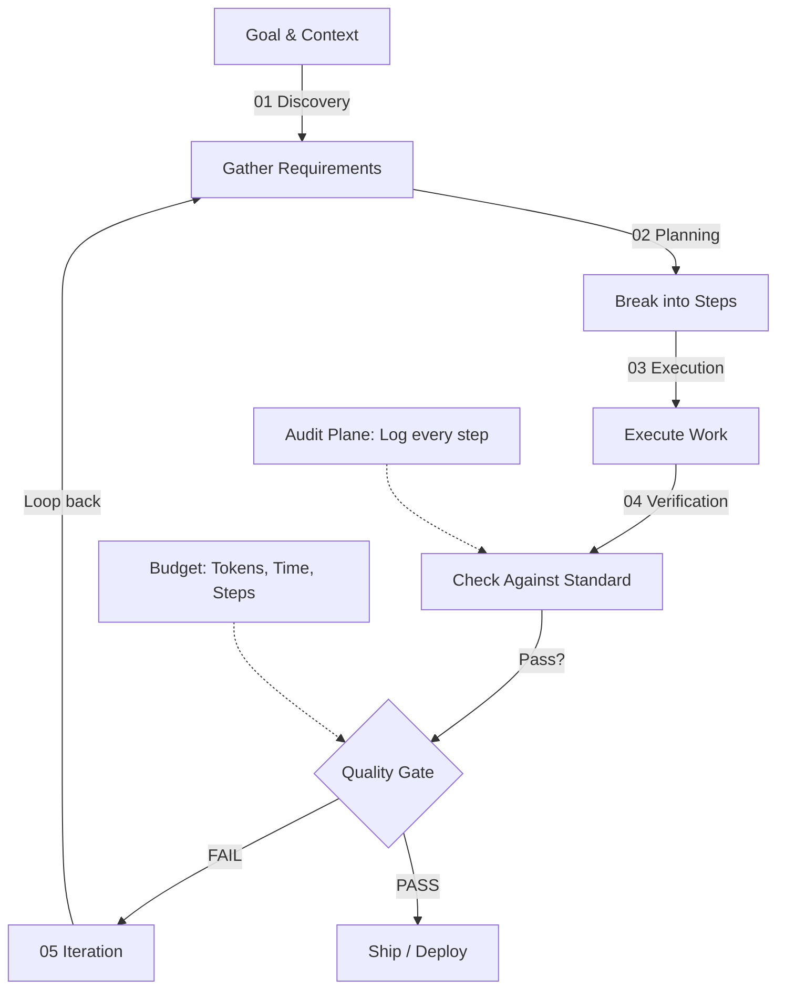

## Why This Matters

The shift from prompt/response to goal/loop/outcome is the single most consequential architectural change in enterprise AI since the chatbot. Enterprises deploying agentic AI with proper governance report an average ROI of 171% within 18 months. This guide establishes the architectural foundations and composable patterns that underpin production agentic systems.

---

## **SECTION 01: Why Loops Matter**

The shift from prompt/response to goal/loop/outcome is the single most consequential architectural change in enterprise AI since the chatbot.

Most organizations' first encounter with generative AI is a single-turn interaction: a person writes a prompt, a model returns a response, and a human decides what happens next. That pattern is simple to reason about and easy to govern — but it caps the system's usefulness at the speed of human attention. An agent that must be re-prompted after every step cannot debug its own code, reconcile a multi-step finance close, or work through a backlog while the team sleeps.

An **agentic loop** breaks that ceiling. Instead of a person driving every step, the agent is given a goal, a set of tools, and a way to check its own work, and it iterates — plan, act, observe, adapt — until the objective is met, a budget is exhausted, or it hits a condition that requires a human. The loop is the mechanism that turns a language model from a chatbot into something that can actually do work.

### **Prompt → Response**
*   The human drives every step.
*   Human is the bottleneck on every decision.
*   Constant context-switching between tasks.
*   Doesn't scale past one operator's attention.
*   Work stops the moment the human stops.

### **Goal → Loop → Outcome**
*   The agent drives execution.
*   Plans the path, executes, checks, retries.
*   Continuous progress without re-prompting.
*   Consistent quality via repeatable verification.
*   Scales to workloads no single human could track.

&gt; **The State of Adoption:** Gartner projects that 40% of enterprise software applications will integrate task-specific AI agents by the end of 2026, up from less than 5% in 2025. Yet a March 2026 enterprise architecture study found that while 79% of organizations report some AI agent adoption, only 11% are in production and just 2% have deployed at full scale — a gap that almost always traces back to architecture and governance, not model capability.

*   **Continuous progress:** Work advances on a schedule, not on a human's availability.
*   **Consistent quality:** A repeatable verification step replaces ad hoc human review.
*   **Scalable workflows:** One architecture generalizes across many tasks and teams.

Enterprises deploying agentic AI with proper governance report an average ROI of 171% within 18 months. The phrase to hold onto is *with proper governance*: the rest of this guide treats the loop and its guardrails as a single design problem, not two separate workstreams.

---

## **SECTION 02: The Canonical Agent Loop**

Every production agent — regardless of framework, model provider, or use case — converges on the same five-phase cycle.

Strip away the framework branding and nearly every working agent runs the same loop: it figures out what it's missing, breaks the goal into steps, does the work, checks the work against a standard, and fixes what failed before trying again. This is the architecture Oracle's developer team and Anthropic's own internal tooling both converge on, and it is the right mental model to design against before picking any framework.

```
[01 Discovery] ➔ [02 Planning] ➔ [03 Execution] ➔ [04 Verification] ➔ [05 Iteration]
```

*   **01 Discovery:** The agent finds what it needs before acting — reading code, querying a system, searching for context. No guessing, no missing context.
*   **02 Planning:** The goal is broken into clear, executable steps. Scope is defined and the path is set before any irreversible action is taken.
*   **03 Execution:** The agent does the actual work: writing, analyzing, building, calling tools, and connecting to external systems via APIs or MCP (Model Context Protocol).
*   **04 Verification:** Output is checked against the goal and a quality standard — tests, linters, rules, or a second model acting as an evaluator.
*   **05 Iteration (Back to 01):** Gaps are fixed and the loop runs again until the work clears the bar, a budget is exhausted, or a human is pulled in. *Note: A successful run still updates memory and context, so the next loop — on this task or the next one — starts smarter.*

This pattern holds at every scale: a coding agent fixing a failing test, a research agent gathering and synthesizing sources, and a finance agent reconciling a ledger are all running the same five phases, just with different tools and different definitions of "done."

A useful way to confirm an architecture is sound: the agent reasons about what it needs, calls a tool, gets a result, decides whether to continue or stop. Across every model provider, tool integration follows that same shape. Tools are defined with a name, a description, and a parameter schema; the model decides whether to call one; the system executes it and returns a result; the model decides whether to loop again or return a final answer.

&gt; **Design Implication:** Treat each phase as independently testable. A loop that fails in production almost always fails because one phase was collapsed into another — planning skipped in favor of immediate execution, or verification reduced to "the agent said it was done." Each phase should be inspectable on its own.

---

## **SECTION 03: Open Loops vs. Closed Loops**

The single architectural decision with the largest effect on cost, predictability, and blast radius.

An **open loop** gives the agent a goal and lets it explore with few constraints on retries, scope, or termination. A **closed loop** gives the agent the same goal but bounds it with explicit budgets, validation checkpoints, and a defined goal state. The difference looks subtle in a design doc and is enormous in a production incident.

### **Open Loop — The Agent Wanders**
*   Good for exploratory, ambiguous tasks.
*   Unlimited or loosely bounded retries.
*   High and unpredictable token usage.
*   Can drift away from the original objective.
*   *Note: Open-loop agents have been observed burning upward of 2M tokens in a single run when no budget or stopping condition was set.*

### **Closed Loop — The Agent Stays on Track**
*   Goal and success criteria defined up front.
*   Validation checkpoints between phases.
*   Hard budget limits on tokens, calls, and time.
*   Predictable, bounded outcomes.
*   *Note: Closed loops are what fix the cost and drift problem — this is the pattern almost all production agents now use.*

In practice, "closed" does not mean rigid. The best production systems are closed at the boundary — hard limits on spend, scope, and irreversible actions — while remaining open within those boundaries, so the agent still has room to explore alternate approaches when the first one fails. The discipline is in defining the boundary explicitly rather than discovering it after an incident.

### **Loop Control Matrix**

| Control Type | What It Bounds | Typical Implementation |
| :--- | :--- | :--- |
| **Token / Cost Budget** | Total spend per run | Hard ceiling enforced by the orchestration layer, *not* the model |
| **Step / Iteration Cap** | How many loop cycles run | Counter checked before each new planning phase |
| **Scope Allowlist** | Which tools, files, or systems can be touched | Tool registry scoped per task, enforced at the API gateway |
| **Validation Checkpoint** | Whether to proceed to the next phase | Tests, linters, schema checks, or an evaluator model |
| **Termination Condition** | When the loop ends | Goal met, budget exhausted, or human escalation triggered |

---

## **SECTION 04: The Five Composable Workflow Patterns**

Anthropic's reference taxonomy, distilled from work with production customers, remains the clearest map of agentic architecture available. Start here before reaching for a framework.

Anthropic draws a deliberate distinction between two categories of agentic systems:
1.  **Workflows:** Systems where the LLM and tools are orchestrated through predefined code paths — the control flow is fixed, even if the content at each step is generated.
2.  **Agents:** Systems where the LLM dynamically directs its own process and tool use, retaining control over how a task gets done.

Across both categories, the most successful production implementations are built from simple, composable patterns. Five patterns cover nearly every production agentic system in use today, and they can be combined inside a single workflow.

### **1. Prompt Chaining**
Decomposes a task into a fixed sequence of steps, where each LLM call processes the output of the one before it. Trades latency for accuracy by making every individual call an easier task.
*   **Use when:** The task decomposes cleanly into fixed subtasks — e.g., drafting marketing copy, then translating it; or writing an outline, validating it against compliance criteria, then writing the full document.

### **2. Routing**
Classifies an input and directs it to a specialized downstream task, separating concerns so each path can be optimized independently rather than forcing one prompt to handle every case well.
*   **Use when:** Inputs fall into distinct categories that are better handled separately and can be classified reliably — e.g., routing support tickets to billing vs. technical paths, or routing easy queries to a smaller, cheaper model and hard ones to a more capable one.

### **3. Parallelization**
Runs independent LLM calls simultaneously.
*   *Sectioning* splits a task into independent subtasks run in parallel.
*   *Voting* runs the same task multiple times to combine outputs and raise confidence.
*   **Use when:** Speed matters and subtasks are genuinely independent, or when diverse perspectives on the same input improve reliability — e.g., parallel content moderation checks, or multiple independent code reviews of the same diff.

### **4. Orchestrator–Workers**
A central LLM dynamically breaks a task down and delegates subtasks to worker LLMs, then synthesizes their results. Unlike parallelization, subtasks aren't pre-defined — the orchestrator determines them from the specific input.
*   **Use when:** Complexity is unpredictable — e.g., multi-file coding changes where the number and nature of affected files can't be known in advance, or research tasks that require gathering and tracking information from multiple moving sources.

### **5. Evaluator–Optimizer Loop**
One LLM call generates a response while a second LLM call — the evaluator — provides structured feedback in a loop, refining the output until it clears a quality bar. This is the pattern that most directly implements "the loop" inside a single task: an optimizer proposes, an evaluator critiques, and the cycle repeats until the evaluator is satisfied or a retry limit is hit.
*   **Use when:** There is a clear evaluation criterion and iterative refinement provably improves output — e.g., literary translation where a second pass catches nuance the first missed, or complex search tasks requiring multiple rounds of searching and analysis to gather complete information.

### **Pattern Selection Reference**

| Pattern | Best For | Production Example |
| :--- | :--- | :--- |
| **Prompt Chaining** | Fixed, cleanly decomposable steps | Generate copy → translate → format for channel |
| **Routing** | Distinct, reliably classifiable input types | Support query triage by category and difficulty |
| **Parallelization** | Independent subtasks; latency-sensitive | Multi-perspective content moderation, parallel reviews |
| **Orchestrator–Workers** | Unpredictable, input-dependent complexity | Multi-file coding agents; open-ended research |
| **Evaluator–Optimizer** | Clear quality bar, iterative refinement pays off | Code review with revision; document quality loops |

&gt; **On Frameworks:** The most consistent finding across production deployments is that teams overestimate how much abstraction they need. Frameworks can help you start quickly, but they often obscure the underlying prompts and responses, making them harder to debug. They can tempt teams toward complexity a simpler setup would handle just as well. Before reaching for an orchestration framework, implement the relevant pattern directly against the model API. Add abstraction only when it removes real complexity you've already hit.

### **Three Principles for Implementation**
1.  **Maintain simplicity:** Add agentic complexity only when a simpler workflow demonstrably falls short.
2.  **Prioritize transparency:** Explicitly surface the agent's planning steps rather than hiding reasoning inside a black box.
3.  **Craft the ACI:** Invest in the agent-computer interface — tool docs and testing — as carefully as a human-facing UI *(See Section 08)*.

---

## **SECTION 05: Single Agent vs. Agent Fleet**

A single agent attempting an entire enterprise workflow in one reasoning loop is brittle by construction. Knowing when to fan out is a core architecture decision.

A single agent in one context window accumulates bloated context, mixed responsibilities, and a single point of failure as task complexity grows. The fix is not a bigger model — it's multi-agent orchestration: coordinating a small swarm of specialized agents toward a shared goal, each with a narrow context and a clear responsibility.

*   **Single Agent (Focus: Simplicity):** One agent, one context, one decision-maker. Best for coding tasks scoped to one repo/module, research with a narrow question, or content generation against a fixed brief.
*   **Agent Fleet (Focus: Scale):** Specialized agents, shared objective, orchestrated workflow. Best for large/unfamiliar codebases spanning many files, deep multi-source research and synthesis, or enterprise enterprise systems with many integrated steps.

Anthropic's own multi-agent research system is a useful reference design: a **lead agent** analyzes the incoming query, develops a search strategy, and spawns specialized subagents that operate in parallel. Each subagent acts as an intelligent filter that iteratively uses tools to gather information before reporting back a condensed result to the lead agent. The lead agent never sees the subagents' raw intermediate work — only their distilled findings — which is what keeps its own context manageable as the fleet scales.

&gt; **Architectural Rule of Thumb:** Orchestrator–worker (Pattern 4 in Section 04) is the load-bearing structure of nearly every effective multi-agent fleet. A central orchestrator decomposes the task, dispatches narrowly-scoped workers, and reconciles their output — it does *not* let workers talk to each other directly, which is what keeps the system debuggable as it grows.

### **Single Agent vs. Fleet Signals**

| Signal | Lean Toward Single Agent | Lean Toward Fleet |
| :--- | :--- | :--- |
| **Scope** | Bounded, well-understood | Large, spans multiple systems or files |
| **Predictability** | Subtasks are knowable in advance | Subtasks depend on what's discovered |
| **Latency Tolerance** | Needs a fast, single-pass answer | Can tolerate parallel exploration time |
| **Failure Cost** | Low — easy to retry the whole task | High — isolating failures to one worker matters |

---

## **SECTION 06: The Six Building Blocks of Production Loops**

Patterns describe control flow. These six components are what actually turn a pattern into something that runs unattended, safely, in an enterprise environment.

1.  **Automations:** The loop runs on a schedule or trigger, not on a person remembering to kick it off. This is what separates a demo from a production system.
2.  **Worktrees:** Parallel agents operate in isolated working copies so concurrent runs don't collide on the same files or state.
3.  **Skills:** Project and domain knowledge is written once, as a reusable artifact, and read by the agent on every loop instead of being re-explained in every prompt.
4.  **Plugins &amp; Connectors:** Standardized connections out to PRs, tickets, chat, and external systems — increasingly via the Model Context Protocol (MCP), now the de facto open standard for agent-to-tool integration.
5.  **Subagents:** The agent that does the work and the agent that checks the work are never the same instance — a maker/checker split that prevents an agent from grading its own homework.
6.  **Memory:** Durable state lives outside the conversation window, on disk or in a database store, so the loop never forgets what it learned in a prior run.

&gt; **Why Skills Matter for Consistency:** Teams that rewrite the same long context block into every prompt see behavior drift over time as the prompt is copy-edited inconsistently across users. Defining a skill once, as a versioned artifact the agent reads on every loop, is what keeps behavior consistent at scale — the same logic that makes a documented runbook more reliable than tribal knowledge.

Of the six, **memory** and **subagents** are the two most often skipped in early prototypes and the two most responsible for production incidents when missing. A loop with no external memory rederives context from scratch every run, burning tokens and re-making mistakes it already fixed once. A loop where the same model checks its own output has no real verification step — it has a second opinion from someone with every incentive to agree with the first.

---

## **SECTION 07: The Quality Gate**

No gate is a slop machine. Build the gate from things the agent can't argue with.

Every closed loop needs exactly one moment where output is checked against a standard before it ships. That moment is the quality gate, and its defining property is that it must be a check the agent cannot talk its way past — a deterministic test, not a request for the agent's own opinion of its work.

```
[Agent Output] ➔ [Quality Gate] ➔ [Ship / Deploy]
```

*   **In Gate:** Code, a document, a data change, or any other artifact produced by the execution phase.
*   **Quality Gate:** Tests, linters, type checks, CI/CD pipelines, and security checks — run automatically, with no agent involved in scoring.
*   **Out Gate:** Only output that clears every check proceeds to deployment, merging, or customer delivery.

&gt; **On Failure:** A failed gate routes back into the loop, not to a human by default. The agent receives the specific failure (which test, which line, which rule) and re-enters execution. Escalate to a human only after a bounded number of failed attempts, or when the failure pattern itself signals something the gate wasn't designed to catch.

### **Quality Gate Types**

| Gate Type | Catches | Where It Runs |
| :--- | :--- | :--- |
| **Tests** | Functional regressions, broken logic | Unit / integration test suite |
| **Linters** | Style violations, common bug patterns | Static analysis, pre-commit hooks |
| **Type Checks** | Interface mismatches, null-safety issues | Compiler / type checker |
| **CI / CD** | Build failures, integration breakage | Deployment pipeline, before merge |
| **Security Checks** | Vulnerable dependencies, secrets, injection risk | SAST/DAST scanners, dependency audit |

The evaluator–optimizer pattern from Section 04 is the natural home for a quality gate when the standard is more nuanced than a pass/fail test — for example, judging the tone of a customer-facing email or the completeness of a research summary. In those cases, the evaluator is a separate model call (or separate agent instance) with explicit rubric criteria, never the same call that produced the work.

---

## The Canonical Agent Loop Reference Architecture



### Pattern Trade-offs: Open vs. Closed Loops

| Dimension | Open Loop | Closed Loop |
| :--- | :--- | :--- |
| **Cost Predictability** | Unpredictable (can exceed 2M tokens) | Hard ceiling enforced |
| **Scope Control** | Unlimited tool access (drift risk) | Scoped allowlist per task |
| **Iteration Cap** | Unlimited retries | Hard step limit |
| **Production Readiness** | High risk incidents | Bounded, recoverable failures |
| **Best For** | Exploratory, research tasks | Enterprise production workflows |

### Composable Pattern Comparison

| Pattern | Decomposition | Complexity | Best For |
| :--- | :--- | :--- | :--- |
| **Prompt Chaining** | Fixed sequence | Low | Cleanly decomposable tasks |
| **Routing** | Input classification | Low | Triage &amp; branching |
| **Parallelization** | Independent subtasks | Medium | Speed-critical, diverse tasks |
| **Orchestrator–Workers** | Dynamic breakdown | High | Unpredictable complexity |
| **Evaluator–Optimizer** | Iterative refinement | High | Quality-first workflows |

---

## Related

- [Agentic AI Landing Zone: Agent Platform Layer](29-agentic-ai-landing-zone-platform-layer.md)
- [Agentic AI Landing Zone: Multi-Agent Reference Architectures](28-agentic-ai-landing-zone-multiagent.md)
- [Enterprise AI Architectural Patterns](15-agile-in-the-age-of-agentic-ai-2026.md)

## Sources

- Enterprise AI deployments, 2026 production customer data
- Gartner AI Ops 2026 Report
- Anthropic internal tooling and architecture research
