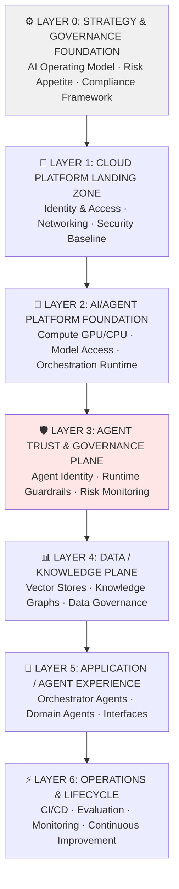
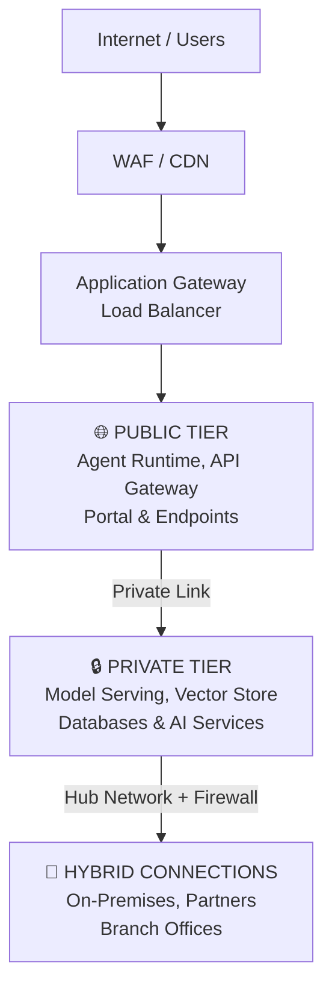

# Agentic AI Landing Zone Architecture

*Enterprise Architecture Blueprint for Governed, Secure, Scalable Agentic AI Workloads — Part 1 of 2*

This is **Part 1 of 2**, covering architecture vision, governance principles, layered platform architecture, business capabilities, and technology stack. [Part 2](parts/14-agentic-ai-landing-zone-architecture-implementation-governance.md) covers standards alignment, implementation roadmap, governance structures, and architecture decision records.

## Why This Matters

Enterprises attempting to scale agentic AI systems face a critical gap: traditional cloud landing zones assume deterministic workloads with predictable behavior, static authorization models, and human-in-loop for all decisions. Autonomous agents exhibit none of these characteristics — they make real-time decisions based on dynamic context, invoke tools unpredictably, access sensitive data across organizational boundaries, and require governance that enables autonomy without surrendering oversight. This architecture bridges that gap through layered trust infrastructure, runtime policy enforcement, and semantic observability that captures not just *what* agents did but *why* and with what authorization.

## Executive Summary

### Objective

Establish a governed, secure, and scalable enterprise platform enabling development and operation of agentic AI workloads across hybrid and multi-cloud environments.

### Strategic Alignment

- **Digital Transformation:** Accelerate AI-driven innovation
- **Automation Strategy:** Enable autonomous business processes
- **Data-Driven Enterprise:** Maximize value from enterprise data assets
- **Risk Management:** Ensure responsible and compliant AI deployment

### Expected Outcomes

| Outcome | Target | Measurement |
| --------- | -------- | ------------- |
| **Deployment Velocity** | 60% reduction in time-to-production | Cycle time from idea to production deployment |
| **Risk Mitigation** | 80% reduction in security incidents | Security events related to AI workloads |
| **Governance Compliance** | 100% policy adherence | Automated policy validation pass rate |
| **Platform Reuse** | 75% component reuse across projects | Percentage of projects using standard components |
| **Cost Efficiency** | 40% reduction in infrastructure redundancy | Multi-tenancy and shared service utilization |

### Business Problem

#### Emerging Challenges

The organization faces critical challenges in scaling agentic AI systems:

1. **Autonomous Decision-Making Risk**: AI agents making decisions without appropriate governance frameworks
2. **Dynamic Tool Access Complexity**: Unpredictable tool invocation patterns creating security exposures
3. **Cross-Domain Data Access**: Agents requiring access to sensitive data across organizational boundaries
4. **Regulatory Scrutiny**: Increasing compliance requirements (EU AI Act, NIST AI RMF, ISO 42001)
5. **Fragmented Integration**: Each agent implementation requiring custom integrations

#### Current State Gaps

Traditional cloud landing zones are insufficient because they assume:

- Deterministic workloads with predictable behavior
- Static authorization models
- Human-in-loop for all decisions
- Point-to-point integrations

**Reality:** Agentic systems exhibit autonomous behavior, dynamic resource requirements, emergent interactions, and real-time adaptation.

## Architecture Vision & Principles

### Vision Statement

*Create a standardized enterprise landing zone that enables **trusted autonomous AI systems** through governed infrastructure, runtime guardrails, behavioral observability, and lifecycle management while supporting hybrid/multi-cloud deployment.*

### Guiding Principles

| # | Principle | Description | Implication |
| --- | ----------- | ------------- | ------------- |
| 1 | **Agent Autonomy Must Be Governed** | All autonomous actions require policy-based approval | Runtime policy enforcement mechanisms required |
| 2 | **Identity-First Trust Model** | Agent identity propagates through all interactions | Federated identity infrastructure mandatory |
| 3 | **Least Privilege Data Access** | Agents access only required data, context-aware | Row-level security and dynamic authorization |
| 4 | **Vendor Abstraction Preferred** | Platform must support multi-model, multi-cloud | Abstraction layers for models, tools, and infrastructure |
| 5 | **Observability By Design** | All agent actions must be traceable and explainable | Semantic telemetry and provenance tracking |
| 6 | **Continuous Risk Assessment** | Risk levels dynamically calculated and enforced | Real-time risk scoring and escalation |
| 7 | **Human Oversight Ensured** | Critical decisions escalate to humans | Configurable intervention thresholds |
| 8 | **Interoperability Standards** | Adopt open protocols (MCP, A2A, ISO 42001) | Standard-based integration interfaces |

## Stakeholder Concerns & Success Criteria

| Stakeholder | Primary Concerns | Success Criteria |
| ------------- | ------------------ | ------------------ |
| **Chief Information Officer** | - Strategic value realization<br>- Total cost of ownership<br>- Time to market | - ROI > 200% within 24 months<br>- 60% faster deployment cycles |
| **Chief Information Security Officer** | - Security posture<br>- Compliance adherence<br>- Trust boundaries | - Zero security breaches<br>- 100% audit compliance<br>- Runtime policy enforcement |
| **Chief Data Officer** | - Data governance<br>- Privacy protection<br>- Data quality | - 100% data lineage tracking<br>- Automated privacy controls<br>- GDPR/CCPA compliance |
| **AI Governance Board** | - Ethical AI deployment<br>- Risk management<br>- Regulatory compliance | - ISO 42001 certification<br>- NIST AI RMF alignment<br>- Risk score &lt; threshold |
| **Platform Engineering** | - Operational excellence<br>- Scalability<br>- Reliability | - 99.9% uptime SLA<br>- Auto-scaling capability<br>- Self-service enablement |
| **Development Teams** | - Developer productivity<br>- Tool availability<br>- Clear standards | - &lt; 1 week onboarding time<br>- Comprehensive documentation<br>- Reusable templates |

## Scope Definition

### In Scope

#### 1. Platform Architecture

- Hybrid/multi-cloud foundation (Azure, AWS, GCP, on-premises)
- Agent runtime environments (serverless, containers, GPU clusters)
- Model serving infrastructure (API gateways, routing, versioning)
- Data and knowledge platform (vector stores, knowledge graphs, structured data)

#### 2. Governance Framework

- Policy definition and enforcement
- Agent identity and access management
- Risk assessment and scoring
- Compliance monitoring and reporting

#### 3. Operational Excellence

- CI/CD pipelines for agent deployment
- Observability and monitoring
- Incident response and escalation
- Performance optimization

#### 4. Standards Alignment

- NIST AI Risk Management Framework (AI RMF)
- ISO/IEC 42001 AI Management System
- Model Context Protocol (MCP) integration
- EU AI Act readiness assessment

### Out of Scope

- Individual agent application logic and business rules
- Specific use case implementations
- User interface and experience design
- Vendor-specific procurement strategies
- Agent content creation and training data curation

## Conceptual Layered Architecture



## Detailed Component Architecture

### Layer 0: Strategy & Governance Foundation

**Purpose:** Establish organizational alignment and governance framework

**Components:**

- **AI Operating Model**
  - Roles and responsibilities (RACI matrix)
  - Decision-making authority levels
  - Escalation procedures

- **Responsible AI Principles**
  - Fairness and non-discrimination
  - Transparency and explainability
  - Privacy and data protection
  - Safety and robustness
  - Accountability

- **Risk Appetite Definition**
  - Risk tolerance thresholds by autonomy level
  - Acceptable risk ranges by business domain
  - Escalation triggers

- **Agent Autonomy Classification**

  | Level | Description | Human Oversight | Examples |
  | ------- | ------------- | ----------------- | ---------- |
  | 0 | No autonomy (recommendation only) | Continuous | Advisory assistants |
  | 1 | Supervised execution | Per-transaction approval | Data analysis agents |
  | 2 | Constrained autonomy | Exception-based review | Workflow automation |
  | 3 | Broad autonomy | Periodic audit | Research agents |
  | 4 | Full autonomy | Post-facto review | Self-optimizing systems |

### Layer 1: Cloud Platform Landing Zone

**Purpose:** Provide secure, resilient infrastructure foundation

**Components:**

1. **Identity Management**
   - Workforce identity (Azure AD, Okta, etc.)
   - Workload identity (service principals, managed identities)
   - Agent identity model (federated identity for autonomous agents)
   - Cross-cloud trust relationships

2. **Network Architecture**
   - Hub-spoke topology
   - Private endpoints for sensitive services
   - Network segmentation (DMZ, internal, restricted)
   - DNS automation and resolution
   - Hybrid connectivity (VPN, ExpressRoute, Direct Connect)

3. **Security Baseline**
   - Policy-based governance (Azure Policy, AWS SCPs, GCP Org Policies)
   - Encryption at rest and in transit
   - Secret management (Key Vault, Secrets Manager, Secret Manager)
   - Vulnerability scanning and patch management
   - Zero Trust network access

4. **Organizational Structure**
   - Management groups/organizations
   - Subscription/account hierarchy
   - Resource group/project structure
   - Environment separation (dev, test, staging, prod)
   - Cost allocation and chargeback

### Layer 2: AI/Agent Platform Foundation

**Purpose:** Enable AI-specific compute, model access, and orchestration

**Components:**

1. **Compute Fabric**

   ```
   GPU Clusters → Training workloads, Real-time inference, Batch processing
   Serverless Compute → Lambda/Functions, Container instances, Event-driven agents
   Container Orchestration → Kubernetes, Agent deployments, Auto-scaling
   Edge Deployment → IoT devices, Branch offices, Mobile runtimes
   ```

2. **Model Access & Management**
   - **Model Gateway**: Unified API for multi-provider access (OpenAI, Anthropic, Google, Azure OpenAI)
   - **Model Registry**: Version control, metadata, performance benchmarks, approval workflow
   - **Model Evaluation**: Continuous assessment (accuracy, bias, toxicity testing)

3. **Orchestration Runtime**
   - **Workflow Engines**: Apache Airflow, Step Functions, Temporal
   - **Agent Frameworks**: LangChain, LlamaIndex, CrewAI, AutoGen
   - **Tool Integration Fabric**: API connectors, Event bus (Kafka), Database adapters

### Layer 3: Agent Trust & Governance Plane

**Purpose:** Enable governed autonomy with runtime controls

**CRITICAL INNOVATION:** This layer extends traditional landing zones to handle autonomous, non-deterministic systems.

**Components:**

1. **Agent Identity & Registry**
   - Unique agent identifiers (DIDs - Decentralized Identifiers)
   - Capability declarations
   - Trust relationships
   - Delegation tokens
   - Active agent catalog

2. **Runtime Guardrails**
   - **Policy Cards** (Machine-readable governance specifications)
   - **Constraint Engines** (Real-time policy enforcement)
   - **Safety Filters** (Content and behavior controls)

3. **Risk Monitoring & Scoring**
   - **Autonomy Risk Assessment** (AURA framework)
   - **Behavioral Analytics** (Anomaly detection, drift detection)
   - **Escalation Management** (Human-in-the-loop workflows)

4. **Observability & Traceability**
   - **Semantic Telemetry** (Intent and action logging)
   - **Provenance Tracking** (Decision lineage)
   - **Audit Logging** (Compliance records)

### Layer 4: Data / Knowledge Plane

**Purpose:** Provide governed access to enterprise data and knowledge

**Components:**

1. **Data Domains**
   - Structured Data (SQL, warehouses, OLAP cubes)
   - Semi-Structured Data (Document stores, JSON/XML lakes)
   - Unstructured Data (Object storage, CMS, archives)

2. **Knowledge Repositories**
   - **Vector Stores**: Pinecone, Weaviate, Qdrant, Azure AI Search
   - **Knowledge Graphs**: Neo4j, Amazon Neptune, Azure Cosmos DB Gremlin
   - **Document Processing**: RAG pipelines

3. **Data Governance**
   - Access Control (RBAC, ABAC, row/column security)
   - Data Lineage (End-to-end tracking)
   - Privacy Controls (PII detection, consent management)

### Layer 5: Application / Agent Experience

**Purpose:** Deliver business value through agent-powered applications

**Components:**

1. **Orchestrator Agents**: High-level coordination, multi-agent workflow management
2. **Domain Agents**: Customer service, financial analysis, research, code generation
3. **User Channels**: Conversational interfaces, embedded copilots, APIs, mobile/web

### Layer 6: Operations & Lifecycle

**Purpose:** Enable continuous delivery and improvement

**Components:**

1. **DevOps / CI/CD**: Source control, build pipeline, test automation, deployment
2. **MLOps**: Model lifecycle, experiment tracking, validation, A/B testing
3. **AgentOps**: Agent simulation, autonomy testing, continuous evaluation
4. **Incident Response**: Alerting, runbook automation, post-mortems

## Business Capabilities Enabled

| Capability | Description | Business Value |
| ------------ | ------------- | ---------------- |
| **Agent Lifecycle Management** | Design, develop, test, deploy, monitor, retire agents | Reduce deployment time by 60%, ensure quality |
| **Model Governance** | Centralized model selection, evaluation, approval, monitoring | Minimize model risk, ensure compliance |
| **Knowledge Integration** | Connect agents to enterprise data with governance controls | Improve decision quality, maintain security |
| **Trust Monitoring** | Real-time risk assessment and behavioral oversight | Prevent incidents, build stakeholder trust |
| **Autonomy Oversight** | Dynamic adjustment of agent autonomy based on risk | Balance innovation and control |
| **Compliance Reporting** | Automated evidence generation for audits | Reduce audit costs, demonstrate compliance |
| **Multi-Cloud Orchestration** | Deploy and manage agents across hybrid environments | Avoid vendor lock-in, optimize costs |
| **Developer Self-Service** | Empower teams with platform, tools, and standards | Accelerate innovation, reduce bottlenecks |

## Technology Architecture

### Multi-Cloud Foundation

**Azure Components**: Azure AI Landing Zone, Azure OpenAI Service, Azure AI Search, AKS, Azure API Management, Azure Monitor, Microsoft Entra ID

**AWS Components**: AWS Bedrock, Amazon Kendra, Amazon EKS, AWS Lambda, Amazon CloudWatch, AWS IAM

**GCP Components**: Vertex AI, Google Cloud Search, GKE, Cloud Functions, Cloud Monitoring, Cloud Identity

**On-Premises**: VMware, NVIDIA DGX, Self-hosted Kubernetes, Traditional databases

### Agent Frameworks & Runtimes

- LangChain / LangGraph (Python)
- LlamaIndex (data ingestion and retrieval)
- CrewAI (multi-agent orchestration)
- AutoGen (Microsoft research framework)
- Semantic Kernel (C#/.NET)
- Haystack (modular NLP)

### Data & Knowledge Platforms

- **Vector Databases**: Pinecone, Weaviate, Qdrant, Milvus
- **Graph Databases**: Neo4j, Amazon Neptune
- **Document Stores**: MongoDB, Cosmos DB
- **Search Engines**: Elasticsearch, Azure AI Search
- **Data Lakes**: Azure Data Lake, S3, Cloud Storage

### Observability Stack

- **Metrics**: Prometheus, Grafana, Azure Monitor
- **Logging**: ELK Stack, Splunk, Azure Log Analytics
- **Tracing**: OpenTelemetry, Jaeger, Zipkin
- **APM**: Datadog, New Relic, AppDynamics
- **Custom**: Agent-specific semantic telemetry

### Development & Operations Tools

- **IaC**: Terraform, Bicep, CloudFormation
- **CI/CD**: GitHub Actions, Azure DevOps, GitLab CI
- **Container Registry**: ACR, ECR, Artifact Registry
- **Secret Management**: Azure Key Vault, AWS Secrets Manager, HashiCorp Vault

## Integration Patterns

### Model Context Protocol (MCP) Integration

MCP provides a standard interface for connecting agents to tools and data sources:

- **Eliminates N×M integration problem**: Instead of every agent needing custom connectors to every tool
- **Vendor-neutral tool ecosystem**: Open-source community support
- **Pluggable architecture**: Add MCP servers without changing agent code
- **Standardized security and observability**: Centralized authentication, rate limiting, audit logging

**MCP Servers to Deploy**:
- **Internal Data**: SQL databases, document repositories, file systems
- **Business Applications**: CRM (Salesforce), collaboration (Slack, Teams), productivity (Jira)
- **External Services**: Web search, geolocation, weather, public datasets

### Network Architecture



**Security Zones**:
- **DMZ**: Public-facing endpoints (WAF, load balancer, agent runtime)
- **Application Tier**: Internal microservices, orchestrators
- **Data Tier**: Databases, storage, AI services (model serving, vector search)
- **Management Tier**: Operations, monitoring, CI/CD
- **Hybrid Connections**: Secure links to on-premises and branch offices

## Trade-offs

**Governance vs. Agility, Centralization vs. Distribution**: This architecture balances several critical trade-offs that shape every implementation decision:

- **Agent Autonomy vs. Risk**: Enabling agents to make decisions without human approval for every action means accepting some level of risk. The landing zone mitigates this through runtime policy enforcement, risk scoring, and escalation workflows — but perfect risk elimination is impossible without eliminating autonomy entirely.

- **Standardization vs. Flexibility**: The landing zone mandates architectural patterns (federated identity, semantic telemetry, policy cards) that reduce flexibility for teams who want to use different patterns. This trade-off is intentional: standardization reduces operational burden at scale, but costs flexibility for specific use cases.

- **Vendor Abstraction vs. Platform Leverage**: The architecture emphasizes multi-cloud support and vendor abstraction (via MCP, Kubernetes, Terraform) which reduces lock-in but also prevents leveraging cloud-specific optimizations that would make individual deployments more efficient. Teams must accept that this architecture won't be optimal for any single cloud provider.

- **Real-time Observability vs. Cost**: Semantic telemetry capturing full context for every agent action is expensive at scale (storage, compute for structured logging). The landing zone implements sampling and tiered storage to manage cost, but this means you won't have perfect visibility into every agent action in production.

- **Complexity for Governance**: This architecture is intentionally complex compared to traditional cloud landing zones. That complexity is the cost of enabling trustworthy autonomous agents. Teams should expect a steeper learning curve and higher initial operational investment than simpler architectures, justified by the governance and safety properties the complexity enables.

## Related

- [Part 2: Implementation, Governance & Roadmap](parts/14-agentic-ai-landing-zone-architecture-implementation-governance.md)

## Sources

This architecture synthesizes patterns from enterprise cloud landing zone design, AI governance frameworks (NIST AI RMF, ISO 42001), and emerging practices in agentic AI deployment across dozens of enterprise pilot programs. Architecture decision records and detailed implementation guidance are in Part 2.
