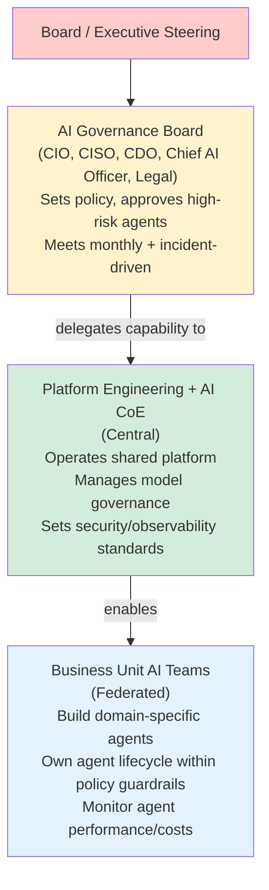
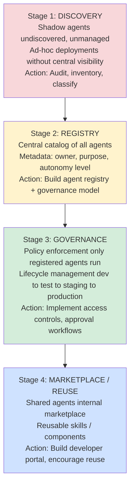
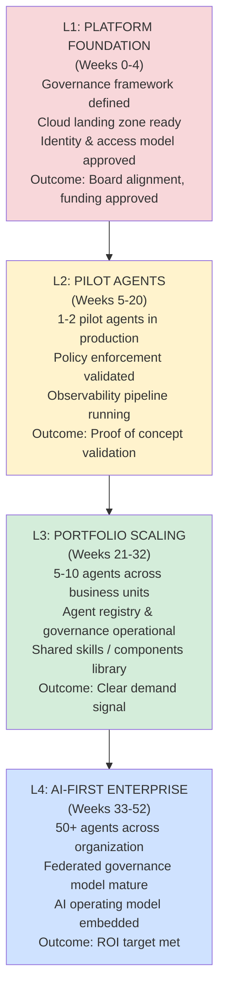
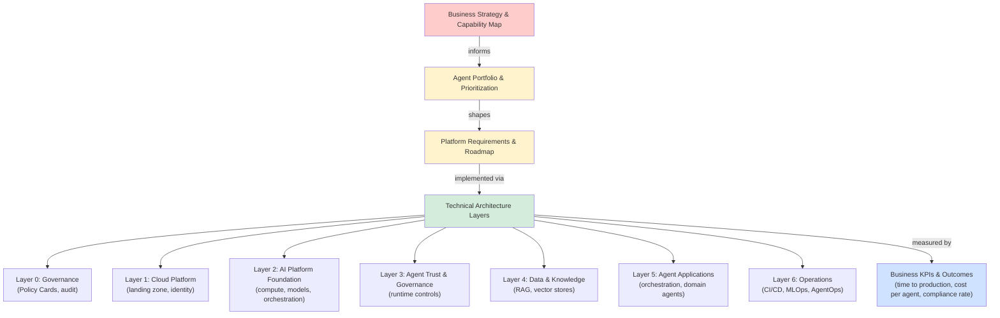

# Agentic AI Landing Zone: Business & Enterprise Architecture Layer

This companion guide restructures the Agentic AI Landing Zone from business drivers through technical implementation.

## Why This Matters

Enterprise leaders face a critical inflection point in 2026. Autonomous agents are no longer speculative—they're production-ready and ROI-positive at scale. This guide bridges strategy and execution: defining business imperatives, capability maps, portfolio management, and governance models that transform agent deployment from ad-hoc experiments into an enterprise operating model.

---

## Strategic Context: Why Agentic AI Now? (2026 Market Drivers)

### Business Imperative

| Driver | 2026 Reality | Impact |
| -------- | ---------- | -------- |
| **Autonomous Workforce Shortage** | 82% of enterprises report skill gaps; 65% planning to deploy autonomous agents within 24 months | Budget shift from hiring to platform investment |
| **Regulatory Deadline Pressure** | EU AI Act Art. 50 transparency in force (Aug 2, 2026); Annex III high-risk deadline Dec 2, 2027 (Digital Omnibus); penalties €35M or 7% turnover | Compliance-first governance now table stakes |
| **Cost-Per-Decision Crisis** | LLM inference costs dropping 70% YoY; agentic automation now ROI-positive at scale | Threshold crossed: automation ROI &gt; process outsourcing |
| **Data Access Democratization** | 78% of enterprises now have MCP-enabled agents; data access standardized | Opportunity to unlock trapped enterprise data |
| **Multi-Model Competition** | Claude 5, GPT-5.5, Gemini 3.5 all production-ready; no single provider dominance | Strategic imperative: vendor portability, cost optimization |

### Strategic Questions Your Organization Must Answer

1. **Scope**: Will agents be deployed across all business units, or in specific domains first?
2. **Autonomy**: What level of autonomous decision-making are we comfortable with? (0-4 scale: advisory → full autonomy)
3. **Data**: Which enterprise data sources should agents access? (ranked by business value vs. sensitivity)
4. **Governance**: Who decides if an agent deployment is compliant? (CIO, CISO, Governance Board?)
5. **Operating Model**: Do we build a central AI CoE, or federate to business units?

---

## BUSINESS CAPABILITY → AI OPPORTUNITY MAPPING

### Step 1: Identify Enterprise Capabilities at Risk / Opportunity

Enterprise capabilities are what your organization *does* (not *how* it does it). Agentic AI creates opportunities in capabilities involving:

- **Routine Decision-Making** (customer service, claims processing, approvals)
- **Information Search & Synthesis** (research, competitive intelligence, compliance monitoring)
- **Cross-Functional Process Coordination** (order fulfillment, project management, incident response)
- **Knowledge Work Automation** (contract review, code generation, financial analysis)

### Step 2: Capability Heat Map (Prioritization)

Build a heat map across your business:

| Capability | Business Value (1-5) | AI Readiness (1-5) | Automation Potential | Regulatory Risk | Priority |
| ------------ | ---------------------- | ------------------- | ---------------------- | ----------------- | ---------- |
| Customer Service | 5 | 4 | 80% | Low | **Tier 1** |
| Compliance Reporting | 5 | 3 | 60% | **High** | **Tier 1** |
| Financial Analysis | 4 | 3 | 70% | Medium | **Tier 2** |
| Contract Management | 4 | 2 | 50% | **High** | **Tier 2** |
| Supply Chain Optimization | 3 | 2 | 60% | Low | **Tier 3** |
| Product Development | 2 | 1 | 30% | Medium | **Tier 3** |

Tailor this example to your actual enterprise capabilities and scores. Your specific heat map drives platform investment prioritization.

---

## AGENT PORTFOLIO VIEW: FROM IDEA TO PRODUCTION

Instead of thinking about "the agent" (singular), think about **agent portfolio management**.

### Portfolio Tiers

```mermaid
graph TD
    T1["TIER 1: Strategic Agents<br/>(Revenue-Generating / Compliance-Critical)"]
    T1A["Customer Engagement Agents<br/>(revenue impact: direct)"]
    T1B["Regulatory Compliance Agents<br/>(risk mitigation: legal/financial)"]
    T1C["Enterprise Process Automation Agents<br/>(efficiency gains: cost reduction)"]
    
    T2["TIER 2: Productivity Agents<br/>(Internal Use)"]
    T2A["Developer Productivity<br/>(code generation, review, documentation)"]
    T2B["Analyst Productivity<br/>(research, synthesis, reporting)"]
    T2C["Operations Productivity<br/>(incident response, diagnostics, remediation)"]
    
    T3["TIER 3: Experimental / Innovation Agents<br/>(Pilot / Learning)"]
    T3A["R&D Agents"]
    T3B["Strategic Initiative Pilots"]
    T3C["Emerging Technology Exploration"]
    
    PLAT["PLATFORM LAYER: Shared Services"]
    PLA["Agent Runtime & Orchestration"]
    PLB["Model Access & Routing"]
    PLC["Observability & Monitoring"]
    PLD["Governance & Policy Enforcement"]
    PLE["Data & Knowledge Infrastructure"]
    
    T1 --> T1A
    T1 --> T1B
    T1 --> T1C
    T2 --> T2A
    T2 --> T2B
    T2 --> T2C
    T3 --> T3A
    T3 --> T3B
    T3 --> T3C
    PLAT --> PLA
    PLAT --> PLB
    PLAT --> PLC
    PLAT --> PLD
    PLAT --> PLE
    
    style T1 fill:#ffcccc
    style T2 fill:#fff3cd
    style T3 fill:#e3f2fd
    style PLAT fill:#d4edda
```



Agent portfolio management organizes agents into four tiers from strategic revenue-generating systems through shared platform services.

### Portfolio Management Questions

- **Capacity**: How many agents can we operationally manage in production?
- **Investment**: What % of IT budget goes to agent development vs. platform infrastructure?
- **Governance**: What approval gate is required for each tier?
- **Lifecycle**: How do we retire or archive obsolete agents?

---

## OPERATING MODEL: ROLES & GOVERNANCE STRUCTURE

### The Emerging AI Operating Model

Most enterprises are adopting a **federated + central platform** model:



The federated operating model balances central governance with business unit autonomy.

### Critical Roles (Map to Your Organization)

| Role | Responsibility | Reports To | 2026 Avg Salary |
| ------ | ---------------- | ----------- | ----------------- |
| Chief AI Officer | AI strategy, portfolio, governance | CEO/CTO | $350K–$500K |
| Director, AI Platform Engineering | Platform architecture, MLOps, infrastructure | CTO | $280K–$380K |
| AI Risk & Compliance Officer | EU AI Act, ISO 42001, risk assessment | Chief Risk Officer | $200K–$280K |
| Agent Architect | Design multi-agent systems, evaluation | Platform Director | $200K–$280K |
| Prompt Engineer / Context Specialist | Optimize agent prompts, context engineering | Engineering Lead | $140K–$180K |
| AI Ethics & Responsible AI Lead | Bias testing, fairness, transparency | Chief AI Officer | $160K–$220K |

Map these roles to your organization. Who owns what? Are there gaps?

---

## EU AI ACT COMPLIANCE: IMMEDIATE ACTIONS

**Timeline Update (July 2026 — Digital Omnibus, final 29 June 2026):** Article 50 transparency obligations are **in force from August 2, 2026** (unchanged). High-risk systems in Annex III now require conformity assessment and risk management documentation **by December 2, 2027** (deferred from August 2, 2026); AI embedded in Annex I regulated products by **August 2, 2028**.

### Compliance Checklist

- [ ] **Classify each agent** against EU AI Act risk levels (Unacceptable / High / Limited / Minimal)
- [ ] **For High-Risk agents**: Conduct conformity assessment and document risk management system
- [ ] **Implement transparency controls**: Disclose to users when AI is being used (mandatory from Aug 2, 2026)
- [ ] **Establish human oversight**: Document escalation procedures for high-risk decisions
- [ ] **Create audit trail**: Implement immutable logging of all agent actions
- [ ] **Draft DPA amendments**: Brief legal/data protection team on how agent data flows affect GDPR
- [ ] **Prepare audit evidence**: Compile technical documentation, policies, risk assessments for regulators

### Mapping Your Agents to EU AI Act Risk Tiers

| Agent Type | Examples | Risk Level | Annex III? | Requirements |
| ------------ | ---------- | ----------- | ----------- | -------------- |
| Customer Service Bot | Order tracking, FAQ responses | **Limited** | No | Transparency disclosure only |
| Loan / Credit Decisioning | Auto-approve applications | **High** | Yes | ⚠️ Full conformity assessment required |
| Employee Hiring Agent | Resume screening, candidate ranking | **High** | Yes | ⚠️ Full conformity assessment required |
| Compliance Monitoring Agent | Regulatory violation detection | **High** | Yes | ⚠️ Full conformity assessment required |
| Research / Analysis Agent | Market intelligence, competitive analysis | **Minimal** | No | No specific obligations |
| Code Generation Agent | Autocomplete, bug fixes | **Limited** | No | Transparency disclosure only |

**ACTION ITEM**: Audit your current agent deployments. Map each to the table above. High-risk items need immediate attention.

---

## AGENT DISCOVERY → REGISTRY → CATALOG → MARKETPLACE

Moving from undiscovered agents (82% of enterprises) to **governed portfolio management**.

### Stages of Agent Maturity



Agent maturity progresses from discovery of shadow agents through registry, governance enforcement, and finally marketplace reuse.

### Agent Registry Schema (Minimum Metadata)

```yaml
agent:
  id: "cust-service-v2.3"
  name: "Customer Service Orchestrator"

  ownership:
    owner: "Customer Service Leadership"
    team: "AI Platform Team"
    sla_contact: "ai-ops@company.com"

  business:
    business_value: "revenue_protection"  # revenue_generation, cost_reduction, risk_mitigation, compliance
    estimated_annual_impact: "$2.5M cost savings"
    business_unit: "Customer Operations"

  technical:
    framework: "langgraph-0.4.x"
    model: "claude-sonnet-4-6"
    runtime: "kubernetes:prod-agents"
    sla: "99.5% uptime"

  governance:
    autonomy_level: 2  # 0-4 scale
    risk_level: "limited"  # unacceptable, high, limited, minimal
    data_classification: "PII"
    eu_ai_act_annex_iii: false
    approval_gate: "AI Governance Board"
    last_review: "2026-07-09"

  observability:
    traces_exported_to: "datadog"
    logs_exported_to: "splunk"
    cost_tracking_enabled: true
    anomaly_detection: true
```

---

## BUSINESS CASE: ROI & INVESTMENT FRAMEWORK

### Agentic AI Investment Tiers

| Tier | Annual Spend | Typical Organizations | ROI Timeline | Key Metrics |
| ------ | -------------- | ---------------------- | -------------- | ------------- |
| **Pilot** | $0.5M–$2M | Early adopters | 6–12 months | Proof of concept, business case validation |
| **Growth** | $2M–$10M | Committed enterprises | 12–18 months | Portfolio of 5–20 agents, cost savings demonstrable |
| **Scale** | $10M–$50M | Mature programs | 18–36 months | 50+ agents, federated governance, org-wide adoption |
| **Enterprise** | $50M+ | Fully integrated | Ongoing optimization | AI-native business model, continuous innovation |

### ROI Calculation Template

**Agent Cost Structure (Annual):**
- Platform Infrastructure: $500K–$2M (amortized across portfolio)
- Model Inference: $X (based on volume × model pricing)
- Operational (MLOps, monitoring, support): $200K–$500K
- Development (engineering time): $Y

**Agent Benefit (Annual):**
- Cost Savings (FTE reduction, process efficiency)
- Revenue Impact (higher throughput, lower churn)
- Risk Mitigation (compliance, fraud prevention)
- Strategic Value (capability, competitive advantage)

**ROI Formula:**
- ROI = (Benefits - Costs) / Costs × 100%
- Payback Period = Costs / Annual Benefits (months)

Build your organization's business case using this template.

---

## CAPABILITY MATURITY: EVOLUTION PATH

### Maturity Progression



Maturity progression spans four levels over a year, from platform foundation through enterprise-wide AI adoption.

---

## CONNECTING TO TECHNICAL ARCHITECTURE



Business strategy flows through portfolio prioritization and platform requirements to seven-layer technical architecture, measured by business outcomes.

See related architecture documents for technical deep-dives on each layer.

---

## Next Steps

1. **Adapt the capability heat map** to your organization's actual business capabilities
2. **Define your agent portfolio strategy** (Tiers 1-3 priorities)
3. **Map roles** to your organizational structure
4. **Audit your current agent landscape** and classify against EU AI Act risk levels
5. **Build your business case** using the ROI template
6. **Establish governance cadence** (monthly AI Governance Board, quarterly portfolio reviews)

---

## Related

- [Agentic AI Landing Zone: Tier 3 Complete](31-agentic-ai-landing-zone-tier3-complete.md)
- [Agentic AI Landing Zone: Context Engineering](24-agentic-ai-landing-zone-context-engineering.md)
- [Agentic AI Landing Zone: Visual Guide](32-agentic-ai-landing-zone-visual-guide.md)

---

**Document Status:** Current (July 2026)  
**Owner:** Chief AI Officer / Enterprise Architecture Office  
**Audience:** Executive leadership, business unit heads, AI governance board
