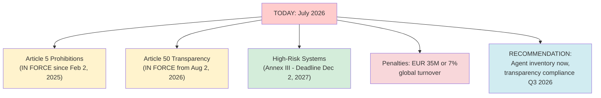

## Why This Matters

The EU AI Act compliance deadlines are now operationalized. High-risk agents require formal conformity assessments by December 2, 2027 (Digital Omnibus deferral). Limited-risk transparency obligations bite August 2, 2026. This guide de-risks compliance and avoids EUR 35M penalties.

---

## CRITICAL TIMELINE

Key deadlines and compliance requirements establish a clear timeline for AI Act adherence.

---

## PART 1: AGENT CLASSIFICATION

### Step 1: Inventory All Agents

**Action:** List every AI agent your organization has or is developing.

Locations to check:
- Production systems (web, mobile, backend)
- Internal tools (employee productivity)
- Experimental/pilot projects
- Shadow systems (teams built without IT approval)
- Proof-of-concepts

**Timeline:** 1-2 days

### Step 2: Classify Each Agent

**EU AI Act Risk Framework:**

| Risk Level | Definition | Requirements |
| ----------- | ----------- | -------------- |
| **UNACCEPTABLE** | Prohibited systems | BANNED (remove immediately) |
| **HIGH-RISK** (Annex III) | Critical systems | MUST COMPLY by Dec 2, 2027 |
| **LIMITED-RISK** | Transparency required | MUST DISCLOSE by Aug 2, 2026 |
| **MINIMAL-RISK** | No specific requirements | No immediate action |

**Classification Decision Tree:**

Does your agent make decisions affecting fundamental rights (credit, employment, justice, safety)?
- YES → HIGH-RISK (Annex III)
- NO → Does agent interact with humans?
  - YES → LIMITED-RISK (transparency)
  - NO → MINIMAL-RISK

---

## PART 2: HIGH-RISK AGENT AUDIT

### Required Documentation (by Dec 2, 2027)

For each HIGH-RISK agent:

1. **Risk Management System:** Process for identifying, assessing, and mitigating risks
2. **Data Governance &amp; Quality:** Training/operational data fitness evidence
3. **Technical Documentation:** Architecture, code, model cards
4. **Record-Keeping:** Immutable audit logs of every decision
5. **Transparency &amp; Information:** User-facing disclosures
6. **Human Oversight &amp; Appeal:** Process documentation
7. **Robustness &amp; Accuracy:** Test results, metrics
8. **Incident Response:** Runbook and escalation

---

## PART 3: TRANSPARENCY OBLIGATIONS (In force Aug 2, 2026)

**For ALL agents, implement disclosure:**

When users interact with AI:
- Clear statement: "This decision was made by AI"
- What AI did: Specific actions taken
- Limitations: "AI can make mistakes"
- Human option: "You can request review by a human"
- Appeal process: "You can appeal this decision"

---

## PART 4: HUMAN OVERSIGHT

**When is human review required?**

Always for:
- First-time users
- High-value decisions
- Refusal/rejection decisions
- Appeals/complaints

**SLA targets:**
- First-time decisions: &lt;24 hours
- Appeals: &lt;48 hours
- Critical cases: &lt;1 hour

---

## PART 5: CONTINUOUS MONITORING

**Dashboard tracking:**
- Daily: Bias metrics, accuracy, audit logs
- Weekly: Metrics review with stakeholders
- Monthly: Compliance gaps
- Quarterly: Risk reassessment

---

## AUDIT READINESS CHECKLIST

Before Dec 2, 2027 deadline:

**HIGH-RISK agents:**
- [ ] Risk management system documented
- [ ] Data governance &amp; quality documented
- [ ] Technical documentation completed
- [ ] Audit log system operational (immutable, signed, 7-year retention)
- [ ] Bias testing completed
- [ ] Accuracy metrics documented

**Transparency (ALL agents):**
- [ ] Disclosure language reviewed by Legal
- [ ] Disclosure implemented on website/app
- [ ] Privacy policy updated

**Human Oversight:**
- [ ] Appeal process defined
- [ ] Human review workflow established
- [ ] SLAs set

---

## Real-World Scenarios

**HIGH-RISK (Loan Approval):**
- Classification: Annex III
- Deadline: Dec 2, 2027
- Must have: Risk mgmt, data governance, technical docs, audit logs, transparency, human oversight, bias monitoring

**LIMITED-RISK (Chatbot):**
- Classification: Article 50
- Deadline: Aug 2, 2026 (NOW)
- Must have: Transparency disclosure, privacy policy, limitations stated

**UNACCEPTABLE (Social Scoring):**
- Classification: Article 5
- Status: ALREADY BANNED (since Feb 2, 2025)
- Action: DISCONTINUE IMMEDIATELY

---

## YOUR ORG: 90-DAY COMPLIANCE PLAN

**Week 1 (Jul 9-13):** Inventory &amp; Classification
**Week 2-3 (Jul 16-27):** High-risk audit starts
**Week 4+ (Jul 30+):** Documentation &amp; implementation

**If you miss Aug 2 transparency deadline:**
- Regulators audit within 14 days
- Demonstrate good-faith effort for grace period
- Penalties: EUR 35M or 7% turnover

---

## Related

- [The Agentic Loop — Enterprise AI Architect's Guide](21-the-agentic-loop-enterprise-ai-architect-guide.md)
- [Agentic AI Landing Zone: Implementation Playbooks](30-agentic-ai-landing-zone-playbooks.md)

## Sources

- EU AI Act (Official text: CELEX 2023R1689)
- Digital Omnibus final Council approval, June 29, 2026
- NIST AI RMF Crosswalk (airc.nist.gov)
