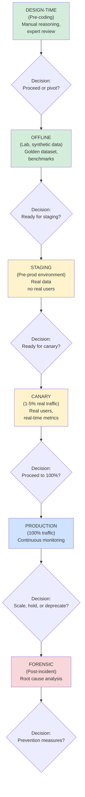

## Why This Matters

Production agentic AI requires systematic evaluation at every stage: design, staging, deployment, operations. 92% of agentic failures happen post-deployment. Evaluation strategy determines whether agents ship with confidence or become production liabilities.

---

## EVALUATION LIFECYCLE

The evaluation lifecycle progresses through design, lab testing, staging, live canary, and production monitoring, with decision gates at each stage.

---

## GOLDEN DATASET: The Foundation

A curated collection of test cases representing real scenarios the agent must handle correctly.

**Components:**
- Input: User request
- Context: Agent context (customer data, policies)
- Expected Output: Correct agent response
- Success Criteria: How to judge correctness
- Metadata: Difficulty, category, impact

**Building a golden dataset:**

1. **Identify scenarios:** Happy paths (70%), edge cases (20%), errors (10%)
2. **Collect real examples:** Support tickets, chat logs, past incidents
3. **Annotate with expected outputs:** Define success criteria
4. **Version and refresh:** Update after incidents, model upgrades

**Size targets:**
- Minimum: 50 test cases
- Recommended: 200-500
- Enterprise: 1000+
- Rule: 20% edge/error cases

---

## OFFLINE EVALUATION: Lab Testing

Run against golden dataset. Measure accuracy, safety, fairness, cost.

**Accuracy Metrics:**
- Task success rate: % of test cases completed correctly (Target: &gt;95%)
- Semantic similarity: Embedding similarity to expected output (Target: &gt;0.85)
- Accuracy by category: Separate metrics for happy path/edge/compliance

**Safety &amp; Compliance Metrics:**
- Hallucination rate: % containing false information (Target: &lt;2%)
- Policy compliance: % adhering to company policies (Target: 100% for high-risk)
- PII handling: Correct sensitive data protection (Target: 100%)
- Escalation detection: Correctly identifies when human needed (Target: &gt;95%)

**Quality Metrics:**
- Relevance: Response relevant to user request (Target: &gt;98%)
- Conciseness: Length appropriate to complexity
- Clarity: Readability score (Target: &lt;8th grade)
- Tone: Matches brand voice (Target: &gt;95%)

**Fairness Metrics:**
- Demographic parity: Equal treatment across groups
- Bias detection: No unfair treatment by identity
- Calibration: Confidence matches actual accuracy

---

## STAGING EVALUATION: Pre-Production Validation

Deploy to staging cluster with production data (anonymized). Run for 24 hours.

**Shadow mode:**
- Current agent responds (returned to user)
- Test agent responds in parallel (not returned)
- Compare behavior, latency, cost

**Metrics tracked:**
- Task alignment: % same results as current agent
- Latency delta: Response time difference
- Cost delta: Cost per call difference
- Errors: Failure mode differences
- Safety: Hallucination detection

---

## CANARY EVALUATION: Live Traffic (1-5%)

**Duration:** 4 hours, 5% of traffic, automatic rollback if error rate &gt;5%

**Key metrics:**
- Error rate (Target: &lt;1%)
- Task success (Target: &gt;95%)
- Latency p95 (Target: &lt;2000ms)
- Cost per request (Target: within budget)
- User satisfaction (Target: &gt;4.0/5.0)

**Decision:** After 4 hours, proceed to 100%, hold, or rollback.

---

## PRODUCTION EVALUATION: Continuous Monitoring

**Real-time dashboard (updated every minute):**
- Availability: 99.5%+ uptime
- Quality: Task success &gt;95%, satisfaction &gt;4.2/5
- Cost: Track spend against budget
- Alerts: Error rate, latency, anomalies

**Weekly regression testing:**
- Run 500 golden dataset cases
- Compare against baseline version
- Flag regressions for investigation

**Multi-dimensional matrix:**

| Dimension | Offline | Staging | Canary | Production |
| --- | --- | --- | --- | --- |
| Accuracy | ✓ | ✓ | ✓ | ✓ Weekly |
| Safety | ✓ | ✓ | ✓ | ✓ Daily |
| Fairness | ✓ | ○ | ○ | ○ Monthly |
| Cost | ✓ | ✓ | ✓ | ✓ Hourly |
| Latency | ✓ | ✓ | ✓ | ✓ Continuous |

---

## TODO: Pre-Production Checklist

1. **Golden Dataset:** Build first 100-200 test cases
2. **Evaluation Pipeline:** Automate offline testing in CI/CD
3. **Monitoring Dashboard:** Set up real-time metric tracking
4. **Regression Testing:** Weekly or bi-weekly baseline
5. **Incident Response:** Process for evaluation failures
6. **Benchmarking:** Baseline current agent performance

---

## Related

- [The Agentic Loop — Enterprise AI Architect's Guide](21-the-agentic-loop-enterprise-ai-architect-guide.md)
- [Agentic AI Landing Zone: Implementation Playbooks](30-agentic-ai-landing-zone-playbooks.md)
- [Agentic AI Landing Zone: Agent Platform Layer](29-agentic-ai-landing-zone-platform-layer.md)

## Sources

- Enterprise agent testing practices, 2026
- Production evaluation frameworks (NIST AI RMF)
- Quality gate architectures from production deployments
