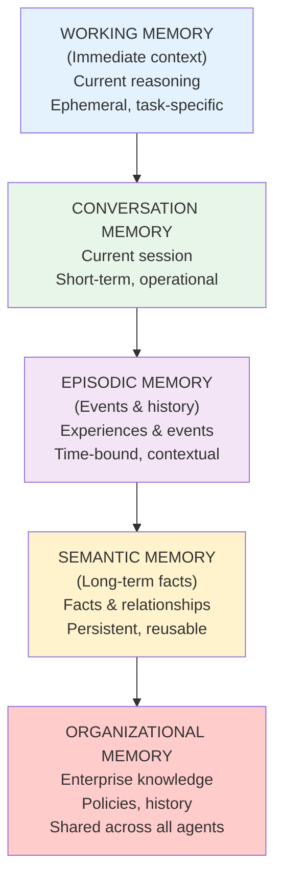

## Why This Matters

Agents without memory are stuck in the present. Agents with well-designed memory become intelligent, adaptive, and trustworthy. Memory is the architectural layer that allows agents to learn from experience, maintain context across sessions, and make decisions informed by historical patterns rather than isolated, context-free reasoning.

---

## THE MEMORY PROBLEM

**Challenge:** Agents process each request in isolation.

**Solution:** Systematic memory architecture that stores, retrieves, and manages agent intelligence across time.

---

## MEMORY TYPES: The Pyramid

Memory layers form a pyramid from immediate working memory through enterprise-wide organizational knowledge.

---

## LAYER 1: WORKING MEMORY

**Purpose:** Immediate, ephemeral storage during active reasoning.

**What it stores:**
- Current task state
- Intermediate reasoning steps
- Active variables and computations
- Transient context from current request

**Characteristics:**
- **Lifetime**: Duration of single request/interaction
- **Storage**: In-memory (RAM)
- **Scope**: Single agent instance
- **Cleanup**: Automatic (garbage collected after request)

---

## LAYER 2: CONVERSATION MEMORY

**Purpose:** Store messages within a session/conversation.

**What it stores:**
- User messages
- Agent responses
- Multi-turn dialogue history
- Session context

**Characteristics:**
- **Lifetime**: Single session (30 min - 1 day)
- **Storage**: In-memory cache or temp DB
- **Scope**: Single conversation thread
- **Cleanup**: After session ends or TTL expires

---

## LAYER 3: EPISODIC MEMORY

**Purpose:** Store specific events and experiences for retrieval.

**What it stores:**
- Past interactions (resolved support tickets)
- Historical decisions and their outcomes
- Customer behavior patterns
- Contextual events and circumstances

**Characteristics:**
- **Lifetime**: Months to years (retention varies)
- **Storage**: Database (PostgreSQL, Cosmos DB, etc.)
- **Scope**: Specific to agent/user/domain
- **Retrieval**: Query, search, semantic similarity
- **Security**: Access controls, PII redaction

---

## LAYER 4: SEMANTIC MEMORY

**Purpose:** Store facts, relationships, and knowledge.

**What it stores:**
- Company policies and procedures
- Product information
- Customer preferences and segments
- Entity relationships (who knows whom, what depends on what)
- Facts and rules

**Characteristics:**
- **Lifetime**: Persistent (months to years)
- **Storage**: Knowledge graphs (Neo4j), vector DBs (Pinecone), or documents
- **Scope**: Shared across multiple agents
- **Encoding**: Embeddings (semantic similarity) or structured (graphs)
- **Update**: Batched or real-time, depending on freshness requirements

---

## LAYER 5: ORGANIZATIONAL MEMORY

**Purpose:** Shared knowledge across all agents and the organization.

**What it stores:**
- Company knowledge base (procedures, best practices)
- Training data and examples
- Historical decisions and precedents
- Aggregate insights and trends
- Lessons learned and playbooks

**Characteristics:**
- **Lifetime**: Permanent
- **Storage**: Central repository (Wiki, Confluence, custom DB)
- **Scope**: Shared across organization
- **Contributors**: Humans + agents (both can add to it)
- **Analytics**: Can be analyzed for patterns

---

## MEMORY LIFECYCLE &amp; GOVERNANCE

### Storage Tiers

| Layer | Storage Type | Retention | Query Time | Cost |
| --- | --- | --- | --- | --- |
| **Working** | RAM | 5 min | < 1ms | Free |
| **Conversation** | Cache / Temp DB | 24 hours | < 100ms | Cheap |
| **Episodic** | Production DB | 7 years | < 500ms | Medium |
| **Semantic** | Vector DB | Permanent | < 200ms | Medium |
| **Organizational** | Central Repo | Permanent | < 1s | Medium |

### Memory Hygiene

**What to delete (privacy/compliance):**
- PII after retention period (GDPR: 7 years)
- Financial data (older than 7 years)
- Deleted customer data (right to erasure)
- Sensitive credentials (never store)

**What to keep:**
- Anonymized patterns (for learning)
- Aggregated statistics (trends, insights)
- Business decisions (compliance trail)
- Playbooks and lessons learned

---

## MEMORY ACCESS CONTROL

**Who can access what?**

```mermaid
graph TD
    A["Agent A<br/>(Customer Service)<br/>Limited authority"]
    B["Can read:<br/>Own conversation history<br/>customer profile, policies"]
    C["Can write:<br/>Conversation history<br/>episodic memory"]
    D["Cannot read:<br/>Other agents' memories<br/>confidential payroll"]
    E["Agent B<br/>(Compliance)<br/>High authority"]
    F["Can read:<br/>All episodic memories<br/>for compliance auditing"]
    G["Can write:<br/>Organizational policies<br/>compliance playbooks"]
    H["Cannot write:<br/>Customer conversation history"]
    I["Human Analyst"]
    J["Can read:<br/>Anonymized aggregated data<br/>trends"]
    K["Can read/write:<br/>Playbooks, training materials"]
    L["Cannot read:<br/>Individual customer<br/>conversations"]
    A --> B
    A --> C
    A --> D
    E --> F
    E --> G
    E --> H
    I --> J
    I --> K
    I --> L
    style A fill:#cfe2ff
    style E fill:#cfe2ff
    style I fill:#cfe2ff
    style B fill:#d4edda
    style C fill:#d4edda
    style D fill:#f8d7da
    style F fill:#d4edda
    style G fill:#d4edda
    style H fill:#f8d7da
    style J fill:#d4edda
    style K fill:#d4edda
    style L fill:#f8d7da
```

Access control varies by role: customer service agents have limited access, compliance agents have broad read access, and analysts can only access anonymized data.

---

## MEMORY COSTS &amp; OPTIMIZATION

### Optimization Strategies

**Compression:**
- Summarize old conversations (after 30 days)
- Archive episodic memory (move to cold storage after 2 years)
- Prune semantic memory (remove unused facts)

**Partitioning:**
- Separate by customer (faster queries)
- Separate by agent type (only agents that need it)
- Separate by time period (hot recent, cold historical)

**Deduplication:**
- Remove duplicate facts (single source of truth)
- Consolidate similar episodes
- Remove outdated policies

---

## IMPLEMENTATION CHECKLIST

**Working Memory:**
- [ ] In-memory storage (dict/cache)
- [ ] Auto-cleanup after request
- [ ] Logging for debugging

**Conversation Memory:**
- [ ] Database schema designed
- [ ] TTL configured (30 min - 1 day)
- [ ] Summarization logic (optional)
- [ ] Indexing for queries

**Episodic Memory:**
- [ ] Production database (PostgreSQL, etc.)
- [ ] Embeddings generated (for similarity search)
- [ ] Retention policy (7 years for compliance)
- [ ] Access controls (who can see what)
- [ ] PII redaction rules

**Semantic Memory:**
- [ ] Vector database (Pinecone, Weaviate, etc.)
- [ ] Knowledge graph (Neo4j, optional)
- [ ] Embedding model selected (OpenAI, Anthropic, local)
- [ ] Facts populated (policies, products, relationships)
- [ ] Update process (batch or real-time)

**Organizational Memory:**
- [ ] Central repository (Wiki, Confluence, custom)
- [ ] Playbooks documented
- [ ] Access controls (who can contribute)
- [ ] Version control (for playbook evolution)
- [ ] Search/retrieval interface

**Governance:**
- [ ] Retention policies documented
- [ ] PII handling guidelines
- [ ] Access control matrix
- [ ] Audit logging (who accessed what)
- [ ] Compliance review (GDPR, CCPA, etc.)

---

## Related

- [Agentic AI Landing Zone: Agent Platform Layer](29-agentic-ai-landing-zone-platform-layer.md)
- [Agentic AI Landing Zone: Multi-Agent Reference Architectures](28-agentic-ai-landing-zone-multiagent.md)
- [The Agentic Loop — Enterprise AI Architect's Guide](21-the-agentic-loop-enterprise-ai-architect-guide.md)

## Sources

- Memory systems research (cognitive science, knowledge management)
- Enterprise AI deployments with persistent agent state
- Privacy and compliance frameworks (GDPR, CCPA)
