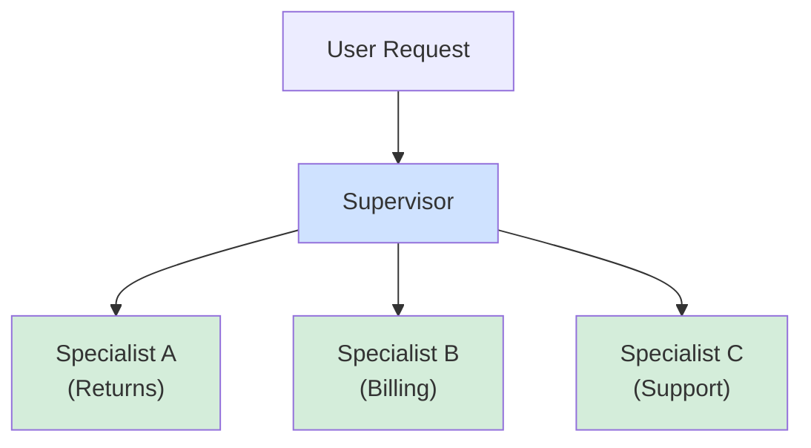
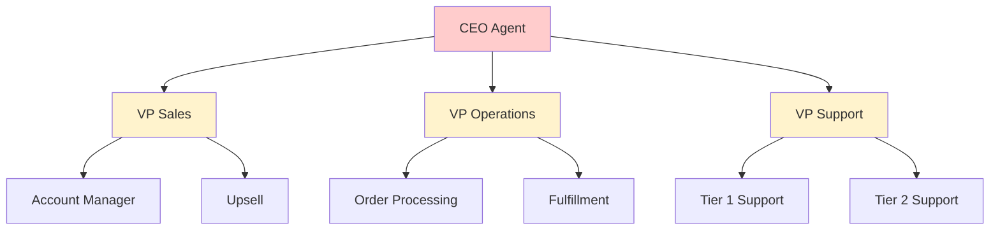
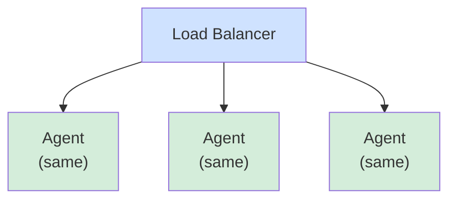
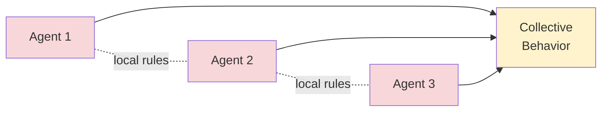

## Why This Matters

Single agents solve narrow problems. Multi-agent systems solve complex, real-world business processes. 73% of production agents use specialist agents. Different specialists (returns expert, billing expert, escalation expert) working together outperform monolithic systems.

---

## MULTI-AGENT TOPOLOGY SELECTION

**When to use each pattern:**

- Simple sequential flow? → SEQUENTIAL
- One coordinator, many workers? → SUPERVISOR
- Hierarchical breakdown? → HIERARCHICAL
- Parallel independent tasks? → MESH
- Load-balanced identical agents? → POOL
- Emergent behavior needed? → SWARM

---

## PATTERN 1: SEQUENTIAL

Agents execute one after another, each passing output to next.

```
User Request → Agent A (Intent) → Agent B (Data) → Agent C (Decision) → Response
```

**Example: Customer Refund Request**
1. Intake Agent: Extract order ID
2. Validation Agent: Verify return window eligible
3. Policy Agent: Determine refund amount &amp; shipping
4. Communication Agent: Compose response

**Pros:** Simple, easy to debug, deterministic
**Cons:** Slow (serial), latency multiplies with steps

---

## PATTERN 2: SUPERVISOR (Orchestrator)

One supervisor agent coordinates multiple specialists, deciding which to call.



**Example:** Customer with 2 issues (overcharge + tracking)
- Supervisor routes to Billing Agent AND Logistics Agent in parallel
- Results combined and escalations handled
- User gets comprehensive response addressing both problems

**Pros:** Parallel execution, clear specialization, good for diverse problems
**Cons:** Supervisor can become bottleneck

---

## PATTERN 3: HIERARCHICAL

Agents organized in hierarchy. High-level agents delegate to lower-level agents.



**Example: Order Processing Escalation**
- CEO routes to VP Operations
- VP Ops handles standard inquiry (Tier 1)
- If complex, Tier 1 escalates to Tier 2
- Tier 2 does deep investigation and compensation

**Pros:** Maps to org structure, natural escalation, familiar to teams
**Cons:** Slow escalation chains, potential bottlenecks

---

## PATTERN 4: MESH (Peer-to-Peer)

Agents are peers. Each can call any other agent directly.

```
Agent A ↔ Agent B
 ↓ ↖    ↓ ↖
 ↓  ↖  ↙  ↖
Agent C ↔ Agent D
```

**Example: Supply Chain Optimization**
- Demand Planner queries Supplier, Inventory, Finance agents
- Supply Planner orchestrates order fulfillment
- Logistics coordinates delivery
- Customer Agent sends notifications

**Pros:** Flexible, no bottlenecks, direct communication
**Cons:** Can become chaotic, hard to trace, risk of infinite loops

---

## PATTERN 5: POOL (Replicated Workers)

Multiple identical agents load-balanced for parallel execution.



**Example: Invoice Processing**
- 10,000 invoices/day
- Single agent: 10,000 seconds ≈ 2.8 hours processing
- Pool of 3 agents: ~55 minutes (3x faster)
- Auto-scaling: Spin up more agents if queue grows

**Pros:** Parallel scaling, consistent latency, cost-optimized
**Cons:** Requires identical agents

---

## PATTERN 6: SWARM

Emergent behavior from many simple agents working autonomously.



No central coordinator; agents follow local rules and communicate with neighbors.

**Use case:** Complex optimization problems (route planning, resource allocation) where emergent solutions outperform centralized planning.

---

## TOPOLOGY DECISION MATRIX

| Topology | Complexity | Parallelism | Scalability | Debugging |
| --- | --- | --- | --- | --- |
| Sequential | Low | None | Poor | Excellent |
| Supervisor | Medium | High | Good | Good |
| Hierarchical | Medium-High | Some | Medium | Medium |
| Mesh | High | High | Excellent | Poor |
| Pool | Low | Excellent | Excellent | Excellent |
| Swarm | Very High | Very High | Excellent | Very Poor |

---

## KEY PRINCIPLE

**Orchestrator-Worker** (from supervisor/hierarchical patterns) is the load-bearing structure of effective multi-agent systems. A central orchestrator:
- Decomposes the task
- Dispatches narrowly-scoped workers
- Reconciles their output
- Does NOT let workers talk directly (keeps system debuggable)

---

## Related

- [The Agentic Loop — Enterprise AI Architect's Guide](21-the-agentic-loop-enterprise-ai-architect-guide.md)
- [Agentic AI Landing Zone: Agent Platform Layer](29-agentic-ai-landing-zone-platform-layer.md)
- [Agentic AI Landing Zone: Implementation Playbooks](30-agentic-ai-landing-zone-playbooks.md)

## Sources

- Production multi-agent deployments, 2026
- Orchestrator-worker architectural patterns
- Enterprise workflow analysis and topology selection
