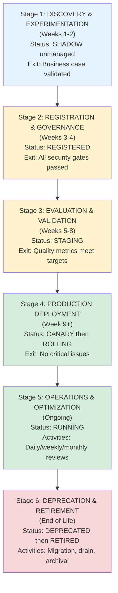

## Why This Matters

82% of enterprises have undiscovered agents — no central visibility. Each team rebuilds capabilities. No standard way to version, own, or deprecate agents. Moving agents from ad-hoc projects to governed, reusable platform products reduces duplication and enables enterprise-scale AI.

---

## THE AGENT PLATFORM PROBLEM

**Today's Reality (2026):**
- Undiscovered agents (no central registry)
- Rebuilt common capabilities (customer service, compliance, reporting)
- No standard discovery, versioning, or deprecation
- No lifecycle governance (who owns it? when retire?)
- Agents treated as projects, not products

**Platform Solution:**
Build a managed agent ecosystem where agents are:
- **Discovered:** Central registry, searchable
- **Versioned:** Clear upgrade paths
- **Owned:** Clear RACI, SLAs, support
- **Governed:** Policy-enforced, audit-logged
- **Reused:** Shared across business units
- **Measured:** Cost tracking, performance
- **Retired:** Graceful deprecation

---

## AGENT REGISTRY: The Source of Truth

Central catalog of all agents authorized to run in your organization.

**Registry contents:**
- Agent ID &amp; metadata
- Ownership &amp; team
- Business value &amp; impact
- Data access permissions
- Compliance classification
- Performance baselines
- Cost tracking
- Deployment locations
- SLA &amp; support info
- Approval status
- Deprecation timeline

**Registry lifecycle:**
- **Tier 0 (Shadow):** Unmanaged discovery phase
- **Tier 1 (Managed):** Team lead approval + security review
- **Tier 2 (Production):** Architecture Review Board approval
- **Tier 3 (High-risk):** AI Governance Board approval

---

## AGENT LIFECYCLE: Idea to Retirement

The lifecycle progresses through six stages from discovery to retirement, with defined gates and exit criteria at each stage.

**Lifecycle gates:**
- Security Review: 3 business days
- Architecture Review: 5 business days
- Compliance Assessment: 7 business days
- Performance Validation: 2 business days
- Canary Approval: 1 business day

---

## AGENT MARKETPLACE: Discovery &amp; Reuse

**Three tiers:**

1. **TIER 1: Shared Core Agents**
   - Canonical implementations (1 per use case)
   - Maintained by Platform Team
   - SLA: 99.9% availability
   - Shared cost across consumers

2. **TIER 2: Domain Agents**
   - Business-unit-specific
   - Maintained by domain teams
   - Published for reuse within BU
   - Shared cost model

3. **TIER 3: Shared Components &amp; Skills**
   - Reusable building blocks
   - Tool integrations, prompt templates, evaluation datasets
   - Shareable across organization

**Reuse governance:**
- Tier 1 Core Agents: Can directly instantiate
- Tier 2 Domain Agents: Requires owner approval
- Licensed for reuse: Use with cost-share agreement
- Not licensed: Cannot use (must build or fork)

---

## COST GOVERNANCE: FinOps for Agents

**Cost structure per agent:**
- Inference Cost (70%): Model API calls
- Compute Cost (15%): Runtime infrastructure
- Storage Cost (8%): Logs, traces, state
- Monitoring Cost (5%): Shared platform
- Support Cost (2%): On-call, maintenance

**Monthly cost tracking:**
- Budget allocation per agent
- Cost per interaction tracking
- Chargeback by cost center
- Alert thresholds (daily, weekly, monthly)

---

## OPERATIONS &amp; MONITORING

**Daily metrics:**
- Uptime &amp; availability
- Error rate &amp; latency
- Task success rate
- Hallucination rate
- Cost tracking

**Weekly reviews:**
- Performance vs. targets
- Anomalies &amp; incidents
- Budget vs. actual spend
- User satisfaction

**Monthly compliance:**
- Bias audits
- Accuracy vs. baseline
- Policy adherence
- Escalation rates

---

## Related

- [The Agentic Loop — Enterprise AI Architect's Guide](21-the-agentic-loop-enterprise-ai-architect-guide.md)
- [Agentic AI Landing Zone: Implementation Playbooks](30-agentic-ai-landing-zone-playbooks.md)
- [Agentic AI Landing Zone: Multi-Agent Reference Architectures](28-agentic-ai-landing-zone-multiagent.md)

## Sources

- Enterprise platform engineering patterns, 2026
- Agent lifecycle management best practices
- FinOps and cost attribution frameworks
- Governance and compliance architectures
