# Agentic AI Landing Zone: Implementation Playbooks

*Concrete, executable guides for your team to operationalize agentic AI platform.*

---

## PLAYBOOK 1: Deploy Your First Agent (8 Weeks)

**Goal:** Get your pilot agent from concept to production with full governance.

**Outcome:** One production agent, proven architecture, team trained.

### Week 1: Discovery & Planning

#### Monday

**Define the Agent Mission**

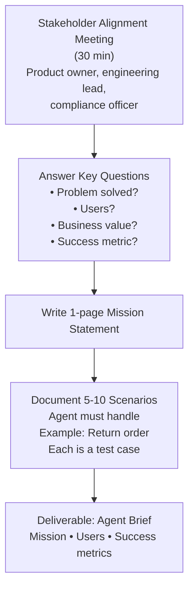

Week 1 Monday flow: establish mission through stakeholder alignment, document success criteria and concrete scenarios, deliver the agent brief.

#### Tuesday-Wednesday

**Risk Classification (EU AI Act)**

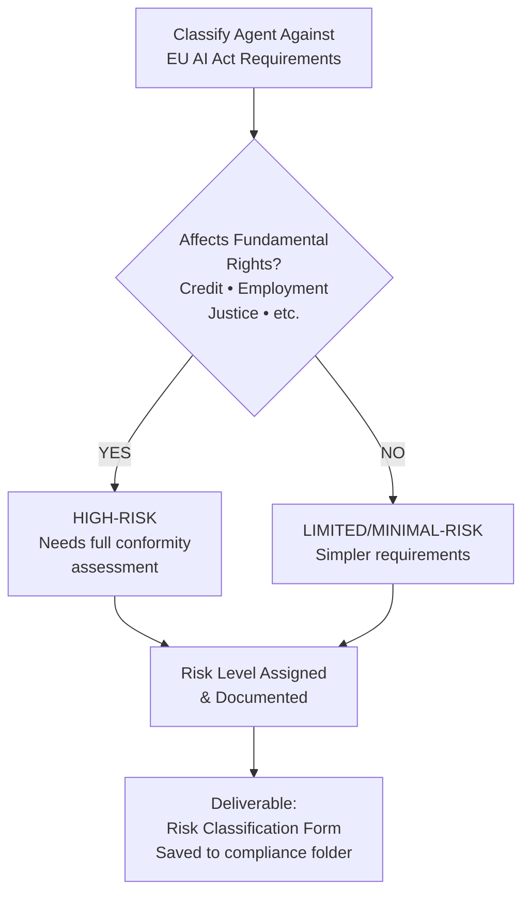

Classify agent against EU AI Act requirements to determine risk level and compliance obligations.

#### Thursday-Friday

**Build Golden Dataset v1**

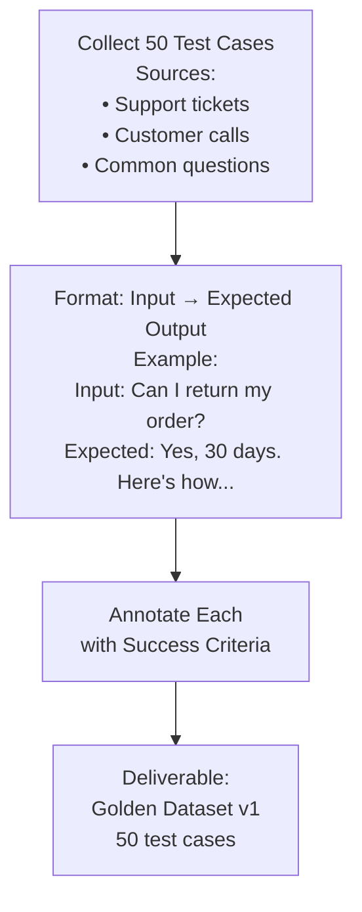

Create first version of golden dataset with 50 annotated test cases from real customer interactions.

**Week 1 Checklist:**

- [ ] Agent mission & brief written
- [ ] Risk classification completed
- [ ] 50 test cases collected & annotated
- [ ] Team trained on next steps
- [ ] Sponsor (exec) signed off on mission

---

### Week 2-3: Architecture & Design

#### Week 2: Architecture Review

**Architecture Design Session**

Monday: 4-hour design session with engineering lead, AI architect, and security engineer to address:

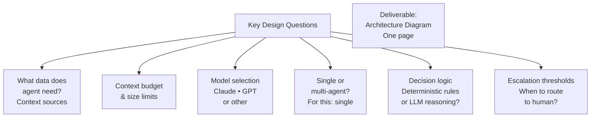

Typical agent flow:
1. User Input → 2. Intent Recognition (agent) → 3. Fetch Context (customer DB + policies) → 4. Make Decision (LLM reasoning) → 5. Generate Response → 6. Human Review Gate? → 7. Response to User

Design captures data flow, model choice, decision approach, and escalation criteria.

#### Week 3: Security & Compliance Design

**Wednesday: Security Review**

With CISO or security engineer, address:

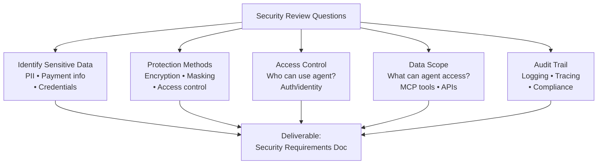

**Friday: Compliance Review**

With legal/compliance team, for HIGH-RISK agents address:

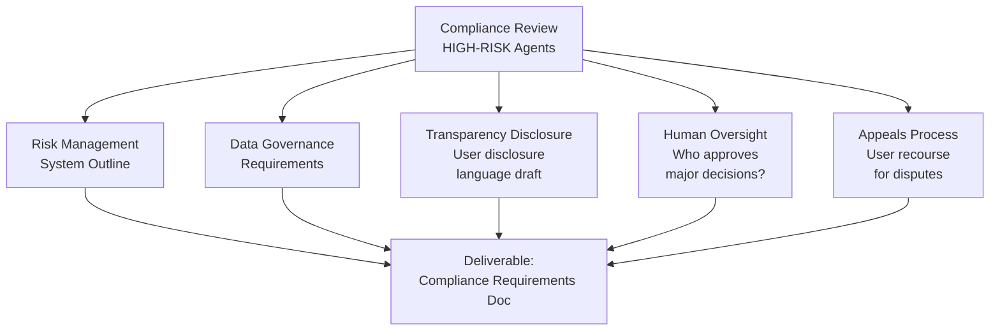

Security and compliance reviews happen in parallel in Week 3, producing separate requirements documents for architect and legal team.

**Weeks 2-3 Checklist:**

- [ ] Architecture diagram completed
- [ ] Data sources identified
- [ ] Model selection completed
- [ ] Security requirements documented
- [ ] Compliance requirements documented
- [ ] ARB pre-review scheduled (optional)

---

### Week 4: Development & Testing

**Monday-Wednesday: Build Agent**

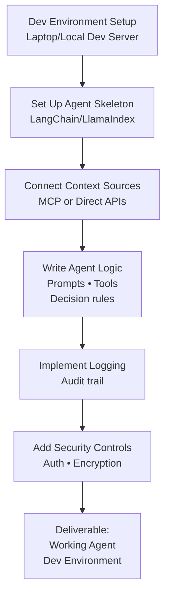

Development tasks progress linearly from environment setup through security hardening.

**Thursday-Friday: Test Against Golden Dataset**

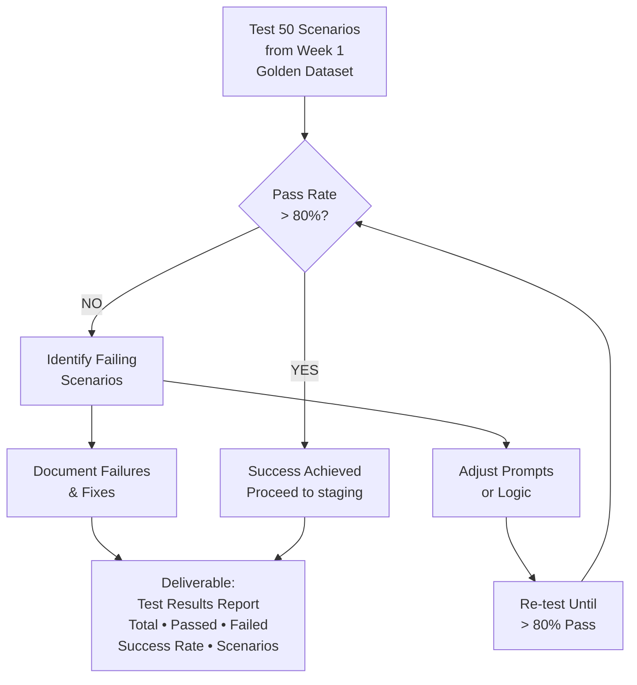

Testing validates agent performance against known scenarios; iterate until pass rate exceeds 80% threshold.

**Week 4 Checklist:**

- [ ] Agent code written
- [ ] Integration with context sources working
- [ ] Logging & audit trail implemented
- [ ] Security controls in place
- [ ] Golden dataset tests run
- [ ] > 80% pass rate achieved

---

### Week 5: Staging Deployment

**Monday: Deploy to Staging**

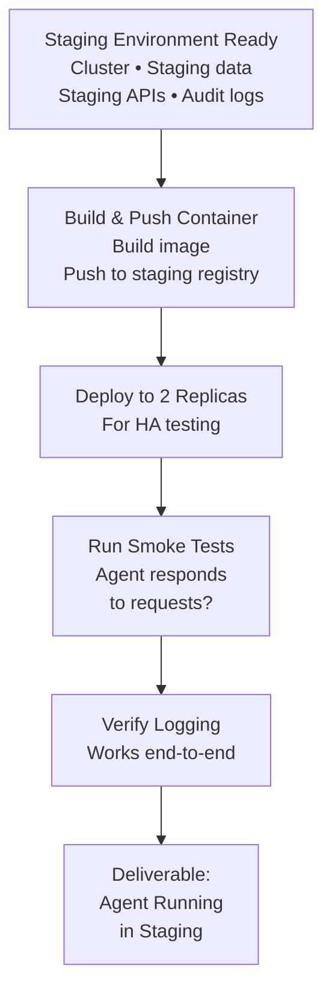

**Tuesday-Thursday: Staging Evaluation**

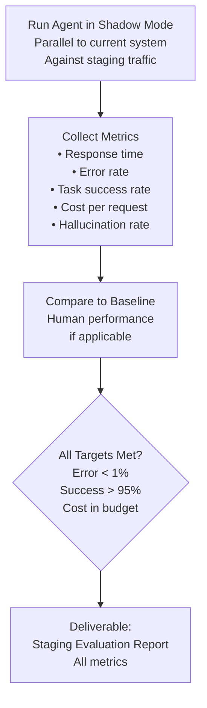

Shadow mode collects 24+ hours of metrics data, comparing agent performance against baseline and target SLAs.

**Friday: ARB Review & Approval to Canary**

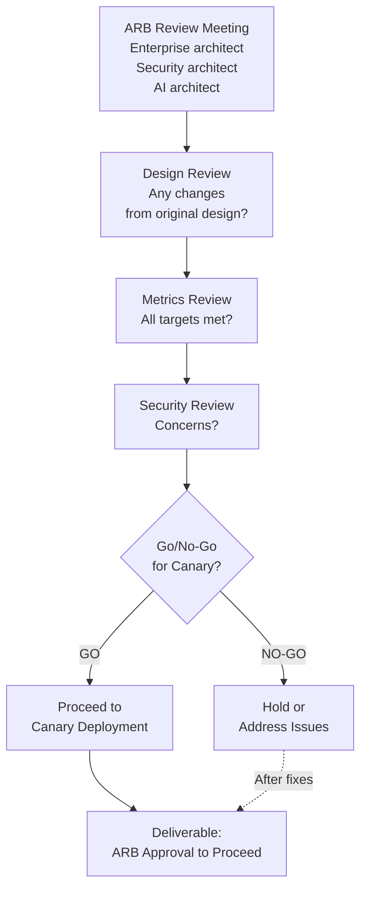

ARB reviews design consistency, metrics achievement, and security posture before canary goes live.

**Week 5 Checklist:**

- [ ] Agent deployed to staging
- [ ] Smoke tests passing
- [ ] Shadow mode evaluation completed
- [ ] Metrics collected & analyzed
- [ ] Metrics meet targets
- [ ] ARB approval obtained
- [ ] Go/no-go decision made

---

### Week 6: Canary Deployment

**Monday: Prepare Canary**

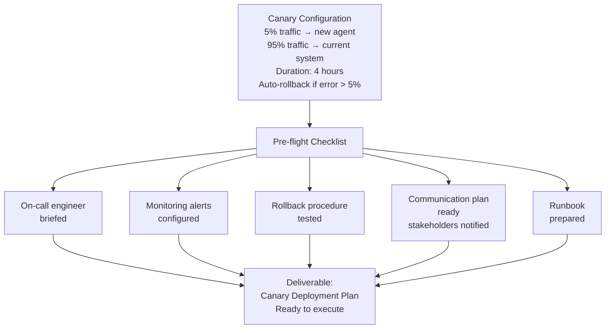

**Tuesday: Execute Canary**

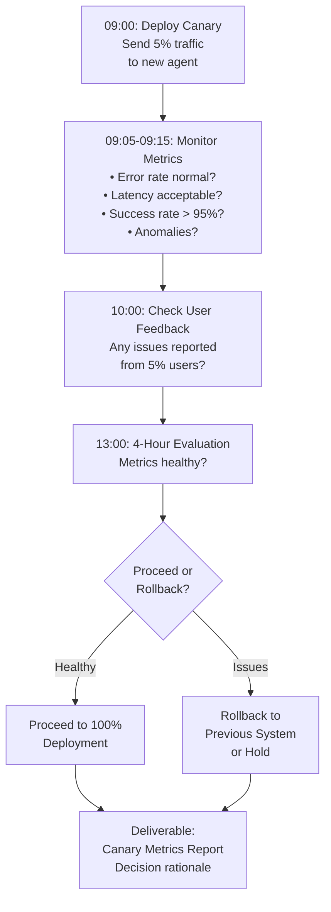

Canary validates agent performance under real-world traffic (5%) before full rollout.

**Week 6 Checklist:**

- [ ] Canary deployment plan finalized
- [ ] Monitoring alerts configured
- [ ] Rollback procedure tested
- [ ] On-call engineer ready
- [ ] Canary deployed (5% traffic)
- [ ] 4-hour evaluation completed
- [ ] Go/no-go for 100% deployment decided

---

### Week 7: Full Production Deployment

**Monday: Blue-Green Deployment to 100%**

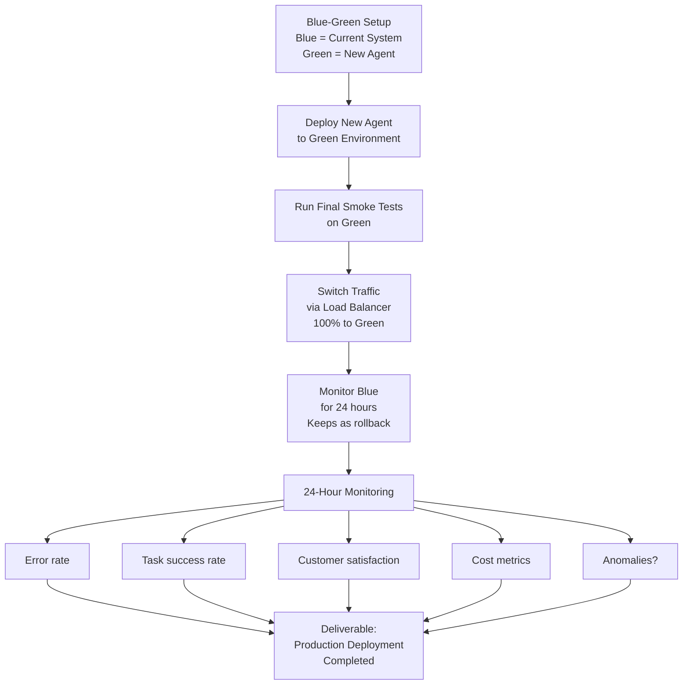

Blue-green deployment minimizes downtime: old system stays live as rollback option during 24-hour monitoring.

**Tuesday-Friday: Operational Stability**

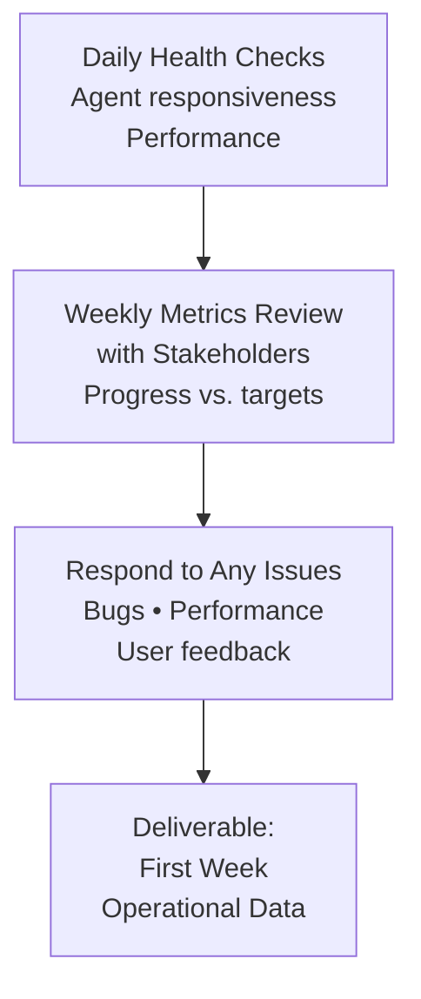

First week focuses on stability monitoring and stakeholder communication.

**Week 7 Checklist:**

- [ ] Blue environment ready
- [ ] Green environment deployed
- [ ] Smoke tests passing on green
- [ ] Traffic switched to green
- [ ] Blue kept available for rollback
- [ ] 24-hour monitoring completed
- [ ] All metrics within SLA
- [ ] Status update to stakeholders

---

### Week 8: Handoff & Optimization

**Monday: Operational Handoff**

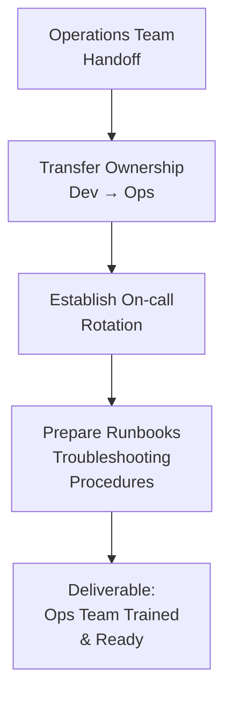

**Tuesday-Friday: Optimization & Feedback**

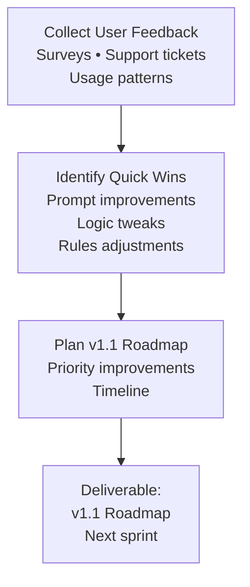

Week 8 transitions to stable operations and captures learnings for the next version.

**Week 8 Checklist:**

- [ ] Operational handoff completed
- [ ] On-call rotation active
- [ ] Runbooks documented
- [ ] Team trained on monitoring
- [ ] User feedback collected
- [ ] v1.1 roadmap created
- [ ] Post-mortem (if any issues occurred)

---

## PLAYBOOK 2: Set Up Agent Registry (2 Weeks)

**Goal:** Build central system for managing all agents.

### Week 1: Design & Setup

**Monday: Decide Build vs. Buy vs. Adopt**

Three strategic options for agent registry:

**Option A: BUILD CUSTOM**
- Pros: Full control, customized
- Cons: Months of development, maintenance burden
- Timeline: 2-3 months
- Effort: 3-4 engineers

**Option B: BUY COMMERCIAL PLATFORM**
- Examples: Aria AI, Vellum, LangSmith
- Pros: Battle-tested, good UX, vendor support
- Cons: Cost $10K-100K/year, learning curve, vendor lock-in
- Timeline: 2-4 weeks (setup + training)
- Cost: ~$30K/year

**Option C: ADOPT EXISTING OPEN-SOURCE**
- Examples: LangSmith (free tier), git-based system
- Pros: Low cost, open source
- Cons: Limited features, no vendor support
- Timeline: 1-2 weeks
- Cost: ~$100/month hosting

**Recommended Path:**

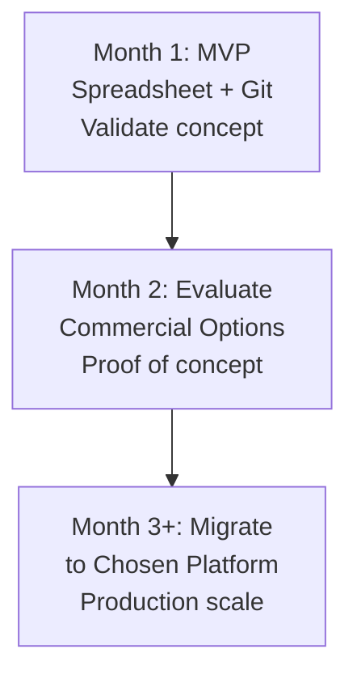

DECISION: [Your choice] ________________

**Tuesday-Wednesday: Schema Design**

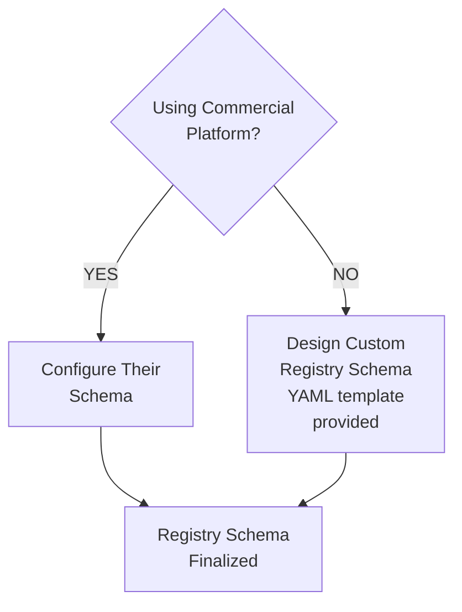

**Thursday-Friday: Pilot Setup**

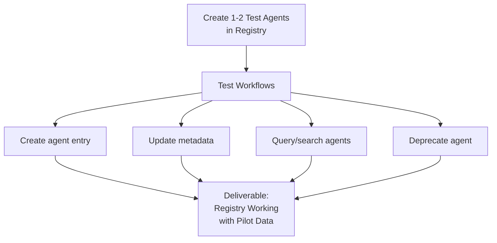

Week 1 establishes the registry foundation through architecture decision and pilot validation.

### Week 2: Governance & Operations

**Monday-Tuesday: Define Governance Workflow**

```mermaid
flowchart TD
    A["Registry Entry Lifecycle"]
    B["DRAFT<br/>Team creates"]
    C["SECURITY_REVIEW<br/>CISO approves"]
    D["ARCHITECTURE_REVIEW<br/>ARB approves"]
    E["APPROVED<br/>Ready to deploy"]
    F["ACTIVE/DEPRECATED/<br/>RETIRED<br/>Operational states"]
    
    B --> C --> D --> E --> F
    
    G["SLAs"]
    G1["Security Review:<br/>3 days"]
    G2["ARB Review:<br/>5 days"]
    G3["Total DRAFT→APPROVED:<br/>~10 days"]
    
    G --> G1 & G2 & G3
    
    H["Deliverable:<br/>Governance Workflow<br/>Documented"]
    E --> H
```

Governance workflow establishes 10-day approval timeline with defined roles for each review stage.

**Wednesday-Thursday: Automation & Integration**

```mermaid
flowchart TD
    A["CI/CD Integration"]
    A1["Deployment pipeline checks<br/>registry for approval"]
    A2["Only APPROVED agents<br/>can be deployed"]
    A3["Deployment automatically<br/>updates registry status<br/>= ACTIVE"]
    
    A --> A1 --> A2 --> A3
    
    B["Monitoring Integration"]
    B1["Registry pulled by<br/>monitoring dashboard"]
    B2["Agents matched to<br/>their SLAs from registry"]
    B3["Metrics tracked per agent<br/>from registry data"]
    
    B --> B1 --> B2 --> B3
    
    C["Deliverable:<br/>Automation Working<br/>End-to-End"]
    A3 & B3 --> C
```

**Friday: Pilot Teams Migrate Agents**

```mermaid
flowchart TD
    A["Convert 3-5 Existing<br/>Agents to Registry"]
    B["Test Governance Workflow<br/>with Real Agents"]
    C["Validate All Approval<br/>Steps with Real Data"]
    D["Deliverable:<br/>First 3-5 Agents<br/>in Registry"]
    
    A --> B --> C --> D
```

Week 2 operationalizes the registry with automated approvals and live agent data.

---

## PLAYBOOK 3: Build Golden Dataset (3 Weeks)

**Goal:** Create evaluation data to measure agent quality.

### Week 1: Collection

**Monday-Wednesday: Identify Scenarios**

```mermaid
flowchart TD
    A["Meeting with<br/>Business Stakeholder"]
    B["Identify Top 20 Things<br/>Users Ask/Request"]
    C["Document Scenarios<br/>20-30 total<br/>Happy path<br/>Edge cases<br/>Errors"]
    D["Deliverable:<br/>Scenario List"]
    
    A --> B --> C --> D
```

**Thursday-Friday: Collect Real Examples**

```mermaid
flowchart TD
    A["Collect Real Examples<br/>from Production"]
    B["Sources:<br/>• Customer service transcripts<br/>• Support tickets<br/>• Chat logs"]
    C["Goal: 100-150 Real Examples<br/>3-5 per scenario<br/>Collect as raw text"]
    D["Deliverable:<br/>Raw Corpus<br/>100-150 Examples"]
    
    A --> B --> C --> D
```

Week 1 establishes the range of scenarios and collects authentic examples from production systems.

### Week 2: Annotation

**Monday-Tuesday: Define Annotation Template**

```mermaid
flowchart TD
    A["Annotation Template<br/>for Each Example"]
    B1["Input:<br/>User question/request"]
    B2["Context:<br/>Agent background<br/>Customer data<br/>Policies"]
    B3["Expected Output:<br/>Correct response"]
    B4["Success Criteria:<br/>How to judge?"]
    B5["Difficulty:<br/>Easy/Medium/Hard"]
    B6["Category:<br/>Happy path<br/>Edge case<br/>Error<br/>Compliance"]
    B7["Coverage:<br/>What's tested?<br/>Functionality<br/>Policy<br/>Edge case"]
    
    A --> B1 & B2 & B3 & B4 & B5 & B6 & B7
    
    C["Deliverable:<br/>Annotation Template<br/>Google Sheet or form"]
    B1 & B2 & B3 & B4 & B5 & B6 & B7 --> C
```

**Wednesday-Thursday: Annotate All Examples**

```mermaid
flowchart TD
    A["Domain Expert Reviews<br/>All 100-150 Examples"]
    B["Fill In Annotation<br/>• Expected output<br/>• Success criteria<br/>• Difficulty estimate"]
    C["Quality Check:<br/>Second reviewer<br/>examines 20%"]
    D{Disagreements?}
    E["Discuss & Align<br/>on Judgments"]
    F["Finalize Dataset"]
    G["Deliverable:<br/>Annotated Golden Dataset<br/>100-150 Test Cases"]
    
    A --> B --> C --> D
    D -->|YES| E --> F
    D -->|NO| F
    F --> G
```

**Friday: Organize & Version**

```mermaid
flowchart TD
    A["Export Dataset<br/>to YAML or JSON<br/>Format"]
    B["Version Control<br/>v1.0<br/>Date: July 9, 2026"]
    C["Store in Git Repo<br/>with commit message"]
    D["Deliverable:<br/>Golden Dataset v1.0<br/>Ready for Evaluation"]
    
    A --> B --> C --> D
```

Week 2 creates a structured, validated golden dataset ready for evaluation automation.

### Week 3: Automate & Integrate

**Monday-Tuesday: Build Evaluation Script**

```mermaid
flowchart TD
    A["Evaluation Script"]
    B["Inputs:<br/>• Agent version<br/>• Golden dataset<br/>• Test cases"]
    C["Agent Execution<br/>Run agent on<br/>each test case"]
    D["Generate Output<br/>for Each Test"]
    E["Compare:<br/>Agent output vs<br/>Expected output<br/>Similarity scoring"]
    F["Aggregate Metrics<br/>Success rate<br/>Per category<br/>Per difficulty"]
    G["Deliverable:<br/>Evaluation Script<br/>Working"]
    
    A --> B --> C --> D --> E --> F --> G
```

**Wednesday: Integrate into CI/CD**

```mermaid
flowchart TD
    A["Code Push Event<br/>Agent code committed"]
    B["CI Pipeline Runs"]
    C["Build Docker Image<br/>Container with agent"]
    D["Run Golden Dataset<br/>Evaluation<br/>Full test suite"]
    E["Report Results<br/>Example: 85% pass rate"]
    F{Pass Rate<br/>> 80%?}
    G["Proceed to<br/>Next Stage"]
    H["Notify Team<br/>Needs Investigation"]
    
    A --> B --> C --> D --> E --> F
    F -->|YES| G
    F -->|NO| H
    
    I["Deliverable:<br/>CI/CD Integration<br/>Working"]
    G & H --> I
```

**Thursday-Friday: Automate Dataset Refresh**

```mermaid
flowchart TD
    A["Quarterly Dataset<br/>Refresh Process"]
    B["Collect New Examples<br/>from Production Issues"]
    C["Identify Failures<br/>Scenarios agent<br/>previously failed"]
    D["Add to Dataset<br/>Expand coverage"]
    E["Version Increment<br/>v1.0 → v1.1 → v1.2"]
    F["Re-baseline All<br/>Production Agents<br/>Against new dataset"]
    G["Deliverable:<br/>Dataset Maintenance<br/>Plan Documented"]
    
    A --> B --> C --> D --> E --> F --> G
```

Week 3 automates golden dataset evaluation in the CI/CD pipeline and establishes quarterly refresh.

---

## PLAYBOOK 4: Establish Evaluation Pipeline (4 Weeks)

**Goal:** Continuous quality assurance from development through production.

### Evaluation Stages

```mermaid
flowchart TD
    A["Dev Stage<br/>Offline Eval<br/>Golden Dataset 80%<br/>Duration: 1 hr"]
    B["Staging Stage<br/>Shadow Eval<br/>Parallel to Current<br/>Duration: 24 hr"]
    C["Canary Stage<br/>Canary Eval<br/>5% Traffic, 4 hours<br/>Duration: 4 hr"]
    D["Prod Stage<br/>Production Eval<br/>100% Traffic, Ongoing<br/>Duration: Continuous"]
    
    A --> B
    B --> C
    C --> D
```

Agent evaluation pipeline stages progressing from development through staging, canary, to production with increasing traffic and duration.

### Week 1-2: Build Evaluation Platform

**Week 1: Metrics Definition**

Establish comprehensive metrics across four categories:

**Accuracy Metrics:**
- Task success rate (% of requests where agent succeeded)
- Semantic similarity (output matches expected?)
- User satisfaction (if ratings available)

**Safety Metrics:**
- Hallucination rate (% of responses with false info)
- Policy compliance (% adhering to company policies)
- PII incidents (0 expected)
- Escalation detection (% of escalatable cases detected)

**Quality Metrics:**
- Relevance (response relevant to query?)
- Conciseness (appropriate length?)
- Clarity (understandable to users?)
- Tone (matches brand voice?)

**Cost Metrics:**
- Cost per request
- Latency (p50, p95, p99)
- Resource utilization

```mermaid
flowchart TD
    A["Define All Metric<br/>Categories"]
    B1["Accuracy: Success,<br/>Similarity, Satisfaction"]
    B2["Safety: Hallucination,<br/>Compliance, PII, Escalation"]
    B3["Quality: Relevance,<br/>Conciseness, Clarity, Tone"]
    B4["Cost: Per Request,<br/>Latency, Resource Use"]
    
    A --> B1 & B2 & B3 & B4
    
    C["Deliverable:<br/>Metrics Definition<br/>Document"]
    B1 & B2 & B3 & B4 --> C
```

**Week 2: Dashboard & Alerting**

```mermaid
flowchart TD
    A["Dashboard Features"]
    B["Current Metrics<br/>Last 1 hour<br/>1 day • 7 days"]
    C["Visualizations<br/>Trend graphs<br/>SLA status<br/>Green/yellow/red"]
    D["Anomalies<br/>Recent issues<br/>flagged"]
    
    A --> B & C & D
    
    E["Alert Configuration"]
    E1["Error rate > 5%<br/>→ On-call"]
    E2["Success < 90%<br/>→ Product owner"]
    E3["Latency p95 > SLA<br/>→ Ops team"]
    E4["Cost > budget<br/>→ Finance"]
    
    A --> E1 & E2 & E3 & E4
    
    F["Deliverable:<br/>Dashboard + Alerting<br/>Working"]
    B & C & D & E1 & E2 & E3 & E4 --> F
```

Weeks 1-2 establish baseline metrics and real-time monitoring infrastructure.

### Week 3-4: Integration & Operations

**Week 3: Offline → Staging → Canary Pipeline**

```mermaid
flowchart TD
    A["Stage 1: Offline<br/>Golden Dataset Tests<br/>Required: 80%+ pass<br/>Automatic CI/CD<br/>Duration: ~5 min"]
    B["Stage 2: Staging<br/>Deploy to Staging<br/>Shadow Mode Parallel<br/>to Current System<br/>Duration: ~24 hours"]
    C["Stage 3: Canary<br/>Prod Deployment<br/>5% Traffic<br/>Monitoring<br/>Duration: ~4 hours"]
    D["Deliverable:<br/>Full Pipeline<br/>Automated"]
    
    A --> B --> C --> D
```

Full evaluation pipeline progresses from offline testing through staging shadow mode to production canary.

**Week 4: Production Monitoring & Regression Testing**

```mermaid
flowchart TD
    A["Production Monitoring<br/>Continuous"]
    B1["Daily Metrics<br/>Report"]
    B2["Weekly Review<br/>Meeting"]
    B3["Monthly Bias/<br/>Fairness Audit"]
    B4["Quarterly Regression<br/>vs. Baseline"]
    
    A --> B1 & B2 & B3 & B4
    
    C["Regression Testing<br/>Weekly Cycle"]
    D["Run Golden Dataset<br/>Tests Again"]
    E["Compare Versions<br/>v1.3 vs v1.2<br/>metrics declined?"]
    F{Metrics Down?}
    G["Investigate & Fix<br/>Root cause analysis"]
    H["Update Baseline<br/>Continuous improvement"]
    I["Deliverable:<br/>Production Monitoring<br/>Live • Team Trained"]
    
    C --> D --> E --> F
    F -->|YES| G --> H
    F -->|NO| H
    H --> I
```

Week 4 establishes production monitoring with weekly regression testing and continuous baseline updates.

---

## PLAYBOOK 5: Implement Multi-Agent System (6 Weeks)

**Goal:** Deploy your first multi-agent workflow.

### Week 1-2: Design

**Monday: Select Workflow**

```mermaid
flowchart TD
    A["Select Business Process<br/>for Multi-Agent System"]
    B["Examples:<br/>Order Processing<br/>Intake → Validation →<br/>Fulfillment → Communication"]
    C["Examples:<br/>Customer Service<br/>Intent → Data Gathering →<br/>Decision → Response"]
    D["Examples:<br/>Compliance<br/>Monitoring → Analysis →<br/>Escalation → Remediation"]
    
    A --> B & C & D
    
    E["DECISION:<br/>Your Workflow Selected"]
    B & C & D --> E
```

**Tuesday-Wednesday: Select Multi-Agent Pattern**

Six strategic patterns to choose from:

- **Sequential:** One agent → next agent → ... (linear flow)
- **Supervisor:** One coordinator, many specialists (hub-and-spoke)
- **Hierarchical:** CEO → VPs → ICs (organizational structure)
- **Mesh:** Peer-to-peer agents (any can call any)
- **Pool:** Many identical agents (load-balanced)
- **Swarm:** Decentralized agents with local rules (emergent)

Decision logic:
- Is workflow linear? → Sequential
- One coordinator? → Supervisor
- Org hierarchy? → Hierarchical
- All agents identical? → Pool
- Emergent behavior? → Swarm

DECISION: [Pattern selected] ________________

**Thursday-Friday: Design Multi-Agent Architecture**

```mermaid
flowchart TD
    A["Define Architecture"]
    B["Agents & Roles<br/>Names • Responsibilities<br/>Data access"]
    C["Handoff Points<br/>Agent A → Agent B<br/>Conditions • Triggers"]
    D["Data Contracts<br/>What data passes<br/>between agents?<br/>Format • Validation"]
    E["Failure Modes<br/>What if Agent B<br/>times out?<br/>Fallback behavior"]
    
    A --> B & C & D & E
    
    F["Decision Interfaces"]
    G["Invocation Logic<br/>When does A<br/>call B?"]
    H["Error Handling<br/>Retry • Escalate<br/>Fallback?"]
    I["Final Authority<br/>Who decides<br/>outcome?"]
    J["Approval Gates<br/>Who approves<br/>major actions?"]
    
    A --> G & H & I & J
    
    K["Deliverable:<br/>Multi-Agent<br/>Architecture Diagram"]
    B & C & D & E & G & H & I & J --> K
```

Weeks 1-2 establish workflow selection and detailed multi-agent design.

### Week 3-4: Implementation

**Week 3: Build Agents & Integration**

```mermaid
flowchart TD
    A["Build Each Agent<br/>Using Playbook 1<br/>Simplified Template"]
    B1["Agent A<br/>Logic • Tests"]
    B2["Agent B<br/>Logic • Tests"]
    BN["Agent N<br/>Logic • Tests"]
    
    A --> B1 & B2 & BN
    
    C["Set Up Handoff"]
    D["Agent A Completes<br/>→ Pass Output<br/>to Agent B"]
    E["Agent B Consumes<br/>→ Produces Own<br/>Output"]
    F["Repeat Handoff<br/>Until Final Output"]
    
    C --> D --> E --> F
    
    G["Error Handling<br/>Configuration"]
    G1["Timeout<br/>Skip or<br/>Escalate?"]
    G2["Failure<br/>Retry or<br/>Failover?"]
    G3["Invalid Output<br/>Validation<br/>Gate"]
    
    G --> G1 & G2 & G3
    
    H["Deliverable:<br/>Multi-Agent System<br/>Working in Dev"]
    B1 & B2 & BN & F & G3 --> H
```

**Week 4: Testing Multi-Agent Flows**

```mermaid
flowchart TD
    A["End-to-End Testing"]
    B1["Happy Path<br/>A → B → C →<br/>Output ✓"]
    B2["Error Path<br/>B Fails →<br/>Escalate to<br/>Human ✓"]
    B3["Edge Case<br/>A Produces<br/>Unexpected →<br/>C Handles ✓"]
    B4["Load Test<br/>100 Concurrent<br/>Requests →<br/>All Complete ✓"]
    
    A --> B1 & B2 & B3 & B4
    
    C["Latency Analysis"]
    D["Per-Agent Timing<br/>Agent A: ~500ms<br/>Agent B: ~1000ms<br/>Agent C: ~300ms"]
    E["Total Path<br/>~1800ms<br/>Within Budget?"]
    F["Optimization<br/>Parallelize if<br/>possible?"]
    
    C --> D --> E --> F
    
    G["Deliverable:<br/>All Tests Passing<br/>Performance Acceptable"]
    B1 & B2 & B3 & B4 & F --> G
```

Weeks 3-4 build, integrate, and thoroughly test multi-agent coordination.

### Week 5-6: Deployment

**Week 5: Staging Deployment**

```mermaid
flowchart TD
    A["Deploy to Staging<br/>Environment"]
    B["Run Shadow Mode<br/>Parallel with<br/>Current System"]
    C["Collect Metrics<br/>24 hours of data<br/>Performance • Errors<br/>Latency • Success rate"]
    D["Analyze Results<br/>All targets met?<br/>Issues found?"]
    E["Deliverable:<br/>Staging Evaluation<br/>Report<br/>Metrics & Issues"]
    
    A --> B --> C --> D --> E
```

**Week 6: Canary → Production**

```mermaid
flowchart TD
    A["Canary Deployment<br/>5% Traffic<br/>4 Hours"]
    B["Monitor Canary<br/>Error rate<br/>Success rate<br/>Anomalies"]
    C{Canary<br/>Healthy?}
    D["Proceed to<br/>100% Deployment"]
    E["Blue-Green Deployment<br/>Switch 100% to<br/>New System"]
    F["Keep Blue<br/>as Rollback<br/>24 Hours"]
    G["Monitoring:<br/>24-Hour<br/>Stability Check"]
    H["Deliverable:<br/>Multi-Agent System<br/>Live in<br/>Production"]
    
    A --> B --> C
    C -->|YES| D
    D --> E --> F --> G --> H
    C -->|NO| E1["Hold or<br/>Address Issues"]
```

Weeks 5-6 progressively validate and deploy the multi-agent system to production.

---

## EXECUTION CHECKLIST

Use this checklist to track progress as you execute all playbooks. Break into team assignments and track completion status in your project management tool.

**PLAYBOOK 1: Deploy First Agent (8 weeks)**

Week 1: Discovery & Planning
- [ ] Agent mission defined
- [ ] Risk classification completed
- [ ] Golden dataset v1 (50 test cases) ready

Week 2-3: Design
- [ ] Architecture diagram finalized
- [ ] Security requirements documented
- [ ] Compliance requirements documented

Week 4: Development
- [ ] Agent code written
- [ ] Logging implemented
- [ ] Golden dataset tests > 80% pass

Week 5: Staging
- [ ] Agent in staging environment
- [ ] Shadow mode evaluation (24 hr)
- [ ] ARB approval to canary

Week 6: Canary
- [ ] Canary deployment (5% traffic, 4 hr)
- [ ] Metrics healthy, ready for 100%

Week 7: Production
- [ ] Blue-green deployment completed
- [ ] 24-hour stability monitoring passed
- [ ] Production deployment live

Week 8: Handoff
- [ ] Operations team trained & ready
- [ ] On-call rotation active
- [ ] v1.1 roadmap created

**PLAYBOOK 2: Set Up Agent Registry (2 weeks)**

Week 1: Design
- [ ] Build vs. Buy decision made
- [ ] Registry schema defined
- [ ] Pilot setup complete

Week 2: Governance
- [ ] Governance workflow defined
- [ ] CI/CD integration working
- [ ] First agents in registry

**PLAYBOOK 3: Build Golden Dataset (3 weeks)**

Week 1: Collection
- [ ] 20-30 scenarios identified
- [ ] 100-150 real examples collected

Week 2: Annotation
- [ ] Annotation template finalized
- [ ] All examples annotated & QA'd

Week 3: Automation
- [ ] Evaluation script working
- [ ] CI/CD integration complete
- [ ] Dataset maintenance plan ready

**PLAYBOOK 4: Establish Evaluation Pipeline (4 weeks)**

Week 1-2: Platform
- [ ] Metrics defined for all stages
- [ ] Dashboard & alerting live

Week 3-4: Integration & Operations
- [ ] Offline → Staging → Canary pipeline automated
- [ ] Production monitoring live
- [ ] Operations team trained

**PLAYBOOK 5: Implement Multi-Agent System (6 weeks)**

Week 1-2: Design
- [ ] Workflow selected & approved
- [ ] Pattern selected
- [ ] Architecture diagram completed

Week 3-4: Implementation
- [ ] All agents built & integrated
- [ ] All tests passing

Week 5-6: Deployment
- [ ] Staging evaluation passed
- [ ] Production deployment live

---

**Recommended Sequence:**

1. **Playbook 1** (Deploy First Agent): Weeks 1-8
2. **Playbook 3** (Golden Dataset): Weeks 4-6 (parallel with Playbook 1)
3. **Playbook 2** (Registry): Weeks 9-10 (after first agent is stable)
4. **Playbook 4** (Evaluation Pipeline): Weeks 11-14 (leverage first agent + registry)
5. **Playbook 5** (Multi-Agent): Weeks 15-20 (after first agent mastered)

---

**Document Status:** READY FOR EXECUTION
**Owner:** Platform Engineering Lead
**Audience:** Engineering teams, product owners
