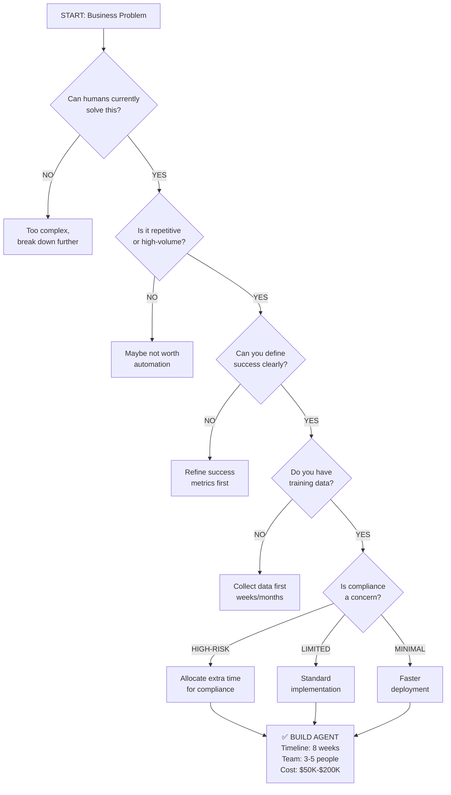
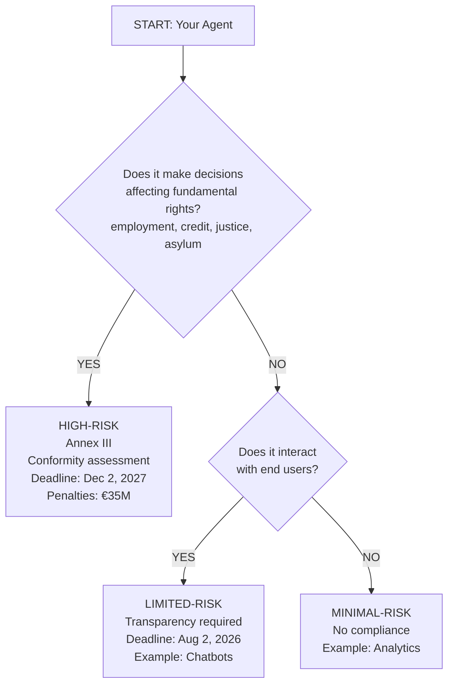
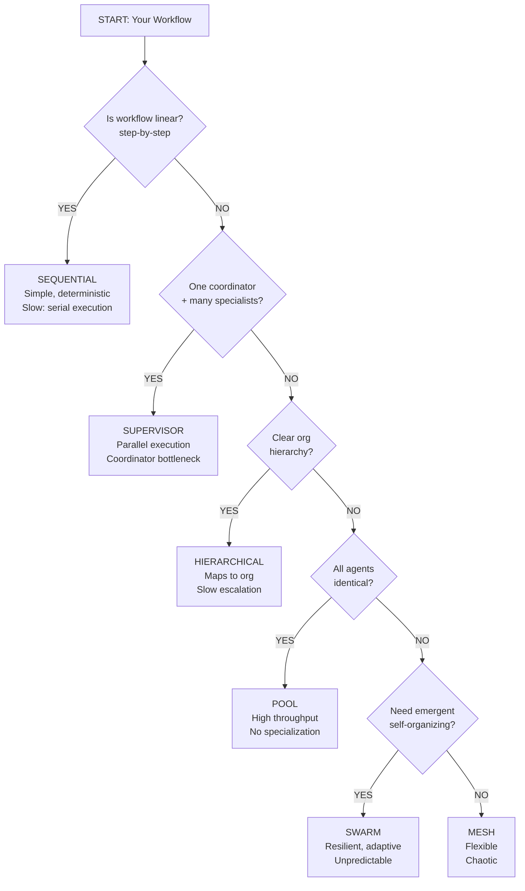
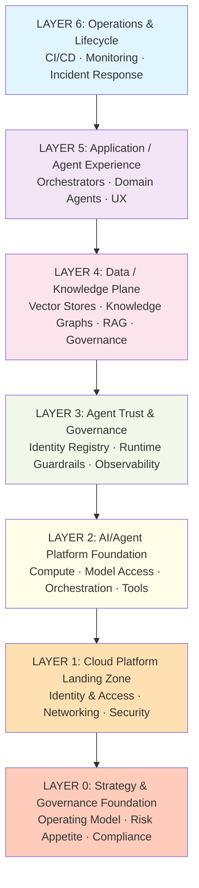
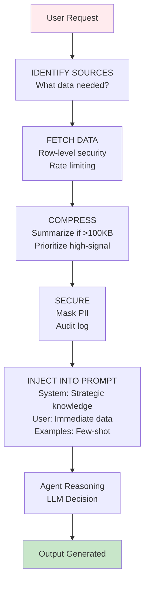
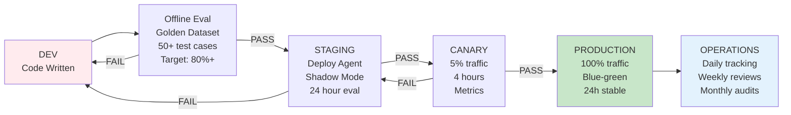

# Agentic AI Landing Zone: Visual Guide & Quick Reference

Diagrams, decision trees, code examples, and glossary for the complete landing zone.

## Why This Matters

Architecture decisions require rapid visual communication. This guide provides decision trees, architecture diagrams, code examples, and reference tables to accelerate agent platform design.

---

## PART 1: DECISION TREES & FLOWCHARTS

### Decision Tree 1: Should You Build an Agent?



### Decision Tree 2: Agent Risk Classification (EU AI Act)



### Decision Tree 3: Multi-Agent Pattern Selection



---

## PART 2: ARCHITECTURE DIAGRAMS

### Complete Landing Zone Stack (Layer Model)



### Context Assembly Flow



### Evaluation Pipeline Stages



---

## PART 3: CODE EXAMPLES

### Example 1: LangGraph Sequential Agent

```python
from langgraph.graph import StateGraph, START, END
from typing import TypedDict

class OrderState(TypedDict):
    order_id: str
    customer_id: str
    customer_profile: dict
    order_details: dict
    decision: str

def intake_agent(state: OrderState):
    return {"order_id": state["order_id"]}

def validation_agent(state: OrderState):
    customer = fetch_customer(state["customer_id"])
    order = fetch_order(state["order_id"])
    days_since = (datetime.now() - order["date"]).days
    eligible = days_since <= 30
    return {"customer_profile": customer, "order_details": order, "eligible": eligible}

def policy_agent(state: OrderState):
    decision = "APPROVE" if state.get("eligible") else "DENY"
    return {"decision": decision}

graph = StateGraph(OrderState)
graph.add_node("intake", intake_agent)
graph.add_node("validation", validation_agent)
graph.add_node("policy", policy_agent)

graph.add_edge(START, "intake")
graph.add_edge("intake", "validation")
graph.add_edge("validation", "policy")
graph.add_edge("policy", END)

agent = graph.compile()
result = agent.invoke({"order_id": "98765", "customer_id": "12345"})
```

### Example 2: Context Orchestrator with MCP

```python
import anthropic
import json

class ContextOrchestrator:
    def __init__(self, budget_kb=8, ttl_seconds=300):
        self.budget_kb = budget_kb
        self.ttl_seconds = ttl_seconds
        self.client = anthropic.Anthropic()

    def assemble_context(self, user_query, customer_id):
        context_items = {}
        
        # Fetch customer profile
        context_items["customer"] = self.fetch_mcp(
            "database_server",
            "query",
            {"sql": f"SELECT * FROM customers WHERE id = {customer_id}"}
        )
        
        # Fetch recent orders
        context_items["orders"] = self.fetch_mcp(
            "database_server",
            "query",
            {"sql": f"SELECT * FROM orders WHERE customer_id = {customer_id} LIMIT 5"}
        )
        
        # Compress if over budget
        total_size = sum(len(json.dumps(v).encode()) for v in context_items.values())
        if total_size > self.budget_kb * 1024:
            context_items = self.compress(context_items)
        
        return context_items

    def inject_into_prompt(self, context, user_query):
        system_prompt = f"You are a customer service agent.\nContext: {json.dumps(context)}"
        response = self.client.messages.create(
            model="claude-opus-4-8",
            max_tokens=500,
            system=system_prompt,
            messages=[{"role": "user", "content": user_query}]
        )
        return response.content[0].text
```

---

## PART 4: GLOSSARY & TERMINOLOGY

**Agent Autonomy Level (0-4):** 0=advisory only, 1=supervised execution, 2=constrained autonomy, 3=broad autonomy, 4=full autonomy

**Agentic AI:** AI systems with goal-directed autonomy, multi-step reasoning, and tool use.

**Canary Deployment:** Gradual rollout (5% traffic, monitor, then scale to 100%).

**Context Engineering:** Systematic collection, organization, security, and optimization of agent reasoning data.

**Conformity Assessment:** Documented evaluation demonstrating a high-risk AI system meets EU AI Act requirements.

**Decentralized Identifier (DID):** Unique cryptographic identifier for an agent, verified without central authority.

**EU AI Act:** European regulation (effective Aug 2, 2026) classifying AI by risk and requiring conformity for high-risk systems.

**Golden Dataset:** Curated collection of representative test cases (input → expected output).

**Hallucination:** When an LLM generates plausible but false information.

**High-Risk AI:** Systems whose failure could harm fundamental rights (employment, credit, justice). Requires conformity assessment.

**Immutable Audit Trail:** Record of events that cannot be retroactively modified, using cryptographic signing.

**Landing Zone:** Preconfigured, secure cloud environment for agent workloads.

**Limited-Risk AI:** Systems interacting with humans (chatbots, recommendations). Require transparency disclosures.

**Model Context Protocol (MCP):** Open standard for connecting AI systems to tools, data sources, and external services.

**Multi-Agent System:** Multiple specialized agents working together to solve complex problems.

**Observability:** Understanding system behavior from external outputs (logs, metrics, traces).

**Policy Card:** Machine-readable specification of governance rules for an agent.

**Registry:** Central catalog of all authorized agents with metadata.

**Risk Management System:** Documented process for identifying, assessing, and mitigating AI system risks.

**Semantic Logging:** Structured logging capturing not just "what" but "why."

**Shadow Mode:** New agent runs in parallel with current system without affecting users (for evaluation).

**Transparency Disclosure:** User-facing statement that an AI system (not human) made a decision.

---

## PART 5: QUICK REFERENCE TABLES

### Compliance Checklist by Risk Level

| Requirement | HIGH-RISK | LIMITED-RISK | MINIMAL-RISK |
| --- | --- | --- | --- |
| Risk Management System | ✅ MUST | ❌ No | ❌ No |
| Data Governance Doc | ✅ MUST | ❌ No | ❌ No |
| Technical Documentation | ✅ MUST | ⚠️ Recommended | ❌ No |
| Audit Logs | ✅ MUST | ⚠️ Recommended | ❌ No |
| Transparency Disclosure | ✅ MUST | ✅ MUST | ❌ No |
| Human Appeal Process | ✅ MUST | ⚠️ Recommended | ❌ No |
| Bias Testing | ✅ MUST | ⚠️ Recommended | ❌ No |
| **Deadline** | **Aug 2** | **Aug 2** | **N/A** |

### Multi-Agent Pattern Comparison

| Pattern | Latency | Complexity | Parallelism | Best For |
| --- | --- | --- | --- | --- |
| Sequential | Slowest | Low | None | Linear workflows |
| Supervisor | Fast | Medium | High | Parallel specialists |
| Hierarchical | Slow | High | Medium | Escalation paths |
| Mesh | Fast | High | High | Complex interdependencies |
| Pool | Fastest | Low | High | Identical tasks |
| Swarm | Variable | Very High | Full | Exploration, emergence |

### Context Assembly Strategy Selection

| Strategy | Latency | Cost | Quality | Best For |
| --- | --- | --- | --- | --- |
| Eager | Fast (~200ms) | High | Complete | Simple requests |
| Lazy | Slow (~400ms) | Low | Precise | Complex queries |
| Hybrid | Medium (~300ms) | Medium | Balanced | Production systems |

### Evaluation Metrics by Stage

| Stage | Focus | Target | Gate |
| --- | --- | --- | --- |
| **Offline** | Success Rate | &gt;80% | Proceed if ✓ |
| **Staging** | Error Rate | &lt;1% | ARB approval if ✓ |
| **Canary** | Latency p95 | &lt;SLA | Auto-proceed if ✓ |
| **Production** | SLA Compliance | 99.5% | Daily tracking |

### Implementation Timelines

| Activity | Duration | Effort | Team Size |
| --- | --- | --- | --- |
| Deploy First Agent | 8 weeks | Medium | 3-5 |
| Set Up Registry | 2 weeks | Low | 1-2 |
| Build Golden Dataset | 3 weeks | Medium | 2-3 |
| Establish Eval Pipeline | 4 weeks | Medium | 2-3 |
| Implement Multi-Agent | 6 weeks | High | 4-6 |
| **Total Program** | **~5 months** | **High** | **5-8** |

---

## Related

- [Agentic AI Landing Zone: Business Layer](23-agentic-ai-landing-zone-business-layer.md)
- [Agentic AI Landing Zone: Context Engineering](24-agentic-ai-landing-zone-context-engineering.md)
- [Agentic AI Landing Zone: Tier 3 Complete](31-agentic-ai-landing-zone-tier3-complete.md)

---

**Document Status:** Current (July 2026)  
**Owner:** Platform Architecture  
**Audience:** Architects, engineers, product teams
