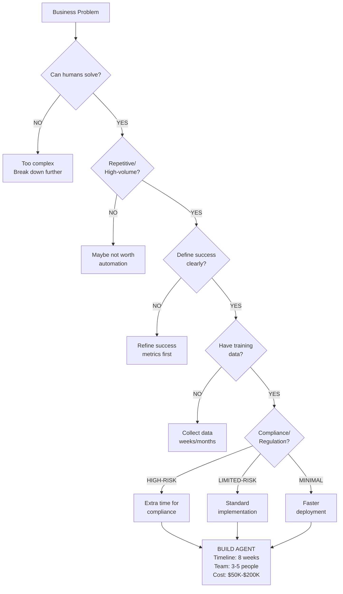
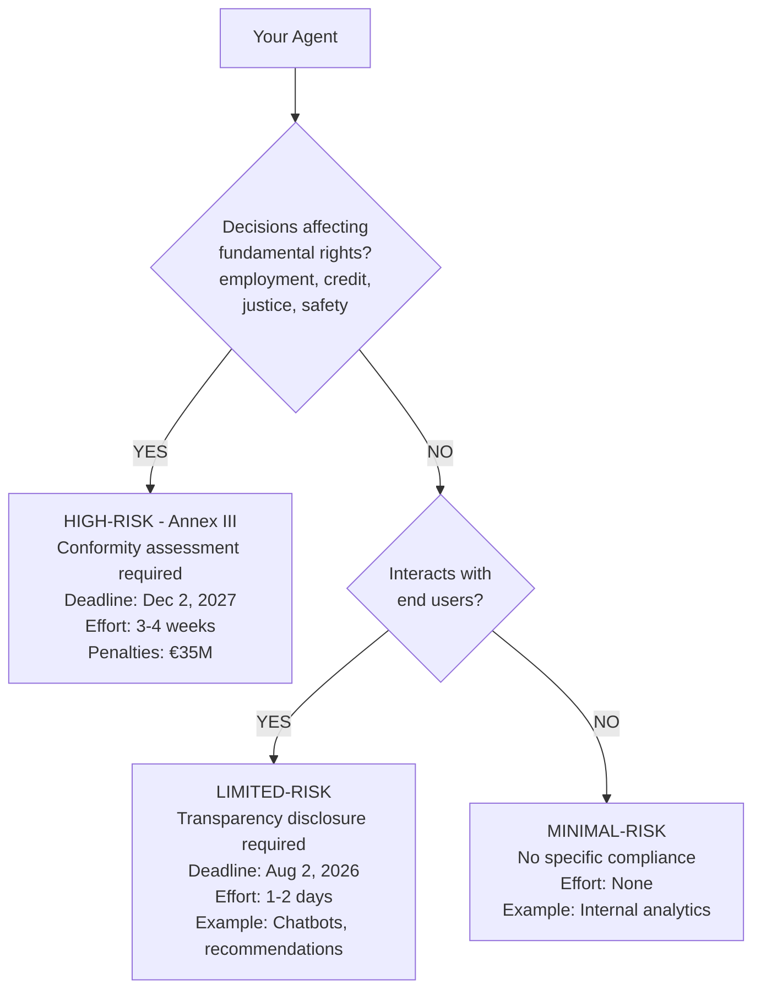
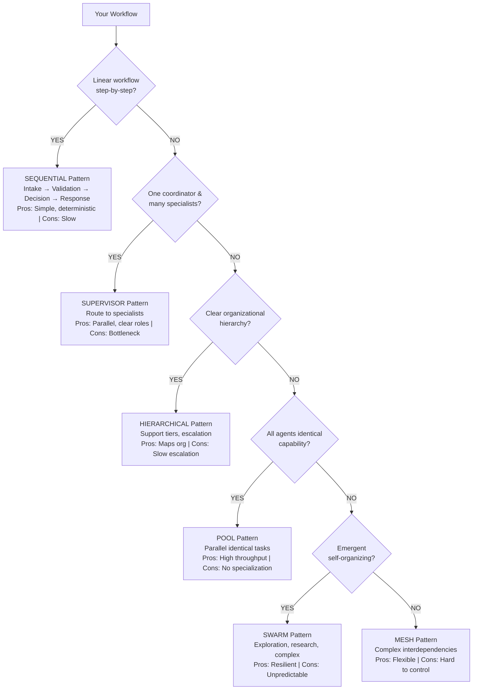
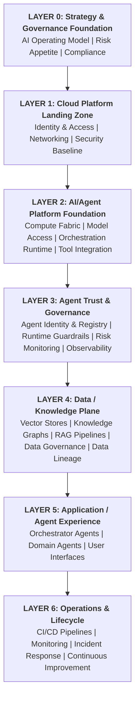
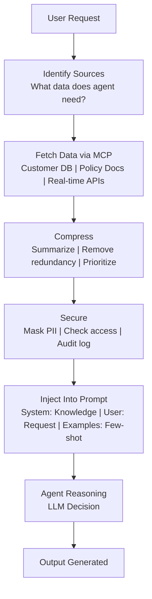
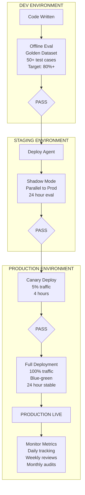
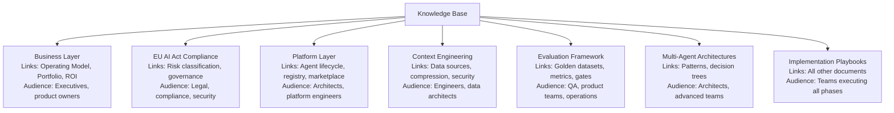

# Agentic AI Landing Zone: Visual Guide & Quick Reference

Diagrams, decision trees, code examples, and glossary for the complete landing zone.

## Why This Matters

Architecture decisions require rapid visual communication. This guide provides decision trees, architecture diagrams, code examples, and reference tables to accelerate agent platform design.

---

## PART 1: DECISION TREES & FLOWCHARTS

### Decision Tree 1: Should You Build an Agent?



Decision tree guiding whether to build an agent based on solvability by humans, volume, success metrics, data availability, and compliance requirements.

### Decision Tree 2: Agent Risk Classification (EU AI Act)



EU AI Act risk classification for agents based on impact on fundamental rights and user interaction.

### Decision Tree 3: Multi-Agent Pattern Selection



Decision tree for selecting multi-agent patterns based on workflow characteristics, organizational structure, and capability requirements.

---

## PART 2: ARCHITECTURE DIAGRAMS

### Diagram 1: Complete Landing Zone Stack



Agentic AI landing zone organized as 7 layers, from governance foundation (bottom) through cloud platform, agent infrastructure, data plane, applications, and operations (top).

### Diagram 2: Context Assembly Flow



Context assembly flow showing how data is gathered from multiple sources via Model Context Protocol, compressed, secured, and injected into the agent's prompt before reasoning begins.

### Diagram 3: Evaluation Pipeline Stages



Staged evaluation pipeline moving agents from development through staging shadow mode to production canary and full deployment with continuous monitoring.

---

## PART 3: CODE EXAMPLES

### Example 1: LangGraph Agent (Sequential Pattern)

```python
from langgraph.graph import StateGraph, START, END
from typing import TypedDict

# Define the state that flows between agents
class OrderState(TypedDict):
    order_id: str
    customer_id: str
    customer_profile: dict  # from DB
    order_details: dict     # from DB
    policies: dict          # from knowledge base
    decision: str           # final decision
    response: str           # response to customer

# Node 1: Intake Agent (understand the request)
def intake_agent(state: OrderState):
    """Extract order ID from request"""
    return {
        "order_id": state["order_id"],
        "customer_id": state["customer_id"]
    }

# Node 2: Validation Agent (verify return eligibility)
def validation_agent(state: OrderState):
    """Check return window, eligibility"""
    # Fetch from DB via MCP
    customer = fetch_customer(state["customer_id"])
    order = fetch_order(state["order_id"])

    days_since_purchase = (datetime.now() - order["date"]).days
    window_days = state["policies"]["return_window"]

    eligible = days_since_purchase <= window_days

    return {
        "customer_profile": customer,
        "order_details": order,
        "eligible": eligible
    }

# Node 3: Policy Agent (determine refund terms)
def policy_agent(state: OrderState):
    """Apply return policy based on order details"""
    if not state.get("eligible"):
        decision = "DENY"
        reason = "Outside return window"
    else:
        decision = "APPROVE"
        reason = "Eligible for return"

    return {"decision": decision}

# Node 4: Communication Agent (generate response)
def communication_agent(state: OrderState):
    """Generate customer-facing response"""
    response = f"Your return request is {state['decision'].lower()}. {reason}"
    return {"response": response}

# Build the graph (Sequential: 1 → 2 → 3 → 4)
graph = StateGraph(OrderState)
graph.add_node("intake", intake_agent)
graph.add_node("validation", validation_agent)
graph.add_node("policy", policy_agent)
graph.add_node("communication", communication_agent)

# Sequential flow
graph.add_edge(START, "intake")
graph.add_edge("intake", "validation")
graph.add_edge("validation", "policy")
graph.add_edge("policy", "communication")
graph.add_edge("communication", END)

# Compile and run
agent = graph.compile()
result = agent.invoke({
    "order_id": "98765",
    "customer_id": "12345"
})
print(result["response"])
```

### Example 2: Supervisor Pattern (Multiple Specialists)

```python
from langgraph.graph import StateGraph, START, END
import anthropic

class CustomerServiceState(TypedDict):
    user_query: str
    intent: str  # billing, returns, technical, etc.
    billing_response: str
    returns_response: str
    technical_response: str
    final_response: str

# Supervisor: Route to specialists
def supervisor(state: CustomerServiceState):
    """Route query to appropriate specialist"""
    client = anthropic.Anthropic()

    message = client.messages.create(
        model="claude-opus-4-8",
        max_tokens=100,
        messages=[{
            "role": "user",
            "content": f"Classify this query: {state['user_query']}. "
                      f"Respond with ONE word: billing, returns, technical, or general"
        }]
    )

    intent = message.content[0].text.lower().strip()
    return {"intent": intent}

# Specialist 1: Billing
def billing_specialist(state: CustomerServiceState):
    client = anthropic.Anthropic()
    message = client.messages.create(
        model="claude-opus-4-8",
        max_tokens=500,
        messages=[{
            "role": "user",
            "content": f"Answer this billing question: {state['user_query']}"
        }]
    )
    return {"billing_response": message.content[0].text}

# Specialist 2: Returns
def returns_specialist(state: CustomerServiceState):
    client = anthropic.Anthropic()
    message = client.messages.create(
        model="claude-opus-4-8",
        max_tokens=500,
        messages=[{
            "role": "user",
            "content": f"Help with this return: {state['user_query']}"
        }]
    )
    return {"returns_response": message.content[0].text}

# Specialist 3: Technical
def technical_specialist(state: CustomerServiceState):
    client = anthropic.Anthropic()
    message = client.messages.create(
        model="claude-opus-4-8",
        max_tokens=500,
        messages=[{
            "role": "user",
            "content": f"Fix this technical issue: {state['user_query']}"
        }]
    )
    return {"technical_response": message.content[0].text}

# Synthesizer: Combine specialist responses
def synthesizer(state: CustomerServiceState):
    """Route to supervisor, then to appropriate specialist, synthesize"""
    if state["intent"] == "billing":
        response = state["billing_response"]
    elif state["intent"] == "returns":
        response = state["returns_response"]
    elif state["intent"] == "technical":
        response = state["technical_response"]
    else:
        response = "I can help with billing, returns, or technical support."

    return {"final_response": response}

# Build graph (Supervisor pattern)
graph = StateGraph(CustomerServiceState)
graph.add_node("supervisor", supervisor)
graph.add_node("billing", billing_specialist)
graph.add_node("returns", returns_specialist)
graph.add_node("technical", technical_specialist)
graph.add_node("synthesizer", synthesizer)

# Routing logic
graph.add_edge(START, "supervisor")
graph.add_conditional_edges(
    "supervisor",
    lambda x: x["intent"],
    {
        "billing": "billing",
        "returns": "returns",
        "technical": "technical",
    }
)
graph.add_edge("billing", "synthesizer")
graph.add_edge("returns", "synthesizer")
graph.add_edge("technical", "synthesizer")
graph.add_edge("synthesizer", END)

# Run
agent = graph.compile()
result = agent.invoke({"user_query": "I was overcharged on my order"})
print(result["final_response"])
```

### Example 3: Context Assembly with MCP

```python
import anthropic
import json

class ContextOrchestrator:
    """Manages context assembly for agents"""

    def __init__(self, budget_kb=8, ttl_seconds=300):
        self.budget_kb = budget_kb
        self.ttl_seconds = ttl_seconds
        self.client = anthropic.Anthropic()

    def assemble_context(self, user_query, customer_id):
        """Assemble context from multiple sources"""

        # Determine what context is needed
        context_items = {}

        # Fetch customer profile (via MCP)
        context_items["customer"] = self.fetch_mcp(
            "database_server",
            "query",
            {"sql": f"SELECT * FROM customers WHERE id = {customer_id}"}
        )

        # Fetch recent orders (via MCP)
        context_items["orders"] = self.fetch_mcp(
            "database_server",
            "query",
            {"sql": f"SELECT * FROM orders WHERE customer_id = {customer_id} LIMIT 5"}
        )

        # Fetch policies (via MCP to knowledge base)
        context_items["policies"] = self.fetch_mcp(
            "knowledge_server",
            "search",
            {"query": "return policy refund"}
        )

        # Compress if over budget
        total_size = sum(
            len(json.dumps(v).encode())
            for v in context_items.values()
        )

        if total_size > self.budget_kb * 1024:
            context_items = self.compress(context_items)

        return context_items

    def fetch_mcp(self, server_id, method, params):
        """Call MCP server to fetch data"""
        # This would call actual MCP protocol
        # Simplified for example
        return {"data": "fetched via MCP"}

    def compress(self, items):
        """Compress context to fit budget"""
        compressed = {}
        for key, value in items.items():
            if isinstance(value, list) and len(value) > 3:
                # Summarize lists
                compressed[key] = f"[Summary: {len(value)} items]"
            else:
                compressed[key] = value
        return compressed

    def inject_into_prompt(self, context, user_query):
        """Inject context into prompt for agent"""

        system_prompt = f"""You are a helpful customer service agent.
Here is context about the customer:
{json.dumps(context, indent=2)}

Follow these policies when responding:
- Return window is 30 days
- Refunds processed within 5-7 days
- Escalate to human if customer is upset"""

        response = self.client.messages.create(
            model="claude-opus-4-8",
            max_tokens=500,
            system=system_prompt,
            messages=[{
                "role": "user",
                "content": user_query
            }]
        )

        return response.content[0].text

# Usage
orchestrator = ContextOrchestrator(budget_kb=8)
context = orchestrator.assemble_context(
    user_query="Can I return my order?",
    customer_id=12345
)
response = orchestrator.inject_into_prompt(
    context=context,
    user_query="Can I return my order?"
)
print(response)
```

---

## PART 4: GLOSSARY & TERMINOLOGY

### A

**Agent**
An autonomous AI system capable of perceiving its environment, making decisions, and taking actions to achieve goals. Often uses an LLM as the reasoning engine.

**Agent Autonomy Level (0-4)**

- 0: Advisory only (recommendations, no actions)
- 1: Supervised execution (human approves each action)
- 2: Constrained autonomy (agent acts within guardrails)
- 3: Broad autonomy (periodic human review)
- 4: Full autonomy (post-facto audit only)

**Agentic AI**
AI systems exhibiting goal-directed autonomy, often involving multi-step reasoning and tool use.

**Architecture Decision Record (ADR)**
Documented decision about significant architectural choices, including context, decision, and consequences.

**Audit Log**
Immutable record of every action taken by an agent, including inputs, decision, reasoning, and outcome.

### C

**Canary Deployment**
Gradual rollout strategy: deploy new version to 5% of traffic, monitor for issues, then scale to 100% if healthy.

**Capability**
What an organization does (customer service, order fulfillment, compliance monitoring). Distinguished from "function" (how it's implemented).

**Conformity Assessment**
Documented evaluation demonstrating that a high-risk AI system meets EU AI Act requirements.

**Context Engineering**
Systematic approach to collecting, organizing, securing, and optimizing the data (context) an agent uses for reasoning.

**Context Budget**
Maximum KB size (or cost, or latency) allocated for context before inference. Forces prioritization of high-signal data.

### D

**Decentralized Identifier (DID)**
Unique identifier for an agent (or person/organization), verified via cryptography, enabling trust without central authority.

**Deprecation**
Process of signaling that an agent will be retired, providing transition time for users to migrate to successor system.

### E

**EU AI Act**
European regulation (effective Aug 2, 2026) classifying AI systems by risk and requiring conformity for high-risk systems.

**Evaluation**
Systematic testing of an agent across multiple stages (offline, staging, canary, production) to ensure quality.

### G

**Golden Dataset**
Curated collection of representative test cases (input → expected output) used to evaluate agent performance.

**Governance**
Policies, procedures, and controls ensuring agents operate safely, fairly, and in compliance with regulations.

### H

**Hallucination**
When an LLM generates plausible-sounding but false information (e.g., "Our return window is 45 days" when it's actually 30).

**High-Risk AI (EU AI Act)**
Systems whose failure or malfunction could cause harm to fundamental rights (employment, credit, justice, etc.). Requires conformity assessment.

### I

**Immutable Audit Trail**
Record of events that cannot be retroactively modified, typically using cryptographic signing for tamper detection.

### L

**Landing Zone**
Preconfigured, secure cloud environment configured to support specific workload types (agents, in this case).

**Limited-Risk AI (EU AI Act)**
Systems interacting with humans (chatbots, recommendations) requiring transparency disclosures.

### M

**Model Context Protocol (MCP)**
Open standard for connecting AI systems to tools, data sources, and external services via JSON-RPC.

**Multi-Agent System**
Multiple specialized agents working together to solve complex problems (sequential, hierarchical, supervisor, etc.).

### O

**Observability**
Ability to understand system behavior from external outputs (logs, metrics, traces). Includes traditional monitoring + semantic logging.

### P

**Policy Card**
Machine-readable specification of governance rules for an agent (allowed actions, data access, escalation triggers, etc.).

**Provenance**
Record of data lineage: where it came from, how it was transformed, who accessed it, and why.

### R

**Registry**
Central catalog of all authorized agents, including metadata (owner, permissions, SLA, status, etc.).

**Risk Management System**
Documented process for identifying, assessing, and mitigating risks from an AI system.

### S

**Semantic Logging**
Structured logging that captures not just "what" happened but "why" (intent, reasoning, context).

**Shadow Mode**
Deployment strategy where a new agent runs in parallel with the current system but doesn't affect users (for evaluation).

**Supervisory Agent**
Agent that coordinates multiple specialist agents, deciding which to call and synthesizing their outputs.

### T

**Tool**
External function or service an agent can invoke: database query, API call, email send, etc.

**Transparency Disclosure**
User-facing statement that an AI system (not a human) made a decision. Required by Aug 2, 2026.

### V

**Verifiable Credential**
Cryptographically signed claim about an agent's identity, capabilities, or delegation authority.

---

## PART 5: QUICK REFERENCE TABLES

### Table 1: Compliance Checklist by Risk Level

| Requirement | HIGH-RISK | LIMITED-RISK | MINIMAL-RISK |
| ------------- | ----------- | -------------- | -------------- |
| Risk Management System | ✅ MUST | ❌ No | ❌ No |
| Data Governance Doc | ✅ MUST | ❌ No | ❌ No |
| Technical Docs | ✅ MUST | ⚠️ Recommended | ❌ No |
| Audit Logs | ✅ MUST | ⚠️ Recommended | ❌ No |
| Transparency Disclosure | ✅ MUST | ✅ MUST | ❌ No |
| Human Appeal Process | ✅ MUST | ⚠️ Recommended | ❌ No |
| Bias Testing | ✅ MUST | ⚠️ Recommended | ❌ No |
| **Deadline** | **Aug 2** | **Aug 2** | **N/A** |

### Table 2: Multi-Agent Pattern Comparison

| Pattern | Latency | Complexity | Parallelism | Best For |
| --------- | --------- | ------------ | ------------ | ---------- |
| Sequential | Slowest | Low | None | Linear workflows |
| Supervisor | Fast | Medium | High | Parallel specialists |
| Hierarchical | Slow | High | Medium | Escalation paths |
| Mesh | Fast | High | High | Complex interdependencies |
| Pool | Fastest | Low | High | Identical tasks |
| Swarm | Variable | Very High | Full | Exploration, emergence |

### Table 3: Context Assembly Strategy Selection

| Strategy | Latency | Cost | Context Quality | Best For |
| ---------- | --------- | ------ | ----------------- | ---------- |
| Eager | Fast (~200ms) | High | Complete | Simple requests |
| Lazy | Slow (~400ms) | Low | Precise | Complex queries |
| Hybrid | Medium (~300ms) | Medium | Balanced | Production systems |

### Table 4: Evaluation Metrics by Stage

| Stage | Focus Metric | Target | Gate |
| ------- | -------------- | -------- | ------ |
| **Offline** | Success Rate | > 80% | Proceed if ✓ |
| **Staging** | Error Rate | &lt; 1% | ARB approval if ✓ |
| **Canary** | Latency p95 | &lt; SLA | Auto-proceed if ✓ |
| **Production** | SLA Compliance | 99.5% | Daily tracking |

### Table 5: Implementation Timelines

| Activity | Duration | Effort | Team Size |
| ---------- | ---------- | -------- | ----------- |
| Deploy First Agent | 8 weeks | Medium | 3-5 |
| Set Up Registry | 2 weeks | Low | 1-2 |
| Build Golden Dataset | 3 weeks | Medium | 2-3 |
| Establish Eval Pipeline | 4 weeks | Medium | 2-3 |
| Implement Multi-Agent | 6 weeks | High | 4-6 |
| **Total Program** | **~5 months** | **High** | **5-8** |

---

## PART 6: NAVIGATION & CROSS-REFERENCES

### How to Read This Knowledge Base

**By Role:**

- **CEO/CIO**: Start → Business Layer → Compliance (EU AI Act)
- **Architect**: Start → Technical layers (0-6) → Multi-Agent patterns
- **Engineer**: Implementation Playbooks → Code examples → Platform layer
- **Compliance Officer**: EU AI Act compliance → Governance requirements
- **Operations**: Playbooks → Evaluation framework → Monitoring dashboard

**By Timeline:**

- **Week 1**: Business Layer + EU AI Act audit
- **Week 2-3**: Architecture & Playbook 1 planning
- **Week 4-8**: Execute Playbook 1 (first agent)
- **Week 9-10**: Playbook 2 (registry) + Playbook 3 (golden dataset)
- **Week 11-14**: Playbook 4 (evaluation)
- **Week 15-20**: Playbook 5 (multi-agent)

**By Urgency:**

1. 🚨 **CRITICAL (24 days)**: EU AI Act compliance → Start immediately
2. 🟠 **HIGH (Weeks 2-4)**: First agent design & architecture
3. 🟡 **MEDIUM (Weeks 5-10)**: Platform setup & operations
4. 🟢 **LONG-TERM (Weeks 11+)**: Optimization & scaling

### Cross-Reference Map



Cross-reference map showing how knowledge base sections connect and which audience each serves.

---

## PART 7: RECOMMENDED READING ORDER

### Executive Track (4 hours)

1. Business Layer & Capability Mapping (1 hour)
2. EU AI Act Compliance - Executive Summary (30 min)
3. Implementation Playbooks - Overview (30 min)
4. Visual Guide - Diagrams & Decision Trees (1 hour)
5. ROI Framework & Roadmap (1 hour)

### Architect Track (8 hours)

1. Original Landing Zone Architecture (2 hours)
2. All 7 layers explained (3 hours)
3. Multi-Agent Architectures (1 hour)
4. Platform Layer (1 hour)
5. Context Engineering (1 hour)

### Engineer Track (6 hours)

1. Implementation Playbooks - Playbook 1 (1 hour)
2. Code Examples (1.5 hours)
3. Evaluation Framework (1 hour)
4. Platform Layer - Technical deep-dive (1 hour)
5. Context Engineering - Implementation (1 hour)

### Compliance Track (5 hours)

1. EU AI Act Compliance (2 hours)
2. Business Layer - Risk & Governance (1 hour)
3. Platform Layer - Audit & Logging (1 hour)
4. Evaluation Framework - Metrics (1 hour)

---

**Document Status:** ✅ COMPLETE  
**Total Knowledge Base:** 9 documents, ~15,000 lines  
**Ready to Share:** YES (with leadership, teams, external partners)  
**Next Step:** Push to GitHub + schedule team briefings
