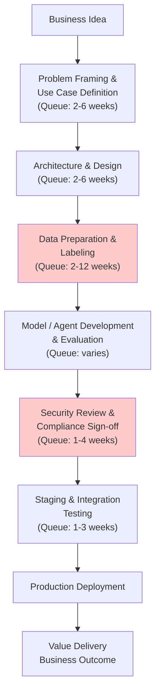

# AI Value Stream Mapping — Lean Delivery for Enterprise AI Programs

**Why this matters:** Most enterprise AI programs have two timelines: 4–8 weeks of actual work and 12–40 weeks of queue time. Value stream mapping reveals and eliminates those bottlenecks, directly multiplying AI program ROI.

> **Current as of July 2026.** AI Value Stream Mapping applies Toyota Production System lean principles to the enterprise AI delivery lifecycle — identifying and eliminating waste, bottlenecks, and handoff delays that prevent AI initiatives from reaching production quickly and sustainably.

---

## What Is AI Value Stream Mapping?

**Value Stream Mapping (VSM)** is a lean management technique derived from the Toyota Production System that visualizes every step, material, and information flow required to deliver value to a customer — with the explicit goal of identifying waste.

Applied to enterprise AI programs, **AI Value Stream Mapping** maps the end-to-end flow from a business idea to a production AI system delivering measurable value, then identifies where:

- Work waits unnecessarily (queue time)
- Effort is spent on activities that don't add value (waste)
- Quality problems require rework (defects)
- Handoffs lose context and slow delivery (flow disruption)

Research shows that organizations with strong VSM practices see dramatically amplified results from AI adoption — the VSM discipline reveals bottlenecks that AI alone cannot fix.

---

## The AI Delivery Value Stream

A typical enterprise AI initiative flows through these stages:



**Key observation:** In most enterprises, the actual work time (model building, evaluation, deployment) is 4–8 weeks. The queue time between steps is 12–40 weeks. **The bottleneck is almost never the AI — it's the process around it.**

---

## Waste in AI Delivery Programs (Eight Wastes Applied)

| Lean Waste Type | AI Program Manifestation |
|----------------|--------------------------|
| **Defects** | Deploying unvalidated models; prompt regressions discovered in production |
| **Overproduction** | Building features no stakeholder requested; over-engineering agent architectures |
| **Waiting** | Data access requests taking weeks; architecture review queues; approvals |
| **Non-utilized talent** | AI engineers waiting for data; stakeholders not involved until demo |
| **Transportation** | Context lost between teams during handoffs (data team → AI team → security → ops) |
| **Inventory** | Undeployed models sitting in staging; backlog of use cases never prioritized |
| **Motion** | Manual report generation; copy-paste data between systems; repeated environment setup |
| **Extra processing** | Over-documenting experiments; generating artifacts no one reads |

---

## How to Conduct an AI Value Stream Mapping Exercise

### Step 1: Define the Value Stream Scope (1 day)

Choose a specific AI delivery type (e.g., "deploy a new agent to production") and define:
- **Customer:** Who receives value? (Business unit, end user)
- **Value:** What outcome are they getting? (Decision speed, cost reduction, task automation)
- **Start:** Where does the value stream begin? (Business idea submitted)
- **End:** Where does it end? (Business outcome measured in production)

### Step 2: Map the Current State (1–2 days)

Walk the process with practitioners — data scientists, platform engineers, security, product owners. For each step capture:

| Attribute | Capture |
|-----------|---------|
| **Process time** | How long does active work take when someone is working on it? |
| **Queue time** | How long does work sit waiting before this step starts? |
| **% Complete and Accurate** | What % of work arrives ready to start, with no rework needed? |
| **Number of people** | How many people are involved in this step? |
| **Tools used** | What systems/tools does this step use? |
| **Pain points** | What frustrations do practitioners report? |

### Step 3: Calculate Flow Metrics

From the current state map:

| Metric | Formula | Typical Enterprise AI |
|--------|---------|----------------------|
| **Total lead time** | Sum of all process + queue times | 16–52 weeks |
| **Total process time** | Sum of process times only | 4–10 weeks |
| **Flow efficiency** | Process time / Lead time × 100% | 10–30% |
| **Largest bottleneck** | Step with highest queue time | Usually data access or security review |

**Target:** Flow efficiency &gt;50% for mature AI delivery. Elite organizations reach 70%+.

### Step 4: Identify Root Causes of Waste

For each bottleneck and waste item, ask "5 Whys":

```
Problem: Data access requests take 8 weeks on average.
Why 1: Requests require manual approval from 3 teams.
Why 2: There is no data catalog; teams don't know what data exists.
Why 3: No budget was allocated for data governance tooling.
Why 4: AI program was funded without including data infrastructure.
Why 5: Business case focused on model cost; ignored data readiness.

Root cause: AI investment decisions don't account for data readiness prerequisites.
```

### Step 5: Design the Future State (1 day)

Apply lean principles to redesign the flow:

| Lean Principle | AI Application |
|---------------|---------------|
| **Pull vs. push** | Teams pull work from shared backlog based on capacity; no forced assignments |
| **Flow** | Eliminate batching; move to continuous delivery with small increments |
| **Takt time** | Match AI delivery pace to business demand; don't build faster than value can be absorbed |
| **Poka-yoke** | Build automated checks that prevent defects (eval gates, security scans) |
| **One-piece flow** | Minimize work-in-progress; focus one team on one AI product at a time |
| **Standard work** | Define repeatable processes for common tasks (data onboarding, model evaluation) |

### Step 6: Implement and Measure (Ongoing)

Implement future state in 30-day kaizen bursts. Track lead time and flow efficiency before and after each change.

---

## AI VSM + Platform Engineering

The most powerful intervention revealed by AI value stream mapping is almost always **missing platform capabilities** that force teams into manual, slow workarounds:

| VSM-Identified Waste | Platform Engineering Solution |
|---------------------|------------------------------|
| 6-week data access wait | Self-service data catalog with automated access provisioning |
| 4-week security review | Automated security gate in CI/CD; policy-as-code |
| 2-week environment setup | Standardized AI development environment; one-click provisioning |
| Manual evaluation runs | Evaluation pipeline in CI/CD; automated on every commit |
| Repeated context-switch between tools | Unified AI development portal |

---

## AI VSM Metrics Dashboard

| Metric | Current State | Target |
|--------|--------------|--------|
| Idea-to-production lead time | — | &lt;90 days |
| Flow efficiency | — | &gt;50% |
| Data access queue time | — | &lt;5 days (self-service) |
| Security review queue time | — | &lt;2 days (automated first pass) |
| Deployment frequency | — | Weekly |
| Rework rate | — | &lt;10% of deployments |
| % Complete and Accurate at handoffs | — | &gt;80% |

---

## Anti-Patterns

| Anti-Pattern | What It Looks Like |
|-------------|-------------------|
| **Mapping the aspirational state** | Participants describe the process as it should work, not as it does |
| **Missing queue times** | Mapping only process steps; queue time is where most lead time hides |
| **No stakeholder ownership** | VSM exercise completed; no one owns implementing the improvements |
| **Tool obsession** | Buying an AI VSM diagramming tool instead of fixing the underlying process |
| **One-time exercise** | VSM done once at program start; not revisited as the value stream evolves |

---

## Related

- AgentOps (operations layer) — [38-agentops-production-guide.md](38-agentops-production-guide.md)

## Sources

- [Lean Enterprise Institute: Value Stream Mapping Is Your Missing AI Superpower](https://www.lean.org/the-lean-post/articles/value-stream-mapping-is-your-missing-ai-superpower/)
- [AIGPE: AI Value Stream Mapping 2026 Ultimate Guide](https://aigproexcellence.com/blog/ai-value-stream-mapping/)
- [Kaizen: Guide to VSM in Lean](https://kaizen.com/insights/guide-vsm-lean-manufacturing/)
- [Wolters Kluwer: AI-Driven Value Stream Management](https://www.wolterskluwer.com/en/expert-insights/ai-driven-value-stream-management-optimizing-continuous-flow-efficiency)
