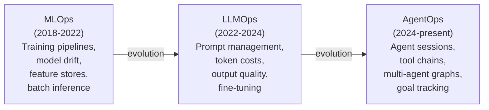
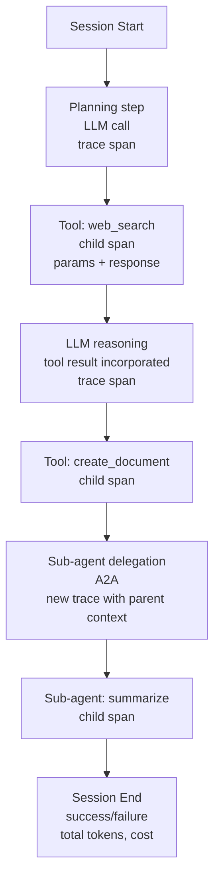
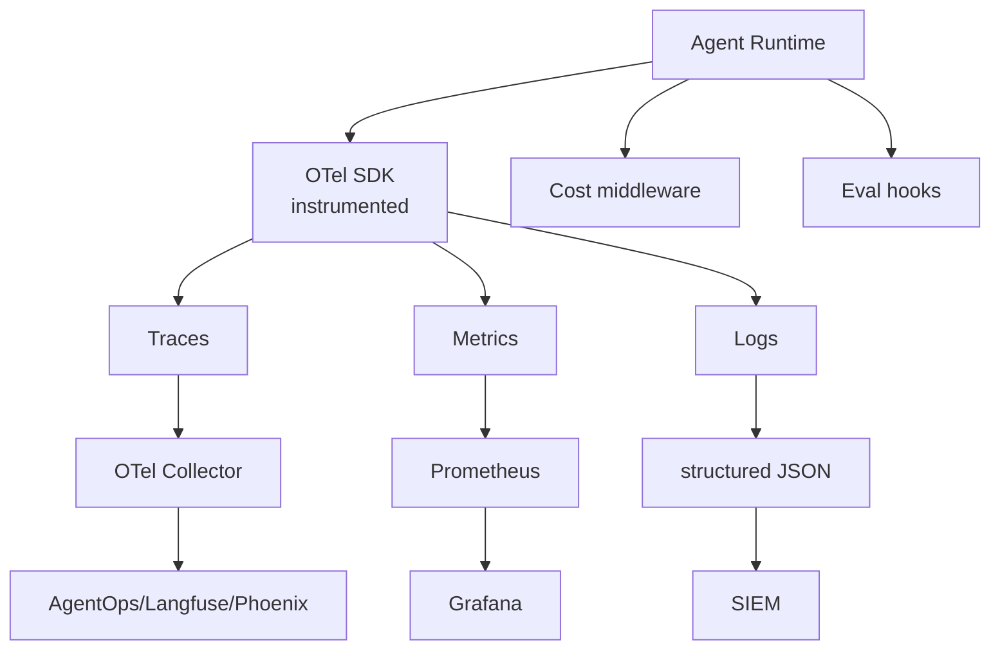

# AgentOps — Operational Discipline for Production AI Agents

**Why this matters:** Agents in production fail in ways traditional APM cannot detect — multi-turn state collapse, tool loops that retry 20 times without logging, and goal failures despite "successful" execution. AgentOps is the observability, SRE, and cost-attribution discipline that prevents silent failures and runaway spend.

> **Current as of July 2026.** AgentOps is the operational practice — tools, processes, and culture — for running AI agents reliably in production. It extends MLOps and LLMOps to address the unique challenges of agents: state across turns, tool invocations, goal-directed behavior, and multi-agent coordination.

---

## What Is AgentOps?

**AgentOps** is the set of practices, tools, and frameworks for designing, deploying, monitoring, optimizing, and governing autonomous AI agents in production. It sits at the convergence of LLMOps (for the model layer) and SRE (for the reliability layer), extended with agent-specific concerns:

- **State management** — agents maintain context across turns; state failures are not visible as HTTP errors
- **Tool invocation tracing** — every tool call must be logged, cost-attributed, and anomaly-detectable
- **Goal-directed behavior monitoring** — the question is not "did it respond?" but "did it achieve the right goal?"
- **Multi-agent coordination** — failures can cascade across agent networks in ways single-agent monitoring cannot detect
- **Cost attribution** — per-agent, per-session token consumption must be tracked for FinOps

The LLM observability market reached **$1.97B in 2025**, projected to hit **$6.8B by 2029** at 36.5% CAGR.

---

## The AgentOps Evolution: MLOps → LLMOps → AgentOps



---

## Why Standard Monitoring Fails for Agents

| Challenge | Why APM/Logging Misses It |
|-----------|--------------------------|
| **Multi-turn state** | HTTP logs show individual requests; agent context spans many turns |
| **Causal chains** | File write logged by OS; reasoning that caused it invisible |
| **Tool-loop failures** | Agent retrying a failing tool 20 times before giving up; looks like 20 normal calls |
| **Goal failure** | Agent completes all steps but achieves wrong outcome; no exception raised |
| **Cost attribution** | 100 agents share one API key; impossible to know which agent spent what |
| **Behavioral drift** | Model output quality degrades over weeks; no metric threshold crossed |

---

## Core AgentOps Capabilities

### 1. Distributed Tracing

Every agent session is a distributed trace spanning:



Standard: **W3C Trace Context** for cross-service propagation; **OpenTelemetry GenAI semantic conventions** for AI-specific attributes.

### 2. Session Replay and Time-Travel Debugging

Production agents fail in ways that are not reproducible from logs alone. AgentOps platforms capture:

- Full prompt and response at every step
- Tool call parameters and raw responses
- Memory state at each turn
- The exact model version and temperature settings

Time-travel debugging replays a failed session with modified inputs to isolate the failure point.

### 3. Cost Attribution

Track token consumption at the granularity of:

```
Organization
  └── Team
        └── Product
              └── Agent Type
                    └── Session
                          └── Individual LLM Call (input tokens, output tokens, cost)
```

### 4. Evaluation in Production

Unlike offline evals run before deployment, production evaluation assesses quality on real agent sessions:

| Eval Type | What It Measures | Frequency |
|-----------|-----------------|-----------|
| **LLM-as-judge** | Output quality, hallucination, task completion | Every session (sampled) |
| **Rule-based** | Format compliance, policy adherence, output length | Every session |
| **Human review** | Edge cases, novel failures, calibration | Weekly sampling |
| **Regression detection** | Quality change after model/prompt update | Every deployment |

### 5. SLO Management

Agents need service level objectives beyond latency and availability:

| SLO Type | Example Target |
|---------|---------------|
| **Task success rate** | &gt;90% of agent sessions complete the intended goal |
| **P95 session duration** | &lt;120 seconds for search + summarize workflow |
| **Token budget per session** | &lt;50,000 tokens; alert at 80% |
| **Tool failure rate** | &lt;2% of tool calls return error |
| **Human escalation rate** | &lt;5% of sessions require human intervention |

---

## Platform Comparison (2026)

### AgentOps
- **Type:** Commercial; open-source client SDK
- **Strengths:** 400+ LLM support; time-travel debugging; multi-framework agent support; cost attribution at agent level
- **Best for:** Multi-framework shops; teams needing deepest agent-level cost visibility

### Langfuse
- **Type:** Open-source (self-hostable on Postgres + ClickHouse); cloud option
- **Strengths:** Framework-agnostic; OTel native; prompt management; evaluation primitives; free self-hosted
- **Best for:** Teams prioritizing data sovereignty; open-source-first stacks

### Arize Phoenix
- **Type:** Open-source (Arize Labs)
- **Strengths:** ML observability heritage; strongest drift detection and embedding analysis; eval primitives
- **Best for:** Teams with ML observability background; statistical rigor requirements

### LangSmith
- **Type:** Commercial (LangChain)
- **Strengths:** Deepest LangChain/LangGraph integration; node-by-node state diffs; full execution graph replay
- **Best for:** LangChain/LangGraph-primary stacks; teams wanting framework-deep visibility

### MLflow (4.x, 2025+)
- **Type:** Open-source (Linux Foundation)
- **Strengths:** Established MLOps base; now includes LLM/agent tracing; experiment tracking
- **Best for:** Teams already on MLflow; wanting unified ML + LLM observability

### Comparison Matrix

| Criterion | AgentOps | Langfuse | Arize Phoenix | LangSmith | MLflow |
|-----------|:--------:|:--------:|:-------------:|:---------:|:------:|
| Open-source | Partial | ★★★★★ | ★★★★★ | ✗ | ★★★★★ |
| Self-hostable | ✗ | ★★★★★ | ★★★★★ | ✗ | ★★★★★ |
| Multi-framework support | ★★★★★ | ★★★★★ | ★★★★★ | ★★★★☆ | ★★★★☆ |
| Cost attribution | ★★★★★ | ★★★★☆ | ★★★☆☆ | ★★★★☆ | ★★★☆☆ |
| Production evals | ★★★★☆ | ★★★★★ | ★★★★★ | ★★★★☆ | ★★★☆☆ |
| Drift detection | ★★★☆☆ | ★★★☆☆ | ★★★★★ | ★★★☆☆ | ★★★★☆ |
| Time-travel debugging | ★★★★★ | ★★★☆☆ | ★★★☆☆ | ★★★★☆ | ★★★☆☆ |
| AIDR integration | ★★★☆☆ | ★★★★☆ | ★★★☆☆ | ★★★☆☆ | ★★★☆☆ |

---

## AgentOps Architecture Pattern



---

## AgentOps in the AIDLC

| Lifecycle Phase | AgentOps Activity |
|----------------|------------------|
| **Build** | Instrument agent with OTel; set up eval harness |
| **Deploy** | Verify traces flowing to observability platform; set SLO baselines |
| **Operate** | Monitor SLOs; review sampled sessions; track cost per session |
| **Improve** | Use session replay to diagnose failures; tune prompts based on eval data |

---

## SRE Practices for Agents

| SRE Practice | Agent Implementation |
|-------------|---------------------|
| **Error budgets** | Agent task success rate SLO; deductions on failures |
| **Circuit breakers** | Stop calling a failing tool after N consecutive failures |
| **Runbooks** | Step-by-step playbooks for common agent failure modes |
| **On-call rotation** | Agent operations team with defined escalation paths |
| **Chaos engineering** | Inject tool failures, latency, model errors to test agent resilience |
| **Postmortem culture** | Structured incident review for every P1 agent failure |

---

## Key Metrics

| KPI | Target |
|----|--------|
| Agent task success rate | &gt;90% |
| P95 session latency | &lt;service SLO (workflow-specific) |
| Cost per session | Tracked; trending down QoQ |
| Tool failure rate | &lt;2% |
| Eval pass rate (production sampled) | &gt;95% |
| Drift alert response time | &lt;4 hours |
| Session trace coverage | 100% of production sessions |

---

## Related

- A.R.T. Framework (Tenacity pillar) — [37-art-framework-agentic-ai-execution.md](37-art-framework-agentic-ai-execution.md)

## Sources

- [MachineLearningMastery: The Practitioner's Guide to AgentOps](https://machinelearningmastery.com/the-practitioners-guide-to-agentops/)
- [Forbes: XOps for Enterprise AI — Convergence of DevOps, MLOps, LLMOps, AgentOps](https://www.forbes.com/councils/forbestechcouncil/2025/04/11/xops-for-enterprise-ai-the-convergence-of-devops-mlops-llmops-and-agentops/)
- [Best AI Agent Observability Tools 2026 (Latitude)](https://latitude.so/blog/best-ai-agent-observability-tools-2026-comparison)
- [Agent Observability: LangSmith, Langfuse, Arize 2026 (DigitalApplied)](https://www.digitalapplied.com/blog/agent-observability-platforms-langsmith-langfuse-arize-2026)
- [MLflow: Top LLM Observability Tools 2026](https://mlflow.org/articles/top-llm-observability-tools-in-2026-a-pro-guide/)
