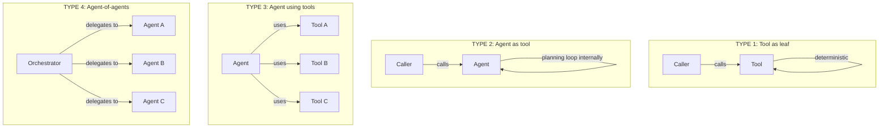
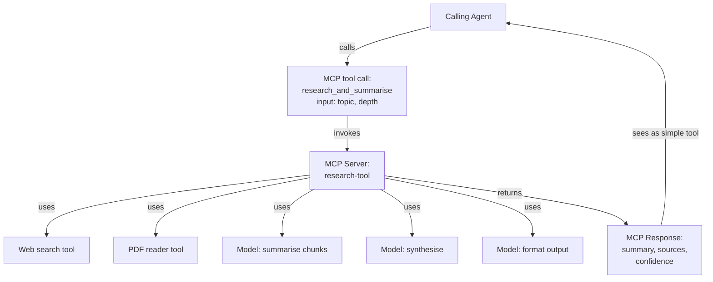
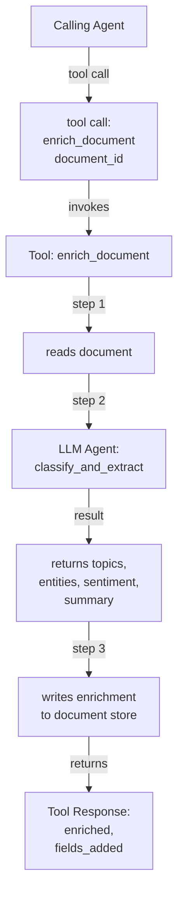
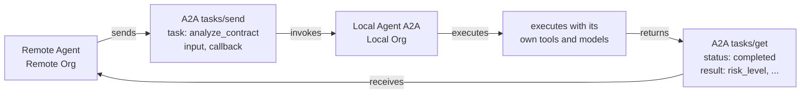
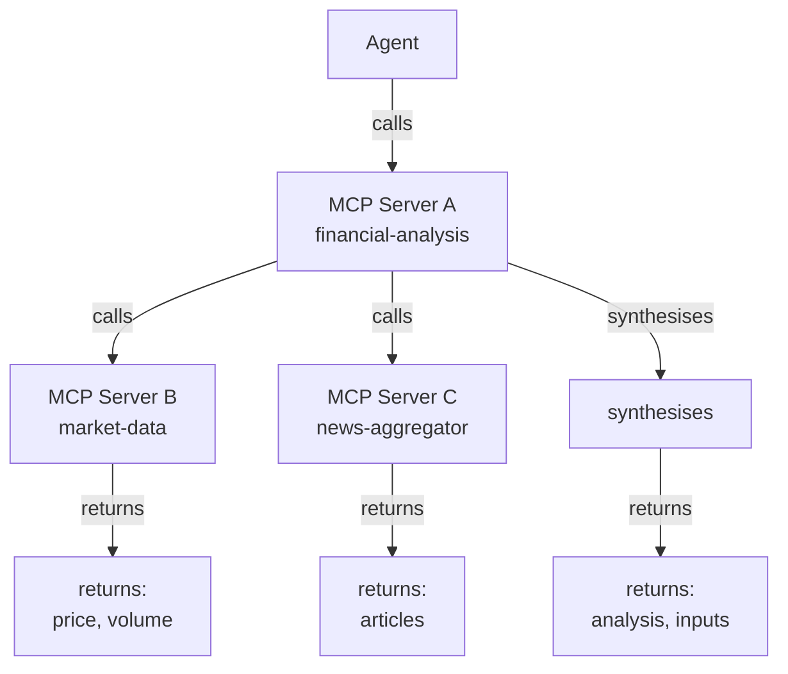
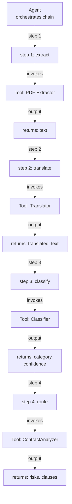
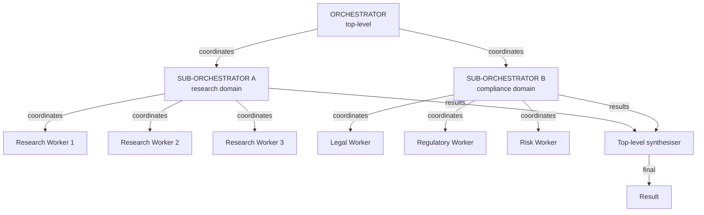

# Agent-as-Tool Composition Patterns

**Why this matters:** The boundary between "tool" and "agent" is architectural, not technical. Understanding composition patterns prevents over-engineering (building agent networks when tool chaining suffices) and enables proper governance isolation across organizational boundaries.

**Audience:** AI architects and platform engineers designing composable multi-agent systems.

**Purpose:** Defines how agents and tools combine in layered compositions. Covers: agent wrapped as MCP tool, tool invoking agent, agent exposing A2A, MCP composing MCP, tool chaining, and nested orchestration — with when to use each, architecture diagrams, and anti-patterns.

**Scope:** Composition patterns. For topology (how agents are arranged), see Multi-Agent Topology Patterns. For protocol mechanics, see MCP Deep Research 2026 and A2A Security &amp; Governance. For decision criteria (agent vs. tool vs. workflow), see Workflow Orchestration Decision Matrix.

---

## 1. Why Composition Matters

The boundary between "tool" and "agent" is architectural, not technical. Both are callable units that accept input and return output. The difference is:

| Characteristic | Tool | Agent |
|---------------|------|-------|
| **Decision-making** | Deterministic; no planning | Has planning loop; can chain calls |
| **State** | Stateless (usually) | May maintain state across calls |
| **Multi-step** | Single operation | Multi-step; may call other tools |
| **Context** | No shared context | Has context window |
| **Failure handling** | Returns error; caller handles | Has retry/escalation logic |

In practice, these form a **composition hierarchy** — agents call tools, which may call other agents, which may be exposed as tools to yet higher-level agents.

---

## 2. The Four Fundamental Composition Types



The power of composition is that **any of these types can appear in any position** in the hierarchy, enabling arbitrary nesting.

---

## 3. Pattern 1: Agent Wrapped as MCP Tool

### What It Is

An agent with a planning loop is exposed through the MCP protocol as a single callable "tool." From the caller's perspective, it is indistinguishable from a deterministic tool. Internally, it may call other tools, invoke a model multiple times, and maintain intermediate state.

### Architecture



### When to Use

- The calling agent should not need to know about the internal complexity
- The sub-task is reusable across multiple calling agents
- The sub-task has a well-defined, stable interface
- You want to limit the calling agent's context window consumption (the agent handles sub-task context internally)
- You want to independently version and deploy the sub-task agent

### Design Constraints

| Constraint | Reason |
|-----------|--------|
| Tool-shaped interface | Input schema + output schema must be stable; MCP contract |
| Synchronous (default) | MCP tool calls are request-response; long-running agents need streaming or async patterns |
| Limited state exposure | Internal state stays inside the wrapped agent; caller gets only the final result |
| Independent authorization | The wrapped agent operates with delegated credentials; see Governance Propagation Chain |
| Timeout budget | The wrapped agent must complete within the calling agent's tool call timeout (typically 60–300 seconds) |

### Anti-patterns

- **Leaking internals**: Wrapped agent returns partial results, error details about internal steps, or references to internal tools — these break the tool abstraction
- **Context leak**: Wrapped agent appends its reasoning to the calling agent's context — the calling agent's context window fills with sub-agent thinking
- **Unscoped delegation**: Wrapped agent receives the calling agent's full token set; it should receive a scoped delegation

---

## 4. Pattern 2: Tool Invoking an Agent

### What It Is

A deterministic tool calls an agent as part of its execution — for example, a document enrichment tool calls an analysis agent to generate metadata.

### Architecture



### When to Use

- An existing deterministic tool needs to add "intelligence" without becoming a full agent
- The tool has complex side effects but needs LLM judgment at a specific decision point
- You are adding AI capability incrementally to an existing tool

### Design Constraints

- The tool remains the owner of the transaction; the agent call is a sub-call
- If the agent call fails, the tool must handle it (retry, fallback, or error)
- The tool's authorization boundary applies to the agent call; use OBO token for the LLM agent

---

## 5. Pattern 3: Agent Exposing A2A

### What It Is

An agent exposes itself as a callable entity via the A2A protocol, allowing remote agents (from different organizations or systems) to dispatch tasks to it.

### Architecture



### Key Design Decisions

| Decision | Options | Recommendation |
|---------|---------|---------------|
| **Synchronous vs. async** | A2A tasks/send (async) vs. streaming | Use async for tasks &gt; 10 seconds; streaming for real-time output |
| **Agent card management** | Static agent card vs. dynamic capability advertisement | Static + versioned; update only on deployment |
| **Authentication** | A2A-defined agent identity + JWT | SPIFFE SVID for workload identity; delegated JWT for user context |
| **Capability scoping** | All-or-nothing vs. fine-grained skill exposure | Expose only the skills the remote org is authorized to use |

### When to Use

- Cross-organization collaboration where you want organizational isolation (the remote agent is a black box to you)
- Third-party integration (your agent provides a service to external consumers)
- Building a reusable agent service accessible across your enterprise's multi-tenant platform

---

## 6. Pattern 4: MCP Composing MCP

### What It Is

An MCP server (acting as a client) calls another MCP server as part of handling a tool request. MCP servers compose hierarchically.

### Architecture



### When to Use

- You have a collection of specialized MCP servers and want to compose them into higher-level services
- A domain MCP server provides a coherent abstraction over multiple lower-level MCP servers
- You want to hide the complexity of multiple data sources behind a single tool

### Critical Governance Requirements

- **Authorization chain**: Server A calls Servers B and C using delegated tokens (not its own service account) — the original user's permissions must apply
- **Trace propagation**: W3C trace context must propagate from Agent → Server A → Server B/C; all spans linked
- **Circular call prevention**: Server A cannot call a server that calls Server A (loop detection at the client level)
- **Timeout budgeting**: Server A's total timeout must be the sum of B + C timeouts + synthesis time; if Server B is slow, Server A will timeout too

---

## 7. Pattern 5: Tool Chaining

### What It Is

The output of one tool is the input of the next tool in a sequence. The chain is orchestrated by the calling agent (not by the tools themselves).

### Architecture



### When to Use

- Each step is a well-defined, deterministic transformation
- The chain is fixed (not dynamically planned)
- The chain is short (&lt; 10 steps; longer chains should be Planner-Executor)
- You want each step to be independently testable and replaceable

### Agent Role in Tool Chaining

The agent does not execute the tools blindly. Before each tool call, the agent:
- Validates that the previous tool's output is suitable as input for the next tool
- Checks whether any step's output should trigger an early exit or branching
- Handles tool failures (retry, skip, fallback) according to the chain's error policy

---

## 8. Pattern 6: Nested Orchestration

### What It Is

An orchestrator agent spawns sub-orchestrators, each of which coordinates its own group of agents or tools. The hierarchy has depth &gt; 2.

### Architecture



### When to Use

- The task decomposition has natural domain boundaries (research domain vs. compliance domain)
- Each domain sub-orchestrator has different governance requirements (different tool access, different HITL thresholds)
- The top-level orchestrator would become too complex if it managed all workers directly

### Governance Considerations

- **Authorization hierarchy**: each sub-orchestrator receives a scoped delegation from the top-level orchestrator; workers receive narrower delegations from sub-orchestrators — authority only ever narrows
- **Max depth**: enforce a hard depth limit (3–4 levels maximum in enterprise; recursive spawning without limits is the highest-severity anti-pattern)
- **Trace completeness**: the trace tree must cover all levels; a sub-orchestrator that drops trace context creates an audit gap

---

## 9. Selection Guide

Use this guide to choose the right composition pattern:

```
Is the sub-task simple and deterministic?
    YES → Use a Tool (no agent needed)
    NO  → Continue ↓

Should the caller be isolated from the sub-task's internal complexity?
    YES → Agent Wrapped as MCP Tool (Pattern 1)
    NO  → Agent Using Tools (direct tool calls)

Is the caller in a different organization or system?
    YES → Agent Exposing A2A (Pattern 3)
    NO  → Continue ↓

Do you need to aggregate multiple specialized data sources behind a single interface?
    YES → MCP Composing MCP (Pattern 4)
    NO  → Continue ↓

Is the task sequence fixed and predetermined?
    YES → Tool Chaining (Pattern 5)
    NO  → Planner-Executor (see Multi-Agent Topology Patterns)

Does the task decompose into natural domain boundaries?
    YES → Nested Orchestration (Pattern 6)
    NO  → Supervisor-Worker (see Multi-Agent Topology Patterns)
```

---

## 10. Composition Anti-Patterns

| Anti-Pattern | Description | Problem | Fix |
|-------------|-------------|---------|-----|
| **Infinite recursion** | Agent A spawns Agent B spawns Agent A | Infinite loop; resource exhaustion | Depth limit + cycle detection |
| **Context bleed** | Sub-agent's thinking is added to parent agent's context | Parent context fills with irrelevant internal steps | Use `_meta` field for internal state; return only the result |
| **Privilege escalation via composition** | Tool calls agent that has higher privileges than the calling agent | Authorization bypass | Scoped delegation: child is always more restricted than parent |
| **Synchronous deep chain** | 5-level synchronous chain: each level blocks waiting | Latency multiplication; single failure fails chain | Break into async tasks; use durable workflow for chains &gt; 3 levels |
| **Hidden side effects** | Wrapped agent performs writes as side effect of a "read" tool call | Calling agent doesn't know tool caused mutations | All tools causing mutations must declare them in schema |
| **Missing trace propagation** | Sub-agent doesn't propagate trace context | Broken audit trail; compliance gap | Mandatory trace context injection at composition boundary |
| **Unversioned agent card** | Agent exposed via A2A without versioned capability manifest | Breaking changes to remote callers without notice | Semantic versioning on agent cards; backward compatibility |

---

## Related

- Multi-Agent Topology Patterns — how agents are arranged (complements composition)

## Sources

- [MCP Deep Research 2026](https://modelcontextprotocol.io/)
- [Workflow Orchestration Decision Matrix](pathname:///archon/agentic-systems/orchestration/decision-matrix)
